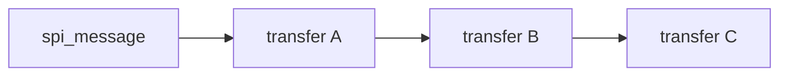
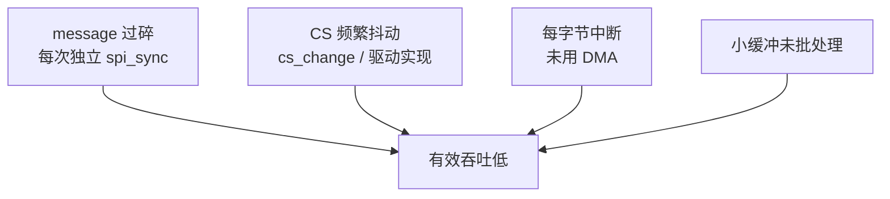

## 前言

**C：** 很多 SPI 量产问题来自对 **`spi_message` 原子性、`spi_transfer` 拼接、`cs_change` 与延时字段** 理解不准，而不是不会调 `spi_write()`。本篇把 **同步/异步入口、全双工语义、常见 helper、性能与 CS 抖动** 说透，并配上可对照手册的拼帧思路。

<!-- more -->

::: tip 阅读顺序
建议先读 [SPI子系统与设备驱动要点](/courses/linuxdev/06-总线与典型子系统/spi/01-SPI子系统与设备驱动要点)；主机侧如何实现见 [SPI控制器与主机驱动主线](/courses/linuxdev/06-总线与典型子系统/spi/02-SPI控制器与主机驱动主线)。
:::

## 1. `spi_message`：一次「原子提交」

- 一个 **`spi_message`** 表示 **一次提交给控制器的完整事务**；核心会保证 **同一 message 内的 transfer 按顺序执行**（中途一般不应被其他设备的传输插入，具体仍取决于控制器与锁策略）。  
- **不要**假设「两个 `spi_sync()` 调用之间」有任何原子关系；若协议要求 **多步必须同一段 CS 低电平**，应放进 **同一个 message** 的多个 `spi_transfer` 里。



## 2. `spi_transfer`：你真正操作的结构

每段 transfer 常见字段（不同内核版本可能增加字段，以 `include/linux/spi/spi.h` 为准）：

| 字段 | 含义 |
| --- | --- |
| `tx_buf` / `rx_buf` | 发送/接收缓冲区；未使用的一侧可为 `NULL` |
| `len` | 本段移位长度（字节） |
| `bits_per_word` / `speed_hz` | 本段可覆盖设备默认值；硬件不支持时会失败 |
| `cs_change` | 本段**结束后**是否允许片选变化（见下节） |
| `delay_usecs` | 本段完成后、下一段开始前可插入延时（控制器/驱动需支持） |

**全双工规则（教学向）：** 若 **`tx_buf` 与 `rx_buf` 均非空**，通常表示 **每个时钟沿同时移出/移入**；主机在 `len` 个字节上 **同时** 发送与接收。若你只想「发哑时钟读 MISO」，常见做法是 **`tx_buf` 指向 dummy 缓冲区**（如全 `0xff`），而不是只填 `rx_buf`（具体以控制器与驱动实现为准，遇疑用示波器对照）。

## 3. `cs_change`：最容易与手册对不上的点

**直觉版：**

- **`cs_change = 0`（默认）**：倾向于 **保持当前片选有效**，继续下一段 transfer。  
- **`cs_change = 1`**：本段结束后 **可以** 产生 CS 无效间隔，再开始下一段（是否拉高、保持多久，依赖主机驱动与硬件）。

**必须与芯片手册对照：** 有的器件要求 **命令与数据在同一 CS 窗口**；有的要求 **命令与数据之间必须有 CS 翻转**。拼错会出现 **「波形看起来对，数据全错」**。

## 4. 典型拼帧：命令 + 数据（同一 CS）

与第一篇示例一致：**先写 1 字节命令，再读 N 字节**，且 **中间不释放 CS**：

```c
static int read_jedec_like(struct spi_device *spi, u8 cmd, u8 *buf, unsigned n)
{
	struct spi_transfer t[2] = { };
	struct spi_message m;
	int ret;

	spi_message_init(&m);

	t[0].tx_buf = &cmd;
	t[0].len = 1;
	t[0].cs_change = 0; /* 通常保持 CS */

	t[1].rx_buf = buf;
	t[1].len = n;

	spi_message_add_tail(&t[0], &m);
	spi_message_add_tail(&t[1], &m);

	ret = spi_sync(spi, &m);
	return ret;
}
```

若手册要求两段之间 **固定延时**，可在 `t[0].delay_usecs` 设置（并确认平台驱动尊重该字段）。

## 5. 同步 API 与 helper

| 入口 | 适用场景 |
| --- | --- |
| `spi_sync()` / `spi_sync_locked()` | 进程上下文阻塞等待完成；`locked` 变体在已持有 `spi_bus_lock` 时使用 |
| `spi_sync_transfer()` | 栈上 `struct spi_transfer x[]` 一次性提交，减少样板代码 |
| `spi_write_then_read()` | 经典「先写后读」，两段缓冲、两段长度 |
| `spi_write()` / `spi_read()` | 纯写或纯读单段 |

**注意：** helper 背后是同样的 message 语义；若默认 helper **不符合** 你的 CS/延时要求，应 **显式组 message**。

## 6. 异步：`spi_async` 与完成回调

在中断上下文、或希望 **与完成回调协作** 时，使用 **`spi_async()`**，在 **`spi_message.complete`** 里唤醒等待者或提交下一帧。需自行处理：

- **并发**：同一 `spi_device` 上多 message 重叠提交是否被驱动允许。  
- **缓冲区生命周期**：完成回调触发前 **不得释放** `tx_buf`/`rx_buf`。  
- **错误路径**：`message.status` 在完成后检查。

量产驱动里常见模式：**workqueue + `spi_sync`**，简单可靠；高吞吐路径再考虑异步与批量。

## 7. 性能：为什么「频率设高了仍很慢」



优化方向（在协议允许前提下）：

- **合并 transfer**、**增大单次 `len`**，减少用户态/内核态切换与 CS 开销。  
- **批量读缓存**、显示类 **一行/多行** 提交。  
- 与硬件同事确认 **DMA 描述符链** 是否与 `transfer_one_message` 匹配。

## 8. 常见故障与语义相关排查

1. **全 0 / 全 0xff / 稳定错码**：优先查 **CPOL/CPHA、MSB/LSB、MOSI/MISO 是否交叉**，再查 **dummy 时钟** 是否满足器件读时序。  
2. **偶尔错一位**：时钟过快、信号完整性、采样沿与手册不一致。  
3. **仅高压测失败**：异步重入、DMA 缓存一致性、完成顺序。

::: tip 同组文章
[SPI设备树与调试实践](/courses/linuxdev/06-总线与典型子系统/spi/04-SPI设备树与调试实践) · [I2C与SPI驱动设计对比](/courses/linuxdev/06-总线与典型子系统/01-I2C与SPI驱动设计对比)
:::
