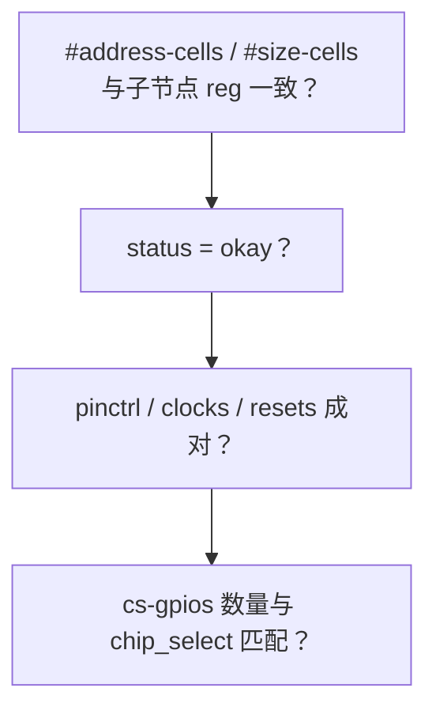

## 前言

**C：** SPI 问题经常是 **子节点挂错控制器、`reg` 片选号与板级走线不一致、模式属性与 flash/传感器手册不符**，或 **把用户态 `spidev` 与内核驱动同时绑在同一设备上**。本篇整理 **DT 常见属性、与 sysfs 的配合、可执行的调试顺序**，并提醒 **安全与量产注意事项**。

<!-- more -->

## 1. 控制器节点检查清单



- **`#address-cells = <1>`、`#size-cells = <0>`** 是 SPI 总线常见约定：子节点 **`reg = <n>`** 表示 **片选索引** `n`，不是内存地址。  
- **`cs-gpios`**：按顺序对应各子设备的 CS；若漏写或顺序与原理图不一致，会出现 **选错从设备或根本选不中**。

## 2. 从设备节点必备与常用可选属性

| 属性 | 作用 |
| --- | --- |
| `compatible` | 与 `spi_driver.of_match_table` 精确匹配 |
| `reg` | 片选索引（见上） |
| `spi-max-frequency` | 上限频率；内核会写入 `spi_device->max_speed_hz` 相关约束 |
| `spi-cpol` / `spi-cpha` | 模式位；与 `SPI_MODE_x` 对应 |
| `spi-cs-high` | CS 高有效（少见，依器件） |
| `spi-lsb-first` | LSB 先出 |
| `spi-3wire` | 单数据线半双工类接线（需控制器与外设均支持） |
| `spi-rx-bus-width` / `spi-tx-bus-width` | 双线/四线等扩展（常见于 SPI NOR） |
| `spi-tx-nbits` / `spi-rx-nbits` | 部分控制器用 nbits 描述单次帧宽 |

**始终以** `Documentation/devicetree/bindings/spi/spi-controller.yaml` **及具体从设备 binding** 为准；不同厂商控制器可能对属性名有别名。

## 3. 设备树示例（带注释）

```txt
&spi0 {
    pinctrl-0 = <&pinctrl_spi0_default>;
    pinctrl-names = "default";
    status = "okay";

    flash@0 {
        compatible = "jedec,spi-nor";
        reg = <0>;
        spi-max-frequency = <50000000>;
        spi-rx-bus-width = <4>;
        spi-tx-bus-width = <4>;
    };

    sensor@1 {
        compatible = "vendor,xyz-sensor";
        reg = <1>;
        spi-max-frequency = <10000000>;
        spi-cpol;
        spi-cpha;
    };
};
```

## 4. sysfs 与启动日志

内核注册完成后，可在运行系统上查看：

```bash
# 总线上的逻辑设备
ls /sys/bus/spi/devices/

# 某从设备目录下常可见 modalias、of_node 链接等
ls /sys/bus/spi/devices/spi0.0/
```

- **`probe` 未执行**：优先查 **`compatible` 字符串**、**是否被别的驱动提前占用**、**控制器是否 probe 成功**。  
- **`spi_setup` 失败**：日志里常有 **mode/频率/位宽不支持**；对照 **主机驱动 `setup`** 与 **DT**。

若平台启用 **debugfs**，部分 SPI 驱动会提供统计或寄存器 dump，路径因驱动而异。

## 5. 用户态 `spidev`：调试利器，量产慎用

`compatible = "spidev,spidev"` 可把从设备暴露为 **`/dev/spidevB.C`**，便于用 **Python/C 小工具** 位bang 验证硬件。

注意：

- **同一 `spi_device` 不应同时** 绑定 **内核业务驱动** 与 **spidev**（会争用总线与语义）。  
- 调试结束应改回正式 `compatible`，避免用户态误操作影响安全设备（如存储、安全元件）。

## 6. 与逻辑分析仪/示波器配合的顺序

1. **确认 CLK 是否在传输时出现**（无 CLK 多为控制器未跑、片选未生效、pinctrl 错误）。  
2. **量 CS 窗口**是否与手册要求一致（对比 [spi_message 语义](/courses/linuxdev/06-总线与典型子系统/spi/03-spi_message与传输语义-全双工片选与性能) 中的 `cs_change`）。  
3. **对模式**：CPOL/CPHA 错时常表现为 **MISO 在错误沿被采样**。  
4. **对频率**：先降到手册保守值，再逐步升高排除信号完整性问题。

## 7. 常见错误归纳

| 现象 | 可能原因 |
| --- | --- |
| 设备树有节点但无驱动 probe | `compatible` 拼写错误；驱动未进内核配置 |
| 多个从设备互相干扰 | `reg` 与 CS 线不对应；GPIO CS 顺序错 |
| 仅某从设备不通 | `spi-max-frequency` 过高；模式属性缺失 |
| 热插拔/电源相关偶发 | 缺少 reset GPIO、上电时序与驱动 PM 配置 |

## 8. 小结

DT 解决 **「谁挂在哪条总线、用哪根 CS、电气与模式上限」**；协议拼帧解决 **「一次传输长什么样」**。二者缺一不可。主机侧实现细节见 [SPI控制器与主机驱动主线](/courses/linuxdev/06-总线与典型子系统/spi/02-SPI控制器与主机驱动主线)。

::: tip 同组文章
[I2C与SPI驱动设计对比](/courses/linuxdev/06-总线与典型子系统/01-I2C与SPI驱动设计对比)
:::
