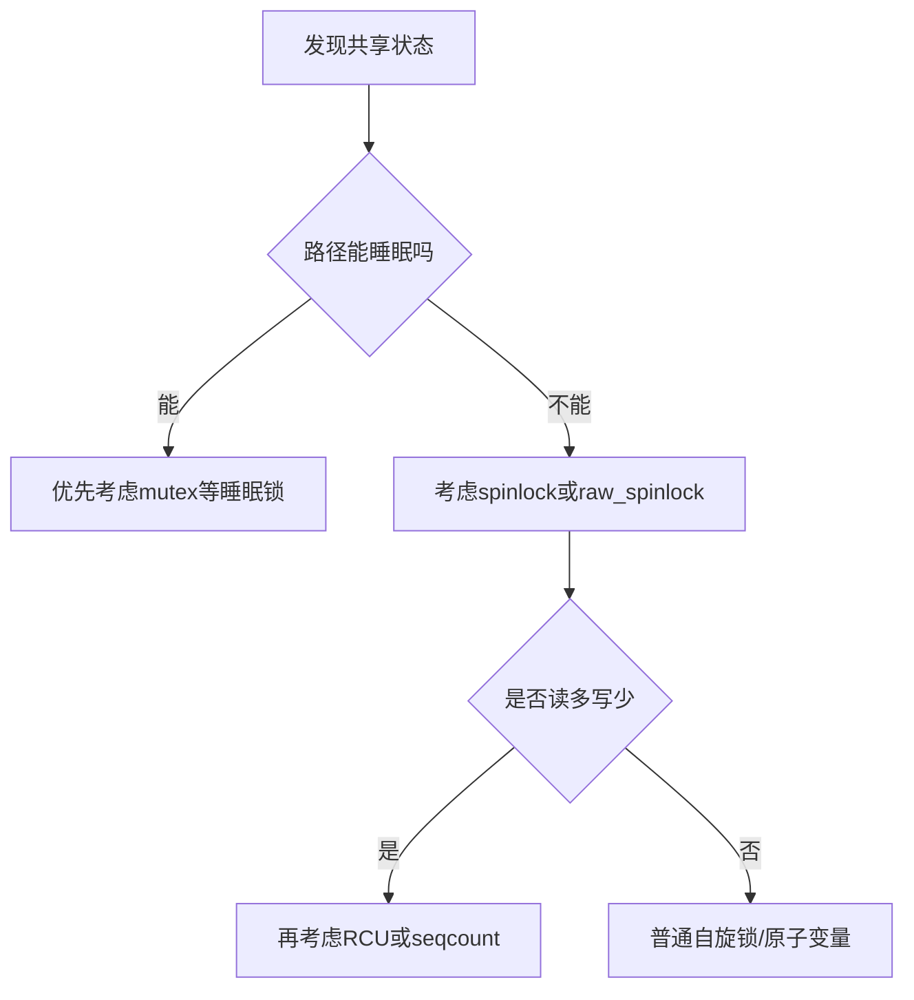

# 自旋锁、互斥锁、原子变量与RCU的取舍

## 前言

**C：** 很多驱动并不是死在“不会上锁”，而是死在“每个地方都上了一个看起来合理、但上下文不匹配的锁”。高级驱动工程师和入门者最大的差别之一，就是看到共享状态时，不会立刻问“用哪个 API”，而是先问：**这段代码运行在哪个上下文、临界区有多大、能不能睡眠、读写比例怎样、未来可否扩展**。本篇就讲常见同步原语背后的取舍逻辑。

<!-- more -->

## 选择同步原语的思考路径

## 不要先背锁名，先识别执行上下文

驱动里常见上下文包括：

- 进程上下文
- 硬中断上下文
- 软中断/NAPI/poll 上下文
- workqueue / kthread
- 定时器回调

是否能睡眠、是否可能被抢占、是否会和 IRQ 并发，决定了很多同步手段能不能用。  
所以判断顺序应该是：

1. 先看上下文
2. 再看共享状态
3. 最后才选锁

## `mutex`：适合进程上下文里的复杂临界区

`mutex` 最适合：

- `read` / `write` / `ioctl` 这类进程上下文路径
- 临界区可能较长
- 需要调用可能睡眠的函数

它的优点是：

- 语义直观
- 调试友好
- 更适合保护复杂对象状态

但不能忘记它的前提：**持锁路径允许睡眠**。  
因此在中断处理函数、某些原子上下文里用 `mutex`，基本就是设计错误。

## `spinlock`：保护短小、不可睡眠的临界区

自旋锁的核心意义是：

- 不让其他 CPU 并发进入
- 当前持锁期间不能睡眠
- 适合极短的共享状态更新

典型适用场景：

- IRQ 和进程上下文同时访问队列头尾
- 多 CPU 并发更新统计状态
- 保护短小描述符环指针

如果临界区里出现这些动作，就要高度警惕：

- `copy_to_user`
- `kmalloc(..., GFP_KERNEL)`
- 等待完成量
- 任何可能阻塞的总线访问

这些都说明你把过重的工作塞进了原子上下文。

## `spin_lock_irqsave()` 不是万能药

很多代码里看到共享变量就直接上 `spin_lock_irqsave()`，这并不总是最佳选择。  
它解决的是“本地中断打断自己”的问题，但也会放大关中断范围。

高级工程师要问：

- 这条路径真的会被本地 IRQ 打断吗
- 是否只需要普通 `spin_lock`
- 是否应该把临界区拆小
- 是否应该把真正重活移到 workqueue

锁选得越重，系统延迟和复杂度通常越高。

## 原子变量适合“单值状态”，不适合“对象一致性”

`atomic_t`、`refcount_t` 适合：

- 引用计数
- 简单标志位
- 单值递增递减

但它们不适合保护复杂结构的一致性。  
例如你有：

- 缓冲区指针
- 数据长度
- 状态标志

如果这些字段必须一起保持一致，仅靠多个原子变量通常会把问题变得更难理解，而不是更安全。

## RCU 适合读多写少、允许版本切换的对象

RCU 的价值不是“比锁更高级”，而是它非常适合：

- 读路径极高频
- 写路径较少
- 允许旧版本在一段宽限期内继续可见

典型使用方式是：

- 读者几乎不阻塞
- 写者创建新对象并替换指针
- 旧对象延迟回收

这类模型很适合路由表、设备配置快照、回调表等场景。  
但如果你的对象经常原地细粒度改写，RCU 就未必比普通锁更简单。

## seqcount / seqlock 适合什么

如果数据结构以“读多写少、可重试读取”为特征，也可以考虑 seqcount。  
它要求读者能够接受：

- 读取期间可能发现写入发生
- 然后重读一遍

因此它更适合：

- 时间戳
- 小型状态快照
- 一致性要求明确但读路径不想重锁的场景

## 真正成熟的判断标准

一个同步方案是否合适，不看它“有没有锁住”，而看它是否满足：

- 上下文约束正确
- 共享对象边界清晰
- 临界区足够短
- 可扩展到未来多队列/多核场景
- 出问题时容易定位

## 常见反模式

1. 用一个大锁把整个驱动全包住  
   初期简单，后期性能和维护性都很差。
2. 迷信原子变量  
   单值安全不等于对象整体安全。
3. 在自旋锁里做长耗时工作  
   经常把系统延迟拖高。
4. 为了“安全”把所有路径都关中断  
   这通常只是掩盖设计边界不清的问题。

## 一句经验总结

锁不是“越强越安全”，而是“越贴合上下文越安全”。  
高级驱动工程师的核心能力，是把共享状态拆清楚，把原子上下文缩小，把大部分复杂度转移到可以睡眠、可观测、可调试的路径里。
