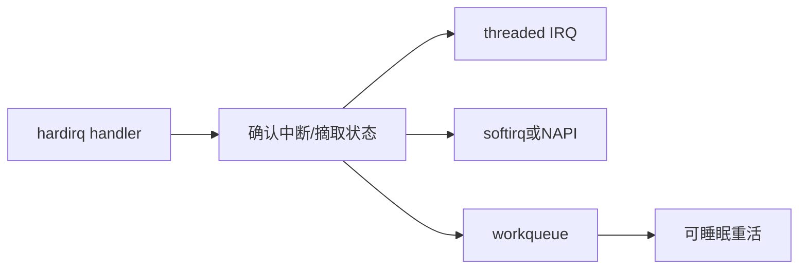

# 中断上下文、软中断、workqueue与线程化IRQ

## 前言

**C：** 很多驱动问题都不是“中断没来”，而是“中断来了之后，工作放错地方了”。有人把所有逻辑塞进 hardirq，导致系统延迟飙升；有人把本该有实时约束的工作无脑丢到 workqueue，结果引入尾延迟；还有人分不清软中断、NAPI、线程化 IRQ 和普通内核线程的边界。本篇的目标，就是把这些常见执行上下文的职责边界讲清楚。

<!-- more -->

## 常见中断相关执行路径

## 先建立一个核心原则

不是所有“后续处理”都应该放在同一种下半部里。  
高级工程师要先问：

- 这段工作有多紧急
- 是否允许睡眠
- 是否要求低尾延迟
- 是否会大量并发触发

只有这些问题想清楚，才谈得上选择 `threaded IRQ`、`softirq/NAPI` 还是 `workqueue`。

## hardirq 应该只做什么

硬中断处理函数最适合做：

- 快速确认中断源
- 读取必要状态
- 清中断
- 唤醒后续处理

不适合做：

- 长循环搬数据
- 大量寄存器轮询
- 可能睡眠的操作
- 复杂锁竞争

你可以把 hardirq 理解成“第一时间止血和转发”，而不是“把所有事情现场做完”。

## 线程化 IRQ 适合什么

线程化 IRQ 的优势在于：

- 更容易与实时系统协同
- 处理函数运行在线程上下文
- 可以使用部分可睡眠接口

它非常适合：

- 中断频率不极端
- 后续处理较重
- 需要更可控调度行为

但它不意味着你就能肆无忌惮地把任何工作塞进去。  
如果线程函数里仍然做超长耗时操作，一样会拖垮吞吐和响应。

## softirq / NAPI 更偏“高频数据路径”

网络驱动、块层等高频场景往往更适合：

- softirq
- NAPI poll

原因是它们面对的是：

- 高包率
- 批量处理
- 对吞吐和 cache 局部性敏感

所以不是所有驱动都该模仿网络子系统，但你要知道：  
**高频数据路径通常不喜欢把每件事都丢给普通 workqueue。**

## workqueue 适合“可延后、可睡眠、可观测”的工作

`workqueue` 最大的价值是把复杂工作搬到进程上下文。  
它适合：

- 资源回收
- 重新初始化
- 失败恢复
- 配置更新
- 可睡眠的后处理

这也是很多复杂驱动最终稳定下来的关键：  
把重活从 hardirq 挪出来，让问题更容易调试，也更容易加锁。

## 一个实用分工模板

在很多复杂驱动里，可以采用这种分层：

1. hardirq  
   只确认中断并记录必要信息
2. threaded IRQ 或 poll  
   处理延迟敏感但不宜放在 hardirq 的工作
3. workqueue  
   做恢复、补偿、慢路径和耗时任务

这比“一个 handler 里全做完”更容易演进，也更容易支撑后续性能调优。

## 什么时候不该滥用 workqueue

如果你面对的是：

- 高频硬件事件
- 明确要求低延迟
- 每次处理都很轻

那么把所有事情都丢进 workqueue，往往会引入：

- 调度抖动
- 额外上下文切换
- 尾延迟放大

所以 workqueue 很重要，但它不是默认答案。

## 常见设计错误

1. hardirq 中做大块数据处理  
   最典型，也最容易拖高系统延迟。
2. thread handler 里又套复杂阻塞路径  
   让中断线程本身变成瓶颈。
3. 高频 IRQ 一律丢 workqueue  
   导致系统在高负载下跟不上节奏。
4. 没有明确区分“快路径”和“慢路径”  
   最终所有工作都混在一起。

## 一个高级视角

真正成熟的中断设计，核心不是“用了哪个 API”，而是把路径拆成：

- 必须立刻做的
- 可以稍后做的
- 可以睡眠做的
- 失败后再做的

只要这四类工作分层清楚，驱动的实时性、吞吐和可维护性都会明显改善。

::: tip 配套源码
可以结合 `examples/linuxdev/04-threaded-irq-workqueue/` 一起看：那个骨架专门展示 hardirq、threaded handler 和 workqueue 的分工方式。
:::
