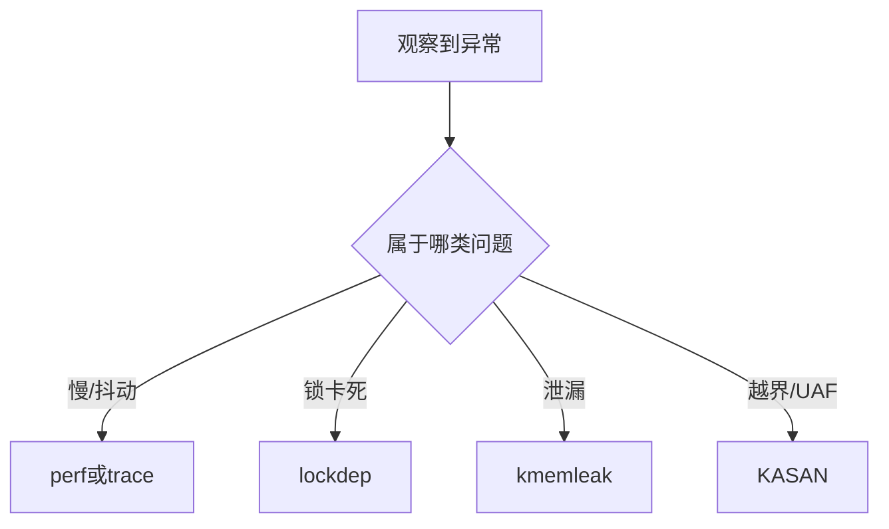

# perf、lockdep、kmemleak、KASAN常用排障手段

## 前言

**C：** 高级驱动工程师面对疑难问题，不能只有一种锤子。性能问题、死锁问题、内存泄漏、越界踩踏，看起来都像“系统不稳定”，但证据形态完全不同。经验不足的人常常一上来就盲改代码；经验更成熟的人会先选对诊断器。`perf`、`lockdep`、`kmemleak`、`KASAN` 这几类工具，正好分别覆盖了不同类型的问题空间。

<!-- more -->

## 先选工具，再看现象

## `perf`：看 CPU 时间到底花在哪

如果你的问题表现为：

- 吞吐下降
- CPU 异常飙高
- 中断线程占用异常
- 某条路径偶发慢

那么 `perf` 往往是第一选择。  
它擅长回答：

- 热点函数是谁
- 调用栈热点集中在哪
- 采样期间 CPU 大部分时间在干什么

对驱动工程师来说，`perf` 特别适合定位：

- 轮询过重
- 中断风暴
- map/unmap 或同步成本过高
- 锁竞争导致的 CPU 空耗

## `lockdep`：把“可能死锁”尽量提前揪出来

很多锁问题不是直接卡死，而是：

- 反向加锁顺序
- 同一把锁在不同上下文使用不一致
- 某些路径里睡眠/原子语义冲突

`lockdep` 的价值在于，它能帮助你从“现象层卡住”提升到“锁依赖关系有问题”。  
对于复杂驱动尤其重要，因为驱动最怕：

- 中断路径一套锁序
- 工作线程另一套锁序
- 恢复路径第三套锁序

这三套一叠加，事故往往只是时间问题。

## `kmemleak`：谁分配了没回收

内核里的内存泄漏不像用户态那么容易观察。  
驱动里常见的泄漏来源包括：

- probe 失败路径清理不完整
- error unwind 漏掉一步
- 热插拔/反复加载卸载路径不对称
- 设备断开后引用还被某个异步路径持有

`kmemleak` 擅长的不是“所有内存问题”，而是：

- 哪些对象可能丢失引用
- 哪些分配看起来永远没人释放

这对排查模块反复装卸后的内存增长特别有价值。

## `KASAN`：越界和 use-after-free 的强力武器

如果你怀疑：

- 缓冲区越界
- UAF
- 野指针访问
- 栈/堆内存踩踏

那么 `KASAN` 非常值得优先启用。  
它的最大价值是：

- 很多原本只表现为“随机崩”的问题，会被尽早转化为明确报错
- 报错通常能直接给出访问类型、对象状态和调用栈

这比只看到一个莫名其妙的 `Oops` 好得多。

## 一个更成熟的排障观念

不要把这些工具当成“出了事才开一次”的救火按钮。  
更成熟的做法是：

- 新驱动早期就用 `KASAN`、`lockdep` 跑基本压力
- 性能优化阶段常态化用 `perf` 做对比
- probe/remove、热插拔场景用 `kmemleak` 看清理路径

这会让很多“线上才暴露”的问题提前到开发期。

## 实用选择矩阵

### 系统慢了，但没崩

先 `perf`，必要时结合 trace。  
先搞清楚 CPU 在忙什么，再决定是否改锁、IRQ 或 DMA 路径。

### 系统卡死或长时间不响应

先怀疑锁和等待关系，优先看 `lockdep`、等待栈和调度现场。

### 内存持续增长

先检查资源释放路径，再用 `kmemleak` 帮你确认泄漏对象。

### 偶发崩溃，栈看起来随机

优先开 `KASAN`，因为很多“随机崩”本质上是越界或 UAF。

## 常见误区

1. 工具没报错就说明设计没问题  
   工具只能覆盖特定类型问题。
2. 一个工具想解决所有问题  
   这是最浪费时间的用法。
3. 只在发布前偶尔开一次  
   很多问题需要尽早暴露。
4. 不做问题分类就盲目采集  
   最后日志和报告堆成山，却没有结论。

## 一句经验总结

高级排障不是“记住很多命令”，而是先判断问题属于哪一类，再选最能产生证据的工具。  
选对工具，往往比多改十处代码更接近答案。
