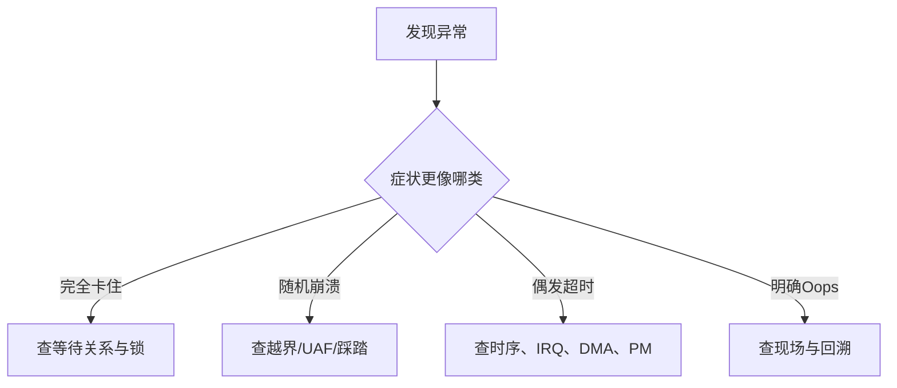

# 死锁、内存踩踏、偶发超时与崩溃现场分析

## 前言

**C：** 真正考验高级驱动工程师的，通常不是“API 会不会写”，而是当现场只剩下一次超时、一张 call trace、几个不完整日志时，你还能不能快速判断问题属于哪一类、下一步该抓什么证据。死锁、内存踩踏、偶发超时和崩溃，表面上都像“系统不稳定”，但它们的证据模式、缩小范围的方法和修复路径完全不同。本篇给你一套更贴近现场处理的分析框架。

<!-- more -->

## 先分型，再深入

## 第一步永远是保护现场

高级工程师的第一反应不应该是“先改几行试试”，而应该是：

- 保存完整日志
- 记录触发条件
- 记录内核版本、配置、平台信息
- 标记问题发生前最后一个正常事件

很多本来能定位的问题，最后定位不了，不是因为问题太难，而是现场在第一时间就被覆盖了。

## 死锁：先看谁在等谁

死锁的典型特征包括：

- 系统卡住不前
- 某个线程长期不再前进
- 中断线程、工作线程或用户线程互相等待

分析死锁时，不要先看“哪个函数最后打印了日志”，而要优先看：

- 哪些任务处于不可中断睡眠
- 谁持有锁
- 谁在等待锁
- 是否存在反向加锁顺序

驱动里常见死锁模式有：

- 中断线程和工作线程争同一把锁
- probe/remove 与运行态回调并发
- 回调里等完成量，而完成量需要当前路径释放资源

## 内存踩踏：症状常常不在第一现场

内存踩踏最麻烦的地方在于：

- 真正写坏内存的地方和最终崩溃的地方可能相隔很远
- 可能只在高负载、大包、长时间运行后暴露

常见高危区域包括：

- DMA 缓冲边界
- 自定义 ring buffer
- 结构体长度与硬件描述符格式不一致
- 错误的 `copy_to_user` / `copy_from_user` 长度

一旦怀疑踩踏，应该优先：

- 缩小问题范围
- 检查长度和边界
- 打开 `KASAN`
- 审视 DMA 同步与映射生命周期

## 偶发超时：最容易被误判

“超时”并不等于“设备坏了”。  
驱动里的偶发超时，常见根因其实包括：

- IRQ 没有及时处理
- 中断到了但后续线程没及时跑
- DMA 方向或同步错了，设备状态一直不更新
- PM 状态切换中设备还没真正恢复
- 锁竞争导致命令提交链路卡住

所以看到超时，推荐优先问：

1. 命令有没有真正提交到硬件
2. 设备是否真的完成过动作
3. 完成事件有没有被软件正确接收
4. 软件收到后有没有被并发或调度耽误

这四步能帮你把“超时”拆成更可分析的阶段。

## 崩溃现场：调用栈只是入口，不是答案

当你拿到一次 `Oops` 或 panic，调用栈当然重要，但别只盯最后一帧。  
更完整的分析应该包括：

- 触发时上下文是什么
- 当前 CPU 在做什么
- 相关驱动最近是否有中断、DMA、PM 或卸载动作
- 崩溃地址像不像空指针、越界、UAF 或函数指针被污染

高级工程师看崩溃，不是“堆栈里出现自己模块名就改那里”，而是把：

- 访问类型
- 地址特征
- 执行上下文
- 近期状态迁移

四件事放在一起看。

## 一个实用的现场分析顺序

### 第一步：判断是同步问题还是内存问题

如果系统像“卡住但没死”，先看锁和等待。  
如果系统像“随机炸”，先看越界/UAF。

### 第二步：判断问题是否与硬件完成链相关

很多超时/崩溃最终都要回到：

- 命令是否下发
- 中断是否到达
- DMA 是否完成
- 状态是否同步

### 第三步：找最近一次状态迁移

复杂驱动里，很多 bug 都发生在状态边界：

- suspend/resume
- probe/remove
- open/close
- queue start/stop
- reset/recovery

### 第四步：缩小复现窗口

不是所有问题都要一次性完全复现。  
很多时候只要把问题缩到：

- 某个高负载场景
- 某种电源切换
- 某个大包长度

就已经足够让你进入可验证状态。

## 真正有用的经验

高级工程师排疑难问题时，最有价值的不是“背过很多命令”，而是会主动构建假设：

- 这是锁没放开，还是线程没被调度到
- 这是 DMA 数据没到，还是到了但 CPU 看不见
- 这是对象提前释放，还是指针本身被写坏

一旦假设结构清楚，工具和日志只是验证手段。

## 一句经验总结

死锁、踩踏、超时、崩溃虽然都叫“故障”，但它们不是一类问题。  
高级驱动工程师真正稀缺的能力，是在很少证据下先把问题分型，再用最短路径把范围压缩到能验证的级别。
