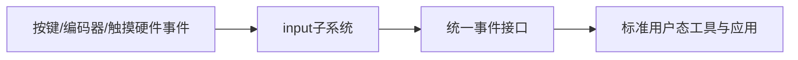

# input子系统与简单输入设备驱动

## 前言

**C：** 很多刚学驱动的人看到按键、编码器、触摸类设备，第一反应是先做一个字符设备导出到 `/dev/xxx`。这种办法能做 demo，但从 Linux 生态看，很多输入设备早就有更合适的统一框架，那就是 `input` 子系统。高级驱动工程师更重要的能力，不是“什么都能手搓字符设备”，而是知道什么时候应该进入现有框架，复用已有用户态生态。

<!-- more -->

## input 子系统的价值

## 为什么不要总是自己造字符设备

如果设备本质上产生的是“输入事件”，自己造字符设备常见问题包括：

- 事件语义需要自己定义
- 用户态要写专有协议
- 标准工具和桌面/中间件无法直接复用
- 多设备兼容性和组合能力差

而 `input` 子系统已经为你提供了：

- 统一事件模型
- 统一上报接口
- 统一用户态访问方式

这就是高级工程师会优先考虑框架接入的原因。

## 哪类设备适合 input

常见适合对象包括：

- 按键
- 开关
- 编码器
- 触摸/触控
- 某些传感器触发事件

核心判断标准不是“硬件长什么样”，而是：

- 它输出的是否本质上是输入事件
- Linux 现有 input 语义能否很好表达它

## 驱动设计重心会发生什么变化

一旦进入 input 框架，驱动重心会从“怎么把数据导出给用户”转移到：

- 如何正确识别硬件事件
- 何时上报按下/释放
- 如何做消抖、状态同步和唤醒处理

这意味着驱动代码会更聚焦硬件行为，而不是自定义协议。

## 典型复杂度来自哪里

输入设备看起来简单，但复杂度经常来自：

- 中断抖动
- 去抖和长按处理
- suspend/resume 下的唤醒能力
- 多输入源组合

也就是说，input 驱动真正有价值的地方不在“调用几个注册函数”，而在于：

- 事件时机是否准确
- 状态机是否稳定
- PM 和唤醒语义是否合理

## 为什么这类框架有长期价值

框架最大的收益之一，是让驱动和用户态契约稳定下来。  
如果将来：

- 换硬件实现
- 加入更多按键
- 从 GPIO 按键变成 I2C 扫描器

只要仍然进入 input 框架，用户态往往无需大改。  
这对长期维护非常重要。

## 常见反模式

1. 输入设备先做字符设备再说  
   往往短期快，长期代价高。
2. 硬件事件来了就直接原样上报  
   忽略去抖、边界和 PM 状态。
3. 只关心功能，不关心唤醒和恢复  
   量产设备常在这里翻车。

## 一句经验总结

当设备本质上是在产生输入事件时，`input` 子系统通常比字符设备更正确。  
高级驱动工程师的价值，不是“能用低层接口强行做出来”，而是能把设备接到最合适的内核抽象里。
