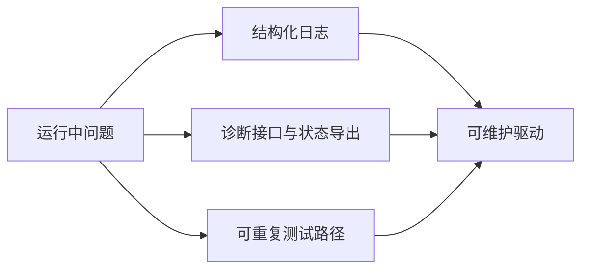

# 日志、诊断接口、可测试性与长期维护

## 前言

**C：** 很多驱动在研发阶段靠作者本人“很熟”，看似没什么问题；可一旦进入量产、交接、线上维护和多年演进阶段，没有观测点、没有诊断接口、没有可重复验证手段的驱动会迅速变成黑盒。高级驱动工程师写驱动时，思考的不只是“今天能不能跑”，还包括“半年后别人怎么定位问题、一年后怎么验证修复、三年后怎么安全重构”。这就是工程化差距。

<!-- more -->

## 长期维护需要哪些基础能力

## 日志不是越多越好，而是越有层次越好

成熟驱动的日志通常会区分：

- 关键状态切换
- 错误现场
- 恢复动作
- 调试细节

如果所有日志都堆在一个层级，常见问题是：

- 平时噪音太大，不敢开
- 真出问题时，关键事件反而埋在海量输出里

所以高级工程师更看重：

- 什么事件必须长期保留
- 什么事件只在 debug 打开
- 什么字段足以帮助现场还原

## 诊断接口的价值

很多线上问题并不需要立刻改代码，而是先要回答：

- 当前设备状态是什么
- 最近一次错误是什么
- 队列是否卡住
- 中断/DMA/PM 状态是否一致

如果驱动完全没有状态导出，排障只能靠猜。  
因此成熟驱动往往会提供合适的诊断入口，例如：

- debugfs
- sysfs 中有限且稳定的状态项
- tracepoints
- 统计计数

关键是边界要清楚：  
诊断接口用于观测和排查，不应变成绕过正式控制路径的“后门配置面板”。

## 可测试性不是测试团队的事

驱动的可测试性很大程度上由设计阶段决定。  
如果代码：

- 状态机边界混乱
- 无法注入错误
- 没有可观测点
- 初始化和恢复耦合得太死

那后面即使你写再多测试脚本，也很难真正覆盖风险点。

高级工程师更关心：

- 哪些路径可以稳定复现
- 哪些错误能否被主动注入
- 哪些状态能否被独立观察

## 为什么很多驱动“只能作者自己修”

原因往往不是技术门槛太高，而是工程化太差：

- 日志没有结构
- 错误码语义模糊
- 状态不导出
- 没有最小复现脚本

这种驱动最大的风险，不在于今天能不能跑，而在于人员一变动就几乎不可维护。

## 长期维护最值钱的习惯

1. 为关键状态切换保留清晰日志
2. 为复杂故障路径预留诊断点
3. 把最小复现步骤沉淀成脚本或文档
4. 让错误恢复路径也具备可观测性

这些事情短期看似不“出功能”，长期却最省时间。

## 一句经验总结

高级驱动工程师写驱动，不只是在写“控制硬件的代码”，也是在写“未来定位问题的证据系统”。  
日志、诊断接口和可测试性，决定了这份驱动是可长期维护的资产，还是只有作者本人能碰的黑盒。
