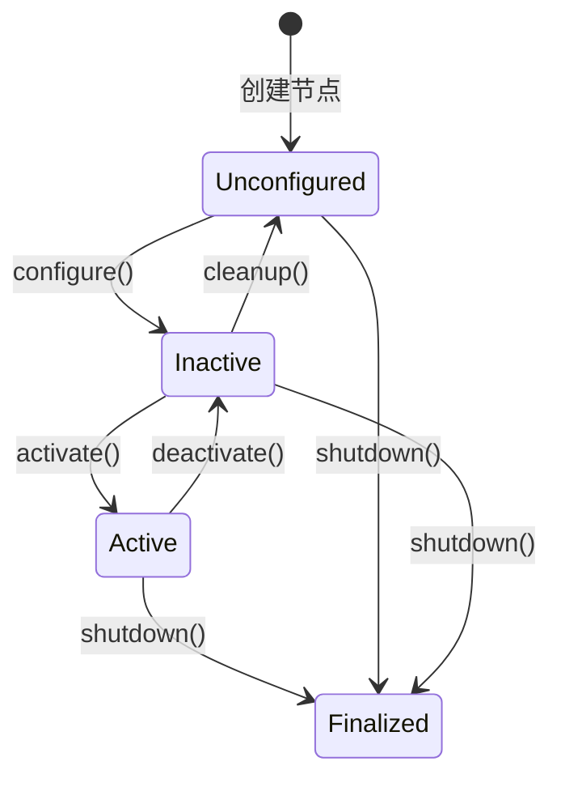
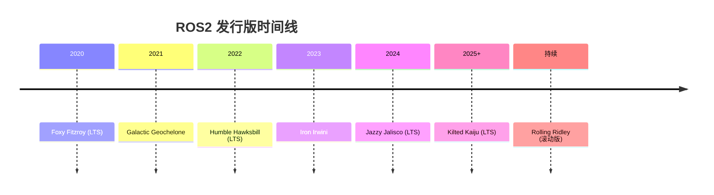

# ROS2 概述与发行版选择

## 前言

**C：** 如果你之前接触过 ROS 1，可能会觉得"不就是个机器人框架吗，ROS 2 能有多大变化"。但实际上，ROS 2 从底层通信到构建工具、从平台支持到实时性保障，几乎是重写了一遍。本篇不急着动手装环境，先把地图看清楚：ROS 2 到底改了什么、为什么改、各发行版怎么选，以及它适合什么样的你。

<!-- more -->

## ROS2 是什么

ROS 2（Robot Operating System 2）是 ROS 的下一代版本，由 Open Robotics（现为 Intrinsic）主导开发，遵循开源协议（Apache 2.0）。它不是一个传统意义上的"操作系统"，而是一套面向机器人开发的**中间件框架 + 工具链 + 生态**。

和 ROS 1 相比，ROS 2 最核心的变化在于：

| 对比项 | ROS 1 | ROS 2 |
| --- | --- | --- |
| 通信中间件 | 自定义 TCP/UDP 协议 | 基于 DDS（Data Distribution Service）标准 |
| 架构 | 依赖中心化 Master 节点 | 去中心化，节点自动发现 |
| 平台支持 | 仅 Linux | Linux、Windows、macOS、RTOS |
| 实时性 | 不支持硬实时 | 可支持硬实时（通过实时 DDS 实现） |
| 安全性 | 无内建安全机制 | 内建 DDS-Security（认证、加密、访问控制） |
| 构建系统 | catkin | colcon + ament |
| Python 支持 | Python 2/3 混用 | 纯 Python 3 |
| 长期维护 | Noetic 是最后版本（2025.05 EOL） | 持续滚动发布，多版本并行维护 |

简单说，ROS 1 的设计目标是"让实验室里的机器人跑起来"，而 ROS 2 的目标是"让机器人在真实世界里可靠运行"。

## ROS2 的核心设计理念

### 去中心化

ROS 1 中所有节点必须连接到一个中心化的 Master（rosmaster），一旦 Master 挂了，整个系统就瘫了。ROS 2 抛弃了这个设计，采用 DDS 的自动发现机制——每个节点加入网络后，会自动发现其他节点并建立连接，无需中心协调者。

这意味着：
- 系统没有单点故障
- 节点可以随时加入或离开
- 支持多机器人系统的网络隔离

### QoS（服务质量）策略

DDS 带来的最大红利之一就是 QoS（Quality of Service）。你可以为每个话题精确控制：

- **可靠性（Reliability）：** BEST_EFFORT（允许丢包，低延迟）或 RELIABLE（保证送达，可能有延迟）
- **持久性（Durability）：** TRANSIENT_LOCAL（新订阅者能收到最后发布的消息）或 VOLATILE
- **历史深度（History Depth）：** 保留最近 N 条消息
- **截止时间（Deadline）：** 消息发布的最大间隔

这是 ROS 1 完全不具备的能力，对于传感器数据（容忍丢包）和指令数据（必须送达）使用不同的 QoS，是 ROS 2 开发中的常见实践。

### 跨平台

ROS 2 支持 Ubuntu、Windows 10/11、macOS，以及通过 micro-ROS 支持裸机 RTOS（FreeRTOS、Zephyr 等）。这意味着你可以在 Windows 上用 Visual Studio 开发，然后部署到 Linux 机器人或嵌入式微控制器上。

### 生命周期管理

ROS 2 引入了受控节点（Managed Node / Lifecycle Node）的概念。节点不再是简单的"启动就跑"，而是有明确的状态机：

这使得系统可以更安全地启动和关闭——比如在 `configure()` 阶段分配资源，在 `activate()` 阶段开始发布数据，在 `deactivate()` 阶段停止发布但不释放资源。

## 发行版一览

ROS 2 遵循与 Ubuntu 类似的发行版命名规则（每两年一个 LTS，按字母顺序排列）：

各版本简要信息：

| 发行版 | 类型 | Ubuntu 版本 | 支持截止 | 状态 |
| --- | --- | --- | --- | --- |
| Foxy | LTS | 20.04 | 2025.05 | 已 EOL |
| Galactic | 非 LTS | 22.04 | 2022.12 | 已 EOL |
| Humble | LTS | 22.04 | 2027.05 | 活跃维护 |
| Iron | 非 LTS | 22.04 | 2024.11 | 已 EOL |
| Jazzy | LTS | 24.04 | 2029.05 | 活跃维护 |
| Rolling | 滚动版 | 24.04+ | 持续 | 活跃开发 |

::: tip 笔者说
如果你在看这篇的时候某个版本已经 EOL，建议直接选当前最新的 LTS。本文后续示例以 Humble 和 Jazzy 为主。
:::

## 如何选择发行版

根据你的使用场景：

**生产项目 / 学习首选**：选 LTS 版本
- Humble（Ubuntu 22.04）：生态最成熟，第三方包支持最全
- Jazzy（Ubuntu 24.04）：较新，长期支持到 2029 年

**想紧跟上游**：选 Rolling
- 最新功能，但 API 可能随时变动
- 适合做包的维护者和贡献者

**嵌入式 / 板卡部署**：
- 需要确认目标板卡的 BSP 支持哪个 Ubuntu 版本
- 老板卡（如 Jetson Xavier）跑 20.04/22.04 → 选 Humble
- 新板卡（如 Jetson Orin）跑 24.04 → 选 Jazzy

::: warning 注意
非 LTS 版本（如 Galactic、Iron）只有约一年的支持周期，不建议用于任何严肃项目。
:::

## 适合什么样的学习者

在正式开始之前，先确认你是否具备以下基础：

1. **Linux 命令行操作**：熟悉终端、文件系统操作、包管理（apt）、环境变量等。
2. **C++ 或 Python 至少会一种**：ROS 2 同时支持 C++（rclcpp）和 Python（rclpy），两者 API 设计一致，选你最顺手的即可。
3. **基本网络概念**：ROS 2 基于 DDS，涉及 IP、端口、组播等网络知识，不需要精通但不应完全陌生。
4. **对机器人有兴趣**：不论是移动机器人、机械臂、无人机还是自动驾驶，ROS 2 都能覆盖。

不需要有 ROS 1 经验。事实上，如果你的 ROS 1 习惯太深，反而可能在初期感到困惑——很多概念虽然名字类似，但用法已经完全不同。

## 常见问题

### ROS 1 学了一半，需要转 ROS 2 吗？

建议直接转。ROS 1 已于 2025 年 5 月停止维护，社区正在全面转向 ROS 2。虽然部分概念相通（话题、服务、动作），但 API 和工具链完全不同，不如从头学 ROS 2。

### Windows 上能学 ROS 2 吗？

可以，但体验不如 Linux。大部分教程和工具链都基于 Ubuntu，如果遇到问题搜索解决方案时 Linux 下的资料更多。建议 Windows 用户使用 WSL2。

### 需要 C++ 还是 Python？

两者都支持，建议根据你的背景选择：
- 嵌入式 / 性能敏感场景 → C++
- 快速原型 / 算法验证 → Python
- 实际项目中经常混合使用：C++ 写底层节点，Python 写高层逻辑

## 小结

ROS 2 是一个面向生产级机器人系统的中间件框架，与 ROS 1 相比在通信架构、平台支持、实时性和安全性上都有本质提升。选择合适的发行版（推荐当前 LTS 版 Humble 或 Jazzy），确认好基础能力后，下一篇我们就动手把环境搭起来，把第一个 ROS 2 程序跑起来。
