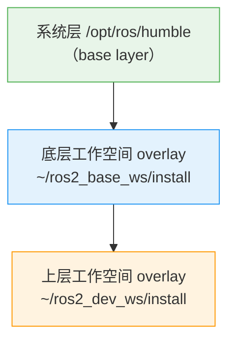

# 工作空间与 colcon 构建系统

## 前言

**C：** 工作空间是 ROS 2 组织代码的基本单元，理解它的 overlay 叠加机制是排查"为什么找不到包"这类问题的钥匙。本文从工作空间的目录结构讲起，演示 colcon 构建流程，拆解 package.xml、CMakeLists.txt、setup.py 三大配置文件，最后给出最小 C++ 包和最小 Python 包的完整可运行示例，帮你建立 ROS 2 工程化开发的正确心智模型。

<!-- more -->

## 一、什么是工作空间

### 1.1 基本概念

工作空间（Workspace）就是一个存放 ROS 2 功能包的目录。它本身不做什么特殊的事情——核心在于构建后生成的 `install/` 目录以及对应的 `setup.bash` 脚本。

ROS 2 使用 **overlay 机制** 来管理多个工作空间和系统安装之间的关系。简单来说：后 source 的工作空间会"覆盖"先 source 的同名资源，形成多层叠加。

### 1.2 三层 overlay 示意图



当你在终端中依次执行以下三条命令时，就形成了一个三层叠加：

```bash
source /opt/ros/humble/setup.bash       # 底层：系统安装
source ~/ros2_base_ws/install/setup.bash  # 中层：基础功能包
source ~/ros2_dev_ws/install/setup.bash   # 顶层：你的开发包
```

查找包的顺序是 **从顶层向底层**：先在 `ros2_dev_ws` 里找，找不到再去 `ros2_base_ws`，最后才查 `/opt/ros/humble`。如果两个工作空间里有同名包，顶层的会优先使用。

### 1.3 目录树结构

一个典型的 ROS 2 工作空间构建后的目录结构：

```
~/ros2_ws/
├── build/                  # 构建中间产物（目标文件、编译缓存等）
│   ├── my_cpp_pkg/
│   └── my_py_pkg/
├── install/                # 安装结果（可执行文件、库、配置）
│   ├── setup.bash          # 核心：source 此文件激活工作空间
│   ├── local_setup.bash
│   ├── my_cpp_pkg/
│   │   ├── lib/my_cpp_pkg/ # 可执行文件
│   │   └── share/my_cpp_pkg/
│   └── my_py_pkg/
│       └── lib/python3.10/dist-packages/
├── log/                    # 构建日志
│   ├── latest_build/
│   └── latest_test/
└── src/                    # 源代码（你编写和存放包的地方）
    ├── my_cpp_pkg/
    └── my_py_pkg/
```

其中只有 `src/` 是你需要手动创建和维护的，其余三个目录由 `colcon build` 自动生成。

## 二、创建工作空间

### 2.1 创建与首次构建

```bash
# 创建工作空间目录
mkdir -p ~/ros2_ws/src
cd ~/ros2_ws

# 确保已 source ROS 2 环境
source /opt/ros/humble/setup.bash

# 构建（此时 src 为空，不会报错，只是没有任何包可构建）
colcon build

# 激活工作空间
source install/setup.bash

# 验证环境变量
echo $AMENT_PREFIX_PATH
# 应包含：/home/user/ros2_ws/install:/opt/ros/humble
```

### 2.2 三个目录的用途

| 目录 | 用途 | 能否删除 | 是否提交到 Git |
|------|------|----------|---------------|
| `build/` | 编译中间产物（`.o`、CMake 缓存等），加速增量构建 | 可以，下次构建会重新生成 | 否，加入 `.gitignore` |
| `install/` | 最终安装产物，`setup.bash` 从这里加载环境 | 可以，但需要重新 `colcon build` | 否，加入 `.gitignore` |
| `log/` | 构建和测试日志，排查编译错误时查看 | 可以 | 否，加入 `.gitignore` |

::: tip .gitignore 模板
ROS 2 工作空间的 `.gitignore` 建议内容：
```
build/
install/
log/
```
只提交 `src/` 下的源代码。
:::

## 三、colcon 常用命令

`colcon` 是 ROS 2 的标准构建工具，底层调用 CMake 或 setuptools 完成实际编译。以下是日常开发中最常用的命令和参数。

### 3.1 构建

```bash
# 构建工作空间中的所有包
colcon build

# 只构建指定的包
colcon build --packages-select my_cpp_pkg

# 并行构建（默认自动检测 CPU 核心数，也可手动指定）
colcon build --parallel-workers 4

# 只构建上次失败或未构建的包
colcon build --continue-on-error

# 输出详细构建日志
colcon build --event-handlers console_direct+
```

### 3.2 符号链接安装（开发阶段推荐）

```bash
# 使用 --symlink-install：Python 代码修改后无需重新构建
colcon build --symlink-install
```

这是 Python 包开发中最实用的参数。正常情况下 `colcon build` 会把 Python 文件复制到 `install/` 目录，每次修改代码都得重新构建才能生效。加上 `--symlink-install` 后，`install/` 里存放的是符号链接，指向 `src/` 中的源文件，修改代码后立即生效。

> C++ 包使用此参数不会有副作用——C++ 需要重新编译才能生效，此参数对 C++ 编译产物无效。

### 3.3 查看包列表

```bash
# 列出工作空间中所有包
colcon list

# 列出包及其依赖
colcon list --packages-up-to my_cpp_pkg

# 只列出顶层包（不被其他包依赖的包）
colcon list --topological-order
```

### 3.4 测试

```bash
# 运行工作空间中所有包的测试
colcon test

# 只测试指定的包
colcon test --packages-select my_cpp_pkg

# 查看测试结果摘要
colcon test-result --verbose
```

### 3.5 常用参数速查

| 命令/参数 | 功能 | 使用场景 |
|-----------|------|----------|
| `--packages-select <pkg>` | 只构建指定包 | 大型工作空间中只改了一个包 |
| `--packages-up-to <pkg>` | 构建指定包及其所有依赖 | 确保依赖链完整 |
| `--symlink-install` | 符号链接安装 | Python 包日常开发 |
| `--cmake-args -DCMAKE_BUILD_TYPE=Release` | 传递 CMake 参数 | 设置编译优化等级 |
| `--merge-install` | 所有包安装到同一个 install/ 前缀 | 某些跨包依赖场景 |
| `--cmake-clean-cache` | 清除 CMake 缓存后重新构建 | CMake 配置出错时 |

## 四、ROS2 包的 package.xml

`package.xml` 是每个 ROS 2 包的"身份证"，位于包的根目录下。它用 XML 格式声明了包名、版本、描述、依赖关系等信息。

### 4.1 基本结构

```xml
<?xml version="1.0"?>
<?xml-model href="http://download.ros.org/schema/package_format3.xsd" schematypens="http://www.w3.org/2001/XMLSchema"?>
<package format="3">
  <name>my_cpp_pkg</name>
  <version>0.1.0</version>
  <description>一个最小的 ROS2 C++ 示例包</description>
  <maintainer email="dev@example.com">EASYZOOM</maintainer>
  <license>Apache-2.0</license>

  <!-- 构建工具依赖 -->
  <buildtool_depend>ament_cmake</buildtool_depend>

  <!-- 编译时依赖 -->
  <depend>rclcpp</depend>
  <depend>std_msgs</depend>

  <!-- 测试依赖 -->
  <test_depend>ament_lint_auto</test_depend>
  <test_depend>ament_lint_common</test_depend>

  <export>
    <build_type>ament_cmake</build_type>
  </export>
</package>
```

### 4.2 依赖声明的三种类型

| 标签 | 含义 | 什么时候需要 |
|------|------|-------------|
| `<buildtool_depend>` | 构建工具本身 | `ament_cmake` 或 `ament_python`，必填 |
| `<depend>` | 编译 + 运行时都需要 | 绝大多数依赖用这个就够了 |
| `<build_depend>` | 仅编译时需要 | 如代码生成工具 |
| `<exec_depend>` | 仅运行时需要 | 如配置文件、数据文件 |
| `<test_depend>` | 仅测试时需要 | 测试框架、mock 工具 |

### 4.3 ament_cmake vs ament_python

两种构建系统的核心区别：

| 对比项 | ament_cmake | ament_python |
|--------|-------------|--------------|
| `<build_type>` | `ament_cmake` | `ament_python` |
| 构建配置文件 | `CMakeLists.txt` | `setup.py` + `setup.cfg` |
| 适用语言 | C++（也可混编 Python） | 纯 Python |
| 编译产物 | 可执行文件、共享库 | Python 模块、脚本 |
| `<buildtool_depend>` | `ament_cmake` | `ament_python` |

::: warning 不要混用
一个包要么是 ament_cmake，要么是 ament_python，不能同时是两者。如果 C++ 和 Python 需要互相调用，把它们分成两个包放在同一工作空间。
:::

## 五、CMakeLists.txt 基本结构

这是 C++ 包的核心构建配置。以下是注释齐全的最小模板：

```cmake
cmake_minimum_required(VERSION 3.8)
project(my_cpp_pkg)

# 默认使用 C++17
if(NOT CMAKE_CXX_STANDARD)
  set(CMAKE_CXX_STANDARD 17)
endif()

# 查找 ROS 2 依赖
find_package(ament_cmake REQUIRED)
find_package(rclcpp REQUIRED)
find_package(std_msgs REQUIRED)

# 声明可执行目标
add_executable(my_node src/my_node.cpp)

# 为目标添加头文件搜索路径（ament 自动处理）
ament_target_dependencies(my_node
  rclcpp
  std_msgs
)

# 安装可执行文件
install(TARGETS my_node
  DESTINATION lib/${PROJECT_NAME}
)

# 安装 launch 文件等资源（如果有）
# install(DIRECTORY launch/
#   DESTINATION share/${PROJECT_NAME}/launch
# )

# 声明测试
if(BUILD_TESTING)
  find_package(ament_lint_auto REQUIRED)
  ament_lint_auto_find_test_dependencies()
endif()

# 打包
ament_package()
```

关键点解析：

- `find_package()`：查找 ROS 2 包的 CMake 配置，获取头文件路径和库文件路径。
- `ament_target_dependencies()`：将查找到的包的头文件和库链接到目标，相当于 `target_include_directories` + `target_link_libraries` 的合并简写。
- `install(TARGETS ... DESTINATION lib/${PROJECT_NAME})`：把可执行文件安装到 `install/my_cpp_pkg/lib/my_cpp_pkg/`，这样 `ros2 run my_cpp_pkg my_node` 才能找到它。
- `ament_package()`：必须放在最后，用于注册包的 ament 信息。

## 六、setup.py / setup.cfg 基本结构

Python 包使用 `setup.py`（入口脚本）和 `setup.cfg`（元数据配置）来定义构建行为。

### 6.1 setup.cfg

```ini
[develop]
script_dir=$base/lib/my_py_pkg
[install]
install_scripts=$base/lib/my_py_pkg
```

这两行的作用是把生成的可执行脚本安装到 `lib/my_py_pkg/` 下，使 `ros2 run` 能找到它们。

### 6.2 setup.py

```python
from setuptools import find_packages, setup

package_name = 'my_py_pkg'

setup(
    name=package_name,
    version='0.1.0',
    packages=find_packages(exclude=['test']),
    data_files=[
        ('share/ament_index/resource_index/packages',
            ['resource/' + package_name]),
        ('share/' + package_name, ['package.xml']),
    ],
    install_requires=['setuptools'],
    zip_safe=True,
    maintainer='EASYZOOM',
    maintainer_email='dev@example.com',
    description='一个最小的 ROS2 Python 示例包',
    license='Apache-2.0',
    tests_require=['pytest'],
    entry_points={
        'console_scripts': [
            'my_node = my_py_pkg.my_node:main',
        ],
    },
)
```

关键点解析：

- `data_files` 中的 `resource/<package_name>` 文件是 ament 的包索引标记，必须存在（可以为空文件）。
- `entry_points` 中的 `console_scripts` 定义了命令行入口：`my_node` 是可执行文件名，`my_py_pkg.my_node:main` 指向 Python 模块的 `main` 函数。
- `packages=find_packages()` 自动发现 Python 子包。

## 七、完整示例：最小 CMake 包与最小 Python 包

### 7.1 最小 C++ 包

目录结构：

```
src/my_cpp_pkg/
├── package.xml
├── CMakeLists.txt
└── src/
    └── my_node.cpp
```

`src/my_node.cpp`：

```cpp
#include "rclcpp/rclcpp.hpp"

int main(int argc, char *argv[]) {
    rclcpp::init(argc, argv);
    auto node = std::make_shared<rclcpp::Node>("minimal_node");
    RCLCPP_INFO(node->get_logger(), "Hello from minimal C++ node!");
    rclcpp::spin(node);
    rclcpp::shutdown();
    return 0;
}
```

`package.xml`（见第四节）和 `CMakeLists.txt`（见第五节）按上面的模板放置后，构建并运行：

```bash
cd ~/ros2_ws
colcon build --packages-select my_cpp_pkg
source install/setup.bash
ros2 run my_cpp_pkg my_node
# 输出：[INFO] [minimal_node]: Hello from minimal C++ node!
```

### 7.2 最小 Python 包

目录结构：

```
src/my_py_pkg/
├── package.xml
├── setup.py
├── setup.cfg
├── resource/
│   └── my_py_pkg      # 空文件，ament 索引标记
└── my_py_pkg/
    └── __init__.py
    └── my_node.py
```

`my_py_pkg/my_node.py`：

```python
import rclpy
from rclpy.node import Node

def main():
    rclpy.init()
    node = Node('minimal_py_node')
    node.get_logger().info('Hello from minimal Python node!')
    try:
        rclpy.spin(node)
    except KeyboardInterrupt:
        pass
    finally:
        node.destroy_node()
        rclpy.shutdown()

if __name__ == '__main__':
    main()
```

`package.xml` 中 `<build_type>` 改为 `ament_python`，`<buildtool_depend>` 改为 `ament_python`：

```xml
<buildtool_depend>ament_python</buildtool_depend>
<!-- ... -->
<export>
  <build_type>ament_python</build_type>
</export>
```

构建并运行：

```bash
cd ~/ros2_ws
colcon build --packages-select my_py_pkg --symlink-install
source install/setup.bash
ros2 run my_py_pkg my_node
# 输出：[INFO] [minimal_py_node]: Hello from minimal Python node!
```

## 八、工作空间环境变量

source `setup.bash` 时，脚本会设置一系列环境变量。理解它们有助于排查问题。

### 8.1 核心环境变量

| 环境变量 | 含义 | 示例值 |
|----------|------|--------|
| `ROS_DISTRO` | 当前 ROS 2 发行版名称 | `humble` |
| `AMENT_PREFIX_PATH` | 所有 overlay 层的路径，用 `:` 分隔 | `/home/u/ws/install:/opt/ros/humble` |
| `ROS_DOMAIN_ID` | DDS 域 ID，同一网络中相同 ID 的节点才能通信 | 默认 `0` |
| `ROS_PYTHON_VERSION` | 使用的 Python 版本 | `3` |
| `LD_LIBRARY_PATH` | 动态库搜索路径 | 包含 ROS 2 包的库路径 |
| `PATH` | 可执行文件搜索路径 | 包含 ROS 2 工具路径 |
| `CMAKE_PREFIX_PATH` | CMake 查找包的搜索路径 | 同 `AMENT_PREFIX_PATH` |

### 8.2 ROS_DOMAIN_ID

这是一个非常重要的变量，控制 DDS（Data Distribution Service）的域隔离：

```bash
# 默认值 0，同一局域网下所有 ROS 2 节点互相可见
echo $ROS_DOMAIN_ID
# 0

# 设置为其他值实现隔离（两台机器人不会互相干扰）
export ROS_DOMAIN_ID=10

# 写入 ~/.bashrc 持久化
echo 'export ROS_DOMAIN_ID=10' >> ~/.bashrc
```

::: warning 多机器人场景
在同一局域网中运行多套 ROS 2 系统（如多台机器人 + 多台工控机），务必为每套系统分配不同的 `ROS_DOMAIN_ID`（取值范围 0-101，推荐用 10、20、30 等间隔值），否则节点会收到错误的消息。
:::

### 8.3 AMENT_PREFIX_PATH

这个变量是 overlay 机制的核心实现：

```bash
# 查看当前所有 overlay 层
echo $AMENT_PREFIX_PATH | tr ':' '\n'
# /home/user/ros2_ws/install
# /opt/ros/humble

# 包含的路径越多，表示叠加的层数越多
# colcon list 和 ros2 pkg list 都依赖这个变量来发现包
```

如果 `ros2 run` 报"package not found"，第一步就是检查 `AMENT_PREFIX_PATH` 是否正确包含了目标包所在的 install 目录。

### 8.4 环境变量排查清单

遇到"找不到包"或"命令不存在"的问题时，按以下顺序排查：

```bash
# 1. 确认 ROS_DISTRO 正确
echo $ROS_DISTRO

# 2. 确认工作空间已激活（检查 install 路径是否存在）
echo $AMENT_PREFIX_PATH

# 3. 确认包在工作空间中
colcon list

# 4. 确认构建成功（检查 install 目录下有对应包）
ls install/

# 5. 重新 source（最常见的问题是忘了 source）
source ~/ros2_ws/install/setup.bash
```

## 九、总结

| 概念 | 要点 |
|------|------|
| 工作空间 | `src/` 放源码，`colcon build` 生成 `build/`、`install/`、`log/` |
| overlay | 多层叠加，后 source 的覆盖先 source 的同名资源 |
| colcon build | `--packages-select` 指定包，`--symlink-install` 适合 Python 开发 |
| package.xml | 包的身份证，声明依赖关系和构建类型 |
| CMakeLists.txt | C++ 包的构建配置，管理编译目标和安装规则 |
| setup.py / setup.cfg | Python 包的构建配置，定义入口点 |
| 环境变量 | `ROS_DOMAIN_ID` 隔离通信域，`AMENT_PREFIX_PATH` 驱动包发现 |

掌握这些基础后，你就可以开始在 ROS 2 中创建自己的功能包，进行节点开发和通信测试了。下一篇文章我们将深入 ROS 2 的通信模型——话题（Topic）、服务（Service）和动作（Action）。
