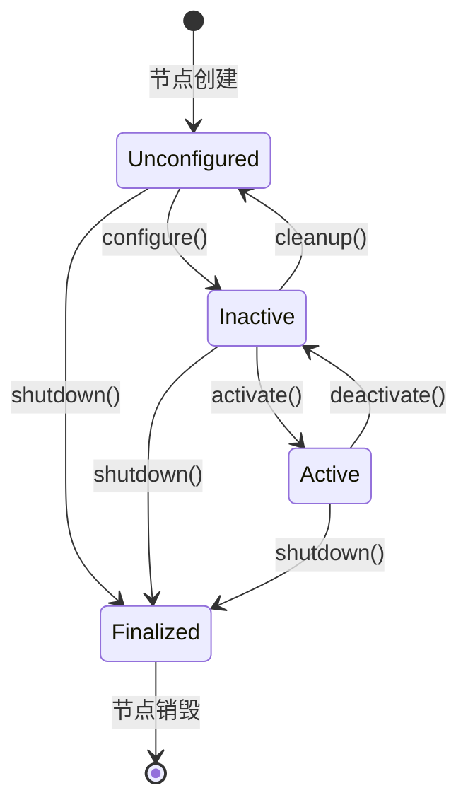

# 节点生命周期管理

## 前言

**C：** 上一篇我们写了第一个普通节点，启动后立刻开始干活。但在真实机器人系统中，传感器节点上电后需要先初始化硬件、校准参数，然后才进入工作状态；遇到异常时还要能安全停机。ROS 2 的**生命周期节点（Lifecycle Node）**就是为此设计的——它通过状态机严格控制节点的启动、激活、去激活和销毁过程。本文将从状态机原理讲起，给出完整的 C++ 和 Python 示例，再演示命令行操作和实际使用建议。

<!-- more -->

## 一、为什么需要生命周期

前面写的普通节点继承自 `rclcpp::Node`（C++）或 `rclpy.node.Node`（Python），一旦构造完成就立即进入运行状态，定时器开始计时，回调开始执行。这种"即起即用"的模式适合简单场景，但实际工程中会暴露几个问题：

1. **硬件初始化顺序不可控**：驱动节点构造函数中打开串口/相机，但此时下游节点可能还没准备好接收数据，造成消息丢失。
2. **无法安全停机**：电机驱动节点被直接 kill 时，电机可能还在转动。你需要在关闭前执行减速停机逻辑。
3. **调试困难**：一个"已经启动"的节点突然出问题，你不知道它当前处于什么内部阶段。

生命周期节点通过**有限状态机（FSM）**解决了这些问题。节点的每个阶段都有明确的语义，状态转换由外部触发或内部回调完成，整个流程可控、可观测、可调试。

::: tip 核心对比

| 对比项 | 普通节点 | 生命周期节点 |
|--------|---------|-------------|
| 基类 | `rclcpp::Node` | `rclcpp_lifecycle::LifecycleNode` |
| 启动行为 | 构造即运行 | 构造后处于 Unconfigured，需手动转换 |
| 硬件管理 | 在构造函数中 | 在 on_configure 回调中 |
| 可观测性 | 只有运行/停止 | 精确到具体状态 |
| 适用场景 | 简单工具节点 | 传感器驱动、执行器控制等 |
:::

## 二、生命周期状态机

ROS 2 的生命周期状态机定义了 4 个**主状态（Primary States）**和若干**转换（Transitions）**。节点在任意时刻只能处于其中一个主状态。



### 2.1 四个主状态

| 状态 | 含义 | 类比 |
|------|------|------|
| **Unconfigured** | 节点已创建但未初始化，不持有任何资源 | 设备刚上电，还没开始初始化 |
| **Inactive** | 节点已配置完成，但未开始处理数据。发布者不发消息，订阅者可以收但不会处理 | 设备就绪，待命状态 |
| **Active** | 节点正在正常工作，处理数据、发布消息 | 设备正常运行中 |
| **Finalized** | 节点已关闭，所有资源已释放 | 设备已关机 |

### 2.2 状态转换

| 转换 | 触发 | 回调 | 典型操作 |
|------|------|------|---------|
| `configure()` | 外部请求 | `on_configure()` | 打开硬件、分配内存、读取参数 |
| `activate()` | 外部请求 | `on_activate()` | 启动定时器、开始发布数据 |
| `deactivate()` | 外部请求 | `on_deactivate()` | 停止定时器、暂停数据发布 |
| `cleanup()` | 外部请求 | `on_cleanup()` | 关闭硬件、释放资源，回到"裸机"状态 |
| `shutdown()` | 外部请求 | `on_shutdown()` | 执行最终清理，不可逆 |

每个回调返回 `CallbackReturn`，可以是 `SUCCESS`（允许转换）或 `FAILURE`（拒绝转换，状态不变）。这让你可以在回调中做检查，比如：串口打开失败时返回 FAILURE，节点停留在 Unconfigured 状态。

## 三、C++ 生命周期节点示例

下面是一个完整可运行的 C++ 生命周期节点，模拟一个传感器：配置时"打开硬件"，激活时开始发布数据，去激活时暂停，清理时"关闭硬件"。

### 3.1 创建包

```bash
cd ~/ros2_ws/src

ros2 pkg create --build-type ament_cmake lifecycle_demo_cpp \
  --dependencies rclcpp rclcpp_lifecycle std_msgs
```

### 3.2 节点代码

创建 `lifecycle_demo_cpp/src/lifecycle_sensor.cpp`：

```cpp
#include <rclcpp/rclcpp.hpp>
#include <rclcpp_lifecycle/lifecycle_node.hpp>
#include <std_msgs/msg/string.hpp>

using CallbackReturn = rclcpp_lifecycle::node_interfaces::LifecycleNodeInterface::CallbackReturn;

class LifecycleSensor : public rclcpp_lifecycle::LifecycleNode {
public:
    LifecycleSensor() : LifecycleNode("lifecycle_sensor") {
        // 构造函数中只做最基本的初始化
        // 不在这里打开硬件或创建定时器
        RCLCPP_INFO(get_logger(), "生命周期节点已创建，当前状态: Unconfigured");
    }

    // ===== 状态转换回调 =====

    // Unconfigured -> Inactive
    CallbackReturn on_configure(const rclcpp_lifecycle::State &) override {
        RCLCPP_INFO(get_logger(), "[on_configure] 正在初始化硬件...");

        // 模拟硬件初始化：打开设备、分配内存等
        hardware_initialized_ = true;

        // 创建发布者（此时不发布数据）
        publisher_ = create_publisher<std_msgs::msg::String>("sensor_data", 10);

        // 创建定时器（先不启用，在 on_activate 中启动）
        timer_ = create_wall_timer(
            std::chrono::milliseconds(500),
            std::bind(&LifecycleSensor::publish_data, this));

        // 配置阶段先禁用定时器
        timer_->cancel();

        RCLCPP_INFO(get_logger(), "[on_configure] 硬件初始化完成");
        return CallbackReturn::SUCCESS;
    }

    // Inactive -> Active
    CallbackReturn on_activate(const rclcpp_lifecycle::State &) override {
        RCLCPP_INFO(get_logger(), "[on_activate] 正在激活节点...");

        if (!hardware_initialized_) {
            RCLCPP_ERROR(get_logger(), "[on_activate] 硬件未初始化，拒绝激活");
            return CallbackReturn::FAILURE;
        }

        // 启用定时器，开始周期性发布
        timer_->reset();

        // 显式激活发布者（LifecycleNode 特有）
        publisher_->on_activate();

        RCLCPP_INFO(get_logger(), "[on_activate] 节点已激活，开始发布数据");
        return CallbackReturn::SUCCESS;
    }

    // Active -> Inactive
    CallbackReturn on_deactivate(const rclcpp_lifecycle::State &) override {
        RCLCPP_INFO(get_logger(), "[on_deactivate] 正在去激活节点...");

        // 停止定时器
        timer_->cancel();

        // 停用发布者
        publisher_->on_deactivate();

        RCLCPP_INFO(get_logger(), "[on_deactivate] 节点已去激活，暂停数据发布");
        return CallbackReturn::SUCCESS;
    }

    // Inactive -> Unconfigured
    CallbackReturn on_cleanup(const rclcpp_lifecycle::State &) override {
        RCLCPP_INFO(get_logger(), "[on_cleanup] 正在清理资源...");

        // 释放定时器和发布者
        timer_.reset();
        publisher_.reset();

        // 关闭硬件
        hardware_initialized_ = false;

        RCLCPP_INFO(get_logger(), "[on_cleanup] 资源已释放，回到未配置状态");
        return CallbackReturn::SUCCESS;
    }

    // 任意状态 -> Finalized
    CallbackReturn on_shutdown(const rclcpp_lifecycle::State & state) override {
        RCLCPP_INFO(get_logger(), "[on_shutdown] 从状态 '%s' 执行关机",
                    state.label().c_str());

        timer_.reset();
        publisher_.reset();
        hardware_initialized_ = false;

        RCLCPP_INFO(get_logger(), "[on_shutdown] 节点已关闭");
        return CallbackReturn::SUCCESS;
    }

private:
    void publish_data() {
        auto msg = std_msgs::msg::String();
        msg.data = "传感器读数: " + std::to_string(counter_++);
        publisher_->publish(msg);
        RCLCPP_INFO(get_logger(), "发布: '%s'", msg.data.c_str());
    }

    rclcpp_lifecycle::LifecyclePublisher<std_msgs::msg::String>::SharedPtr publisher_;
    rclcpp::TimerBase::SharedPtr timer_;
    bool hardware_initialized_ = false;
    size_t counter_ = 0;
};

int main(int argc, char *argv[]) {
    rclcpp::init(argc, argv);
    rclcpp::executors::SingleThreadedExecutor exec;
    auto node = std::make_shared<LifecycleSensor>();
    exec.add_node(node->get_node_base_interface());
    exec.spin();
    rclcpp::shutdown();
    return 0;
}
```

::: warning 注意事项
- 继承 `rclcpp_lifecycle::LifecycleNode` 而非 `rclcpp::Node`。
- 发布者类型是 `rclcpp_lifecycle::LifecyclePublisher`，需要显式调用 `on_activate()` / `on_deactivate()`。
- `main` 函数中使用 `exec.add_node(node->get_node_base_interface())` 而非直接 `add_node(node)`。
:::

### 3.3 配置 CMakeLists.txt

```cmake
cmake_minimum_required(VERSION 3.8)
project(lifecycle_demo_cpp)

if(CMAKE_COMPILER_IS_GNUCXX OR CMAKE_CXX_COMPILER_ID MATCHES "Clang")
  add_compile_options(-Wall -Wextra -Wpedantic)
endif()

find_package(ament_cmake REQUIRED)
find_package(rclcpp REQUIRED)
find_package(rclcpp_lifecycle REQUIRED)
find_package(std_msgs REQUIRED)

add_executable(lifecycle_sensor src/lifecycle_sensor.cpp)
ament_target_dependencies(lifecycle_sensor
  rclcpp rclcpp_lifecycle std_msgs)

install(TARGETS lifecycle_sensor
  DESTINATION lib/${PROJECT_NAME}
)

ament_package()
```

### 3.4 配置 package.xml

在 `package.xml` 中添加依赖：

```xml
<depend>rclcpp</depend>
<depend>rclcpp_lifecycle</depend>
<depend>std_msgs</depend>
```

## 四、Python 生命周期节点示例

### 4.1 创建包

```bash
cd ~/ros2_ws/src

ros2 pkg create --build-type ament_python lifecycle_demo_py \
  --dependencies rclpy std_msgs
```

### 4.2 节点代码

创建 `lifecycle_demo_py/lifecycle_sensor.py`：

```python
#!/usr/bin/env python3
"""
生命周期传感器节点 - Python 版本
演示 on_configure / on_activate / on_deactivate / on_cleanup / on_shutdown
"""

import rclpy
from rclpy.lifecycle import LifecycleNode, LifecycleState, TransitionCallbackReturn
from std_msgs.msg import String


class LifecycleSensor(LifecycleNode):
    def __init__(self):
        super().__init__('lifecycle_sensor')
        self.counter = 0
        self.hardware_initialized = False
        self.publisher = None
        self.timer = None
        self.get_logger().info('生命周期节点已创建，当前状态: Unconfigured')

    def on_configure(self, state: LifecycleState) -> TransitionCallbackReturn:
        """Unconfigured -> Inactive：初始化硬件，创建发布者"""
        self.get_logger().info('[on_configure] 正在初始化硬件...')

        # 模拟硬件初始化
        self.hardware_initialized = True

        # 创建发布者
        self.publisher = self.create_lifecycle_publisher(String, 'sensor_data', 10)

        # 创建定时器（暂不启动）
        self.timer = self.create_timer(0.5, self.publish_data)
        self.timer.cancel()  # 配置阶段先禁用

        self.get_logger().info('[on_configure] 硬件初始化完成')
        return TransitionCallbackReturn.SUCCESS

    def on_activate(self, state: LifecycleState) -> TransitionCallbackReturn:
        """Inactive -> Active：启动定时器，激活发布者"""
        self.get_logger().info('[on_activate] 正在激活节点...')

        if not self.hardware_initialized:
            self.get_logger().error('[on_activate] 硬件未初始化，拒绝激活')
            return TransitionCallbackReturn.FAILURE

        self.timer.reset()  # 重新启用定时器

        self.get_logger().info('[on_activate] 节点已激活，开始发布数据')
        # 注意：Python 中的 LifecyclePublisher 在父类 on_activate 中自动激活
        return super().on_activate(state)

    def on_deactivate(self, state: LifecycleState) -> TransitionCallbackReturn:
        """Active -> Inactive：停止定时器，停用发布者"""
        self.get_logger().info('[on_deactivate] 正在去激活节点...')

        self.timer.cancel()

        self.get_logger().info('[on_deactivate] 节点已去激活，暂停数据发布')
        return super().on_deactivate(state)

    def on_cleanup(self, state: LifecycleState) -> TransitionCallbackReturn:
        """Inactive -> Unconfigured：释放所有资源"""
        self.get_logger().info('[on_cleanup] 正在清理资源...')

        self.destroy_timer(self.timer)
        self.destroy_publisher(self.publisher)
        self.timer = None
        self.publisher = None
        self.hardware_initialized = False

        self.get_logger().info('[on_cleanup] 资源已释放，回到未配置状态')
        return TransitionCallbackReturn.SUCCESS

    def on_shutdown(self, state: LifecycleState) -> TransitionCallbackReturn:
        """任意状态 -> Finalized：最终清理"""
        self.get_logger().info(
            f"[on_shutdown] 从状态 '{state.label}' 执行关机")

        if self.timer is not None:
            self.destroy_timer(self.timer)
        if self.publisher is not None:
            self.destroy_publisher(self.publisher)

        self.hardware_initialized = False
        self.get_logger().info('[on_shutdown] 节点已关闭')
        return TransitionCallbackReturn.SUCCESS

    def publish_data(self):
        msg = String()
        msg.data = f'传感器读数: {self.counter}'
        self.counter += 1
        self.publisher.publish(msg)
        self.get_logger().info(f"发布: '{msg.data}'")


def main(args=None):
    rclpy.init(args=args)
    executor = rclpy.executors.SingleThreadedExecutor()
    node = LifecycleSensor()
    executor.add_node(node)
    try:
        executor.spin()
    except KeyboardInterrupt:
        pass
    executor.shutdown()
    node.destroy_node()
    rclpy.shutdown()


if __name__ == '__main__':
    main()
```

### 4.3 配置入口点

在 `setup.py` 的 `entry_points` 中添加：

```python
entry_points={
    'console_scripts': [
        'lifecycle_sensor = lifecycle_demo_py.lifecycle_sensor:main',
    ],
},
```

然后赋予执行权限并编译：

```bash
chmod +x lifecycle_demo_py/lifecycle_sensor.py
cd ~/ros2_ws
colcon build --symlink-install
source install/setup.bash
```

## 五、生命周期节点通信

生命周期节点最关键的设计在于：**不同状态下，通信行为不同**。

### 5.1 LifecyclePublisher 的行为

| 节点状态 | 发布者行为 | 订阅者行为 |
|---------|-----------|-----------|
| Unconfigured | 发布者未创建，无法通信 | 不可通信 |
| Inactive | 发布者存在但不发送消息（`on_deactivate` 已调用） | 可建立连接，消息被 DDS 缓存 |
| Active | 正常发布消息 | 正常接收消息 |
| Finalized | 资源已释放 | 不可通信 |

这就是 `LifecyclePublisher` 和普通 `Publisher` 的核心区别：

- `on_activate()` 被调用后，发布者才会真正将消息通过网络发出。
- `on_deactivate()` 被调用后，即使 `publish()` 被调用，消息也不会被发送到 DDS 网络。

::: tip 深入理解
这种设计让系统具有"待命"能力。比如一个激光雷达节点在 Inactive 状态下，发布者已经注册到了 DDS，下游节点可以发现它（`ros2 topic list` 能看到话题），但不会有数据流出。当你需要整个系统从待命切换到工作时，只需逐个 activate 所有节点，数据流就会按预期启动。
:::

### 5.2 订阅者的兼容性

生命周期节点的发布者对订阅者来说是**透明兼容**的。下游的普通节点（非生命周期节点）使用普通的 `create_subscription` 即可接收数据，不需要任何特殊处理。生命周期管理是发布者侧的事，对消费者无感。

## 六、使用 ros2 lifecycle 命令

ROS 2 提供了 `ros2 lifecycle` 命令集，用于从命令行查看和操控生命周期节点的状态。

### 6.1 编译运行节点

先编译并启动生命周期节点：

```bash
# 终端 1：启动 C++ 生命周期节点
source ~/ros2_ws/install/setup.bash
ros2 run lifecycle_demo_cpp lifecycle_sensor

# 或启动 Python 版本
ros2 run lifecycle_demo_py lifecycle_sensor
```

此时节点处于 **Unconfigured** 状态，什么都不做。

### 6.2 查看当前状态

```bash
# 查看节点当前状态
ros2 lifecycle get /lifecycle_sensor
```

输出：

```
unconfigured [1]
```

### 6.3 查看可用转换

```bash
# 列出当前状态下可以执行的转换
ros2 lifecycle list /lifecycle_sensor
```

在 Unconfigured 状态下，输出：

```
configure [1]
shutdown [4]
```

### 6.4 执行状态转换

```bash
# Unconfigured -> Inactive（初始化硬件）
ros2 lifecycle set /lifecycle_sensor configure
```

输出：

```
Transitioning successful: unconfigured [1] -> inactive [2]
```

此时查看状态：

```bash
ros2 lifecycle get /lifecycle_sensor
# inactive [2]
```

```bash
# Inactive -> Active（开始工作）
ros2 lifecycle set /lifecycle_sensor activate
# Transitioning successful: inactive [2] -> active [3]
```

此时终端 1 会开始打印发布的传感器数据。

```bash
# Active -> Inactive（暂停工作）
ros2 lifecycle set /lifecycle_sensor deactivate
# Transitioning successful: active [3] -> inactive [2]

# Inactive -> Unconfigured（释放资源）
ros2 lifecycle set /lifecycle_sensor cleanup
# Transitioning successful: inactive [2] -> unconfigured [1]

# 任意状态 -> Finalized（关机）
ros2 lifecycle set /lifecycle_sensor shutdown
# Transitioning successful: unconfigured [1] -> finalized [5]
```

### 6.5 在 launch 文件中管理

实际项目中，通常在 launch 文件中通过 `LifecycleNode` 的 `autostart` 参数或使用 `lifecycle_manager` 节点来自动化状态转换：

```python
# launch 示例（Python）
from launch import LaunchDescription
from launch_ros.actions import LifecycleNode

def generate_launch_description():
    return LaunchDescription([
        LifecycleNode(
            package='lifecycle_demo_cpp',
            executable='lifecycle_sensor',
            name='lifecycle_sensor',
            namespace='',
            autostart=True,           # 自动执行 configure + activate
            # 也可以只 configure 不 activate
        ),
    ])
```

`autostart=True` 会让节点在启动后自动经历 configure → activate 的转换流程。更多精细控制可以使用 `lifecycle_manager` 或 `lifecycle_manager_py` 节点。

## 七、什么时候该用生命周期节点

不是所有节点都需要生命周期管理。以下是一些实用的判断标准：

### 7.1 推荐使用生命周期节点的场景

| 场景 | 原因 |
|------|------|
| **硬件驱动节点**（相机、激光雷达、IMU、电机） | 需要可控的硬件初始化/释放流程 |
| **执行器控制节点**（机械臂、底盘驱动） | 必须支持安全停机，避免失控 |
| **需要调试/诊断的节点** | 通过 `ros2 lifecycle get` 即可快速了解节点内部阶段 |
| **多节点协同系统** | 可以按顺序激活/去激活，确保数据流可控 |
| **需要"待命模式"的系统** | 节点就绪但不发数据，等待外部指令激活 |

### 7.2 不需要生命周期节点的场景

- 简单的数据中转/处理节点（如消息格式转换）
- 纯计算节点（如 SLAM、规划算法）
- 一次性的工具节点（如 `ros2 bag play`、参数加载器）
- 原型验证阶段，快速验证通信逻辑时

### 7.3 实际项目建议

1. **传感器驱动一律用生命周期节点**。这是 ROS 2 社区的最佳实践，像 `ros2_camera`、`rplidar_ros` 等官方驱动都遵循这个模式。
2. **在 launch 文件中用 `autostart=True` 或 `lifecycle_manager` 统一管理**，避免手动一条条敲命令。
3. **在 on_configure 中读取参数**，而不是在构造函数中。这样可以通过参数服务在运行前调整配置。
4. **on_shutdown 中做安全处理**。电机节点要确保电机停止，串口节点要确保端口关闭。
5. **生命周期和普通节点可以混用**。下游消费者无需关心上游是否是生命周期节点。

::: tip 小结
生命周期节点是 ROS 2 区别于 ROS 1 的重要特性之一。它让机器人系统从"启动即失控"变成"启动即可控"，是实现安全、可靠的机器人软件系统的关键基础设施。掌握生命周期管理，是从 ROS 2 玩家进阶到 ROS 2 工程师的必经之路。
:::
