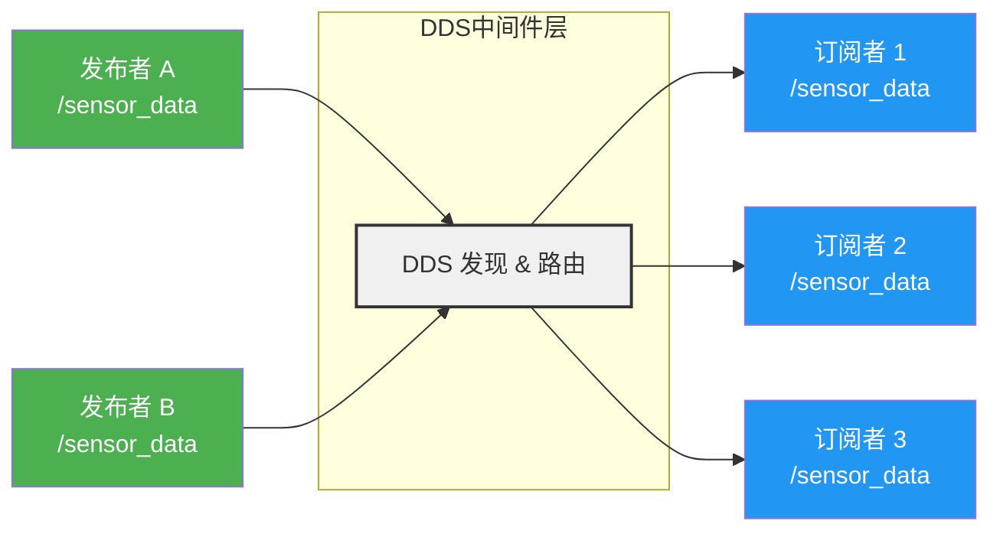

# 话题（Topic）通信

## 前言

**C：** 话题是 ROS 2 最基础也最常用的通信方式——传感器数据、里程计、图像流、日志……几乎一切"持续产生的数据流"都通过话题传递。本篇从发布/订阅模型讲起，覆盖消息类型、C++ 和 Python 完整示例、常用命令行工具，以及 ROS 2 独有的 QoS 服务质量策略。掌握话题通信，就掌握了 ROS 2 的"经络"。

<!-- more -->

## 话题通信模型

### 发布/订阅模式

话题通信采用经典的**发布/订阅（Publish/Subscribe）**模式，属于一对多的异步通信：

- **发布者（Publisher）**：向某个话题持续发送消息，不关心谁在接收。
- **订阅者（Subscriber）**：向某个话题注册兴趣，只关心自己需要的数据。
- **话题（Topic）**：消息的通道，由字符串名称标识（如 `/cmd_vel`、`/scan`）。
- **中间件（DDS）**：负责消息的路由、发现和传输，对用户透明。

这种解耦设计意味着：发布者和订阅者互不知道对方的存在，新增或移除节点无需修改其他节点的代码。

### DDS 如何实现

ROS 2 底层使用 DDS（Data Distribution Service）标准实现通信。DDS 通过组播自动发现同一网络中的节点，并按照 QoS 策略匹配发布者和订阅者。只有当双方的 QoS 兼容时，才会建立数据通道。



上图展示了 DDS 的核心作用：多个发布者向同一话题发数据，DDS 自动将消息分发给所有匹配的订阅者。整个过程无需中心服务器——这就是 ROS 2 与 ROS 1 最大的架构区别。

::: tip 关键特性
- **异步**：发布者调用 `publish()` 后立即返回，不会阻塞等待订阅者处理。
- **一对多**：一条消息可以同时被多个订阅者接收。
- **匿名**：发布者不知道有几个订阅者，反之亦然。
- **类型安全**：每个话题绑定一种消息类型，编译期即可检查。
:::

## 消息类型

ROS 2 中每个话题都有固定的消息类型。消息类型由**包名/消息名**组成，例如 `std_msgs/msg/String`。

### 常用消息包

| 包名 | 说明 | 典型消息 |
| --- | --- | --- |
| `std_msgs` | 基础类型 | `String`、`Int32`、`Float64`、`Bool`、`Header` |
| `geometry_msgs` | 几何与运动 | `Twist`（线速度+角速度）、`Pose`、`TransformStamped` |
| `sensor_msgs` | 传感器数据 | `LaserScan`、`Image`、`Imu`、`PointCloud2`、`NavSatFix` |
| `nav_msgs` | 导航相关 | `Odometry`、`Path`、`OccupancyGrid` |
| `tf2_msgs` | 坐标变换 | `TFMessage` |

### 查看消息定义

使用 `ros2 interface` 命令查看系统中的消息定义：

```bash
# 列出所有已安装的接口（消息、服务、动作）
ros2 interface list

# 筛选 msg 类型
ros2 interface list --msg | grep std_msgs

# 查看具体消息的字段定义
ros2 interface show std_msgs/msg/String
# 输出：string data

ros2 interface show geometry_msgs/msg/Twist
# 输出：
# Vector3  linear
#   float64 x
#   float64 y
#   float64 z
# Vector3  angular
#   float64 x
#   float64 y
#   float64 z
```

自定义消息也很常见——在一个独立的包中定义 `.msg` 文件，然后在其他包中引用它。这会在后续章节单独讲解。

## C++ 发布者示例

下面创建一个发布者节点，以 1Hz 的频率向 `/chatter` 话题发布 `std_msgs/msg/String` 消息。

假设功能包名为 `my_topic_demo`，`CMakeLists.txt` 和 `package.xml` 中已正确声明依赖 `rclcpp` 和 `std_msgs`。

```cpp
// src/talker.cpp
#include <chrono>
#include <functional>
#include <string>

#include "rclcpp/rclcpp.hpp"
#include "std_msgs/msg/string.hpp"

using namespace std::chrono_literals;

class MinimalPublisher : public rclcpp::Node
{
public:
    MinimalPublisher() : Node("minimal_publisher"), count_(0)
    {
        // 创建发布者，话题名为 /chatter，队列深度 10
        publisher_ = this->create_publisher<std_msgs::msg::String>("chatter", 10);

        // 创建定时器，每 500ms 触发一次回调
        timer_ = this->create_wall_timer(
            500ms,
            std::bind(&MinimalPublisher::timer_callback, this));
    }

private:
    void timer_callback()
    {
        auto message = std_msgs::msg::String();
        message.data = "Hello, ROS2! Count: " + std::to_string(count_++);
        RCLCPP_INFO(this->get_logger(), "Publishing: '%s'", message.data.c_str());
        publisher_->publish(message);
    }

    rclcpp::TimerBase::SharedPtr timer_;
    rclcpp::Publisher<std_msgs::msg::String>::SharedPtr publisher_;
    size_t count_;
};

int main(int argc, char *argv[])
{
    rclcpp::init(argc, argv);
    rclcpp::spin(std::make_shared<MinimalPublisher>());
    rclcpp::shutdown();
    return 0;
}
```

对应的 `CMakeLists.txt` 关键部分：

```cmake
find_package(rclcpp REQUIRED)
find_package(std_msgs REQUIRED)

add_executable(talker src/talker.cpp)
ament_target_dependencies(talker rclcpp std_msgs)

install(TARGETS talker
  DESTINATION lib/${PROJECT_NAME})
```

编译并运行：

```bash
colcon build --packages-select my_topic_demo
source install/setup.bash
ros2 run my_topic_demo talker
```

终端输出：

```
[INFO] [minimal_publisher]: Publishing: 'Hello, ROS2! Count: 0'
[INFO] [minimal_publisher]: Publishing: 'Hello, ROS2! Count: 1'
[INFO] [minimal_publisher]: Publishing: 'Hello, ROS2! Count: 2'
...
```

## C++ 订阅者示例

订阅者节点监听 `/chatter` 话题，在回调函数中处理收到的消息：

```cpp
// src/listener.cpp
#include <functional>
#include <memory>
#include <string>

#include "rclcpp/rclcpp.hpp"
#include "std_msgs/msg/string.hpp"

using std::placeholders::_1;

class MinimalSubscriber : public rclcpp::Node
{
public:
    MinimalSubscriber() : Node("minimal_subscriber")
    {
        // 创建订阅者，绑定回调函数
        subscription_ = this->create_subscription<std_msgs::msg::String>(
            "chatter",
            10,
            std::bind(&MinimalSubscriber::topic_callback, this, _1));
    }

private:
    void topic_callback(const std_msgs::msg::String &msg) const
    {
        RCLCPP_INFO(this->get_logger(), "Received: '%s'", msg.data.c_str());
    }

    rclcpp::Subscription<std_msgs::msg::String>::SharedPtr subscription_;
};

int main(int argc, char *argv[])
{
    rclcpp::init(argc, argv);
    rclcpp::spin(std::make_shared<MinimalSubscriber>());
    rclcpp::shutdown();
    return 0;
}
```

`CMakeLists.txt` 补充：

```cmake
add_executable(listener src/listener.cpp)
ament_target_dependencies(listener rclcpp std_msgs)

install(TARGETS listener
  DESTINATION lib/${PROJECT_NAME})
```

同时运行发布者和订阅者（两个终端）：

```bash
# 终端 1
ros2 run my_topic_demo talker

# 终端 2
ros2 run my_topic_demo listener
```

::: tip 关于回调函数
`rclcpp::spin()` 会进入事件循环，等待并分发回调。回调函数在 `spin` 线程中执行，因此不应包含耗时操作。如果回调需要处理大量计算，建议使用 `MultiThreadedExecutor` 或将任务提交到独立线程。
:::

## Python 发布者与订阅者

Python 版本使用 `rclpy`，API 结构与 C++ 版本一一对应。

### 发布者

```python
# scripts/talker.py
import rclpy
from rclpy.node import Node
from std_msgs.msg import String


class MinimalPublisher(Node):
    def __init__(self):
        super().__init__('minimal_publisher_py')
        self.publisher_ = self.create_publisher(String, 'chatter', 10)
        self.timer = self.create_timer(0.5, self.timer_callback)
        self.count = 0

    def timer_callback(self):
        msg = String()
        msg.data = f'Hello from Python! Count: {self.count}'
        self.count += 1
        self.get_logger().info(f'Publishing: "{msg.data}"')
        self.publisher_.publish(msg)


def main(args=None):
    rclpy.init(args=args)
    publisher = MinimalPublisher()
    rclpy.spin(publisher)
    publisher.destroy_node()
    rclpy.shutdown()


if __name__ == '__main__':
    main()
```

### 订阅者

```python
# scripts/listener.py
import rclpy
from rclpy.node import Node
from std_msgs.msg import String


class MinimalSubscriber(Node):
    def __init__(self):
        super().__init__('minimal_subscriber_py')
        self.subscription = self.create_subscription(
            String,
            'chatter',
            self.listener_callback,
            10)

    def listener_callback(self, msg):
        self.get_logger().info(f'Received: "{msg.data}"')


def main(args=None):
    rclpy.init(args=args)
    subscriber = MinimalSubscriber()
    rclpy.spin(subscriber)
    subscriber.destroy_node()
    rclpy.shutdown()


if __name__ == '__main__':
    main()
```

::: tip C++ 和 Python 节点互通
C++ 发布者和 Python 订阅者可以互相通信，反之亦然。因为通信是通过 DDS 完成的，与语言无关。话题名称和消息类型一致即可。
:::

## ros2 topic 命令

`ros2 topic` 是日常开发和调试中最常用的命令行工具集。

### 常用命令一览

```bash
# 列出当前所有活跃话题
ros2 topic list

# 查看话题详细信息（类型、QoS、发布者/订阅者数量）
ros2 topic info /chatter
ros2 topic info /chatter --verbose    # 包含发布者和订阅者的节点名

# 实时打印话题上的消息
ros2 topic echo /chatter
ros2 topic echo /chatter std_msgs/msg/String   # 指定类型
ros2 topic echo /chatter --once                 # 只打印一条

# 手动向话题发布消息（常用于调试）
ros2 topic pub /chatter std_msgs/msg/String \
  "{data: 'Hello from CLI'}" --once
ros2 topic pub /chatter std_msgs/msg/String \
  "{data: 'Continuous message'}" -r 1    # 以 1Hz 持续发布

# 查看话题的消息发布频率
ros2 topic hz /chatter

# 查看话题消息的传输延迟
ros2 topic delay /chatter

# 查看话题的数据类型
ros2 topic type /chatter
# 输出：std_msgs/msg/String

# 查看话题带宽占用
ros2 topic bw /chatter
```

::: tip 调试技巧
`ros2 topic pub` 命令非常适合快速验证节点行为。比如调试避障逻辑时，手动向 `/cmd_vel` 发布速度指令：

```bash
ros2 topic pub /cmd_vel geometry_msgs/msg/Twist \
  "{linear: {x: 0.5}, angular: {z: 0.0}}" -r 10
```
:::

## QoS 策略

QoS（Quality of Service）是 ROS 2 区别于 ROS 1 的核心特性之一。DDS 通过 QoS 策略控制消息的传输行为。**发布者和订阅者的 QoS 必须兼容，否则无法建立连接**——这是新手常踩的坑。

### 四个核心策略

#### Reliability（可靠性）

| 值 | 含义 | 适用场景 |
| --- | --- | --- |
| `BEST_EFFORT` | 尽力传输，允许丢包 | 传感器数据流（激光雷达、图像），丢几帧无影响 |
| `RELIABLE` | 保证送达，丢失会重传 | 指令数据（`/cmd_vel`、`/goal`），不能丢 |

#### Durability（持久性）

| 值 | 含义 | 适用场景 |
| --- | --- | --- |
| `VOLATILE` | 只接收订阅之后发布的消息 | 默认选项，大多数场景 |
| `TRANSIENT_LOCAL` | 新订阅者能收到最后几条"晚期到达"的消息 | 静态地图（`/map`）、TF 变换，订阅者启动前就有的数据 |

#### History（历史策略）

| 值 | 含义 |
| --- | --- |
| `KEEP_LAST` | 只保留最近的 N 条（配合 depth 使用） |
| `KEEP_ALL` | 保留所有未处理的消息（可能耗尽内存） |

#### Depth（队列深度）

当订阅者处理速度跟不上发布速度时，消息会缓存在队列中。`depth` 指定队列最多保留多少条。超过 `depth` 的旧消息会被丢弃（`KEEP_LAST`）。

### QoS 兼容规则

DDS 的兼容性规则如下：

| 发布者 | 订阅者 | 是否兼容 |
| --- | --- | --- |
| RELIABLE | RELIABLE | 兼容 |
| BEST_EFFORT | BEST_EFFORT | 兼容 |
| BEST_EFFORT | RELIABLE | 兼容（订阅者降级） |
| **RELIABLE** | **BEST_EFFORT** | **不兼容** |

`Durability` 规则类似：`TRANSIENT_LOCAL` 的发布者可以被 `VOLATILE` 的订阅者接收，但 `VOLATILE` 的发布者不能与 `TRANSIENT_LOCAL` 的订阅者兼容。

### 配置示例

**C++ 示例——发布者使用 RELIABLE QoS：**

```cpp
#include "rclcpp/qos.hpp"

// 方式一：使用预设配置文件
auto qos = rclcpp::QoS(rclcpp::KeepLast(10))
    .reliable()
    .transient_local();
publisher_ = this->create_publisher<std_msgs::msg::String>("chatter", qos);

// 方式二：使用系统预设
// rclcpp::SystemDefaultsQoS()      - RELIABLE, VOLATILE, KEEP_LAST(depth=10)
// rclcpp::SensorDataQoS()          - BEST_EFFORT, VOLATILE, KEEP_LAST(depth=5)
// rclcpp::ServicesQoS()            - RELIABLE, TRANSIENT_LOCAL, KEEP_LAST(depth=1)
// rclcpp::ParametersQoS()          - RELIABLE, VOLATILE, KEEP_LAST(depth=1000)
publisher_ = this->create_publisher<std_msgs::msg::String>(
    "chatter", rclcpp::SensorDataQoS());
```

**Python 示例——订阅者使用 SensorDataQoS：**

```python
from rclpy.qos import QoSProfile, QoSReliabilityPolicy, QoSHistoryPolicy
from rclpy.qos import QoSDurabilityPolicy

# 自定义 QoS
custom_qos = QoSProfile(
    reliability=QoSReliabilityPolicy.BEST_EFFORT,
    history=QoSHistoryPolicy.KEEP_LAST,
    depth=5,
    durability=QoSDurabilityPolicy.VOLATILE,
)
self.subscription = self.create_subscription(
    String, 'scan', self.callback, custom_qos)

# 或使用预设
# from rclpy.qos import SensorDataQoS, ReliableQoS
# self.subscription = self.create_subscription(
#     String, 'scan', self.callback, SensorDataQoS())
```

### 常见 QoS 配置建议

| 场景 | 推荐配置 |
| --- | --- |
| 激光雷达 `/scan` | `SensorDataQoS`（BEST_EFFORT, depth=5） |
| 图像 `/camera/image_raw` | `SensorDataQoS` 或自定义 BEST_EFFORT, depth=1~5 |
| 速度指令 `/cmd_vel` | `ReliableQoS`（RELIABLE, depth=10） |
| 地图 `/map` | `RELIABLE + TRANSIENT_LOCAL` |
| TF 变换 `/tf` | `RELIABLE + TRANSIENT_LOCAL, depth=100` |
| 普通日志 `/rosout` | 默认（RELIABLE, VOLATILE, depth=10） |

## 小结

话题通信是 ROS 2 的"血液系统"，几乎贯穿所有机器人应用的始终。本篇覆盖了以下要点：

1. 话题基于发布/订阅模式，由 DDS 实现去中心化的自动发现和数据路由。
2. 消息类型定义了话题的数据结构，可通过 `ros2 interface` 命令查看。
3. C++ 和 Python 的发布者/订阅者代码结构对称，且可跨语言互通。
4. `ros2 topic` 命令集是日常调试的利器。
5. QoS 策略是 ROS 2 的核心能力，理解兼容规则并合理配置是写好 ROS 2 程序的关键。

下一篇我们将学习**服务（Service）通信**——一种请求/响应式的同步通信模型，适用于需要返回结果的一次性调用场景。
