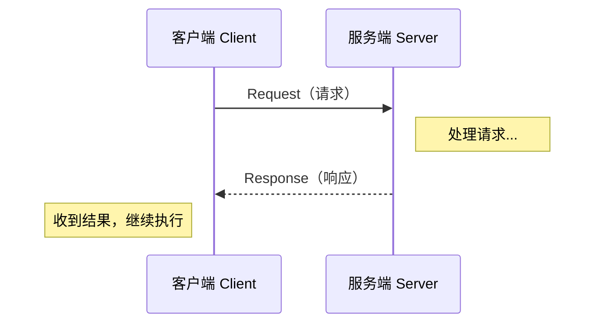

# 服务（Service）通信

## 前言

**C：** 服务通信是 ROS 2 中"用完即走"的同步调用机制——客户端发请求，服务端给响应，一次交互搞定。当你需要查询传感器状态、触发一次性动作、或者获取计算结果时，服务比话题更合适。本篇从请求/响应模型讲起，覆盖内置服务类型、C++ 与 Python 完整示例、`ros2 service` 命令行工具，以及服务与话题的选择策略。

<!-- more -->

## 服务通信模型

### 请求/响应模式

服务通信采用**请求/响应（Request/Response）**模式，属于一对一的同步通信：

- **服务端（Server）**：在某个服务名上监听请求，收到后处理并返回响应。
- **客户端（Client）**：向指定服务名发送请求，阻塞（或异步）等待响应结果。
- **服务名（Service Name）**：由字符串标识（如 `/add_two_ints`、`/get_map`）。
- **服务类型（Service Type）**：定义请求和响应的数据结构，格式为 `包名/srv/服务名`。



与话题的一对多异步广播不同，服务是**一对一**的——一次请求只会被一个服务端处理，客户端会等待响应返回后才继续执行。

### 适用场景

服务通信适合以下典型场景：

| 场景 | 示例 |
| --- | --- |
| 一次性查询 | 查询机器人当前位姿、获取地图数据 |
| 触发动作 | 请求抓取物体、触发拍照、切换导航模式 |
| 计算请求 | 两数相加、矩阵运算、路径规划 |
| 参数配置 | 读取/设置节点运行时参数 |

::: tip 关键特性
- **同步阻塞**：客户端调用后默认阻塞等待响应（也可使用异步调用）。
- **一对一**：一个请求只由一个服务端处理。
- **有返回值**：请求方一定能收到响应（成功或失败）。
- **类型安全**：请求和响应的数据结构在编译期定义。
:::

## 内置服务类型

ROS 2 提供了许多内置服务类型，最常用的是 `example_interfaces/srv/AddTwoInts`，用于演示两个整数相加。

### 查看服务类型定义

```bash
# 列出所有已安装的 srv 类型
ros2 interface list --srv

# 查看 AddTwoInts 的定义
ros2 interface show example_interfaces/srv/AddTwoInts
# 输出：
# int64 a
# int64 b
# ---
# int64 sum
```

中间的 `---` 分隔线上方是**请求字段**，下方是**响应字段**。

### 其他常用服务类型

| 服务类型 | 用途 |
| --- | --- |
| `std_srvs/srv/SetBool` | 设置布尔值，返回成功/失败 |
| `std_srvs/srv/Trigger` | 触发一次性动作，无参数 |
| `std_srvs/srv/Empty` | 空请求空响应，仅作信号 |
| `example_interfaces/srv/AddTwoInts` | 两数相加（教学示例） |
| `nav_msgs/srv/GetMap` | 获取栅格地图 |
| `sensor_msgs/srv/SetCameraInfo` | 设置相机参数 |

::: tip
可以用 `ros2 interface list --srv | grep std_srvs` 快速筛选某个包下的服务类型。
:::

## C++ 服务端示例

下面创建一个服务端节点，提供 `/add_two_ints` 服务，接收两个整数并返回它们的和。

假设功能包名为 `my_service_demo`，`CMakeLists.txt` 中已添加依赖 `rclcpp` 和 `example_interfaces`。

### 服务端代码

```cpp
// src/add_two_ints_server.cpp
#include "rclcpp/rclcpp.hpp"
#include "example_interfaces/srv/add_two_ints.hpp"

class AddTwoIntsServer : public rclcpp::Node {
public:
    AddTwoIntsServer() : Node("add_two_ints_server") {
        // 创建服务，绑定回调函数
        service_ = this->create_service<example_interfaces::srv::AddTwoInts>(
            "add_two_ints",
            std::bind(&AddTwoIntsServer::add, this,
                      std::placeholders::_1, std::placeholders::_2));
        RCLCPP_INFO(this->get_logger(), "服务端已启动，等待请求...");
    }

private:
    void add(const std::shared_ptr<example_interfaces::srv::AddTwoInts::Request> request,
             std::shared_ptr<example_interfaces::srv::AddTwoInts::Response> response) {
        response->sum = request->a + request->b;
        RCLCPP_INFO(this->get_logger(), "收到请求: %ld + %ld = %ld",
                    request->a, request->b, response->sum);
    }

    rclcpp::Service<example_interfaces::srv::AddTwoInts>::SharedPtr service_;
};

int main(int argc, char **argv) {
    rclcpp::init(argc, argv);
    rclcpp::spin(std::make_shared<AddTwoIntsServer>());
    rclcpp::shutdown();
    return 0;
}
```

### CMakeLists.txt 关键配置

```cmake
find_package(ament_cmake REQUIRED)
find_package(rclcpp REQUIRED)
find_package(example_interfaces REQUIRED)

add_executable(add_two_ints_server src/add_two_ints_server.cpp)
ament_target_dependencies(add_two_ints_server rclcpp example_interfaces)

install(TARGETS add_two_ints_server
  DESTINATION lib/${PROJECT_NAME})
```

### package.xml 关键依赖

```xml
<depend>rclcpp</depend>
<depend>example_interfaces</depend>
```

## C++ 客户端示例

客户端发送请求并等待响应：

```cpp
// src/add_two_ints_client.cpp
#include "rclcpp/rclcpp.hpp"
#include "example_interfaces/srv/add_two_ints.hpp"

int main(int argc, char **argv) {
    rclcpp::init(argc, argv);

    // 从命令行读取两个参数
    if (argc != 3) {
        RCLCPP_ERROR(rclcpp::get_logger("rclcpp"), "用法: add_two_ints_client <a> <b>");
        return 1;
    }

    auto node = rclcpp::make_shared<rclcpp::Node>("add_two_ints_client");
    auto client = node->create_client<example_interfaces::srv::AddTwoInts>("add_two_ints");

    // 构造请求
    auto request = std::make_shared<example_interfaces::srv::AddTwoInts::Request>();
    request->a = std::stoll(argv[1]);
    request->b = std::stoll(argv[2]);

    RCLCPP_INFO(node->get_logger(), "发送请求: %ld + %ld", request->a, request->b);

    // 等待服务端上线
    while (!client->wait_for_service(1s)) {
        if (!rclcpp::ok()) {
            RCLCPP_ERROR(node->get_logger(), "等待服务时节点被关闭");
            return 1;
        }
        RCLCPP_INFO(node->get_logger(), "等待服务端上线...");
    }

    // 发送请求并等待响应（同步调用）
    auto result = client->call(request);
    if (result) {
        RCLCPP_INFO(node->get_logger(), "结果: %ld + %ld = %ld",
                    request->a, request->b, result->sum);
    } else {
        RCLCPP_ERROR(node->get_logger(), "服务调用失败");
    }

    rclcpp::shutdown();
    return 0;
}
```

### 编译与运行

```bash
# 在工作空间根目录
colcon build --packages-select my_service_demo
source install/setup.bash

# 终端 1：启动服务端
ros2 run my_service_demo add_two_ints_server

# 终端 2：启动客户端
ros2 run my_service_demo add_two_ints_client 3 5
# 输出：结果: 3 + 5 = 8
```

::: warning 注意
客户端的 `call()` 是同步阻塞调用，会一直等待直到收到响应。如果服务端不存在或超时，需要先用 `wait_for_service()` 确认服务可用。ROS 2 也支持异步 `async_send_request()`，适用于不希望阻塞的场景。
:::

## Python 服务端与客户端

Python 版本更加简洁，适合快速原型开发。功能包需要依赖 `rclpy` 和 `example_interfaces`。

### Python 服务端

```python
# scripts/add_two_ints_server.py
import rclpy
from rclpy.node import Node
from example_interfaces.srv import AddTwoInts


class AddTwoIntsServer(Node):
    def __init__(self):
        super().__init__('add_two_ints_server_py')
        self.srv = self.create_service(AddTwoInts, 'add_two_ints', self.add_callback)
        self.get_logger().info('Python 服务端已启动，等待请求...')

    def add_callback(self, request, response):
        response.sum = request.a + request.b
        self.get_logger().info(f'收到请求: {request.a} + {request.b} = {response.sum}')
        return response


def main():
    rclpy.init()
    node = AddTwoIntsServer()
    rclpy.spin(node)
    rclpy.shutdown()


if __name__ == '__main__':
    main()
```

### Python 客户端

```python
# scripts/add_two_ints_client.py
import sys
import rclpy
from rclpy.node import Node
from example_interfaces.srv import AddTwoInts


class AddTwoIntsClient(Node):
    def __init__(self):
        super().__init__('add_two_ints_client_py')
        self.client = self.create_client(AddTwoInts, 'add_two_ints')

    def send_request(self, a, b):
        while not self.client.wait_for_service(timeout_sec=1.0):
            self.get_logger().info('等待服务端上线...')

        request = AddTwoInts.Request()
        request.a = a
        request.b = b
        self.get_logger().info(f'发送请求: {a} + {b}')

        future = self.client.call_async(request)
        rclpy.spin_until_future_complete(self, future)
        return future.result()


def main():
    rclpy.init()
    if len(sys.argv) != 3:
        print('用法: add_two_ints_client.py <a> <b>')
        return

    client = AddTwoIntsClient()
    a = int(sys.argv[1])
    b = int(sys.argv[2])
    result = client.send_request(a, b)

    if result is not None:
        client.get_logger().info(f'结果: {a} + {b} = {result.sum}')
    else:
        client.get_logger().error('服务调用失败')

    client.destroy_node()
    rclpy.shutdown()


if __name__ == '__main__':
    main()
```

### setup.py 关键配置

```python
# setup.py
entry_points={
    'console_scripts': [
        'add_two_ints_server_py = scripts.add_two_ints_server:main',
        'add_two_ints_client_py = scripts.add_two_ints_client:main',
    ],
},
install_requires=['setuptools'],
package_data={'my_service_demo': ['scripts/*.py']},
```

### 运行

```bash
colcon build --packages-select my_service_demo
source install/setup.bash

# 终端 1
ros2 run my_service_demo add_two_ints_server_py

# 终端 2
ros2 run my_service_demo add_two_ints_client_py 10 20
# 输出：结果: 10 + 20 = 30
```

::: tip C++ 与 Python 的互操作性
C++ 服务端和 Python 客户端完全互通，只要它们使用相同的服务类型和相同的服务名称即可。这在实际项目中非常常见——性能关键的服务用 C++ 实现，上层逻辑用 Python 快速迭代。
:::

## ros2 service 命令

ROS 2 提供了一组命令行工具用于调试和测试服务通信。

### 查看当前可用服务

```bash
# 列出系统中所有正在提供的服务
ros2 service list

# 输出示例：
# /add_two_ints
# /camera/get_parameters
# /robot_state_node/get_logger_level
```

### 查看服务类型

```bash
# 查看某个服务的类型
ros2 service type /add_two_ints
# 输出：example_interfaces/srv/AddTwoInts
```

### 从命令行调用服务

```bash
# 调用服务（按提示输入参数）
ros2 service call /add_two_ints example_interfaces/srv/AddTwoInts "{a: 7, b: 3}"
# 输出：
# sum: 10
```

这非常适合调试——无需编写客户端代码，直接从终端验证服务端逻辑是否正确。

### 查找提供指定类型的服务

```bash
# 查找系统中所有 AddTwoInts 类型的服务
ros2 service find example_interfaces/srv/AddTwoInts
# 输出：/add_two_ints
```

### 命令速查表

| 命令 | 功能 |
| --- | --- |
| `ros2 service list` | 列出所有活跃服务 |
| `ros2 service type <service>` | 查看服务类型 |
| `ros2 service call <service> <type> "<args>"` | 调用服务 |
| `ros2 service find <type>` | 查找指定类型的服务 |

## 服务 vs 话题的选择

服务与话题是 ROS 2 中最常用的两种通信方式，它们各有适用场景：

| 对比项 | 话题（Topic） | 服务（Service） |
| --- | --- | --- |
| 通信模式 | 发布/订阅，异步 | 请求/响应，同步 |
| 连接关系 | 一对多（广播） | 一对一（点对点） |
| 数据流 | 持续的数据流 | 一次性交互 |
| 是否阻塞 | 发布者不阻塞 | 客户端阻塞等待 |
| 返回值 | 无 | 有（响应） |
| 适用场景 | 传感器数据、里程计、日志 | 查询、触发、计算 |
| 典型频率 | 高频（10-1000 Hz） | 低频（按需触发） |
| 可靠性 | 可能丢失消息（取决于 QoS） | 一定收到响应或超时错误 |
| 示例 | `/scan`、`/cmd_vel`、`/image` | `/get_map`、`/spawn_entity` |

### 选择原则

1. **持续数据流用话题**——传感器数据、控制指令、状态信息。
2. **一次性操作用服务**——查询、触发、计算、配置。
3. **需要返回结果用服务**——话题没有"响应"的概念。
4. **高频低延迟用话题**——服务的同步等待不适合高频场景。
5. **多消费者同时接收用话题**——服务的请求只会被一个服务端处理。

::: warning 避免滥用服务
不要用服务传递高频数据（如相机图像或激光扫描），同步等待会导致系统严重延迟。对于既需要请求响应、又需要长时间执行的任务（如导航到目标点），应使用**动作（Action）**通信，将在下一篇介绍。
:::

## 小结

服务通信是 ROS 2 中不可或缺的一环，与话题互补。记住核心要点：

- 服务是**一对一同步**通信，适合一次性操作和需要返回值的场景。
- 使用 `create_service()` 创建服务端，`create_client()` 创建客户端。
- `ros2 service call` 命令可以在终端直接测试服务。
- C++ 和 Python 服务端/客户端完全互通。
- 根据数据流特征选择话题或服务，不要混淆使用。

下一篇我们将学习**动作（Action）通信**——它结合了话题的异步特性和服务的请求/响应机制，专为长时间运行的任务设计。
