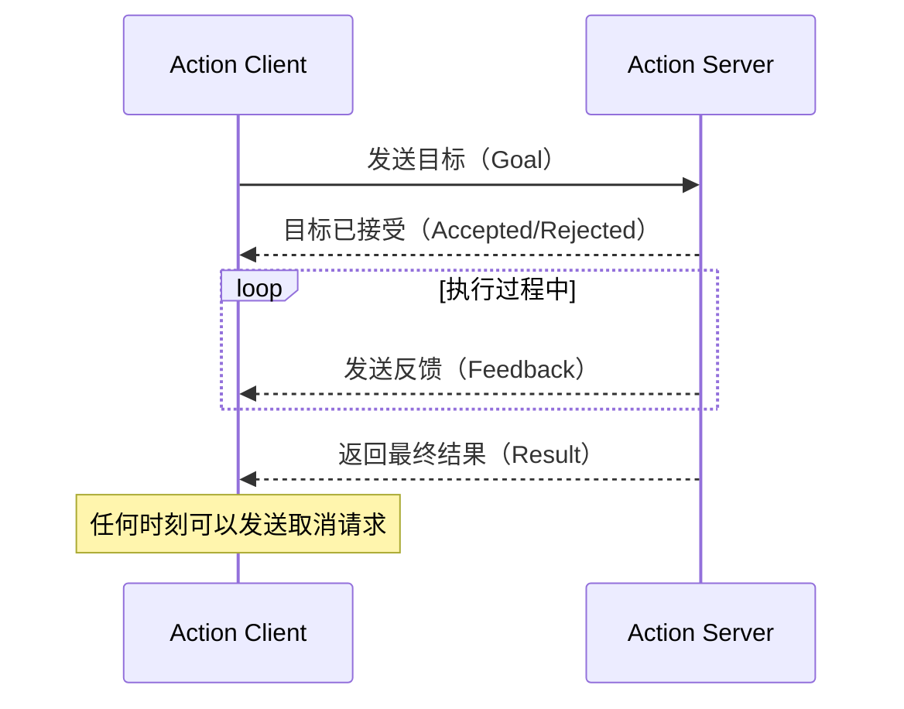

# 动作（Action）通信

## 前言

**C：** 话题是"说完了就不管了"，服务是"等你有空回我一下"。但如果你要让机器人走到某个点，过程中需要持续反馈当前位置、随时可能取消——这两种模式都不够用。Action 就是为这种"需要中间反馈、可以中途取消、有明确结果"的长时任务设计的。本篇详细讲解 Action 的通信模型、定义方式，以及在 C++ 和 Python 中的使用方法。

<!-- more -->

## 为什么需要 Action

Service 的局限在于：

| 问题 | 说明 |
| --- | --- |
| 没有中间反馈 | 客户端发出请求后只能干等，不知道任务进展 |
| 无法取消 | 一旦发送请求，只能等服务端处理完成 |
| 长任务阻塞 | 导航、抓取这类可能持续数秒甚至数分钟的任务，用 Service 不合适 |

Action 解决了这三个问题，它本质上是对 Topic + Service 的一层封装：



底层实现上，Action 使用了 5 个 Topic 来完成通信：

| Topic | 方向 | 作用 |
| --- | --- | --- |
| `_action/goal` | Client → Server | 发送目标 |
| `_action/result` | Server → Client | 返回最终结果 |
| `_action/feedback` | Server → Client | 发送中间反馈 |
| `_action/cancel` | Client → Server | 取消目标 |
| `_action/status` | Server → Client | 目标执行状态 |

## 内置动作类型

```bash
# 查看所有可用动作类型
ros2 interface list | grep action

# 查看具体定义
ros2 interface show example_interfaces/action/Fibonacci
```

输出：

```
# Goal
int32 order
---
# Result
int32[] sequence
---
# Feedback
int32[] partial_sequence
```

## 自定义 Action 定义

Action 文件使用 `.action` 扩展名，分为三段，用 `---` 分隔：

```action
# my_interfaces/action/CountDown.action

# --- 目标 ---
int32 target_count
---
# --- 结果 ---
bool success
int32 final_count
---
# --- 反馈 ---
int32 current_count
```

将此文件放入接口包的 `action/` 目录，并在 `CMakeLists.txt` 的 `rosidl_generate_interfaces` 中注册（参见上一篇"自定义消息与服务类型"），然后重新编译。

## C++ Action 服务端

```cpp
// count_down_server.cpp
#include <rclcpp/rclcpp.hpp>
#include <rclcpp_action/rclcpp_action.hpp>
#include "my_interfaces/action/count_down.hpp"

class CountDownServer : public rclcpp::Node {
public:
  using CountDown = my_interfaces::action::CountDown;
  using GoalHandle = rclcpp_action::ServerGoalHandle<CountDown>;

  CountDownServer() : Node("count_down_server") {
    action_server_ = rclcpp_action::create_server<CountDown>(
      this,
      "count_down",
      std::bind(&CountDownServer::handle_goal, this, std::placeholders::_1, std::placeholders::_2),
      std::bind(&CountDownServer::handle_cancel, this, std::placeholders::_1),
      std::bind(&CountDownServer::handle_accepted, this, std::placeholders::_1));
    RCLCPP_INFO(this->get_logger(), "倒计时 Action 服务端已启动");
  }

private:
  rclcpp_action::Server<CountDown>::SharedPtr action_server_;

  // 处理新目标：决定是否接受
  rclcpp_action::GoalResponse handle_goal(
      const rclcpp_action::GoalUUID &uuid,
      std::shared_ptr<const CountDown::Goal> goal) {
    (void)uuid;
    RCLCPP_INFO(this->get_logger(), "收到目标: 倒计时到 %d", goal->target_count);
    if (goal->target_count <= 0) {
      return rclcpp_action::GoalResponse::REJECT;
    }
    return rclcpp_action::GoalResponse::ACCEPT_AND_EXECUTE;
  }

  // 处理取消请求
  rclcpp_action::CancelResponse handle_cancel(
      const std::shared_ptr<GoalHandle> goal_handle) {
    RCLCPP_INFO(this->get_logger(), "收到取消请求");
    return rclcpp_action::CancelResponse::ACCEPT;
  }

  // 接受目标后开始执行
  void handle_accepted(const std::shared_ptr<GoalHandle> goal_handle) {
    // 在新线程中执行，避免阻塞
    std::thread{std::bind(&CountDownServer::execute, this, std::placeholders::_1), goal_handle}.detach();
  }

  // 执行倒计时逻辑
  void execute(const std::shared_ptr<GoalHandle> goal_handle) {
    auto goal = goal_handle->get_goal();
    auto feedback = std::make_shared<CountDown::Feedback>();
    auto result = std::make_shared<CountDown::Result>();

    rclcpp::Rate rate(2);  // 2Hz
    int current = goal->target_count;

    for (int i = current; i >= 0; --i) {
      // 检查是否被取消
      if (goal_handle->is_canceling()) {
        result->success = false;
        result->final_count = i;
        goal_handle->canceled(result);
        RCLCPP_INFO(this->get_logger(), "目标已取消");
        return;
      }

      // 发送反馈
      feedback->current_count = i;
      goal_handle->publish_feedback(feedback);
      RCLCPP_INFO(this->get_logger(), "当前倒计时: %d", i);
      rate.sleep();
    }

    // 成功完成
    result->success = true;
    result->final_count = 0;
    goal_handle->succeed(result);
    RCLCPP_INFO(this->get_logger(), "倒计时完成!");
  }
};

int main(int argc, char **argv) {
  rclcpp::init(argc, argv);
  rclcpp::spin(std::make_shared<CountDownServer>());
  rclcpp::shutdown();
  return 0;
}
```

`CMakeLists.txt` 中需要额外添加：

```cmake
find_package(rclcpp_action REQUIRED)
ament_target_dependencies(count_down_server rclcpp_action my_interfaces)
```

## C++ Action 客户端

```cpp
// count_down_client.cpp
#include <rclcpp/rclcpp.hpp>
#include <rclcpp_action/rclcpp_action.hpp>
#include "my_interfaces/action/count_down.hpp"

class CountDownClient : public rclcpp::Node {
public:
  using CountDown = my_interfaces::action::CountDown;

  CountDownClient() : Node("count_down_client") {
    client_ = rclcpp_action::create_client<CountDown>(this, "count_down");

    // 发送目标
    send_goal(10);
  }

private:
  rclcpp_action::Client<CountDown>::SharedPtr client_;

  void send_goal(int target) {
    if (!client_->wait_for_action_server(std::chrono::seconds(5))) {
      RCLCPP_ERROR(this->get_logger(), "等待 Action 服务端超时");
      return;
    }

    auto goal_msg = CountDown::Goal();
    goal_msg.target_count = target;

    auto send_goal_options = rclcpp_action::Client<CountDown>::SendGoalOptions();
    send_goal_options.result_callback =
      [this](const rclcpp_action::ClientGoalHandle<CountDown>::WrappedResult &result) {
        if (result.code == rclcpp_action::ResultCode::SUCCEEDED) {
          RCLCPP_INFO(this->get_logger(), "目标成功完成，最终值: %d",
                      result.result->final_count);
        } else {
          RCLCPP_WARN(this->get_logger(), "目标被取消或失败");
        }
      };
    send_goal_options.feedback_callback =
      [this](rclcpp_action::ClientGoalHandle<CountDown>::SharedPtr,
             const std::shared_ptr<const CountDown::Feedback> feedback) {
        RCLCPP_INFO(this->get_logger(), "反馈: 当前 %d", feedback->current_count);
      };

    client_->async_send_goal(goal_msg, send_goal_options);
  }
};

int main(int argc, char **argv) {
  rclcpp::init(argc, argv);
  rclcpp::spin(std::make_shared<CountDownClient>());
  rclcpp::shutdown();
  return 0;
}
```

## Python Action 示例

服务端：

```python
# count_down_server.py
import rclpy
from rclpy.node import Node
from rclpy.action import ActionServer, GoalResponse, CancelResponse
from my_interfaces.action import CountDown
import time


class CountDownServer(Node):
    def __init__(self):
        super().__init__('count_down_server')
        self._action_server = ActionServer(
            self, CountDown, 'count_down',
            execute_callback=self.execute_callback,
            goal_callback=self.goal_callback,
            cancel_callback=self.cancel_callback)
        self.get_logger().info('倒计时 Action 服务端已启动')

    def goal_callback(self, goal_request):
        if goal_request.target_count <= 0:
            return GoalResponse.REJECT
        return GoalResponse.ACCEPT_AND_EXECUTE

    def cancel_callback(self, goal_handle):
        return CancelResponse.ACCEPT

    def execute_callback(self, goal_handle):
        result = CountDown.Result()
        feedback = CountDown.Feedback()
        rate = self.create_rate(2)

        for i in range(goal_handle.target_count, -1, -1):
            if goal_handle.is_cancel_requested:
                result.success = False
                result.final_count = i
                goal_handle.canceled()
                return result

            feedback.current_count = i
            goal_handle.publish_feedback(feedback)
            self.get_logger().info(f'当前倒计时: {i}')
            rate.sleep()

        result.success = True
        result.final_count = 0
        return result


def main(args=None):
    rclpy.init(args=args)
    node = CountDownServer()
    rclpy.spin(node)
    node.destroy_node()
    rclpy.shutdown()


if __name__ == '__main__':
    main()
```

客户端：

```python
# count_down_client.py
import rclpy
from rclpy.node import Node
from rclpy.action import ActionClient
from my_interfaces.action import CountDown


class CountDownClient(Node):
    def __init__(self):
        super().__init__('count_down_client')
        self._client = ActionClient(self, CountDown, 'count_down')
        self._client.wait_for_server()
        self.send_goal(10)

    def send_goal(self, target):
        goal = CountDown.Goal()
        goal.target_count = target

        send_goal_future = self._client.send_goal_async(
            goal,
            feedback_callback=self.feedback_callback)

        send_goal_future.add_done_callback(self.goal_response_callback)

    def goal_response_callback(self, future):
        goal_handle = future.result()
        if not goal_handle.accepted:
            self.get_logger().warn('目标被拒绝')
            return
        result_future = goal_handle.get_result_async()
        result_future.add_done_callback(self.get_result_callback)

    def feedback_callback(self, feedback_msg):
        self.get_logger().info(
            f'反馈: 当前 {feedback_msg.feedback.current_count}')

    def get_result_callback(self, future):
        result = future.result().result
        self.get_logger().info(f'最终值: {result.final_count}')


def main(args=None):
    rclpy.init(args=args)
    node = CountDownClient()
    rclpy.spin(node)
    node.destroy_node()
    rclpy.shutdown()


if __name__ == '__main__':
    main()
```

## ros2 action 命令

```bash
# 查看所有运行中的 action
ros2 action list

# 查看 action 类型
ros2 action list -t

# 查看 action 详细信息
ros2 action info /count_down

# 从命令行发送目标
ros2 action send_goal /count_down my_interfaces/action/CountDown "{target_count: 5}"

# 发送目标并查看反馈
ros2 action send_goal --feedback /count_down my_interfaces/action/CountDown "{target_count: 5}"

# 取消目标
ros2 action send_goal /count_down my_interfaces/action/CountDown "{target_count: 100}" &
ros2 action cancel /count_down
```

## Topic vs Service vs Action 选择指南

| 特性 | Topic | Service | Action |
| --- | --- | --- | --- |
| 通信模式 | 发布/订阅 | 请求/响应 | 目标/反馈/结果 |
| 连接关系 | 一对多 | 一对一 | 一对一 |
| 是否阻塞 | 否 | 是（等待响应） | 否（异步） |
| 中间反馈 | 不支持 | 不支持 | 支持 |
| 取消机制 | 不适用 | 不支持 | 支持 |
| 适用场景 | 传感器数据流、状态广播 | 查询、触发一次性操作 | 导航、运动控制等长时任务 |

选择原则：

- **数据持续产生、不需要请求** → Topic
- **一次性操作、等待结果** → Service
- **长时任务、需要反馈和取消** → Action

::: tip 笔者说
在真实项目中，这三种通信方式经常组合使用。比如导航系统：用 Action 执行导航任务（带反馈），用 Service 查询当前位姿（一次性），用 Topic 发布里程计数据（持续流）。
:::

## 常见问题

### Action 执行很慢怎么办

确保服务端的 `execute` 回调不在主线程中阻塞。C++ 中应使用 `std::thread` 或 `std::async`，Python 中可以使用 `MultiThreadedExecutor`。

### 客户端怎么知道目标是否被接受

通过 `goal_response_callback`。如果服务端的 `handle_goal` 返回 `REJECT`，客户端会在回调中收到 rejected 状态。

### 可以同时有多个目标在执行吗

默认情况下，Action Server 一次只处理一个目标。如果收到新目标，默认会拒绝。你可以通过 `GoalPolicy` 配置改为排队或并行处理。

## 小结

Action 是 ROS 2 中处理长时任务的通信机制，核心特性是中间反馈和取消支持。要点：

1. Action 定义三段式：Goal（目标）、Result（结果）、Feedback（反馈）
2. 底层使用 5 个 Topic 封装，对用户透明
3. 服务端实现 `handle_goal`、`handle_cancel`、`handle_accepted`、`execute` 四个回调
4. 客户端通过回调处理目标接受、反馈和最终结果
5. 与 Topic 和 Service 配合使用，覆盖机器人的所有通信需求

至此，ROS 2 的三种核心通信机制——Topic、Service、Action——我们都讲完了。下一篇进入参数系统与 Launch 文件。
