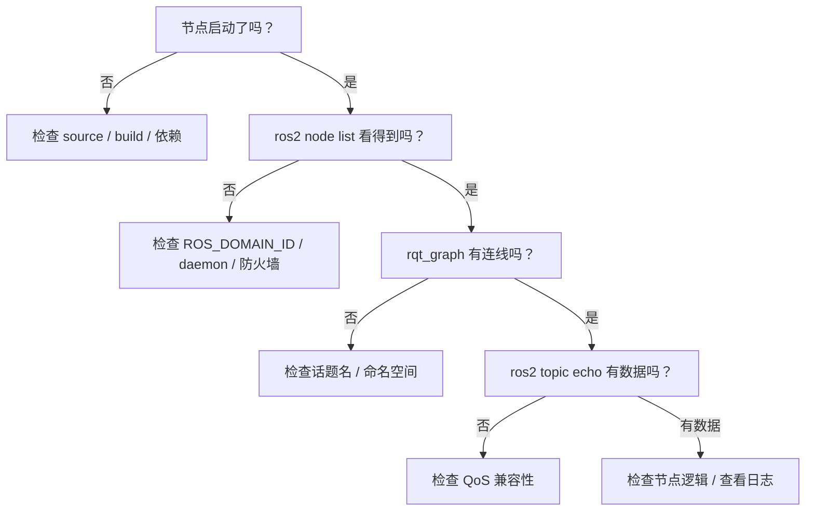

# 日志系统与问题排查

## 前言

**C：** ROS 2 程序出了问题，第一反应往往是"看日志"。但如果你对 ROS 2 的日志系统不了解，满屏的日志可能不但帮不到你，反而让你更晕。本篇从 ROS 2 的日志机制讲起，然后总结常见的 ROS 2 问题排查思路和技巧，帮你建立系统化的排障能力。

<!-- more -->

## ROS2 日志系统

### 日志级别

ROS 2 使用标准的 5 级日志：

| 级别 | 宏（C++） | 函数（Python） | 说明 |
| --- | --- | --- | --- |
| DEBUG | `RCLCPP_DEBUG` | `self.get_logger().debug()` | 调试信息，默认不显示 |
| INFO | `RCLCPP_INFO` | `self.get_logger().info()` | 一般信息 |
| WARN | `RCLCPP_WARN` | `self.get_logger().warn()` | 警告，不影响运行但值得注意 |
| ERROR | `RCLCPP_ERROR` | `self.get_logger().error()` | 错误，功能可能受影响 |
| FATAL | `RCLCPP_FATAL` | `self.get_logger().fatal()` | 致命错误，节点即将终止 |

### C++ 日志使用

```cpp
RCLCPP_INFO(this->get_logger(), "节点已启动，话题: %s", topic_name.c_str());
RCLCPP_DEBUG(this->get_logger(), "收到数据: x=%.2f, y=%.2f", x, y);
RCLCPP_WARN(this->get_logger(), "传感器数据延迟 %.3f 秒", delay);
RCLCPP_ERROR(this->get_logger(), "连接服务 %s 失败", service_name.c_str());

// 使用条件日志（避免不必要的字符串拼接）
RCLCPP_INFO_EXPRESSION(this->get_logger(), count > 100,
                       "已处理 %d 条数据", count);

// 只在第一次执行时打印
RCLCPP_INFO_ONCE(this->get_logger(), "配置已加载");

// 每隔 N 秒打印一次（throttle）
RCLCPP_INFO_THROTTLE(this->get_logger(), *clock, 5000,
                     "运行正常，已处理 %d 条", count);
```

### Python 日志使用

```python
self.get_logger().info('节点已启动')
self.get_logger().debug(f'收到数据: x={x:.2f}, y={y:.2f}')
self.get_logger().warn('传感器数据延迟 %.3f 秒', delay)
self.get_logger().error(f'连接服务 {name} 失败')

# 设置日志级别
self.get_logger().set_level(rclpy.logging.LoggingSeverity.DEBUG)
```

## 控制台日志格式

ROS 2 的默认日志格式：

```
[组件名] [时间戳] [日志级别] [文件:行号]: 消息内容
```

示例：

```
[my_node-1] [INFO] [1713920000.123456] [my_node.cpp:42]: 节点已启动
[my_node-1] [WARN] [1713920001.234567] [my_node.cpp:87]: 传感器数据延迟 0.500 秒
```

### 修改日志格式

通过环境变量控制：

```bash
# 设置日志级别（所有节点）
export RCUTILS_CONSOLE_OUTPUT_FORMAT="[{severity}] [{name}]: {message}"
export RCUTILS_LOGGING_LEVEL=DEBUG

# 使用 ANSI 颜色（默认开启）
export RCUTILS_COLORIZED_OUTPUT=1

# 只显示某个节点为 DEBUG
export RCUTILS_LOGGING_BUFFERED_STREAM=0
```

### 日志文件输出

```bash
# 日志文件默认存储在：
# ~/.ros/log/<timestamp>/目录下

# 查看最新的日志目录
ls -lt ~/.ros/log/ | head -5

# 查看某个节点的日志
cat ~/.ros/log/latest/my_node-*.log
```

在 Launch 文件中配置日志输出：

```python
Node(
    package='my_pkg',
    executable='my_node',
    output='screen',          # 输出到控制台
    # output='log',           # 输出到日志文件
    # output='both',          # 同时输出到控制台和日志文件
    arguments=['--ros-args', '--log-level', 'debug'],
)
```

## 常见问题排查

### 问题1：节点启动失败

**现象：** `ros2 run` 后节点立即退出或报错。

**排查步骤：**

```bash
# 1. 检查包是否安装
ros2 pkg list | grep my_pkg

# 2. 检查可执行文件是否存在
ros2 pkg executables my_pkg

# 3. 检查是否 source 了环境
printenv | grep ROS

# 4. 查看详细错误信息
ros2 run my_pkg my_node --ros-args --log-level debug
```

常见原因：
- 忘记 `colcon build` 或 `source install/setup.bash`
- Python 包的 entry_points 配置错误
- C++ 可执行文件的 install 规则缺失
- 依赖的共享库找不到（`ldd` 检查）

### 问题2：节点之间无法通信

**现象：** `ros2 node list` 能看到两个节点，但数据传不过去。

**排查步骤：**

```bash
# 1. 检查话题名是否匹配
ros2 topic list

# 2. 检查话题的发布者和订阅者
ros2 topic info /my_topic --verbose

# 3. 尝试从命令行 echo
ros2 topic echo /my_topic

# 4. 尝试从命令行 pub
ros2 topic pub /my_topic std_msgs/String "{data: 'test'}"

# 5. 检查 QoS 兼容性
ros2 topic info /my_topic --verbose
```

常见原因：
- **话题名不匹配**：拼写错误、命名空间差异、全限定名 vs 相对名
- **QoS 不兼容**：发布者用 BestEffort，订阅者用 Reliable（或不匹配）
- **消息类型不匹配**：发布者和订阅者使用了不同的消息类型
- **ROS_DOMAIN_ID 不同**：两个节点在不同的 DDS 域中

### 问题3：QoS 不兼容

这是 ROS 2 新手最容易踩的坑之一。DDS 要求发布者和订阅者的 QoS 策略兼容：

| 发布者 | 订阅者 | 是否兼容 |
| --- | --- | --- |
| Reliable | Reliable | 兼容 |
| Reliable | BestEffort | 兼容 |
| BestEffort | Reliable | **不兼容** |
| BestEffort | BestEffort | 兼容 |

::: warning 关键规则
**BestEffort 发布者不能与 Reliable 订阅者配对**，但反过来可以。这是因为 BestEffort 允许丢包，而 Reliable 不允许。
:::

解决方法：统一 QoS 策略，或者调整订阅者匹配发布者的 QoS。

### 问题4：性能问题——消息延迟或丢包

**排查步骤：**

```bash
# 测量话题延迟
ros2 topic delay /my_topic

# 测量发布频率
ros2 topic hz /my_topic

# 测量带宽占用
ros2 topic bw /my_topic

# 查看 DDS 层面的统计信息（某些 DDS 实现支持）
```

常见优化方向：
- 减小消息体积（不必要的字段不要放在高频话题中）
- 使用 BestEffort QoS 替代 Reliable（减少确认开销）
- 调整 History Depth（不要保留太多历史消息）
- 大数据使用共享内存传输（如 FastDDS 的 SHM）

### 问题5：内存泄漏

```bash
# 查看节点进程的内存占用
watch -n 1 'ps aux | grep my_node'

# 使用 Valgrind 检查（仅限开发环境）
valgrind --leak-check=full ros2 run my_pkg my_node
```

C++ 常见内存泄漏原因：
- 回调中分配内存但没有释放
- `shared_ptr` 循环引用
- 定时器/订阅者没有正确清理

Python 中一般不需要手动管理内存，但要注意避免回调中积累大量数据对象。

### 问题6：Launch 文件问题

```bash
# 查看 Launch 文件可用的参数
ros2 launch my_pkg robot.launch.py --show-args

# 以详细模式运行 Launch
ros2 launch my_pkg robot.launch.py -v

# 检查 Launch 文件语法
python3 -c "from launch import LaunchService; print('OK')"
```

## 排查清单

遇到问题时，按以下顺序检查：



## 日志最佳实践

1. **INFO 级别记录关键事件**：节点启动、连接建立、状态切换
2. **WARN 级别记录可恢复的异常**：重试、降级运行、非预期但可处理的情况
3. **ERROR 级别记录功能受损**：连接失败、数据校验错误
4. **DEBUG 级别记录调试信息**：详细的中间计算结果、收到的每一条数据
5. **使用有意义的日志消息**：不要只写 `error happened`，要写清楚 what、where、why
6. **高频操作使用 THROTTLE**：避免每帧都打日志刷屏
7. **生产环境设置日志级别为 INFO 或 WARN**：避免 DEBUG 日志影响性能

```cpp
// 好的日志
RCLCPP_ERROR(this->get_logger(), "连接传感器 %s 失败: %s (重试 %d/%d)",
             sensor_name.c_str(), error_msg.c_str(), retry_count, max_retries);

// 不好的日志
RCLCPP_ERROR(this->get_logger(), "error");
```

## 小结

ROS 2 的日志和调试体系要点：

1. **五级日志**：DEBUG / INFO / WARN / ERROR / FATAL，按需使用
2. **控制台 + 文件双输出**：`output` 参数控制
3. **环境变量控制格式和级别**：`RCUTILS_*` 系列变量
4. **rqt_console** 是 GUI 日志查看的首选工具
5. **QoS 不兼容**是最常见的通信问题，牢记 BestEffort 发布者不能配 Reliable 订阅者
6. **排查按顺序**：节点启动 → 节点发现 → 话题连接 → 数据传输 → 节点逻辑

至此，ROS 2 基础篇的全部内容就讲完了。从环境搭建、节点和包、三种通信机制、参数和 Launch、到调试工具和日志系统，这些知识足以支撑你开展大部分 ROS 2 开发工作。后续进阶篇会覆盖 Gazebo 仿真、TF 坐标变换、导航系统等内容。
