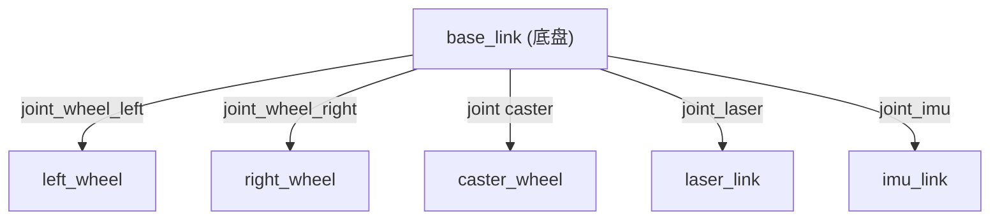

# URDF 基础与机器人描述

## 前言

**C：** 不管是移动机器人、机械臂还是四足机器人，在 ROS 2 中做任何事情之前，你都需要告诉系统"我的机器人长什么样"——有几个关节、连杆怎么连、尺寸多大、传感器装在哪里。URDF（Unified Robot Description Format）就是用来干这件事的：用 XML 描述机器人的运动学和动力学属性。本篇从 URDF 的核心概念讲起，带你写出一个完整的两轮差速小车模型，并在 RViz 中可视化验证。

<!-- more -->

## 什么是 URDF

URDF 是 ROS 中使用最广泛的机器人描述格式，本质上是一个 XML 文件，包含两大核心元素：

- **link（连杆）**：机器人的刚体部件——底盘、轮子、传感器外壳等
- **joint（关节）**：连接两个 link 的运动关系——旋转、平移、固定等

URDF 在 ROS 2 中的主要用途：

| 用途 | 说明 |
| --- | --- |
| RViz 可视化 | 显示机器人的 3D 模型 |
| 导航系统 | 提供机器人的几何和运动学信息 |
| Gazebo 仿真 | 作为物理仿真的输入（需额外添加 Gazebo 标签） |
| 运动规划 | 机械臂的正/逆运动学计算 |
| 碰撞检测 | 规划避障时的碰撞体定义 |

## 基本结构

一个最简单的 URDF 文件：

```xml
<?xml version="1.0"?>
<robot name="my_robot">
  <!-- link 和 joint 定义将在这里 -->
</robot>
```

所有的 link 和 joint 都放在 `<robot>` 根元素内。URDF 描述的是一棵 **树结构**——只有一个根 link，其他 link 通过 joint 逐级连接。



## link 元素详解

每个 link 由三部分组成：visual（外观）、collision（碰撞体）、inertial（惯性属性）。

```xml
<link name="base_link">

  <!-- 1. Visual：控制 RViz 中的外观显示 -->
  <visual>
    <origin xyz="0 0 0" rpy="0 0 0"/>
    <geometry>
      <box size="0.6 0.4 0.2"/>
    </geometry>
    <material name="blue">
      <color rgba="0.0 0.0 0.8 1.0"/>
    </material>
  </visual>

  <!-- 2. Collision：用于碰撞检测，通常比 visual 简单 -->
  <collision>
    <origin xyz="0 0 0" rpy="0 0 0"/>
    <geometry>
      <box size="0.6 0.4 0.2"/>
    </geometry>
  </collision>

  <!-- 3. Inertial：质量和惯性矩阵 -->
  <inertial>
    <origin xyz="0 0 0" rpy="0 0 0"/>
    <mass value="5.0"/>
    <inertia ixx="0.01" ixy="0" ixz="0"
             iyy="0.01" iyz="0" izz="0.01"/>
  </inertial>

</link>
```

### visual 的几何形状

URDF 支持的几何体：

| 形状 | XML 标签 | 参数 |
| --- | --- | --- |
| 长方体 | `<box>` | `size="x y z"` |
| 圆柱体 | `<cylinder>` | `radius="r" length="l"` |
| 球体 | `<sphere>` | `radius="r"` |
| 网格模型 | `<mesh>` | `filename="package://pkg/path/mesh.dae"` |

::: tip 笔者说
visual 和 collision 可以使用不同的几何体。通常 visual 用精细的 mesh，collision 用简化的基本体以加速碰撞计算。
:::

### origin 属性

`origin` 有两个属性：

- `xyz="x y z"`：平移量（单位：米）
- `rpy="roll pitch yaw"`：旋转量（单位：弧度）

```xml
<!-- 将 link 向上偏移 0.15m（放在底盘上方） -->
<origin xyz="0 0 0.15" rpy="0 0 0"/>

<!-- 绕 X 轴旋转 90 度（如将竖直安装的激光雷达旋转到水平扫描） -->
<origin xyz="0 0 0" rpy="${pi/2} 0 0"/>
```

### inertial 惯性矩阵

惯性矩阵是 3x3 对称矩阵，只需要指定 6 个独立值：

```
| ixx  ixy  ixz |
| ixy  iyy  iyz |
| ixz  iyz  izz |
```

对于简单几何体，可以用公式估算；对于复杂形状，建议使用 CAD 软件导出或使用专门的估算工具。

## joint 元素详解

joint 描述两个 link 之间的运动关系：

```xml
<joint name="joint_wheel_left" type="continuous">
  <!-- parent 和 child link -->
  <parent link="base_link"/>
  <child link="left_wheel"/>

  <!-- 关节相对于 parent link 的位置和姿态 -->
  <origin xyz="0.25 0.2 0" rpy="${-pi/2} 0 0"/>

  <!-- 旋转轴（仅对需要轴的关节有意义） -->
  <axis xyz="0 0 1"/>

  <!-- 关节限位（仅对 revolute/prismatic 有效） -->
  <limit lower="-1.0" upper="1.0" effort="10.0" velocity="5.0"/>

  <!-- 动力学参数 -->
  <dynamics damping="0.1" friction="0.0"/>
</joint>
```

### 关节类型

| 类型 | 说明 | 典型用途 |
| --- | --- | --- |
| `revolute` | 有角度限制的旋转关节 | 机械臂关节 |
| `continuous` | 无限旋转关节 | 轮子 |
| `prismatic` | 滑动关节 | 升降机构 |
| `fixed` | 固定连接 | 传感器安装 |
| `floating` | 6 自由度（平移+旋转） | 通常不用 |
| `planar` | 平面内 3 自由度 | 较少使用 |

### limit 属性说明

| 参数 | 说明 | 单位 |
| --- | --- | --- |
| `lower` | 关节最小角度/位移 | rad 或 m |
| `upper` | 关节最大角度/位移 | rad 或 m |
| `effort` | 最大力/力矩 | N 或 N·m |
| `velocity` | 最大速度 | rad/s 或 m/s |

## 完整示例：两轮差速小车

下面是一个可直接在 RViz 中查看的完整 URDF：

```xml
<?xml version="1.0"?>
<robot name="diff_bot">

  <!-- ===== 颜色定义 ===== -->
  <material name="dark_grey">
    <color rgba="0.3 0.3 0.3 1.0"/>
  </material>
  <material name="blue">
    <color rgba="0.0 0.0 0.8 1.0"/>
  </material>
  <material name="white">
    <color rgba="1.0 1.0 1.0 1.0"/>
  </material>

  <!-- ===== 底盘 ===== -->
  <link name="base_link">
    <visual>
      <origin xyz="0 0 0" rpy="0 0 0"/>
      <geometry>
        <box size="0.6 0.4 0.15"/>
      </geometry>
      <material name="blue"/>
    </visual>
    <collision>
      <origin xyz="0 0 0" rpy="0 0 0"/>
      <geometry>
        <box size="0.6 0.4 0.15"/>
      </geometry>
    </collision>
    <inertial>
      <mass value="5.0"/>
      <origin xyz="0 0 0"/>
      <inertia ixx="0.02" ixy="0" ixz="0"
               iyy="0.04" iyz="0" izz="0.05"/>
    </inertial>
  </link>

  <!-- ===== 左轮 ===== -->
  <link name="left_wheel">
    <visual>
      <origin xyz="0 0 0" rpy="${pi/2} 0 0"/>
      <geometry>
        <cylinder radius="0.1" length="0.05"/>
      </geometry>
      <material name="dark_grey"/>
    </visual>
    <collision>
      <origin xyz="0 0 0" rpy="${pi/2} 0 0"/>
      <geometry>
        <cylinder radius="0.1" length="0.05"/>
      </geometry>
    </collision>
    <inertial>
      <mass value="0.5"/>
      <origin xyz="0 0 0"/>
      <inertia ixx="0.001" ixy="0" ixz="0"
               iyy="0.002" iyz="0" izz="0.001"/>
    </inertial>
  </link>

  <joint name="left_wheel_joint" type="continuous">
    <parent link="base_link"/>
    <child link="left_wheel"/>
    <origin xyz="0.25 0.225 0" rpy="0 0 0"/>
    <axis xyz="0 1 0"/>
  </joint>

  <!-- ===== 右轮 ===== -->
  <link name="right_wheel">
    <visual>
      <origin xyz="0 0 0" rpy="${pi/2} 0 0"/>
      <geometry>
        <cylinder radius="0.1" length="0.05"/>
      </geometry>
      <material name="dark_grey"/>
    </visual>
    <collision>
      <origin xyz="0 0 0" rpy="${pi/2} 0 0"/>
      <geometry>
        <cylinder radius="0.1" length="0.05"/>
      </geometry>
    </collision>
    <inertial>
      <mass value="0.5"/>
      <origin xyz="0 0 0"/>
      <inertia ixx="0.001" ixy="0" ixz="0"
               iyy="0.002" iyz="0" izz="0.001"/>
    </inertial>
  </link>

  <joint name="right_wheel_joint" type="continuous">
    <parent link="base_link"/>
    <child link="right_wheel"/>
    <origin xyz="0.25 -0.225 0" rpy="0 0 0"/>
    <axis xyz="0 1 0"/>
  </joint>

  <!-- ===== 万向轮（前） ===== -->
  <link name="caster_wheel">
    <visual>
      <origin xyz="0 0 0" rpy="0 0 0"/>
      <geometry>
        <sphere radius="0.05"/>
      </geometry>
      <material name="white"/>
    </visual>
    <collision>
      <origin xyz="0 0 0" rpy="0 0 0"/>
      <geometry>
        <sphere radius="0.05"/>
      </geometry>
    </collision>
    <inertial>
      <mass value="0.1"/>
      <inertia ixx="0.0001" ixy="0" ixz="0"
               iyy="0.0001" iyz="0" izz="0.0001"/>
    </inertial>
  </link>

  <joint name="caster_joint" type="fixed">
    <parent link="base_link"/>
    <child link="caster_wheel"/>
    <origin xyz="-0.25 0 -0.125" rpy="0 0 0"/>
  </joint>

</robot>
```

## 验证 URDF

### 语法检查

```bash
# 安装检查工具
sudo apt install ros-humble-xacro

# 检查 URDF 语法
check_urdf diff_bot.urdf
```

正确输出：

```
robot name is: diff_bot
---------- Successfully Parsed XML ---------------
root Link: base_link has 3 child(ren)
    child(1):  left_wheel
    child(2):  right_wheel
    child(3):  caster_wheel
```

### 在 RViz 中可视化

```python
# launch/display.launch.py
from launch import LaunchDescription
from launch_ros.actions import Node
import os
from ament_index_python.packages import get_package_share_directory

def generate_launch_description():
    urdf_file = os.path.join(
        os.path.dirname(__file__),
        'diff_bot.urdf'
    )

    return LaunchDescription([
        # 发布机器人状态（joint states）
        Node(
            package='joint_state_publisher_gui',
            executable='joint_state_publisher_gui',
            name='joint_state_publisher_gui',
        ),
        # 发布 TF（从 URDF 生成）
        Node(
            package='robot_state_publisher',
            executable='robot_state_publisher',
            name='robot_state_publisher',
            output='screen',
            parameters=[{'robot_description': open(urdf_file).read()}],
        ),
        # 启动 RViz
        Node(
            package='rviz2',
            executable='rviz2',
            name='rviz2',
        ),
    ])
```

运行：

```bash
ros2 launch my_bot display.launch.py
```

在 RViz 中添加 **RobotModel** 和 **TF** 显示，拖动 joint_state_publisher_gui 的滑块可以看到轮子转动。

::: tip 笔者说
如果 RViz 中看不到模型，检查左下角的 Global Options → Fixed Frame 是否设置为 `base_link`。
:::

## URDF 的局限性

当模型逐渐变复杂，纯 URDF 会暴露以下问题：

| 问题 | 说明 |
| --- | --- | 
| 大量重复代码 | 两个轮子几乎一样，但要写两遍 |
| 参数不便于修改 | 修改轮子半径需要改多处 |
| 不支持条件编译 | 不同配置（有/无传感器）需要维护多个文件 |
| 不支持数学表达式 | 坐标偏移只能硬编码 |

这就是为什么 ROS 社区发展出了 **Xacro**——URDF 的宏预处理超集。下一篇详细讲解。

## 小结

URDF 是 ROS 2 中描述机器人的基础格式，核心要点：

1. **树结构**：一个根 link，通过 joint 逐级连接子 link
2. **link 三要素**：visual（外观）、collision（碰撞体）、inertial（惯性）
3. **joint 类型**：continuous（轮子）、revolute（有限旋转）、fixed（固定）、prismatic（滑动）
4. **origin 属性**：xyz 定义位置偏移，rpy 定义姿态旋转
5. **验证流程**：check_urdf 检查语法 → robot_state_publisher 发布 TF → RViz 可视化
6. **局限性**：不支持宏和参数化 → 引出 Xacro

下一篇使用 Xacro 重写这个模型，体验参数化建模的便利。
