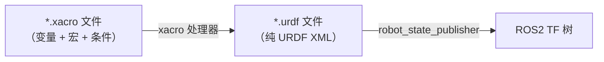

# Xacro 宏与参数化建模

## 前言

**C：** 上一篇我们用纯 URDF 手写了一个两轮差速小车，你可能已经感受到了：左右两个轮子的 XML 几乎一模一样，改个坐标和名字就要复制粘贴一大段；要是想换个轮子半径，还得逐个修改多处数字，既容易出错又难以维护。Xacro 就是来终结这种痛苦的——它让 URDF 支持变量、数学表达式、条件判断和宏，本质上是"给 URDF 加了一层预处理能力"。本篇从语法到实战，带你把上一篇的小车改写成 Xacro 格式，体会参数化建模的优雅。

<!-- more -->

## 为什么需要 Xacro

上一篇我们手写 URDF 时，遇到了几个典型痛点：

| 问题 | 示例 |
| --- | --- |
| 重复代码多 | 左右轮子、前后传感器结构完全相同，却要写两遍 |
| 不支持变量 | 修改轮子半径需要在多处手动同步 |
| 不支持数学表达式 | 无法用 `pi * r * 2` 自动计算轮子周长 |
| 不支持条件判断 | 无法根据参数决定是否包含某个传感器 |
| 不支持模块化 | 所有内容写在一个文件里，几百行难以管理 |

Xacro（XML Macros）正是为了解决这些问题而诞生的。它的核心设计理念是：

- **URDF 的超集**：任何合法的 URDF 文件都是合法的 Xacro 文件
- **预处理**：Xacro 在 URDF 之上增加了一层宏展开预处理，最终输出纯 URDF
- **参数化**：通过变量和宏实现"定义一次，多处复用"



## Xacro 基本语法

### 属性定义与使用

用 `xacro:property` 定义变量，用 `${}` 引用：

```xml
<?xml version="1.0"?>
<robot xmlns:xacro="http://www.ros.org/wiki/xacro" name="my_robot">

  <!-- 定义属性 -->
  <xacro:property name="wheel_radius" value="0.066" />
  <xacro:property name="wheel_width" value="0.026" />
  <xacro:property name="base_length" value="0.3" />
  <xacro:property name="base_width" value="0.2" />
  <xacro:property name="base_height" value="0.05" />

  <!-- 使用属性 -->
  <link name="base_link">
    <visual>
      <geometry>
        <box size="${base_length} ${base_width} ${base_height}" />
      </geometry>
    </visual>
    <collision>
      <geometry>
        <box size="${base_length} ${base_width} ${base_height}" />
      </geometry>
    </collision>
    <inertial>
      <mass value="5.0" />
      <origin xyz="0 0 0" rpy="0 0 0" />
      <inertia ixx="${1/12 * 5.0 * (base_width**2 + base_height**2)}"
               ixy="0" ixz="0"
               iyy="${1/12 * 5.0 * (base_length**2 + base_height**2)}"
               iyz="0"
               izz="${1/12 * 5.0 * (base_length**2 + base_width**2)}" />
    </inertial>
  </link>

</robot>
```

### 数学表达式

Xacro 使用 Python 的数学表达式引擎，支持 `+`、`-`、`*`、`/` 和 `**`（幂运算）：

```xml
<xacro:property name="pi" value="${3.14159265}" />
<xacro:property name="wheel_radius" value="0.066" />
<xacro:property name="wheel_circumference" value="${2 * pi * wheel_radius}" />
<xacro:property name="half_length" value="${base_length / 2}" />

<!-- 三角函数也可以使用 -->
<xacro:property name="angle" value="${0.5236}" />
<xacro:property name="sin_val" value="${sin(angle)}" />
```

::: tip 可用的数学函数
支持 Python 内置的 `sin()`、`cos()`、`tan()`、`sqrt()`、`abs()`、`round()`、`min()`、`max()`、`pi` 等函数和常量。
:::

### 条件判断

用 `xacro:if` 根据布尔条件决定是否包含某段 XML：

```xml
<xacro:property name="use_lidar" value="true" />
<xacro:property name="use_camera" value="false" />

<!-- 条件为 true 时才会展开 -->
<xacro:if value="${use_lidar}">
  <link name="lidar_link">
    <visual>
      <geometry>
        <cylinder radius="0.04" length="0.05" />
      </geometry>
    </visual>
  </link>
  <joint name="lidar_joint" type="fixed">
    <parent link="base_link" />
    <child link="lidar_link" />
    <origin xyz="0 0 0.075" rpy="0 0 0" />
  </joint>
</xacro:if>

<xacro:if value="${use_camera}">
  <!-- 这段不会被展开 -->
  <link name="camera_link">...</link>
</xacro:if>
```

::: warning 注意
`xacro:if` 的 `value` 属性必须是一个可求值为布尔值的表达式，不要写 `value="true"` 这种字符串，应该写 `value="${true}"` 或 `value="${use_lidar}"`。
:::

### 宏定义与调用

宏（macro）是 Xacro 最强大的特性，类似于函数——定义一次，通过参数复用：

```xml
<!-- 定义宏 -->
<xacro:macro name="default_inertial" params="mass">
  <inertial>
    <mass value="${mass}" />
    <origin xyz="0 0 0" rpy="0 0 0" />
    <inertia ixx="0.001" ixy="0" ixz="0"
             iyy="0.001" iyz="0"
             izz="0.001" />
  </inertial>
</xacro:macro>

<!-- 调用宏 -->
<link name="sensor_link">
  <visual>
    <geometry>
      <box size="0.03 0.03 0.02" />
    </geometry>
  </visual>
  <xacro:default_inertial mass="0.1" />
</link>
```

## include 机制

当机器人模型复杂起来，把所有内容塞在一个文件里会非常难维护。Xacro 支持 `xacro:include` 把不同模块拆分到多个文件中：

```text
my_robot_description/
├── urdf/
│   ├── robot.urdf.xacro          # 主文件，组合所有模块
│   ├── common.xacro              # 公共属性和宏
│   ├── base.urdf.xacro           # 底盘
│   ├── wheels.urdf.xacro         # 轮子系统
│   └── sensors.urdf.xacro        # 传感器
```

**robot.urdf.xacro（主文件）：**

```xml
<?xml version="1.0"?>
<robot xmlns:xacro="http://www.ros.org/wiki/xacro" name="diff_bot">

  <!-- 包含公共属性 -->
  <xacro:include filename="common.xacro" />

  <!-- 包含各模块 -->
  <xacro:include filename="base.urdf.xacro" />
  <xacro:include filename="wheels.urdf.xacro" />
  <xacro:include filename="sensors.urdf.xacro" />

</robot>
```

::: tip 路径写法
`xacro:include` 的 `filename` 支持**相对路径**（相对于当前文件）和 `$(find pkg_name)` 包路径两种写法。ROS 2 中推荐使用相对路径或通过 Launch 文件传入绝对路径。
:::

## 使用 Xacro 宏简化重复结构

以两轮差速小车的轮子为例。上一篇中左右轮子的 URDF 几乎完全一样，只有名称和坐标不同。用宏可以大幅简化：

**wheels.urdf.xacro：**

```xml
<?xml version="1.0"?>
<robot xmlns:xacro="http://www.ros.org/wiki/xacro">

  <!-- 轮子参数（可在 common.xacro 中统一定义） -->
  <xacro:property name="wheel_radius" value="0.066" />
  <xacro:property name="wheel_width" value="0.026" />
  <xacro:property name="wheel_mass" value="0.2" />
  <xacro:property name=" axle_offset" value="0.04" /> <!-- 轮子 Y 方向偏移 -->

  <!-- 轮子宏：参数化轮子的所有属性 -->
  <xacro:macro name="wheel" params="prefix parent_link *origin">
    <!-- 轮子 link -->
    <link name="${prefix}_wheel_link">
      <visual>
        <origin xyz="0 0 0" rpy="${pi/2} 0 0" />
        <geometry>
          <cylinder radius="${wheel_radius}" length="${wheel_width}" />
        </geometry>
        <material name="${prefix}_wheel_material">
          <color rgba="0.2 0.2 0.2 1" />
        </material>
      </visual>
      <collision>
        <origin xyz="0 0 0" rpy="${pi/2} 0 0" />
        <geometry>
          <cylinder radius="${wheel_radius}" length="${wheel_width}" />
        </geometry>
      </collision>
      <inertial>
        <mass value="${wheel_mass}" />
        <origin xyz="0 0 0" rpy="0 0 0" />
        <inertia ixx="${1/12 * wheel_mass * (3*wheel_radius**2 + wheel_width**2)}"
                 ixy="0" ixz="0"
                 iyy="${1/12 * wheel_mass * (3*wheel_radius**2 + wheel_width**2)}"
                 iyz="0"
                 izz="${0.5 * wheel_mass * wheel_radius**2}" />
      </inertial>
    </link>

    <!-- 轮子 joint -->
    <joint name="${prefix}_wheel_joint" type="continuous">
      <parent link="${parent_link}" />
      <child link="${prefix}_wheel_link" />
      <xacro:insert_block name="origin" />
      <axis xyz="0 1 0" />
    </joint>
  </xacro:macro>

  <!-- 调用宏：左轮 -->
  <xacro:wheel prefix="left" parent_link="base_link">
    <origin xyz="0 ${axle_offset} -0.016" rpy="0 0 0" />
  </xacro:wheel>

  <!-- 调用宏：右轮 -->
  <xacro:wheel prefix="right" parent_link="base_link">
    <origin xyz="0 ${-axle_offset} -0.016" rpy="0 0 0" />
  </xacro:wheel>

</robot>
```

::: tip 块参数 `*origin`
宏参数名前加 `*` 表示这是一个"块参数"，调用时在标签体内用 `<origin>` 传入一段 XML 块，宏体内用 `<xacro:insert_block name="origin" />` 展开。这是 Xacro 处理复杂 XML 结构的优雅方式。
:::

与纯 URDF 相比，定义一次宏后，添加新轮子只需一行调用——这就是参数化建模的核心价值。

## 完整示例：两轮差速小车 Xacro

下面把上一篇的完整小车模型用 Xacro 重写，按模块拆分：

**common.xacro：**

```xml
<?xml version="1.0"?>
<robot xmlns:xacro="http://www.ros.org/wiki/xacro">

  <!-- 底盘尺寸 -->
  <xacro:property name="base_length" value="0.3" />
  <xacro:property name="base_width" value="0.2" />
  <xacro:property name="base_height" value="0.05" />
  <xacro:property name="base_mass" value="5.0" />

  <!-- 轮子参数 -->
  <xacro:property name="wheel_radius" value="0.066" />
  <xacro:property name="wheel_width" value="0.026" />
  <xacro:property name="wheel_mass" value="0.2" />
  <xacro:property name="axle_offset" value="0.04" />

  <!-- 万向轮参数 -->
  <xacro:property name="caster_radius" value="0.02" />
  <xacro:property name="caster_mass" value="0.05" />

  <!-- 传感器开关 -->
  <xacro:property name="use_lidar" value="true" />
  <xacro:property name="use_camera" value="false" />

  <!-- 常量 -->
  <xacro:property name="pi" value="${3.14159265}" />

  <!-- 材质定义 -->
  <material name="base_material">
    <color rgba="0.3 0.3 0.7 1" />
  </material>
  <material name="dark_gray">
    <color rgba="0.2 0.2 0.2 1" />
  </material>

</robot>
```

**base.urdf.xacro：**

```xml
<?xml version="1.0"?>
<robot xmlns:xacro="http://www.ros.org/wiki/xacro">

  <link name="base_link">
    <visual>
      <geometry>
        <box size="${base_length} ${base_width} ${base_height}" />
      </geometry>
      <material name="base_material" />
    </visual>
    <collision>
      <geometry>
        <box size="${base_length} ${base_width} ${base_height}" />
      </geometry>
    </collision>
    <inertial>
      <mass value="${base_mass}" />
      <origin xyz="0 0 0" rpy="0 0 0" />
      <inertia ixx="${1/12 * base_mass * (base_width**2 + base_height**2)}"
               ixy="0" ixz="0"
               iyy="${1/12 * base_mass * (base_length**2 + base_height**2)}"
               iyz="0"
               izz="${1/12 * base_mass * (base_length**2 + base_width**2)}" />
    </inertial>
  </link>

  <!-- 底盘中心偏移到底盘上表面 -->
  <link name="base_footprint" />
  <joint name="base_footprint_joint" type="fixed">
    <parent link="base_footprint" />
    <child link="base_link" />
    <origin xyz="0 0 ${base_height / 2}" rpy="0 0 0" />
  </joint>

</robot>
```

**wheels.urdf.xacro：**

```xml
<?xml version="1.0"?>
<robot xmlns:xacro="http://www.ros.org/wiki/xacro">

  <!-- 万向轮宏 -->
  <xacro:macro name="caster_wheel" params="prefix *origin">
    <link name="${prefix}_caster_link">
      <visual>
        <geometry>
          <sphere radius="${caster_radius}" />
        </geometry>
        <material name="dark_gray" />
      </visual>
      <collision>
        <geometry>
          <sphere radius="${caster_radius}" />
        </geometry>
      </collision>
      <inertial>
        <mass value="${caster_mass}" />
        <origin xyz="0 0 0" rpy="0 0 0" />
        <inertia ixx="${2/5 * caster_mass * caster_radius**2}"
                 ixy="0" ixz="0"
                 iyy="${2/5 * caster_mass * caster_radius**2}"
                 iyz="0"
                 izz="${2/5 * caster_mass * caster_radius**2}" />
      </inertial>
    </link>
    <joint name="${prefix}_caster_joint" type="fixed">
      <parent link="base_link" />
      <child link="${prefix}_caster_link" />
      <xacro:insert_block name="origin" />
    </joint>
  </xacro:macro>

  <!-- 驱动轮 -->
  <xacro:wheel prefix="left" parent_link="base_link">
    <origin xyz="0 ${axle_offset} -0.016" rpy="0 0 0" />
  </xacro:wheel>
  <xacro:wheel prefix="right" parent_link="base_link">
    <origin xyz="0 ${-axle_offset} -0.016" rpy="0 0 0" />
  </xacro:wheel>

  <!-- 万向轮 -->
  <xacro:caster_wheel prefix="front">
    <origin xyz="${base_length/2 - 0.05} 0 ${-base_height/2 - caster_radius + 0.005}" rpy="0 0 0" />
  </xacro:caster_wheel>
  <xacro:caster_wheel prefix="rear">
    <origin xyz="${-base_length/2 + 0.05} 0 ${-base_height/2 - caster_radius + 0.005}" rpy="0 0 0" />
  </xacro:caster_wheel>

</robot>
```

**sensors.urdf.xacro：**

```xml
<?xml version="1.0"?>
<robot xmlns:xacro="http://www.ros.org/wiki/xacro">

  <xacro:if value="${use_lidar}">
    <link name="lidar_link">
      <visual>
        <geometry>
          <cylinder radius="0.04" length="0.05" />
        </geometry>
        <material name="dark_gray" />
      </visual>
      <collision>
        <geometry>
          <cylinder radius="0.04" length="0.05" />
        </geometry>
      </collision>
      <inertial>
        <mass value="0.15" />
        <origin xyz="0 0 0" rpy="0 0 0" />
        <inertia ixx="0.001" ixy="0" ixz="0"
                 iyy="0.001" iyz="0"
                 izz="0.001" />
      </inertial>
    </link>
    <joint name="lidar_joint" type="fixed">
      <parent link="base_link" />
      <child link="lidar_link" />
      <origin xyz="0 0 ${base_height / 2 + 0.025}" rpy="0 0 0" />
    </joint>
  </xacro:if>

  <xacro:if value="${use_camera}">
    <link name="camera_link">
      <visual>
        <geometry>
          <box size="0.03 0.06 0.03" />
        </geometry>
      </visual>
    </link>
    <joint name="camera_joint" type="fixed">
      <parent link="base_link" />
      <child link="camera_link" />
      <origin xyz="${base_length/2} 0 ${base_height/2 + 0.015}" rpy="0 0 0" />
    </joint>
  </xacro:if>

</robot>
```

**robot.urdf.xacro（主文件）：**

```xml
<?xml version="1.0"?>
<robot xmlns:xacro="http://www.ros.org/wiki/xacro" name="diff_bot">

  <xacro:include filename="common.xacro" />
  <xacro:include filename="base.urdf.xacro" />
  <xacro:include filename="wheels.urdf.xacro" />
  <xacro:include filename="sensors.urdf.xacro" />

</robot>
```

::: tip 参数化建模的优势
现在如果要把轮子半径从 66mm 改成 80mm，只需修改 `common.xacro` 中的一行 `wheel_radius`，左右轮子和惯量都会自动更新。想关闭激光雷达？把 `use_lidar` 改为 `false` 即可。这就是参数化建模的力量。
:::

## 编译 Xacro

### 命令行转换

在开发调试时，可以用 `xacro` 命令手动将 `.xacro` 转换为 `.urdf`：

```bash
# 基本用法
xacro robot.urdf.xacro > robot.urdf

# 带参数覆盖（改变默认值）
xacro robot.urdf.xacro use_lidar:=false > robot_no_lidar.urdf
```

### 在 Launch 文件中使用

ROS 2 推荐的方式是在 Launch 文件中直接处理 Xacro，无需预先手动转换：

```python
# launch/display.launch.py
import os
from launch import LaunchDescription
from launch.substitutions import Command, FindExecutable, PathJoinSubstitution
from launch_ros.substitutions import FindPackageShare
from launch_ros.actions import Node
from launch.actions import DeclareLaunchArgument
from launch.substitutions import LaunchConfiguration


def generate_launch_description():
    pkg_share = FindPackageShare('diff_bot_description')

    # 声明可配置参数
    use_lidar_arg = DeclareLaunchArgument(
        'use_lidar',
        default_value='true',
        description='Whether to include lidar'
    )

    # xacro 处理并输出 URDF
    robot_description_content = Command([
        PathJoinSubstitution([FindExecutable(name='xacro')]),
        ' ',
        PathJoinSubstitution([pkg_share, 'urdf', 'robot.urdf.xacro']),
        ' use_lidar:=',
        LaunchConfiguration('use_lidar'),
    ])

    # 启动 robot_state_publisher
    robot_state_publisher_node = Node(
        package='robot_state_publisher',
        executable='robot_state_publisher',
        parameters=[{
            'robot_description': robot_description_content,
        }],
        output='screen',
    )

    # 启动 RViz 可视化
    rviz_node = Node(
        package='rviz2',
        executable='rviz2',
        name='rviz2',
        output='screen',
    )

    return LaunchDescription([
        use_lidar_arg,
        robot_state_publisher_node,
        rviz_node,
    ])
```

运行时可以覆盖参数：

```bash
# 默认启动（带激光雷达）
ros2 launch diff_bot_description display.launch.py

# 关闭激光雷达
ros2 launch diff_bot_description display.launch.py use_lidar:=false
```

### 包目录结构

完整的功能包结构如下：

```text
diff_bot_description/
├── CMakeLists.txt
├── package.xml
├── launch/
│   └── display.launch.py
└── urdf/
    ├── robot.urdf.xacro
    ├── common.xacro
    ├── base.urdf.xacro
    ├── wheels.urdf.xacro
    └── sensors.urdf.xacro
```

**CMakeLists.txt 中安装文件：**

```cmake
cmake_minimum_required(VERSION 3.8)
project(diff_bot_description)

find_package(ament_cmake REQUIRED)

install(DIRECTORY urdf launch
  DESTINATION share/${PROJECT_NAME}
)

ament_package()
```

**package.xml：**

```xml
<?xml version="1.0"?>
<package format="3">
  <name>diff_bot_description</name>
  <version>0.1.0</version>
  <description>Xacro model for a differential drive robot</description>
  <maintainer email="user@example.com">user</maintainer>
  <license>Apache-2.0</license>

  <buildtool_depend>ament_cmake</buildtool_depend>

  <exec_depend>robot_state_publisher</exec_depend>
  <exec_depend>xacro</exec_depend>
  <exec_depend>joint_state_publisher_gui</exec_depend>
  <exec_depend>rviz2</exec_depend>

  <export>
    <build_type>ament_cmake</build_type>
  </export>
</package>
```

## 常用 Xacro 模式和技巧

### 1. 可复用宏库

将常用的宏（如标准惯性矩阵、标准关节）抽取到独立的宏库文件中，多个机器人项目共享：

```xml
<!-- urdf/macros/inertia_macros.xacro -->
<?xml version="1.0"?>
<robot xmlns:xacro="http://www.ros.org/wiki/xacro">

  <!-- 长方体惯性矩阵宏 -->
  <xacro:macro name="box_inertia" params="m x y z">
    <inertia ixx="${m/12 * (y*y + z*z)}" ixy="0" ixz="0"
             iyy="${m/12 * (x*x + z*z)}" iyz="0"
             izz="${m/12 * (x*x + y*y)}" />
  </xacro:macro>

  <!-- 圆柱体惯性矩阵宏 -->
  <xacro:macro name="cylinder_inertia" params="m r h">
    <inertia ixx="${m/12 * (3*r*r + h*h)}" ixy="0" ixz="0"
             iyy="${m/12 * (3*r*r + h*h)}" iyz="0"
             izz="${0.5 * m * r * r}" />
  </xacro:macro>

  <!-- 球体惯性矩阵宏 -->
  <xacro:macro name="sphere_inertia" params="m r">
    <inertia ixx="${2/5 * m * r * r}" ixy="0" ixz="0"
             iyy="${2/5 * m * r * r}" iyz="0"
             izz="${2/5 * m * r * r}" />
  </xacro:macro>

</robot>
```

使用时：

```xml
<xacro:include filename="macros/inertia_macros.xacro" />

<link name="my_link">
  <inertial>
    <mass value="2.0" />
    <xacro:box_inertia m="2.0" x="0.1" y="0.1" z="0.05" />
  </inertial>
</link>
```

### 2. 默认参数值

宏参数可以设置默认值，调用时可选传入：

```xml
<!-- 有默认值的宏参数用 "|=" 指定默认值 -->
<xacro:macro name="sensor_mount" params="prefix xyz:='0 0 0.1' rpy:='0 0 0'">
  <joint name="${prefix}_joint" type="fixed">
    <parent link="base_link" />
    <child link="${prefix}_link" />
    <origin xyz="${xyz}" rpy="${rpy}" />
  </joint>
</xacro:macro>

<!-- 使用默认位置 -->
<xacro:sensor_mount prefix="imu" />

<!-- 覆盖位置 -->
<xacro:sensor_mount prefix="gps" xyz="0.1 0 0.02" />
```

::: tip 语法说明
默认参数的语法是 `param_name:=default_value`，注意等号前面是参数名加 `:=`，默认值不需要加引号（字符串值除外）。
:::

### 3. 嵌套宏

宏可以调用其他宏，实现多层抽象：

```xml
<!-- 底层宏：单个 link + visual -->
<xacro:macro name="simple_link" params="name geometry_mesh">
  <link name="${name}">
    <visual>
      <geometry>
        <mesh filename="${geometry_mesh}" />
      </geometry>
    </visual>
  </link>
</xacro:macro>

<!-- 高层宏：带关节的传感器安装 -->
<xacro:macro name="add_sensor" params="prefix xyz:='0 0 0.1' mesh">
  <xacro:simple_link name="${prefix}_link" geometry_mesh="${mesh}" />
  <joint name="${prefix}_joint" type="fixed">
    <parent link="base_link" />
    <child link="${prefix}_link" />
    <origin xyz="${xyz}" rpy="0 0 0" />
  </joint>
</xacro:macro>

<!-- 使用 -->
<xacro:add_sensor prefix="lidar"
                   xyz="0 0 0.15"
                   mesh="package://my_pkg/meshes/lidar.dae" />
```

### 4. 输入参数通过 Launch 传入

在 Launch 文件中用 `arguments` 给 Xacro 传参，实现运行时配置：

```python
# 在 Launch 文件中传入多个参数
xacro_file = os.path.join(
    get_package_share_directory('diff_bot_description'),
    'urdf', 'robot.urdf.xacro'
)

robot_description_config = xacro.process_file(
    xacro_file,
    mappings={
        'wheel_radius': '0.08',
        'use_lidar': 'true',
        'use_camera': 'true',
    }
)

robot_description = {'robot_description': robot_description_config.toxml()}
```

这样同一套 Xacro 文件就能适配不同的硬件配置，真正实现"一套模型，多种变体"。

## 小结

Xacro 为 URDF 建模带来的改进可以归纳为以下几点：

| 能力 | URDF | Xacro |
| --- | --- | --- |
| 变量 | 不支持 | `xacro:property` + `${}` |
| 数学表达式 | 不支持 | Python 表达式引擎 |
| 条件判断 | 不支持 | `xacro:if` |
| 宏复用 | 不支持 | `xacro:macro` + `xacro:call` |
| 模块化 | 手动合并 | `xacro:include` |
| 默认参数 | 不支持 | `param:=default` |

掌握 Xacro 后，你会发现机器人建模的效率有了质的飞跃。下一篇我们将进入可视化验证环节，用 RViz2 查看模型效果，用 `check_urdf` 和 `urdf_to_graphviz` 检查模型结构。
