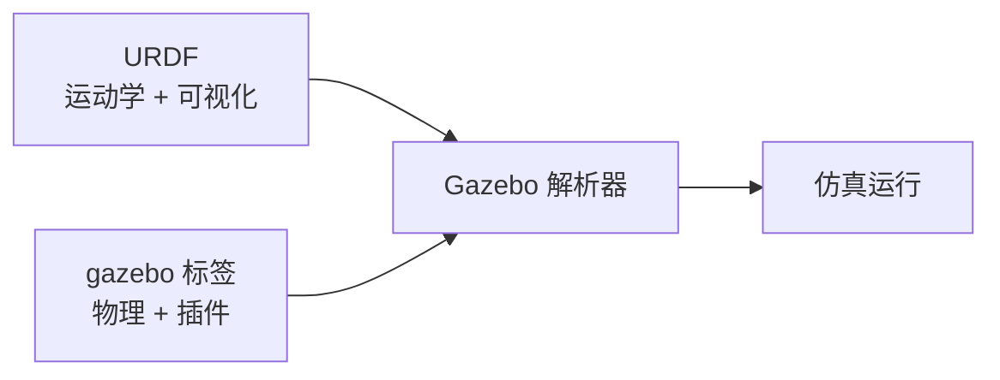

# URDF 传感器插件与 Gazebo 标签

## 前言

**C：** 上一篇把 URDF 模型加载到了 Gazebo 里，轮子也转起来了。但一个空底盘没什么用——你需要给它装上传感器（激光雷达、IMU、相机），才能做导航和避障。Gazebo 通过插件机制模拟这些传感器，你需要做的是在 URDF 中用 `<gazebo>` 标签配置插件的参数。本篇详细讲解差速驱动、激光雷达、IMU、相机四大插件的配置方法，并给出一个完整的带传感器的仿真机器人。

<!-- more -->

## URDF vs SDF

URDF 描述运动学和可视化，但不包含仿真属性。Gazebo 的原生格式是 SDF（Simulation Description Format）。

为了让 URDF 也能用于 Gazebo，ROS 社区采用了一种混合方式：**在 URDF 中嵌入 `<gazebo>` 标签**，作为"补丁"来描述仿真属性。



## gazebo 标签基础

`<gazebo>` 标签有两种用法：

```xml
<!-- 用法1：为已有 link 添加仿真属性 -->
<gazebo reference="base_link">
  <material>Gazebo/Blue</material>
  <mu1>0.1</mu1>
  <mu2>0.1</mu2>
</gazebo>

<!-- 用法2：定义全局插件（不关联特定 link） -->
<gazebo>
  <plugin name="diff_drive" filename="libgazebo_ros_diff_drive.so">
    <!-- 插件参数 -->
  </plugin>
</gazebo>
```

`<gazebo reference="link_name">` 中的属性：

| 属性 | 说明 | 示例 |
| --- | --- | --- |
| `material` | Gazebo 渲染材质 | `Gazebo/Blue`, `Gazebo/Grey` |
| `mu1`, `mu2` | 摩擦系数（两个方向） | `0.5` |
| `kp`, `kd` | 接触刚度/阻尼 | `1000000.0` |
| `minContact`, `maxContact` | 接触面限制 | `1` |
| `gravity` | 是否受重力 | `true`/`false` |

## 差速驱动插件

这是让两轮差速机器人动起来的核心插件：

```xml
<gazebo>
  <plugin name="diff_drive" filename="libgazebo_ros_diff_drive.so">

    <!-- 关节配置 -->
    <left_joint>left_wheel_joint</left_joint>
    <right_joint>right_wheel_joint</right_joint>

    <!-- 轮子参数 -->
    <wheel_separation>0.45</wheel_separation>
    <wheel_diameter>0.2</wheel_diameter>

    <!-- 性能限制 -->
    <max_wheel_torque>20</max_wheel_torque>
    <max_wheel_acceleration>1.0</max_wheel_acceleration>

    <!-- 话题映射 -->
    <ros>
      <namespace>/</namespace>
      <remapping>cmd_vel:=cmd_vel</remapping>
      <remapping>odom:=odom</remapping>
      <remapping>odom_tf:=odom_tf</remapping>
    </ros>

    <!-- 里程计配置 -->
    <odometry_source>world</odometry_source>
    <publish_odometry>true</publish_odometry>
    <publish_odometry_tf>true</publish_odometry_tf>
    <publish_wheel_tf>false</publish_wheel_tf>

    <update_rate>50</update_rate>
  </plugin>
</gazebo>
```

| 参数 | 说明 |
| --- | --- |
| `wheel_separation` | 两轮中心之间的距离（米） |
| `wheel_diameter` | 轮子直径（米） |
| `max_wheel_torque` | 单轮最大扭矩（N·m） |
| `max_wheel_acceleration` | 单轮最大角加速度（rad/s²） |
| `odometry_source` | `world`（精确）或 `encoder`（模拟编码器误差） |

::: tip 笔者说
`wheel_separation` 和 `wheel_diameter` 必须与 URDF 中 joint 和 link 的尺寸完全一致，否则里程计会出现系统性偏差。
:::

## 激光雷达插件

```xml
<!-- 1. 定义激光雷达 link（纯 URDF，不参与物理） -->
<link name="laser_link">
  <visual>
    <origin xyz="0 0 0" rpy="0 0 0"/>
    <geometry>
      <cylinder radius="0.05" length="0.04"/>
    </geometry>
    <material name="black">
      <color rgba="0.0 0.0 0.0 1.0"/>
    </material>
  </visual>
</link>

<!-- 2. fixed joint 连接到底盘 -->
<joint name="laser_joint" type="fixed">
  <parent link="base_link"/>
  <child link="laser_link"/>
  <origin xyz="0.25 0 0.15" rpy="0 0 0"/>
</joint>

<!-- 3. Gazebo 传感器 + 插件 -->
<gazebo reference="laser_link">
  <sensor name="lidar" type="ray">
    <always_on>true</always_on>
    <update_rate>10</update_rate>
    <ray>
      <scan>
        <horizontal>
          <samples>360</samples>
          <resolution>1</resolution>
          <min_angle>-3.14159</min_angle>
          <max_angle>3.14159</max_angle>
        </horizontal>
      </scan>
      <range>
        <min>0.12</min>
        <max>10.0</max>
        <resolution>0.015</resolution>
      </range>
      <noise>
        <type>gaussian</type>
        <mean>0.0</mean>
        <stddev>0.01</stddev>
      </noise>
    </ray>
    <plugin name="lidar_plugin" filename="libgazebo_ros_ray_sensor.so">
      <ros>
        <namespace>/</namespace>
        <remapping>out:=scan</remapping>
      </ros>
      <frame_name>laser_link</frame_name>
    </plugin>
  </sensor>
</gazebo>
```

关键参数说明：

| 参数 | 说明 | 推荐值 |
| --- | --- | --- |
| `samples` | 水平扫描点数 | 360 ~ 1080 |
| `min_angle` / `max_angle` | 扫描范围（弧度） | `-π` ~ `π` |
| `min` / `max` | 有效测距范围 | 0.1 ~ 10.0m |
| `resolution` | 距离分辨率 | 0.01 ~ 0.02m |
| `noise stddev` | 高斯噪声标准差 | 0.01 ~ 0.03m |
| `update_rate` | 发布频率（Hz） | 5 ~ 20 |

## IMU 插件

```xml
<!-- IMU link（纯外壳） -->
<link name="imu_link">
  <visual>
    <origin xyz="0 0 0" rpy="0 0 0"/>
    <geometry>
      <box size="0.03 0.03 0.01"/>
    </geometry>
    <material name="red">
      <color rgba="0.8 0.0 0.0 1.0"/>
    </material>
  </visual>
</link>

<joint name="imu_joint" type="fixed">
  <parent link="base_link"/>
  <child link="imu_link"/>
  <origin xyz="0 0 0.05" rpy="0 0 0"/>
</joint>

<!-- IMU 传感器插件 -->
<gazebo reference="imu_link">
  <sensor name="imu_sensor" type="imu">
    <always_on>true</always_on>
    <update_rate>100</update_rate>
    <imu>
      <angular_velocity>
        <x><noise type="gaussian"><mean>0.0</mean><stddev>0.01</stddev></noise></x>
        <y><noise type="gaussian"><mean>0.0</mean><stddev>0.01</stddev></noise></y>
        <z><noise type="gaussian"><mean>0.0</mean><stddev>0.01</stddev></noise></z>
      </angular_velocity>
      <linear_acceleration>
        <x><noise type="gaussian"><mean>0.0</mean><stddev>0.017</stddev></noise></x>
        <y><noise type="gaussian"><mean>0.0</mean><stddev>0.017</stddev></noise></y>
        <z><noise type="gaussian"><mean>0.0</mean><stddev>0.017</stddev></noise></z>
      </linear_acceleration>
    </imu>
    <plugin name="imu_plugin" filename="libgazebo_ros_imu_sensor.so">
      <ros>
        <namespace>/</namespace>
        <remapping>~/out:=imu/data</remapping>
      </ros>
      <initial_orientation_as_reference>false</initial_orientation_as_reference>
    </plugin>
  </sensor>
</gazebo>
```

## 相机插件

```xml
<link name="camera_link">
  <visual>
    <origin xyz="0 0 0" rpy="0 0 0"/>
    <geometry>
      <box size="0.03 0.06 0.03"/>
    </geometry>
    <material name="black">
      <color rgba="0.1 0.1 0.1 1.0"/>
    </material>
  </visual>
</link>

<joint name="camera_joint" type="fixed">
  <parent link="base_link"/>
  <child link="camera_link"/>
  <origin xyz="0.3 0 0.2" rpy="0 0 0"/>
</joint>

<gazebo reference="camera_link">
  <sensor name="camera" type="camera">
    <update_rate>30</update_rate>
    <camera>
      <horizontal_fov>1.39626</horizontal_fov>
      <image>
        <width>640</width>
        <height>480</height>
        <format>R8G8B8</format>
      </image>
      <clip>
        <near>0.02</near>
        <far>300</far>
      </clip>
      <noise>
        <type>gaussian</type>
        <mean>0.0</mean>
        <stddev>0.007</stddev>
      </noise>
    </camera>
    <plugin name="camera_plugin" filename="libgazebo_ros_camera.so">
      <ros>
        <namespace>/</namespace>
        <remapping>image_raw:=camera/image_raw</remapping>
        <remapping>camera_info:=camera/camera_info</remapping>
      </ros>
      <frame_name>camera_link</frame_name>
    </plugin>
  </sensor>
</gazebo>
```

## 验证传感器数据

启动仿真后，查看各传感器话题：

```bash
# 查看所有话题
ros2 topic list

# 激光雷达
ros2 topic echo /scan --once
ros2 topic hz /scan

# IMU
ros2 topic echo /imu/data --once
ros2 topic hz /imu/data

# 相机
ros2 topic echo /camera/camera_info --once
ros2 topic hz /camera/image_raw

# 里程计
ros2 topic echo /odom --once
ros2 topic hz /odom
```

在 RViz 中添加对应显示：
- **LaserScan** → Topic: `/scan`
- **Image** → Topic: `/camera/image_raw`
- **Odometry** → Topic: `/odom`
- **TF** → 自动显示

## 常见问题

### 传感器数据为空

检查：
1. `<always_on>true</always_on>` 是否设置
2. `<update_rate>` 是否大于 0
3. 插件文件名是否正确
4. 用 `ros2 topic info /scan --verbose` 检查是否有发布者

### 插件加载报错 "cannot open shared object file"

```bash
# 查找插件实际路径
find /opt/ros/humble -name "libgazebo_ros_ray_sensor.so"
find /opt/ros/humble -name "libgazebo_ros_diff_drive.so"

# 安装缺失的包
sudo apt install ros-humble-gazebo-plugins
```

### 相机画面为黑

可能是相机被其他物体遮挡，或者 `<clip><near>` 值设置太大。尝试将相机抬高或调小 near 值。

### 里程计漂移严重

`odometry_source` 设为 `world` 可以消除仿真中的里程计漂移（使用精确位置）。设为 `encoder` 会模拟真实编码器的噪声。

## 小结

Gazebo 传感器插件是在 URDF 中通过 `<gazebo>` 标签配置的，要点：

1. **混合格式**：URDF 描述运动学，`<gazebo>` 标签补充仿真属性
2. **四大插件**：差速驱动（diff_drive）、激光雷达（ray_sensor）、IMU（imu_sensor）、相机（camera）
3. **配置要点**：关节名与 URDF 一致、frame_name 正确、update_rate 合理
4. **噪声模型**：各传感器都支持高斯噪声配置，建议设置以提高仿真真实性
5. **验证方式**：`ros2 topic echo` 查看数据，RViz 可视化验证

将这些插件整合到 Xacro 模型中，你就拥有了一个功能完整的仿真机器人平台。
