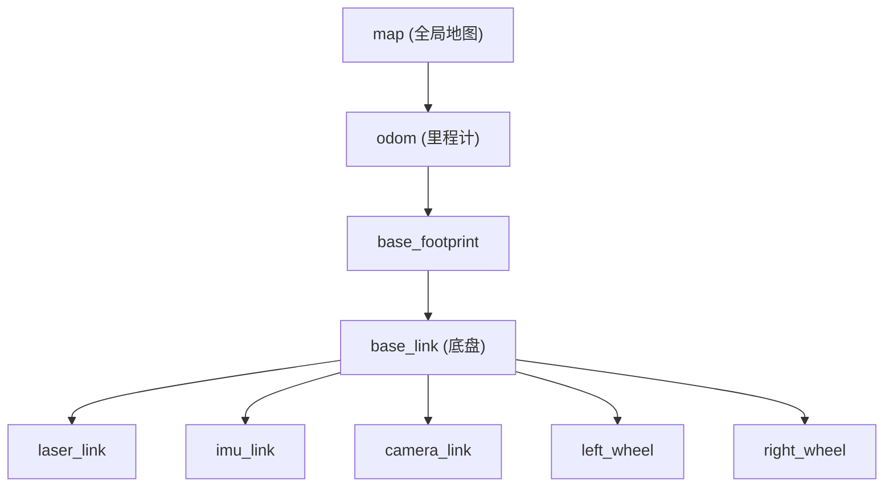
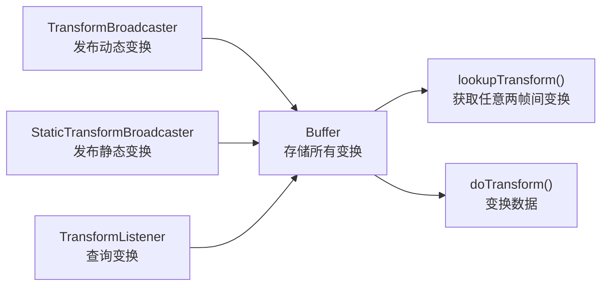

# TF 坐标系与变换基础

## 前言

**C：** 激光雷达装在机器人前方，检测到前方 2 米处有个障碍物——但这个"前方"是相对于雷达自身的坐标系的。如果你的导航算法需要知道这个障碍物相对于机器人底盘的位置，就需要做坐标变换。ROS 2 中的 TF（Transform）库就是专门处理这类问题的——它维护一棵坐标系树，自动计算任意两个坐标系之间的变换关系。本篇讲解 TF 的核心概念和基本用法。

<!-- more -->

## 为什么需要 TF

一个典型机器人系统中有多个坐标系：

| 坐标系 | 说明 |
| --- | --- |
| `base_link` | 机器人底盘中心 |
| `base_footprint` | 底盘投影到地面（无 Z 旋转） |
| `odom` | 里程计坐标系 |
| `map` | 全局地图坐标系 |
| `laser_link` | 激光雷达安装位置 |
| `imu_link` | IMU 安装位置 |
| `camera_link` | 相机安装位置 |

传感器在自己的坐标系中工作，而导航、控制算法通常在 `base_link` 或 `odom` 中工作。TF 的任务就是让你能方便地在任意两个坐标系之间转换数据。

## 坐标系树

TF 把所有坐标系组织成一棵 **树**：



关键规则：

- **每个坐标系只有一个父坐标系**（树结构，不是图结构）
- **任意两个坐标系之间有且仅有一条路径**
- 要查询 A → B 的变换，TF 自动沿着树路径计算中间变换并组合
- 树中不能有**闭环**

::: warning 注意
如果你的 TF 树中出现闭环（比如不小心给两个坐标系互相声明了父子关系），`robot_state_publisher` 会报错，整个 TF 系统将无法正常工作。
:::

## 常用坐标系命名规范

ROS 社区的 REP 105 定义了标准坐标系命名：

| 坐标系 | REP 105 含义 | 变化特性 |
| --- | --- | --- |
| `map` | 全局固定坐标系，原点在启动时定义 | 不变 |
| `odom` | 里程计坐标系，平滑连续但有漂移 | 连续变化，有长期漂移 |
| `base_footprint` | 底盘在地面的投影（Z=0，无 roll/pitch） | 随机器人移动 |
| `base_link` | 底盘中心（包含 Z 和姿态） | 随机器人移动 |
| `sensor_link` | 各传感器的安装位置 | 相对 base_link 固定 |

map 和 odom 的关系是：map → odom 的变换会随时间缓慢变化（补偿里程计漂移），而 odom → base_footprint 由里程计提供。

## tf2_ros 核心组件

ROS 2 中的 TF 实现称为 **tf2**，主要组件：



| 组件 | 作用 | 话题 |
| --- | --- | --- |
| `TransformBroadcaster` | 发布动态变换 | `/tf` |
| `StaticTransformBroadcaster` | 发布静态变换 | `/tf_static` |
| `TransformListener`（+ `Buffer`） | 监听并缓存变换，提供查询接口 | 订阅 `/tf` 和 `/tf_static` |

## C++ 发布 TF 变换

### 发布动态变换

```cpp
// tf_broadcaster_node.cpp
#include <rclcpp/rclcpp.hpp>
#include <tf2_ros/transform_broadcaster.h>
#include <geometry_msgs/msg/transform_stamped.hpp>
#include <tf2/LinearMath/Quaternion.h>

class TFBroadcasterNode : public rclcpp::Node {
public:
  TFBroadcasterNode() : Node("tf_broadcaster_demo") {
    broadcaster_ = std::make_unique<tf2_ros::TransformBroadcaster>(*this);

    // 模拟一个传感器安装在 base_link 前方 0.3m、上方 0.1m
    timer_ = this->create_wall_timer(
      std::chrono::milliseconds(50),
      std::bind(&TFBroadcasterNode::publish_transform, this));
  }

private:
  std::unique_ptr<tf2_ros::TransformBroadcaster> broadcaster_;
  rclcpp::TimerBase::SharedPtr timer_;
  double yaw_ = 0.0;

  void publish_transform() {
    geometry_msgs::msg::TransformStamped t;

    t.header.stamp = this->now();
    t.header.frame_id = "base_link";
    t.child_frame_id = "sensor_link";

    // 传感器安装位置偏移
    t.transform.translation.x = 0.3;
    t.transform.translation.y = 0.0;
    t.transform.translation.z = 0.1;

    // 如果传感器有旋转，设置四元数
    yaw_ += 0.01;  // 模拟缓慢旋转
    tf2::Quaternion q;
    q.setRPY(0.0, -0.26, yaw_);  // pitch = -15度
    t.transform.rotation.x = q.x();
    t.transform.rotation.y = q.y();
    t.transform.rotation.z = q.z();
    t.transform.rotation.w = q.w();

    broadcaster_->sendTransform(t);
  }
};

int main(int argc, char **argv) {
  rclcpp::init(argc, argv);
  rclcpp::spin(std::make_shared<TFBroadcasterNode>());
  rclcpp::shutdown();
  return 0;
}
```

### 发布静态变换

```cpp
#include <tf2_ros/static_transform_broadcaster.h>

// 静态变换只需发布一次
auto static_broadcaster = std::make_shared<tf2_ros::StaticTransformBroadcaster>(node);

geometry_msgs::msg::TransformStamped static_t;
static_t.header.stamp = node->now();
static_t.header.frame_id = "base_link";
static_t.child_frame_id = "imu_link";

static_t.transform.translation.x = 0.0;
static_t.transform.translation.y = 0.0;
static_t.transform.translation.z = 0.05;

tf2::Quaternion q;
q.setRPY(0.0, 0.0, 0.0);
static_t.transform.rotation.x = q.x();
static_t.transform.rotation.y = q.y();
static_t.transform.rotation.z = q.z();
static_t.transform.rotation.w = q.w();

static_broadcaster->sendTransform(static_t);
```

## Python 发布 TF 变换

```python
# tf_broadcaster_demo.py
import rclpy
from rclpy.node import Node
from tf2_ros import TransformBroadcaster
from geometry_msgs.msg import TransformStamped
from tf2_ros.static_transform_broadcaster import StaticTransformBroadcaster
import math


class TFBroadcasterDemo(Node):
    def __init__(self):
        super().__init__('tf_broadcaster_demo')
        self.broadcaster = TransformBroadcaster(self)

        # 发布静态变换（只需一次）
        self.static_broadcaster = StaticTransformBroadcaster(self)
        static_t = TransformStamped()
        static_t.header.stamp = self.get_clock().now().to_msg()
        static_t.header.frame_id = 'base_link'
        static_t.child_frame_id = 'imu_link'
        static_t.transform.translation.x = 0.0
        static_t.transform.translation.z = 0.05
        static_t.transform.rotation.w = 1.0
        self.static_broadcaster.sendTransform(static_t)

        # 定时发布动态变换
        self.timer = self.create_timer(0.05, self.publish_transform)
        self.yaw = 0.0

    def publish_transform(self):
        t = TransformStamped()
        t.header.stamp = self.get_clock().now().to_msg()
        t.header.frame_id = 'base_link'
        t.child_frame_id = 'sensor_link'

        t.transform.translation.x = 0.3
        t.transform.translation.z = 0.1

        self.yaw += 0.01
        t.transform.rotation.z = math.sin(self.yaw / 2)
        t.transform.rotation.w = math.cos(self.yaw / 2)

        self.broadcaster.sendTransform(t)


def main(args=None):
    rclpy.init(args=args)
    node = TFBroadcasterDemo()
    rclpy.spin(node)
    node.destroy_node()
    rclpy.shutdown()


if __name__ == '__main__':
    main()
```

## 查看 TF 树

```bash
# 安装工具
sudo apt install ros-humble-tf2-tools

# 生成 TF 树的 PDF/图片
ros2 run tf2_tools view_frames

# 查看生成的文件
ls frames_*.pdf
```

`view_frames` 会监听 5 秒钟的 TF 数据，然后生成 `frames.pdf`（图形）和 `frames.gv`（DOT 格式）。

实时查看两个坐标系之间的变换：

```bash
# 查看从 base_link 到 sensor_link 的变换
ros2 run tf2_ros tf2_echo base_link sensor_link

# 持续查看
ros2 run tf2_ros tf2_echo base_link sensor_link --continuous
```

查看某个坐标系被哪些父坐标系引用：

```bash
ros2 run tf2_ros tf2_monitor
```

## 时间戳的重要性

TF 变换必须带有时间戳。查询变换时也需要指定时间：

```cpp
// 查询"此时此刻"的变换
auto transform = buffer_->lookupTransform(
    "base_link",    // 目标坐标系
    "sensor_link",  // 源坐标系
    tf2::TimePointZero  // 获取最新可用
);

// 查询某个具体时刻的变换
auto transform = buffer_->lookupTransform(
    "base_link",
    "sensor_link",
    rclcpp::Time(1234567890, 0, RCL_ROS_TIME),  // 具体时间
    rclcpp::Duration::from_seconds(0.1)          // 等待超时
);
```

::: warning 关键概念
TF 查询有两种模式：
- **指定时间**：查找该时刻的变换。如果该时刻的数据还没到，会等待直到超时。
- **最新时间**（`tf2::TimePointZero`）：直接返回最新的变换，不等待。

推荐使用指定时间模式（通常是消息自带的时间戳），因为传感器数据的生产和消费之间有延迟，直接用最新时间可能导致变换与数据不对应。
:::

## 常见问题

### "Extrapolation Into Future" 错误

**原因**：查询的时间戳比 TF 缓存中最新的变换还新。

**解决**：
1. 确保广播器和监听者使用相同的时钟源
2. 检查 `use_sim_time` 参数（仿真时必须为 true）
3. 给查询加超时：`lookupTransform(..., rclcpp::Duration::from_seconds(1.0))`

### "Could not find transform" 错误

**原因**：两个坐标系之间没有连通路径。

**解决**：
1. `ros2 run tf2_tools view_frames` 检查 TF 树
2. 确认坐标系名称拼写正确（注意大小写和下划线）
3. 确认所有需要的变换都在发布

### 时间戳全为零

**原因**：未正确设置 `use_sim_time`。

```bash
# 仿真环境下，确保 use_sim_time=true
ros2 run my_pkg my_node --ros-args -p use_sim_time:=true
```

## 小结

TF 是 ROS 2 机器人系统的核心基础之一，要点：

1. **树结构**：所有坐标系组织成一棵树，每个坐标系有唯一父节点
2. **两大 broadcaster**：TransformBroadcaster（动态，/tf）和 StaticTransformBroadcaster（静态，/tf_static）
3. **Buffer + Listener**：缓存变换并提供查询接口
4. **时间戳**：变换和查询都需要时间戳，推荐使用消息自带的时间戳
5. **命名规范**：遵循 REP 105（map、odom、base_footprint、base_link）
6. **工具链**：view_frames（查看树）、tf2_echo（查看具体变换）、tf2_monitor（监控）

下一篇深入 TF2 编程，讲解坐标点变换、方向向量旋转等实际操作。
