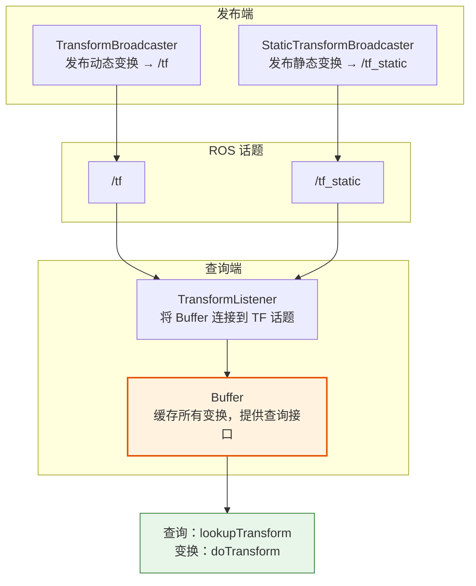
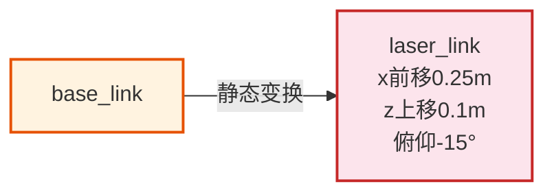
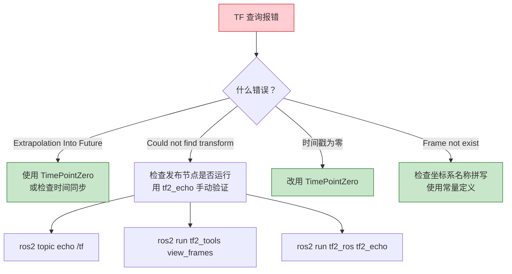

# TF2 编程实践

## 前言

**C：** 上一篇我们理解了 TF 坐标系树的核心概念和发布方式，本篇进入实战编程。重点讲解 TF2 四大核心类的使用方法、如何查询变换并解析结果、如何将坐标点从一个坐标系变换到另一个坐标系、方向向量的旋转变换，以及一个完整的 C++/Python 双版本示例——将激光雷达坐标系中的障碍物点变换到底盘坐标系。最后梳理 TF2 编程中最常见的报错及排查思路。

<!-- more -->

## TF2 核心类

在 ROS 2 中，`tf2_ros` 包提供了四个核心类，覆盖了坐标变换的发布与查询全流程：



### Buffer（变换缓冲区）

`tf2_ros::Buffer` 是整个 TF2 系统的"数据库"。它在内部维护一个按时间索引的变换树，自动订阅 `/tf` 和 `/tf_static` 话题并缓存所有收到的变换数据。所有的查询和变换操作都通过 Buffer 完成。

```cpp
#include <tf2_ros/buffer.h>
#include <tf2_ros/transform_listener.h>

// 创建 Buffer（ROS 2 Humble+ 可以直接创建，自动订阅话题）
auto buffer = std::make_shared<tf2_ros::Buffer>(node->get_clock());

// 可选：显式创建 Listener 确保 Buffer 订阅 TF 话题
auto listener = std::make_shared<tf2_ros::TransformListener>(*buffer);
```

::: tip ROS 2 版本差异
在 ROS 2 Humble 及之后版本中，`Buffer` 构造函数接受 `Clock::SharedPtr` 参数后会自动创建内部的订阅，不一定需要显式创建 `TransformListener`。但为了代码兼容性，建议显式创建。
:::

### TransformBroadcaster（动态变换发布器）

用于发布随时间变化的坐标变换（如底盘在里程计坐标系中的位置），消息发布到 `/tf` 话题：

```cpp
#include <tf2_ros/transform_broadcaster.h>

auto broadcaster = std::make_shared<tf2_ros::TransformBroadcaster>(node);
broadcaster->sendTransform(transform_msg);
```

### StaticTransformBroadcaster（静态变换发布器）

用于发布固定不变的坐标变换（如传感器相对于底盘的安装位置），消息发布到 `/tf_static` 话题，使用 latched QoS 确保新节点也能收到历史数据：

```cpp
#include <tf2_ros/static_transform_broadcaster.h>

auto static_bc = std::make_shared<tf2_ros::StaticTransformBroadcaster>(node);
static_bc->sendTransform(static_transform_msg);
```

### TransformListener（变换监听器）

作为 Buffer 和 ROS 话题之间的桥梁。在 Humble 之后的版本中，它的主要作用是保持对 TF 话题的引用不被垃圾回收。建议始终在创建 Buffer 之后立即创建 Listener。

## 查询坐标变换

`Buffer::lookupTransform()` 是 TF2 编程中使用频率最高的方法。它的函数签名：

```cpp
geometry_msgs::msg::TransformStamped lookupTransform(
    const std::string& target_frame,   // 目标坐标系
    const std::string& source_frame,   // 源坐标系
    const tf2::TimePoint& time         // 查询的时间点
);
```

返回值是一个 `TransformStamped` 消息，包含了从源坐标系到目标坐标系的完整变换——包括平移和旋转。

### 基本用法

```cpp
#include <tf2_ros/buffer.h>
#include <tf2_ros/transform_listener.h>
#include <geometry_msgs/msg/transform_stamped.hpp>

// 在节点中使用
class TransformQueryNode : public rclcpp::Node {
public:
    TransformQueryNode()
        : Node("transform_query_node") {

        buffer_ = std::make_shared<tf2_ros::Buffer>(this->get_clock());
        listener_ = std::make_shared<tf2_ros::TransformListener>(*buffer_);

        timer_ = this->create_wall_timer(
            std::chrono::seconds(1),
            std::bind(&TransformQueryNode::queryCallback, this));
    }

private:
    void queryCallback() {
        try {
            // 查询 base_link 在 odom 中的当前位姿
            auto transform = buffer_->lookupTransform(
                "odom",                          // target
                "base_link",                     // source
                tf2::TimePointZero               // tf2::TimePointZero = 最新可用
            );

            // 解析平移
            double x = transform.transform.translation.x;
            double y = transform.transform.translation.y;
            double z = transform.transform.translation.z;

            // 解析旋转（四元数）
            double qx = transform.transform.rotation.x;
            double qy = transform.transform.rotation.y;
            double qz = transform.transform.rotation.z;
            double qw = transform.transform.rotation.w;

            RCLCPP_INFO(this->get_logger(),
                "odom → base_link: T=[%.3f, %.3f, %.3f], Q=[%.3f, %.3f, %.3f, %.3f]",
                x, y, z, qx, qy, qz, qw);

        } catch (const tf2::TransformException& ex) {
            RCLCPP_WARN(this->get_logger(), "Transform failed: %s", ex.what());
        }
    }

    std::shared_ptr<tf2_ros::Buffer> buffer_;
    std::shared_ptr<tf2_ros::TransformListener> listener_;
    rclcpp::TimerBase::SharedPtr timer_;
};
```

::: tip tf2::TimePointZero 的含义
传入 `tf2::TimePointZero` 表示查询"最新可用的变换"。如果传入具体时间戳，Buffer 会在该时刻前后进行插值。对于需要时间同步的传感器数据处理，建议使用传感器数据自带的时间戳。
:::

## 坐标点变换

知道两个坐标系之间的变换关系后，最常见的需求就是**将一个点从源坐标系变换到目标坐标系**。TF2 提供了 `tf2::doTransform()` 模板函数来完成这个操作。

### tf2::doTransform

```cpp
#include <tf2_geometry_msgs/tf2_geometry_msgs.hpp>
#include <geometry_msgs/msg/point_stamped.hpp>

// 构造一个在 laser_link 坐标系中的点
geometry_msgs::msg::PointStamped laser_point;
laser_point.header.stamp = this->now();
laser_point.header.frame_id = "laser_link";
laser_point.point.x = 1.5;  // 激光前方 1.5m
laser_point.point.y = 0.3;  // 左侧 0.3m
laser_point.point.z = 0.0;

// 查询变换
auto tf = buffer_->lookupTransform(
    "base_link", "laser_link", tf2::TimePointZero);

// 变换点
geometry_msgs::msg::PointStamped base_point;
tf2::doTransform(laser_point, base_point, tf);

RCLCPP_INFO(this->get_logger(),
    "base_link: [%.3f, %.3f, %.3f]",
    base_point.point.x, base_point.point.y, base_point.point.z);
```

`doTransform` 是一个模板函数，可以处理多种 ROS 消息类型：

| 消息类型 | 说明 |
| --- | --- |
| `geometry_msgs/msg/PointStamped` | 带时间戳的三维点 |
| `geometry_msgs/msg/PoseStamped` | 带时间戳的位姿（位置 + 朝向） |
| `geometry_msgs/msg/Vector3Stamped` | 带时间戳的方向向量 |
| `sensor_msgs/msg/LaserScan` | 整个激光扫描数据 |

## 坐标轴变换（方向向量）

除了变换点位置，有时还需要变换方向向量（如机器人的前进方向、传感器扫描方向）。方向向量只受旋转影响，不受平移影响。

### tf2::Vector3 旋转操作

```cpp
#include <tf2/LinearMath/Vector3.h>
#include <tf2/LinearMath/Quaternion.h>

// 从变换中提取旋转四元数
tf2::Quaternion q(
    transform.transform.rotation.x,
    transform.transform.rotation.y,
    transform.transform.rotation.z,
    transform.transform.rotation.w);

// 定义一个方向向量（例如 laser_link 的 x 轴正方向）
tf2::Vector3 laser_forward(1.0, 0.0, 0.0);

// 旋转该向量到 base_link 坐标系
tf2::Vector3 base_forward = tf2::quatRotate(q, laser_forward);

RCLCPP_INFO(this->get_logger(),
    "laser x-axis in base_link: [%.3f, %.3f, %.3f]",
    base_forward.x(), base_forward.y(), base_forward.z());
```

### tf2::Quaternion 常用操作

```cpp
#include <tf2/LinearMath/Quaternion.h>
#include <tf2/LinearMath/Matrix3x3.h>

// 从欧拉角创建四元数（roll, pitch, yaw，单位：弧度）
tf2::Quaternion q;
q.setRPY(0.0, 0.0, 1.5708);  // 绕 z 轴旋转 90 度

// 四元数转欧拉角
tf2::Matrix3x3 m(q);
double roll, pitch, yaw;
m.getRPY(roll, pitch, yaw);

RCLCPP_INFO(this->get_logger(),
    "RPY: [%.3f, %.3f, %.3f] rad",
    roll, pitch, yaw);
```

::: warning 四元数归一化
浮点运算可能导致四元数不再满足归一化约束（|q| = 1）。在多次旋转运算后，建议调用 `q.normalize()` 保持数值稳定性。
:::

## 完整示例：将传感器数据变换到 base_link

假设激光雷达安装在机器人底盘前方 0.25m、上方 0.1m 处，且激光雷达有 15 度的俯仰角。我们需要将激光雷达坐标系中检测到的障碍物点变换到 `base_link` 坐标系。

### 场景 TF 树



### C++ 版本

#### package.xml

```xml
<?xml version="1.0"?>
<package format="3">
  <name>laser_transform_demo</name>
  <version>0.1.0</version>
  <description>Demo: transform laser points to base_link</description>
  <maintainer email="easyzoom@example.com">EASYZOOM</maintainer>
  <license>Apache-2.0</license>

  <buildtool_depend>ament_cmake</buildtool_depend>

  <depend>rclcpp</depend>
  <depend>geometry_msgs</depend>
  <depend>tf2_ros</depend>
  <depend>tf2_geometry_msgs</depend>
  <depend>std_msgs</depend>

  <test_depend>ament_lint_auto</test_depend>

  <export>
    <build_type>ament_cmake</build_type>
  </export>
</package>
```

#### CMakeLists.txt

```cmake
cmake_minimum_required(VERSION 3.8)
project(laser_transform_demo)

find_package(ament_cmake REQUIRED)
find_package(rclcpp REQUIRED)
find_package(geometry_msgs REQUIRED)
find_package(tf2_ros REQUIRED)
find_package(tf2_geometry_msgs REQUIRED)
find_package(std_msgs REQUIRED)

add_executable(laser_transform_node src/laser_transform_node.cpp)
ament_target_dependencies(laser_transform_node
  rclcpp
  geometry_msgs
  tf2_ros
  tf2_geometry_msgs
  std_msgs
)

install(TARGETS laser_transform_node
  DESTINATION lib/${PROJECT_NAME}
)

ament_package()
```

#### src/laser_transform_node.cpp

```cpp
#include <cmath>
#include <rclcpp/rclcpp.hpp>
#include <geometry_msgs/msg/transform_stamped.hpp>
#include <geometry_msgs/msg/point_stamped.hpp>
#include <tf2_ros/buffer.h>
#include <tf2_ros/transform_listener.h>
#include <tf2_ros/static_transform_broadcaster.h>
#include <tf2_geometry_msgs/tf2_geometry_msgs.hpp>
#include <tf2/LinearMath/Quaternion.h>

class LaserTransformNode : public rclcpp::Node {
public:
    LaserTransformNode()
        : Node("laser_transform_node") {

        // 1. 发布 laser_link → base_link 的静态变换
        static_bc_ = std::make_shared<tf2_ros::StaticTransformBroadcaster>(this);
        publishLaserStaticTf();

        // 2. 创建 TF Buffer 和 Listener
        buffer_ = std::make_shared<tf2_ros::Buffer>(this->get_clock());
        listener_ = std::make_shared<tf2_ros::TransformListener>(*buffer_);

        // 3. 定时器：每秒查询一次，模拟障碍物点变换
        timer_ = this->create_wall_timer(
            std::chrono::seconds(1),
            std::bind(&LaserTransformNode::timerCallback, this));

        RCLCPP_INFO(this->get_logger(),
            "Laser Transform Node started. "
            "laser_link: forward=0.25m, up=0.1m, pitch=-15deg");
    }

private:
    void publishLaserStaticTf() {
        geometry_msgs::msg::TransformStamped tf_msg;
        tf_msg.header.stamp = this->now();
        tf_msg.header.frame_id = "base_link";
        tf_msg.child_frame_id = "laser_link";

        // 平移：前方 0.25m，上方 0.1m
        tf_msg.transform.translation.x = 0.25;
        tf_msg.transform.translation.y = 0.0;
        tf_msg.transform.translation.z = 0.1;

        // 旋转：俯仰角 -15 度（绕 Y 轴旋转）
        tf2::Quaternion q;
        q.setRPY(0.0, -0.2618, 0.0);  // -15° = -0.2618 rad
        tf_msg.transform.rotation.x = q.x();
        tf_msg.transform.rotation.y = q.y();
        tf_msg.transform.rotation.z = q.z();
        tf_msg.transform.rotation.w = q.w();

        static_bc_->sendTransform(tf_msg);
    }

    void timerCallback() {
        // 等待 TF 可用
        if (!buffer_->canTransform("base_link", "laser_link", tf2::TimePointZero)) {
            RCLCPP_WARN(this->get_logger(), "Waiting for laser_link transform...");
            return;
        }

        // 模拟激光雷达检测到前方 1.5m、左侧 0.2m 处有障碍物
        geometry_msgs::msg::PointStamped laser_point;
        laser_point.header.stamp = this->now();
        laser_point.header.frame_id = "laser_link";
        laser_point.point.x = 1.5;
        laser_point.point.y = 0.2;
        laser_point.point.z = 0.0;

        // 查询 laser_link → base_link 变换
        auto tf = buffer_->lookupTransform(
            "base_link", "laser_link", tf2::TimePointZero);

        // 执行变换
        geometry_msgs::msg::PointStamped base_point;
        tf2::doTransform(laser_point, base_point, tf);

        // 计算障碍物距离（在 base_link 坐标系中）
        double dist = std::sqrt(
            base_point.point.x * base_point.point.x +
            base_point.point.y * base_point.point.y);

        RCLCPP_INFO(this->get_logger(),
            "Obstacle in laser_link: [%.3f, %.3f, %.3f]",
            laser_point.point.x, laser_point.point.y, laser_point.point.z);
        RCLCPP_INFO(this->get_logger(),
            "Obstacle in base_link: [%.3f, %.3f, %.3f], dist=%.3fm",
            base_point.point.x, base_point.point.y, base_point.point.z, dist);
    }

    std::shared_ptr<tf2_ros::StaticTransformBroadcaster> static_bc_;
    std::shared_ptr<tf2_ros::Buffer> buffer_;
    std::shared_ptr<tf2_ros::TransformListener> listener_;
    rclcpp::TimerBase::SharedPtr timer_;
};

int main(int argc, char *argv[]) {
    rclcpp::init(argc, argv);
    rclcpp::spin(std::make_shared<LaserTransformNode>());
    rclcpp::shutdown();
    return 0;
}
```

### Python 版本

#### laser_transform_node.py

```python
#!/usr/bin/env python3
"""
Laser Transform Demo - 将激光雷达坐标系中的障碍物点变换到 base_link
"""

import math
import rclpy
from rclpy.node import Node
from geometry_msgs.msg import TransformStamped, PointStamped
from tf2_ros import StaticTransformBroadcaster, TransformListener, Buffer
from tf2_geometry_msgs import do_transform_point


class LaserTransformNode(Node):
    def __init__(self):
        super().__init__('laser_transform_node')

        # 1. 发布 laser_link 的静态变换
        self.static_bc = StaticTransformBroadcaster(self)
        self.publish_laser_static_tf()

        # 2. 创建 TF Buffer 和 Listener
        self.buffer = Buffer()
        self.listener = TransformListener(self.buffer, self)

        # 3. 定时查询与变换
        self.timer = self.create_timer(1.0, self.timer_callback)
        self.get_logger().info(
            'Laser Transform Node (Python) started. '
            'laser_link: forward=0.25m, up=0.1m, pitch=-15deg')

    def publish_laser_static_tf(self):
        """发布 laser_link 相对于 base_link 的静态变换"""
        tf_msg = TransformStamped()
        tf_msg.header.stamp = self.get_clock().now().to_msg()
        tf_msg.header.frame_id = 'base_link'
        tf_msg.child_frame_id = 'laser_link'

        # 平移
        tf_msg.transform.translation.x = 0.25
        tf_msg.transform.translation.y = 0.0
        tf_msg.transform.translation.z = 0.1

        # 俯仰角 -15 度，转换为四元数
        # 绕 Y 轴旋转：q = (0, sin(-pitch/2), 0, cos(-pitch/2))
        half_pitch = -math.radians(15.0) / 2.0
        tf_msg.transform.rotation.x = 0.0
        tf_msg.transform.rotation.y = math.sin(half_pitch)
        tf_msg.transform.rotation.z = 0.0
        tf_msg.transform.rotation.w = math.cos(half_pitch)

        self.static_bc.sendTransform(tf_msg)

    def timer_callback(self):
        """定时查询并变换障碍物点"""
        # 等待 TF 可用
        if not self.buffer.can_transform(
                'base_link', 'laser_link', rclpy.time.Time()):
            self.get_logger().warn('Waiting for laser_link transform...')
            return

        # 模拟激光雷达检测到障碍物
        laser_point = PointStamped()
        laser_point.header.stamp = self.get_clock().now().to_msg()
        laser_point.header.frame_id = 'laser_link'
        laser_point.point.x = 1.5
        laser_point.point.y = 0.2
        laser_point.point.z = 0.0

        # 查询变换
        try:
            tf = self.buffer.lookup_transform(
                'base_link', 'laser_link', rclpy.time.Time())
        except Exception as e:
            self.get_logger().error(f'Lookup failed: {e}')
            return

        # 变换点
        base_point = do_transform_point(laser_point, tf)

        # 计算距离
        dist = math.sqrt(
            base_point.point.x ** 2 + base_point.point.y ** 2)

        self.get_logger().info(
            f'Obstacle in laser_link: '
            f'[{laser_point.point.x:.3f}, {laser_point.point.y:.3f}, '
            f'{laser_point.point.z:.3f}]')
        self.get_logger().info(
            f'Obstacle in base_link: '
            f'[{base_point.point.x:.3f}, {base_point.point.y:.3f}, '
            f'{base_point.point.z:.3f}], dist={dist:.3f}m')


def main():
    rclpy.init()
    node = LaserTransformNode()
    rclpy.spin(node)
    node.destroy_node()
    rclpy.shutdown()


if __name__ == '__main__':
    main()
```

#### setup.py

```python
from setuptools import find_packages, setup

package_name = 'laser_transform_demo_py'

setup(
    name=package_name,
    version='0.1.0',
    packages=find_packages(exclude=['test']),
    data_files=[
        ('share/ament_index/resource_index/packages',
            ['resource/' + package_name]),
        ('share/' + package_name, ['package.xml']),
    ],
    install_requires=['setuptools'],
    entry_points={
        'console_scripts': [
            'laser_transform_node = laser_transform_demo_py.laser_transform_node:main',
        ],
    },
)
```

### 运行与预期输出

```bash
# C++ 版本
colcon build --packages-select laser_transform_demo
source install/setup.bash
ros2 run laser_transform_demo laser_transform_node

# Python 版本
colcon build --packages-select laser_transform_demo_py
source install/setup.bash
ros2 run laser_transform_demo_py laser_transform_node
```

预期输出：

```
[INFO] Obstacle in laser_link: [1.500, 0.200, 0.000]
[INFO] Obstacle in base_link: [1.716, 0.200, -0.388], dist=1.728m
```

由于激光雷达有 -15 度俯仰角，障碍物点的 z 坐标从 0 变为负值（低于激光雷达安装高度），x 坐标增大（激光雷达朝下看，实际水平距离更远）。

## Python tf2 编程

Python 中使用 TF2 主要涉及 `tf2_ros` 和 `tf2_geometry_msgs` 两个包。除了上面示例中的 `do_transform_point`，还有其他常用的工具函数：

### Buffer 与 Listener 创建

```python
from tf2_ros import Buffer, TransformListener

# 创建 Buffer 和 Listener
buffer = Buffer()
listener = TransformListener(buffer, node)
```

::: warning Python 中 Listener 的创建顺序
在 Python 中，`TransformListener` 必须接受 `buffer` 和 `node` 作为参数，且 `buffer` 必须在 `listener` 之前创建。如果顺序反了或参数缺失，TF 数据将无法被接收。
:::

### 常用变换函数

```python
from tf2_geometry_msgs import do_transform_point
from tf2_geometry_msgs import do_transform_pose_stamped
from tf2_geometry_msgs import do_transform_vector3

# 变换点
new_point = do_transform_point(point_stamped, transform)

# 变换位姿（位置 + 朝向）
new_pose = do_transform_pose_stamped(pose_stamped, transform)

# 变换方向向量（只旋转不平移）
from geometry_msgs.msg import Vector3Stamped
vec = Vector3Stamped()
vec.header.frame_id = 'laser_link'
vec.vector.x = 1.0
new_vec = do_transform_vector3(vec, transform)
```

### 查询变换（带超时）

```python
from rclpy.duration import Duration

try:
    # 带超时的查询，最多等待 1 秒
    tf = buffer.lookup_transform(
        'base_link', 'laser_link',
        rclpy.time.Time(),
        timeout=Duration(seconds=1.0))
except Exception as e:
    node.get_logger().error(f'Transform failed: {e}')
```

## 常见问题

TF2 编程中遇到的报错大多可以归为以下几类：

### 1. Extrapolation Into Future

```
Lookup would require extrapolation into the future.
```

**原因**：查询的时间戳晚于 Buffer 中已有的最新变换时间。通常是因为使用了 `this->now()` 作为查询时间，但 TF 发布端的时间比本节点快（不同机器的时间不完全同步）。

**解决方案**：

```cpp
// 方案一：查询最新可用变换
auto tf = buffer_->lookupTransform("target", "source", tf2::TimePointZero);

// 方案二：使用 rclcpp::Time(0) 等价于最新
auto tf = buffer_->lookupTransform("target", "source", rclcpp::Time(0));

// 方案三：从传感器消息中获取时间戳
auto tf = buffer_->lookupTransform(
    "target", "source",
    tf2_ros::fromMsg(sensor_msg->header.stamp));
```

### 2. Could not find transform / No transform available

```
Could not find transform from 'laser_link' to 'base_link'
```

**原因**：
- 发布该变换的节点没有运行
- TF 树断裂（两个坐标系之间没有连通路径）
- 刚启动，Buffer 还没来得及收集变换数据

**排查步骤**：

```bash
# 1. 确认 TF 话题有数据
ros2 topic echo /tf --once
ros2 topic echo /tf_static --once

# 2. 查看 TF 树是否连通
ros2 run tf2_tools view_frames
# 然后打开 frames.pdf 查看

# 3. 手动查询变换
ros2 run tf2_ros tf2_echo base_link laser_link
```

### 3. 时间戳为零的问题

```
Transform for target_frame and source_frame not available at time 0.000
```

**原因**：查询时传入了 `rclcpp::Time(0)` 但 Buffer 被以某种方式配置为不允许查询时间为零的变换。在某些配置下，`Time(0)` 会被解释为"时间零点"而不是"最新时间"。

**解决方案**：统一使用 `tf2::TimePointZero` 或显式使用 `this->now()`：

```cpp
// 推荐
auto tf = buffer_->lookupTransform("target", "source", tf2::TimePointZero);
```

### 4. 坐标系名拼写错误

```
Frame id [laser_link] does not exist
```

**原因**：frame_id 大小写敏感，`laser_link` 和 `Laser_Link` 是两个不同的坐标系。ROS 命名惯例是全小写加下划线。

::: warning 拼写错误是最隐蔽的 bug
建议在项目中定义坐标系名称常量，避免硬编码字符串：

```cpp
namespace Frames {
    constexpr const char* BASE_LINK = "base_link";
    constexpr const char* LASER_LINK = "laser_link";
    constexpr const char* ODOM = "odom";
    constexpr const char* MAP = "map";
}
```

Python 中类似：

```python
class Frames:
    BASE_LINK = 'base_link'
    LASER_LINK = 'laser_link'
    ODOM = 'odom'
    MAP = 'map'
```

这样既避免拼写错误，又方便全局修改。
:::

### 问题排查流程总结



本篇通过核心类讲解、API 用法、方向向量操作和完整示例，覆盖了 TF2 编程的日常场景。下一篇我们将学习如何使用 RViz2 可视化 TF 树和传感器数据，进一步提升调试效率。
