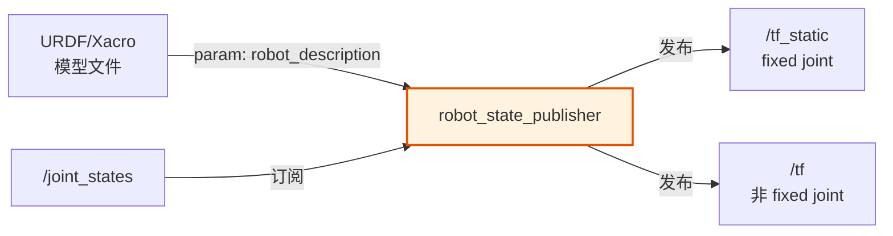
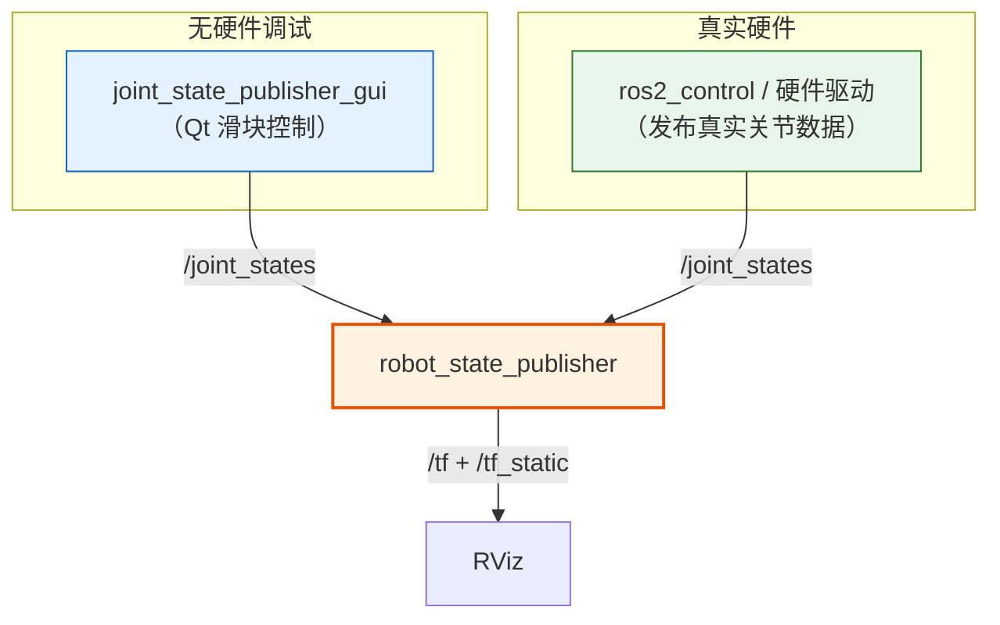
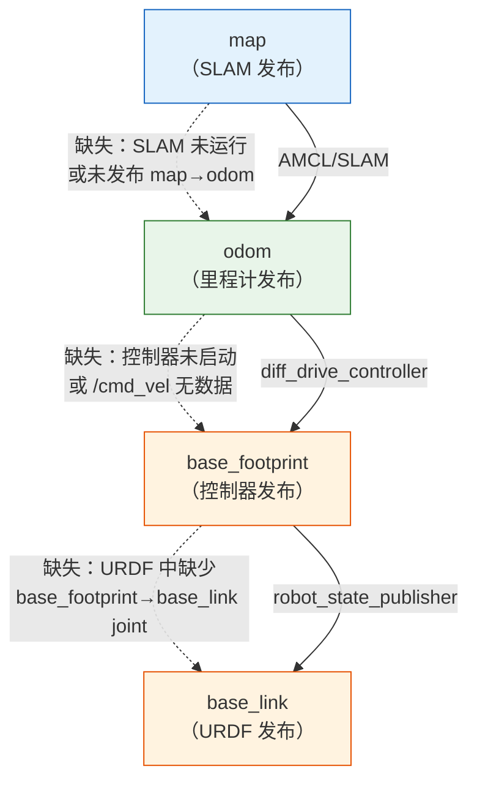
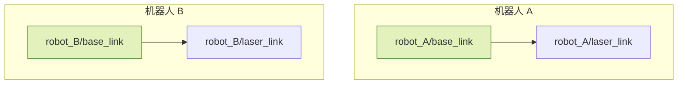

# 静态变换与 robot_state_publisher

## 前言

**C：** 前两篇我们从零手写了 TF 发布代码，逐条指定 frame_id、translation、rotation。但在真实项目中，一个机器人动辄十几个坐标系，全靠手写 TransformStamped 既容易出错又不便于维护。ROS 2 提供了 `robot_state_publisher` 节点，能直接从 URDF/Xacro 模型中自动提取所有 fixed joint 对应的静态变换并发布。本篇从静态变换与动态变换的区别讲起，详细讲解 `static_transform_publisher` 的用法、`robot_state_publisher` 的工作原理、`joint_state_publisher` 与真实硬件的衔接方式，最终给出一个 URDF + RViz 的完整 Launch 示例。此外还包括 TF 树完整性检查方法和多机器人系统的 TF 命名空间隔离技巧。

<!-- more -->

## 静态变换 vs 动态变换

TF 系统将坐标变换分为两类，发布到不同的话题上：

```mermaid
graph LR
    subgraph 静态变换 "/tf_static"
        ST1["传感器→底盘<br/>（安装位置，永不变化）"]
        ST2["底盘中心→轮子<br/>（URDF fixed joint）"]
    end
    subgraph 动态变换 "/tf"
        DT1["odom→base_link<br/>（里程计，持续更新）"]
        DT2["map→odom<br/>（SLAM 纠偏）"]
    end

    style ST1 fill:#e3f2fd,stroke:#1565c0
    style ST2 fill:#e3f2fd,stroke:#1565c0
    style DT1 fill:#fff3e0,stroke:#e65100
    style DT2 fill:#fff3e0,stroke:#e65100
```

| 类型 | 话题 | 发布器 | 典型场景 |
| --- | --- | --- | --- |
| 静态变换 | `/tf_static` | `static_transform_publisher` / `robot_state_publisher` | 传感器安装位置、URDF fixed joint |
| 动态变换 | `/tf` | 自定义节点（里程计、SLAM 等） | 底盘位姿、map→odom 纠偏 |

::: tip 为什么区分静态和动态？
静态变换发布到 `/tf_static` 使用 latched QoS，只发送一次但新订阅者会立即收到历史消息。动态变换发布到 `/tf`，以高频率持续更新。分开管理可以减少网络带宽消耗，也方便调试——静态变换出问题通常是 URDF 配错，动态变换出问题通常是驱动或算法异常。
:::

## static_transform_publisher 使用

`tf2_ros` 包提供了 `static_transform_publisher` 这个现成节点，无需写任何代码就能发布固定变换。它有两种使用方式：命令行和 Launch 文件。

### 命令行方式

适用于快速测试和临时调试：

```bash
# 语法：--x --y --z --qx --qy --qz --qw parent_frame child_frame
ros2 run tf2_ros static_transform_publisher \
    0.2 0.0 0.1 0 0 0 1 base_link laser_link
```

也可以用欧拉角代替四元数：

```bash
# 语法：--x --y --z --yaw --pitch --roll parent_frame child_frame
ros2 run tf2_ros static_transform_publisher \
    0.2 0.0 0.1 0 0 0 base_link laser_link
```

::: warning 欧拉角顺序
命令行中的欧拉角顺序是 **yaw-pitch-roll**（Z-Y-X 内旋），注意不要和常见的 roll-pitch-yaw 搞混。
:::

### Launch 文件方式

在正式项目中，推荐使用 Launch 文件统一管理：

```python
# launch/static_tf.launch.py
from launch import LaunchDescription
from launch_ros.actions import Node

def generate_launch_description():
    return LaunchDescription([
        Node(
            package='tf2_ros',
            executable='static_transform_publisher',
            name='laser_static_tf',
            arguments=[
                '--x', '0.2', '--y', '0.0', '--z', '0.1',
                '--qx', '0', '--qy', '0', '--qz', '0', '--qw', '1',
                'base_link', 'laser_link'
            ],
        ),
        Node(
            package='tf2_ros',
            executable='static_transform_publisher',
            name='imu_static_tf',
            arguments=[
                '--x', '0', '--y', '0', '--z', '0.05',
                '--yaw', '0', '--pitch', '0', '--roll', '0',
                'base_link', 'imu_link'
            ],
        ),
    ])
```

::: tip static_transform_publisher 的局限性
当传感器数量较多（超过 5 个）时，手动维护每个 `static_transform_publisher` 节点会变得繁琐且容易出错。更好的做法是使用 `robot_state_publisher` 从 URDF 自动发布，下一节详细介绍。
:::

## robot_state_publisher

`robot_state_publisher`（简称 RSP）是 ROS 2 机器人系统中最重要的节点之一。它的核心功能是：



**工作流程：**

1. 启动时从 ROS 参数 `robot_description` 读取 URDF 模型
2. 解析 URDF 中的所有 joint，提取父子关系和运动学参数
3. 对于 `type="fixed"` 的关节，自动发布到 `/tf_static`（无需任何外部输入）
4. 对于 `type="continuous"`、`type="revolute"`、`type="prismatic"` 的关节，需要订阅 `/joint_states` 话题获取当前关节角度，然后计算并发布到 `/tf`

### 基本 Launch 用法

```python
from launch import LaunchDescription
from launch_ros.actions import Node
from launch.actions import DeclareLaunchArgument
from launch.substitutions import LaunchConfiguration, Command
import os
from ament_index_python.packages import get_package_share_directory

def generate_launch_description():
    pkg_share = get_package_share_directory('my_robot_description')

    return LaunchDescription([
        # 将 URDF 内容写入 robot_description 参数
        DeclareLaunchArgument(
            name='model',
            default_value=os.path.join(pkg_share, 'urdf', 'my_robot.urdf'),
            description='Path to robot URDF file'
        ),

        Node(
            package='robot_state_publisher',
            executable='robot_state_publisher',
            name='robot_state_publisher',
            output='screen',
            parameters=[{
                'robot_description': Command([
                    'xacro ', LaunchConfiguration('model')
                ])
            }],
        ),
    ])
```

### URDF 中各类 joint 的处理方式

| joint type | RSP 行为 | 是否需要 /joint_states |
| --- | --- | --- |
| `fixed` | 自动发布到 `/tf_static` | 否 |
| `continuous` | 需要关节角度才能发布 | 是 |
| `revolute` | 需要关节角度才能发布 | 是 |
| `prismatic` | 需要关节位置才能发布 | 是 |
| `mimic` | 跟随被模仿关节的值 | 否（由 RSP 内部处理） |

::: warning 常见问题：No transform from base_link to laser_link
如果你确认 URDF 中有 `base_link → laser_link` 的 fixed joint，但 `tf2_echo` 仍然报错，检查以下几点：
1. `robot_state_publisher` 是否正常运行（`ros2 node list`）
2. `robot_description` 参数是否正确加载（`ros2 param get /robot_state_publisher robot_description`）
3. URDF 中 joint 的 `parent` 和 `child` 属性是否拼写正确
:::

## joint_state_publisher 与 joint_state_publisher_gui

`robot_state_publisher` 本身只负责"根据关节角度计算并发布 TF"，它需要外部节点提供关节状态数据。这就是 `joint_state_publisher` 的作用。

### joint_state_publisher（无 GUI）

在**没有真实硬件**时，`joint_state_publisher` 会为 URDF 中所有非固定关节发布默认值（通常是 0），让 RSP 能正常工作：

```python
Node(
    package='joint_state_publisher',
    executable='joint_state_publisher',
    name='joint_state_publisher',
    output='screen',
),
```

### joint_state_publisher_gui（带 GUI 滑块）

`joint_state_publisher_gui` 在提供关节状态的同时还启动一个 Qt 窗口，包含每个可动关节的滑块，适合在 RViz 中手动调整机器人姿态进行调试：

```python
Node(
    package='joint_state_publisher_gui',
    executable='joint_state_publisher_gui',
    name='joint_state_publisher_gui',
    output='screen',
),
```

::: warning 依赖注意事项
`joint_state_publisher_gui` 依赖 Python 的 `tkinter` 库。在 Ubuntu 上安装：
```bash
sudo apt install ros-humble-joint-state-publisher-gui
```
如果 `tkinter` 缺失，会报 `_tkinter.TclError` 错误。
:::

### 与真实硬件的衔接

在真实机器人上，**不要使用** `joint_state_publisher`。取而代之，你的硬件驱动节点（如 `ros2_control` 控制器）会直接发布 `/joint_states` 话题。消息类型为 `sensor_msgs/msg/JointState`：

```bash
# 查看关节状态
ros2 topic echo /joint_states

# 输出示例：
# header:
#   stamp: {sec: 1713945600, nanosec: 300000000}
#   frame_id: ''
# name: ['left_wheel_joint', 'right_wheel_joint']
# position: [0.0, 0.0]
# velocity: [0.5, 0.5]
# effort: [0.0, 0.0]
```

数据流关系：



## URDF + RViz 完整示例

下面给出一个将 URDF 模型、`robot_state_publisher`、`joint_state_publisher` 和 RViz 串联起来的完整 Launch 文件。假设你有一个 `my_robot_description` 包，结构如下：

```
my_robot_description/
├── launch/
│   └── display.launch.py
├── urdf/
│   └── my_robot.urdf.xacro
├── config/
│   └── rviz/
│       └── display.rviz
├── package.xml
└── setup.py
```

### URDF 模型文件

`urdf/my_robot.urdf.xacro`——一个简单的两轮差速小车：

```xml
<?xml version="1.0"?>
<robot xmlns:xacro="http://www.ros.org/wiki/xacro" name="my_robot">

  <!-- ========== 定义常量 ========== -->
  <xacro:property name="base_radius"   value="0.2"/>
  <xacro:property name="base_height"   value="0.05"/>
  <xacro:property name="wheel_radius"  value="0.05"/>
  <xacro:property name="wheel_width"   value="0.03"/>
  <xacro:property name="wheel_x"       value="0.15"/>
  <xacro:property name="laser_x"       value="0.2"/>
  <xacro:property name="laser_z"       value="0.08"/>
  <xacro:property name="imu_z"         value="0.03"/>

  <!-- ========== 底盘 base_link ========== -->
  <link name="base_link">
    <visual>
      <origin xyz="0 0 ${base_height/2}" rpy="0 0 0"/>
      <geometry>
        <cylinder radius="${base_radius}" length="${base_height}"/>
      </geometry>
      <material name="blue">
        <color rgba="0.2 0.4 0.8 1.0"/>
      </material>
    </visual>
  </link>

  <!-- ========== 左轮 ========== -->
  <link name="left_wheel_link">
    <visual>
      <origin xyz="0 0 0" rpy="${pi/2} 0 0"/>
      <geometry>
        <cylinder radius="${wheel_radius}" length="${wheel_width}"/>
      </geometry>
      <material name="dark_gray">
        <color rgba="0.3 0.3 0.3 1.0"/>
      </material>
    </visual>
  </link>

  <joint name="left_wheel_joint" type="continuous">
    <parent link="base_link"/>
    <child link="left_wheel_link"/>
    <origin xyz="0 ${base_radius + wheel_width/2} ${base_height - wheel_radius}" rpy="0 0 0"/>
    <axis xyz="0 1 0"/>
  </joint>

  <!-- ========== 右轮 ========== -->
  <link name="right_wheel_link">
    <visual>
      <origin xyz="0 0 0" rpy="${pi/2} 0 0"/>
      <geometry>
        <cylinder radius="${wheel_radius}" length="${wheel_width}"/>
      </geometry>
      <material name="dark_gray">
        <color rgba="0.3 0.3 0.3 1.0"/>
      </material>
    </visual>
  </link>

  <joint name="right_wheel_joint" type="continuous">
    <parent link="base_link"/>
    <child link="right_wheel_link"/>
    <origin xyz="0 -${base_radius + wheel_width/2} ${base_height - wheel_radius}" rpy="0 0 0"/>
    <axis xyz="0 1 0"/>
  </joint>

  <!-- ========== 激光雷达 ========== -->
  <link name="laser_link">
    <visual>
      <origin xyz="0 0 0" rpy="0 0 0"/>
      <geometry>
        <cylinder radius="0.03" length="0.04"/>
      </geometry>
      <material name="red">
        <color rgba="0.9 0.2 0.2 1.0"/>
      </material>
    </visual>
  </link>

  <joint name="laser_joint" type="fixed">
    <parent link="base_link"/>
    <child link="laser_link"/>
    <origin xyz="${laser_x} 0 ${base_height + laser_z}" rpy="0 0 0"/>
  </joint>

  <!-- ========== IMU ========== -->
  <link name="imu_link">
    <visual>
      <origin xyz="0 0 0" rpy="0 0 0"/>
      <geometry>
        <box size="0.02 0.02 0.01"/>
      </geometry>
      <material name="green">
        <color rgba="0.2 0.8 0.3 1.0"/>
      </material>
    </visual>
  </link>

  <joint name="imu_joint" type="fixed">
    <parent link="base_link"/>
    <child link="imu_link"/>
    <origin xyz="0 0 ${base_height + imu_z}" rpy="0 0 0"/>
  </joint>

</robot>
```

### 完整 Launch 文件

`launch/display.launch.py`：

```python
#!/usr/bin/env python3
"""
display.launch.py —— 启动 URDF 模型可视化

节点组成：
  1. robot_state_publisher  —— 从 URDF 发布 TF
  2. joint_state_publisher_gui —— 发布关节状态（调试用）
  3. rviz2  —— 3D 可视化
"""

import os
from launch import LaunchDescription
from launch.actions import DeclareLaunchArgument
from launch.substitutions import LaunchConfiguration, Command
from launch_ros.actions import Node
from ament_index_python.packages import get_package_share_directory


def generate_launch_description():
    # 获取包路径
    pkg_share = get_package_share_directory('my_robot_description')

    # 声明参数：是否使用 GUI 版关节发布器
    use_gui_arg = DeclareLaunchArgument(
        name='gui',
        default_value='true',
        choices=['true', 'false'],
        description='Whether to use joint_state_publisher_gui'
    )

    # 声明参数：URDF/Xacro 文件路径
    model_arg = DeclareLaunchArgument(
        name='model',
        default_value=os.path.join(pkg_share, 'urdf', 'my_robot.urdf.xacro'),
        description='Absolute path to robot URDF/Xacro file'
    )

    # robot_state_publisher：从 URDF 发布 TF
    robot_state_publisher_node = Node(
        package='robot_state_publisher',
        executable='robot_state_publisher',
        name='robot_state_publisher',
        output='screen',
        parameters=[{
            'robot_description': Command(['xacro ', LaunchConfiguration('model')])
        }],
    )

    # RViz2
    rviz_config = os.path.join(pkg_share, 'config', 'rviz', 'display.rviz')
    rviz_node = Node(
        package='rviz2',
        executable='rviz2',
        name='rviz2',
        arguments=['-d', rviz_config] if os.path.exists(rviz_config) else [],
        output='screen',
    )

    return LaunchDescription([
        use_gui_arg,
        model_arg,
        robot_state_publisher_node,
        # 根据参数选择关节发布器（条件启动）
        Node(
            package='joint_state_publisher_gui',
            executable='joint_state_publisher_gui',
            name='joint_state_publisher_gui',
            output='screen',
            condition=LaunchConfiguration('gui'),
        ),
        Node(
            package='joint_state_publisher',
            executable='joint_state_publisher',
            name='joint_state_publisher',
            output='screen',
            condition=LaunchConfiguration('gui').__class__(
                value='false', undefined='false', name='not_gui'
            ),
        ),
        rviz_node,
    ])
```

::: tip 更简洁的条件启动
上面的条件启动写法比较冗长。实际项目中可以用 `launch.conditions.IfCondition` 和 `UnlessCondition` 实现更清晰的逻辑：

```python
from launch.conditions import IfCondition, UnlessCondition

# 使用 GUI 版
Node(
    package='joint_state_publisher_gui',
    executable='joint_state_publisher_gui',
    name='joint_state_publisher_gui',
    output='screen',
    condition=IfCondition(LaunchConfiguration('gui')),
),
# 使用无 GUI 版
Node(
    package='joint_state_publisher',
    executable='joint_state_publisher',
    name='joint_state_publisher',
    output='screen',
    condition=UnlessCondition(LaunchConfiguration('gui')),
),
```
:::

### RViz 配置要点

在 RViz 中正确显示 URDF 模型，需要添加以下 Display 类型：

| Display 类型 | 作用 | 关键设置 |
| --- | --- | --- |
| RobotModel | 显示 URDF 3D 模型 | Description Source 选 `robot_description` |
| TF | 显示 TF 坐标轴 | 勾选 Show Axes、Show Names |
| Grid | 地面网格参考 | 可选 |

在 Fixed Frame 中选择 `base_link` 或 `odom`（取决于你的 TF 树根节点）。

### 运行

```bash
# 编译
colcon build --packages-select my_robot_description
source install/setup.bash

# 启动可视化
ros2 launch my_robot_description display.launch.py

# 不使用 GUI（例如在无桌面环境的服务器上）
ros2 launch my_robot_description display.launch.py gui:=false
```

## TF 链完整性检查

在多节点的机器人系统中，TF 树由多个节点共同维护。如果某个节点没有运行或配置错误，TF 树就可能出现断裂。以下是系统的检查流程：

### 1. 查看 TF 树结构

```bash
# 安装工具
sudo apt install ros-humble-tf2-tools

# 生成 TF 树 PDF（监听约 5 秒后生成 frames.pdf）
ros2 run tf2_tools view_frames

# 查看结果
evince frames.pdf   # 或用你习惯的 PDF 阅读器
```

生成的 PDF 中会展示完整的 TF 树结构，包括每个变换的发布频率和最近数值。如果树断裂（多个不连通的子树），PDF 中会出现多个独立的树片段。

### 2. 实时查看特定变换

```bash
# 查看两个坐标系之间的变换
ros2 run tf2_ros tf2_echo odom base_link

# 如果报错：Transform from odom to base_link failed
# 说明 TF 树在 odom 和 base_link 之间断裂
```

### 3. 监控所有 TF 发布状态

```bash
ros2 run tf2_ros tf2_monitor

# 输出包括：
# - 每个变换的发布频率
# - 最大延迟
# - 缺失的父/子帧
```

### 4. map → odom → base_link 链的常见问题

这是移动机器人导航中最核心的 TF 链，下面列出常见断裂原因和排查思路：



| 断裂位置 | 症状 | 常见原因 | 解决方法 |
| --- | --- | --- | --- |
| map → odom | 导航全局路径不准 | SLAM/AMCL 未启动或未发布 | 检查 SLAM 节点是否正常运行 |
| odom → base_footprint | 局部规划报错 | 底盘控制器未启动 | 检查 `diff_drive_controller` 是否 active |
| base_footprint → base_link | RViz 模型不显示 | URDF 中缺少该 joint | 在 URDF 中添加 fixed joint |
| base_link → laser_link | 激光数据无法投影 | RSP 未运行或 URDF 缺 joint | 检查 RSP 和 URDF |

::: tip 使用 ros2 topic hz 检查发布频率
```bash
# 检查动态变换发布频率（应 ≥ 20Hz）
ros2 topic hz /tf

# 检查静态变换（发布一次后不再重复）
ros2 topic echo /tf_static --once
```
:::

## 多机器人系统的 TF 命名空间隔离

当系统中同时运行多个机器人（如多机器人编队仿真或真实多机场景）时，所有机器人的 TF 树会混在一起。如果两台机器人都发布 `base_link`，TF 系统会报错——因为树中不能有两个同名 frame。

### 方案一：ROS 2 命名空间 + tf_prefix（推荐）

ROS 2 原生支持节点命名空间，配合 `tf_prefix` 参数可以隔离不同机器人的 TF 树：

```python
# launch/multi_robot.launch.py
from launch import LaunchDescription
from launch_ros.actions import Node
from launch.actions import GroupAction, PushRosNamespace

def generate_launch_description():
    # 机器人 A 的所有节点放入命名空间
    robot_a = GroupAction([
        PushRosNamespace('robot_A'),
        Node(
            package='robot_state_publisher',
            executable='robot_state_publisher',
            parameters=[{
                'robot_description': open('robot_a.urdf').read(),
                'frame_prefix': 'robot_A/',  # 所有 frame 前加前缀
            }],
        ),
    ])

    # 机器人 B 的所有节点放入命名空间
    robot_b = GroupAction([
        PushRosNamespace('robot_B'),
        Node(
            package='robot_state_publisher',
            executable='robot_state_publisher',
            parameters=[{
                'robot_description': open('robot_b.urdf').read(),
                'frame_prefix': 'robot_B/',
            }],
        ),
    ])

    return LaunchDescription([robot_a, robot_b])
```

使用 `frame_prefix` 后，机器人 A 的坐标系会自动变为 `robot_A/base_link`、`robot_A/laser_link` 等，机器人 B 类似。两棵 TF 树互不冲突。



### 方案二：在 URDF 中直接使用前缀命名

如果不方便在 Launch 中设置 `frame_prefix`，也可以在 URDF 中直接用前缀命名所有 link 和 joint：

```xml
<robot name="robot_A">
  <link name="robot_A/base_link">
    <!-- ... -->
  </link>
  <joint name="robot_A/laser_joint" type="fixed">
    <parent link="robot_A/base_link"/>
    <child link="robot_A/laser_link"/>
    <!-- ... -->
  </joint>
  <link name="robot_A/laser_link">
    <!-- ... -->
  </link>
</robot>
```

::: warning frame_prefix 的注意事项
1. `frame_prefix` 只对 `robot_state_publisher` 发布的 TF 生效。如果你有自定义节点使用 `TransformBroadcaster` 发布动态变换，需要自行在代码中添加前缀。
2. 导航包（Nav2）也需要配置对应的 `robot_frame` 和 `global_frame` 参数以匹配命名空间。
3. 如果使用 Gazebo 仿真，模型中的 frame 名称需要与 URDF 中的名称一致。
:::

### 方案三：多 map → odom 的桥接

在多机器人导航中，除了隔离各自的 TF 树，还需要一个全局的坐标系将所有机器人统一到同一张地图上。通常由一个中心节点发布各机器人 `odom` 到全局 `map` 的变换：

```bash
# 机器人 A 在全局地图中的位置
ros2 run tf2_ros static_transform_publisher \
    0 0 0 0 0 0 map robot_A/odom

# 机器人 B 在全局地图中的位置
ros2 run tf2_ros static_transform_publisher \
    5 0 0 0 0 0 map robot_B/odom
```

这样，通过链式查询 `robot_A/base_link → robot_A/odom → map → robot_B/odom → robot_B/base_link`，就能计算两台机器人之间的相对位姿。

## 小结

本篇围绕静态变换和 `robot_state_publisher`，完整覆盖了以下内容：

- **静态 vs 动态变换**的区别和发布策略
- `static_transform_publisher` 的命令行和 Launch 文件用法
- `robot_state_publisher` 从 URDF 自动发布 TF 的原理与配置
- `joint_state_publisher` 在无硬件调试和真实硬件场景下的不同用法
- **完整的 URDF + RViz Launch 示例**，可直接用于自己的项目
- **TF 树完整性检查**方法和 `map → odom → base_link` 链的常见问题排查
- **多机器人 TF 隔离**的三种方案

掌握这些内容后，你就具备了在真实机器人项目中管理 TF 系统的能力。下一节将进入 ROS 2 导航栈的实战，运用 TF 完成地图构建和自主导航。
