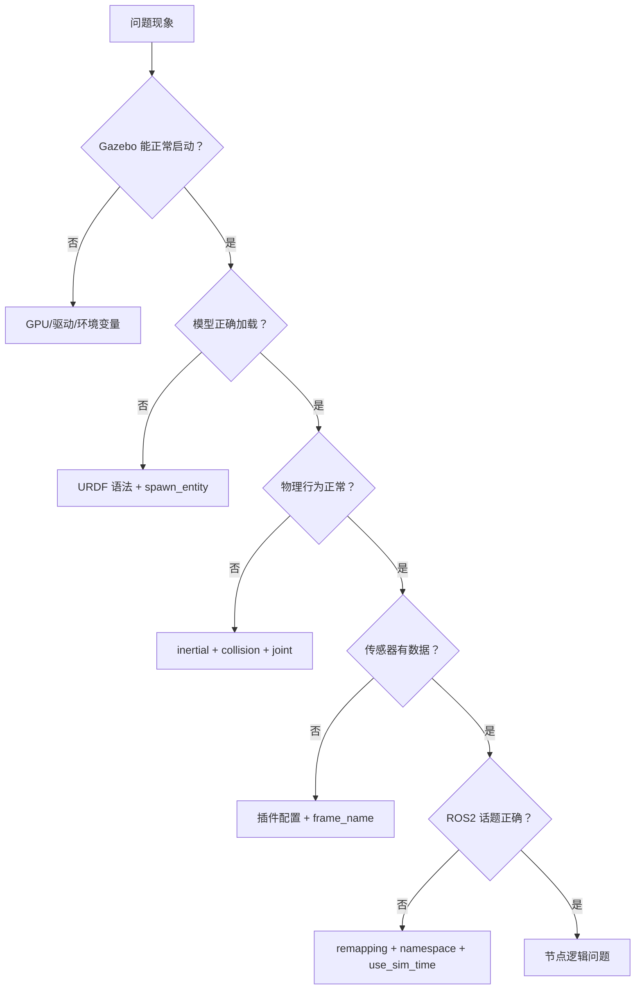

# Gazebo 仿真调试与常见问题

## 前言

**C：** 仿真环境搭建好了，模型也加载了，但机器人行为不对——轮子转了但不走、传感器数据异常、物理行为不合理。Gazebo 仿真的问题排查比纯 ROS 2 节点复杂，因为你需要同时关注物理仿真层和 ROS 2 通信层。本篇总结 Gazebo 仿真中最常遇到的问题和排查思路，帮你建立系统化的仿真调试能力。

<!-- more -->

## 仿真调试检查清单

遇到仿真问题时，按以下顺序排查：



## 一、Gazebo 启动问题

### 黑屏或闪退

```bash
# 1. 检查 GPU 驱动
nvidia-smi
# 如果没有输出，说明驱动有问题

# 2. 尝试软件渲染
export LIBGL_ALWAYS_SOFTWARE=1
gazebo

# 3. 检查环境变量
echo $DISPLAY
echo $LIBGL_ALWAYS_SOFTWARE

# 4. 如果是 SSH 远程运行，需要 X11 转发
ssh -X user@host
```

### "could not find or load Gazebo"

```bash
# 确认安装
dpkg -l | grep gazebo

# 重新安装
sudo apt install ros-humble-gazebo-ros-pkgs

# 检查环境变量
source /opt/ros/humble/setup.bash
```

## 二、模型加载问题

### spawn_entity 失败

```
[ERROR] [spawn_entity.py]: Unable to get robot description from topic
```

**排查步骤：**

```bash
# 1. 确认 robot_state_publisher 在运行
ros2 node list | grep robot_state_publisher

# 2. 确认 robot_description 话题有数据
ros2 topic echo /robot_description --once

# 3. 检查 spawn_entity 的参数
ros2 run gazebo_ros spawn_entity.py -topic robot_description -entity my_robot

# 4. 如果用 Xacro，确认编译后文件存在
xacro path/to/robot.xacro > /tmp/robot.urdf && check_urdf /tmp/robot.urdf
```

### 模型加载到错误位置

```python
# 在 spawn_entity 中指定初始位置
spawn_entity = Node(
    package='gazebo_ros',
    executable='spawn_entity.py',
    arguments=[
        '-topic', 'robot_description',
        '-entity', 'diff_bot',
        '-x', '0.0',
        '-y', '0.0',
        '-z', '0.1',  # 略高于地面
    ],
)
```

## 三、物理行为异常

### 模型穿透地面

**原因：** base_link 的 z=0 中心点恰好在地面平面上，导致半个模型在地面以下。

**解决：**

```xml
<!-- 方案1：给 base_link 的 collision 加向上偏移 -->
<collision>
  <origin xyz="0 0 0.075" rpy="0 0 0"/>  <!-- 半个底盘高度 -->
  <geometry><box size="0.6 0.4 0.15"/></geometry>
</collision>

<!-- 方案2：使用 base_footprint（推荐） -->
<link name="base_footprint">
  <collision>
    <origin xyz="0 0 0.001" rpy="0 0 0"/>
    <geometry><box size="0.6 0.4 0.01"/></geometry>
  </collision>
</link>
<joint name="base_joint" type="fixed">
  <parent link="base_footprint"/>
  <child link="base_link"/>
  <origin xyz="0 0 0.15" rpy="0 0 0"/>  <!-- 底盘中心抬高 -->
</joint>
```

### 轮子不转动或打滑

```bash
# 检查差速驱动插件话题
ros2 topic info /cmd_vel --verbose

# 尝试发送速度命令
ros2 topic pub /cmd_vel geometry_msgs/Twist "{linear: {x: 0.3}}" --once

# 检查关节名称是否与 URDF 一致
# 插件配置中的 left_joint 必须完全匹配 URDF 中的 joint name
```

常见原因：

| 原因 | 解决方法 |
| --- | --- |
| 关节名不匹配 | 检查 `<left_joint>` 与 URDF 中的 `<joint name="...">` |
| 摩擦系数太低 | 在 `<gazebo reference="wheel">` 中设置 `<mu1>1.0</mu1>` |
| 扭矩不足 | 增大 `<max_wheel_torque>` |
| 惯性参数不合理 | 确保底盘质量和轮子质量比例合理 |
| 轮子悬浮 | 调整轮子的 z 坐标使轮子刚好接触地面 |

### 机器人抖动或飞出

```xml
<!-- 物理引擎参数调整 -->
<physics type="ode">
  <max_step_size>0.0005</max_step_size>
  <real_time_update_rate>2000</real_time_update_rate>
  <ode>
    <solver>
      <type>quick</type>
      <iters>50</iters>
      <sor>1.3</sor>
    </solver>
  </ode>
</physics>
```

减小步长、增加迭代次数通常能改善稳定性。

## 四、传感器问题

### 激光雷达无数据

```bash
# 检查话题是否存在
ros2 topic list | grep scan
ros2 topic echo /scan --once

# 检查话题发布者
ros2 topic info /scan --verbose

# 如果有发布者但 echo 无数据
# 可能是 update_rate 太低或 noise 配置有误
```

常见原因：

| 原因 | 解决方法 |
| --- | --- |
| `<always_on>` 未设置 | 添加 `<always_on>true</always_on>` |
| frame_name 错误 | 检查 `<frame_name>` 是否与 URDF 中的 link name 一致 |
| 插件文件名错误 | 确认使用 `libgazebo_ros_ray_sensor.so`（Humble） |
| 传感器被遮挡 | 在 RViz 中检查传感器位置 |

### IMU 数据异常

```bash
# 检查数据格式
ros2 topic echo /imu/data --once

# 正常的 IMU 数据应该有：
# - angular_velocity（角速度）
# - linear_acceleration（线加速度）
# - orientation（四元数）
```

常见问题：
- **orientation 全零**：`<initial_orientation_as_reference>false</initial_orientation_as_reference>` 未设置
- **加速度不包含重力**：Gazebo 的 IMU 默认包含重力，如果不需要可以通过 `<angular_velocity>` 的 bias 调整

### 相机话题名不对

```bash
# 检查实际发布的话题
ros2 topic list | grep camera

# 可能的命名：
# /camera/image_raw  或  /camera/color/image_raw
# /camera/camera_info 或  /camera/color/camera_info
```

如果话题名不符合预期，检查 `<remapping>` 配置。

## 五、ROS 2 通信问题

### use_sim_time 未设置

这是仿真中**最高频**的问题：

```
[ERROR] [tf2]: Extrapolation Into Future
```

**解决：** 确保所有节点都设置了 `use_sim_time:=true`。

```python
# Launch 文件中统一设置
Node(
    package='my_pkg',
    executable='my_node',
    parameters=[{'use_sim_time': True}],
)
```

```bash
# 命令行方式
ros2 run my_pkg my_node --ros-args -p use_sim_time:=true
```

::: warning 注意
`robot_state_publisher` 也需要设置 `use_sim_time`。在 Launch 文件中，通常将 `{'use_sim_time': use_sim}` 传入 robot_description 参数之外，还需要额外设置。
:::

### 话题 remapping 不正确

```xml
<!-- Gazebo Classic 插件使用 <ros> 子标签 -->
<plugin name="diff_drive" filename="libgazebo_ros_diff_drive.so">
  <ros>
    <namespace>/</namespace>
    <remapping>cmd_vel:=cmd_vel</remapping>
  </ros>
</plugin>

<!-- 注意：旧版插件使用 <topicName>，Humble 不再支持 -->
<!-- 错误：<topicName>~/cmd_vel</topicName> -->
```

### TF 树断裂

```bash
# 检查 TF 树
ros2 run tf2_tools view_frames

# 检查特定变换
ros2 run tf2_ros tf2_echo odom base_link
ros2 run tf2_ros tf2_echo base_link laser_link
```

常见断裂原因：
- `robot_state_publisher` 未运行或未加载正确 URDF
- Gazebo 的差速驱动插件未发布 odom TF
- `joint_state_publisher` 未发布 joint states（非仿真模式）

## 六、性能问题

### 仿真速度低于 1x

```bash
# 查看实时因子
ros2 topic echo /clock --once
# 对比 system clock 和 simulation clock

# Gazebo GUI 左下角显示 Real Time Factor
```

优化方案：

| 优化项 | 方法 |
| --- | --- |
| 物理步长 | 增大 `max_step_size`（牺牲精度） |
| 渲染 | 关闭阴影、降低分辨率 |
| 传感器 | 降低 `update_rate`、减少采样点 |
| 碰撞体 | 用简单几何体代替 mesh |
| 模型数量 | 减少世界中的静态模型 |

### CPU 占用过高

```bash
# 查看 Gazebo 进程的资源占用
top -p $(pgrep gzserver)

# 限制 Gazebo 的 CPU 使用
cpulimit -l 200 -p $(pgrep gzserver)
```

## 七、实用调试技巧

### 仅启动物理引擎（无 GUI）

```bash
# 仅 gzserver（无渲染，省资源）
ros2 run gazebo_ros gazebo.launch.py gui:=false

# 在 Launch 文件中设置
gazebo = IncludeLaunchDescription(
    PythonLaunchDescriptionSource([...]),
    launch_arguments={'gui': 'false'}.items(),
)
```

### Gazebo 服务调用

```bash
# 暂停仿真
ros2 service call /pause_physics std_srvs/srv/Empty

# 恢复仿真
ros2 service call /unpause_physics std_srvs/srv/Empty

# 重置模型位置
ros2 service call /reset_world std_srvs/srv/Empty
ros2 service call /reset_simulation std_srvs/srv/Empty

# 获取模型状态
ros2 service call /gazebo/get_model_state gazebo_msgs/srv/GetModelState \
  "{model_name: 'diff_bot'}"
```

### 在仿真中动态添加模型

```bash
# 通过服务在运行时添加模型
ros2 service call /spawn_entity gazebo_msgs/srv/SpawnEntity \
  "{name: 'box', xml: '<model name=\"box\"><static>true</static><link name=\"link\"><collision><geometry><box><size>1 1 1</size></box></geometry></collision><visual><geometry><box><size>1 1 1</size></box></geometry></visual></link></model>', \
  initial_pose: {position: {x: 3.0, y: 0.0, z: 0.5}}}"
```

## 小结

Gazebo 仿真调试的系统化方法：

1. **分层排查**：Gazebo 启动 → 模型加载 → 物理行为 → 传感器 → ROS2 通信
2. **use_sim_time**：仿真环境中最常见的问题，确保所有节点统一设置
3. **模型物理**：inertial 参数、collision 偏移、摩擦系数是三大核心
4. **传感器验证**：`ros2 topic echo` 是第一手调试手段
5. **性能优化**：无 GUI 模式、降低传感器频率、简化碰撞体
6. **Gazebo 服务**：pause/unpause/reset 提供灵活的调试控制
