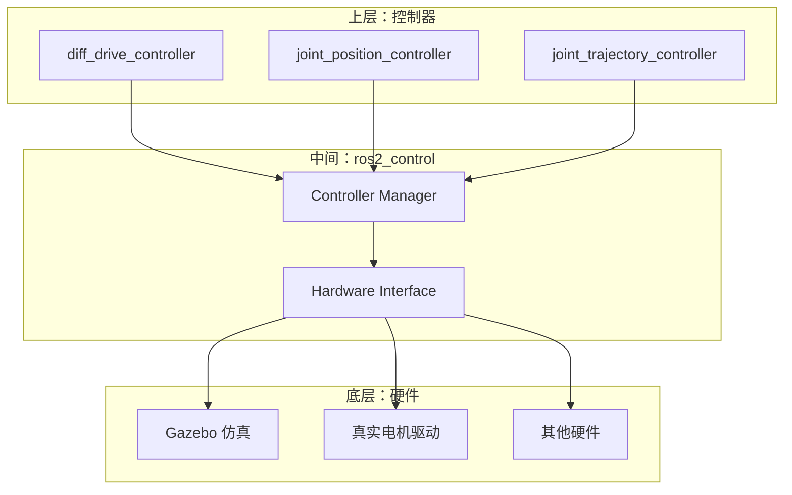
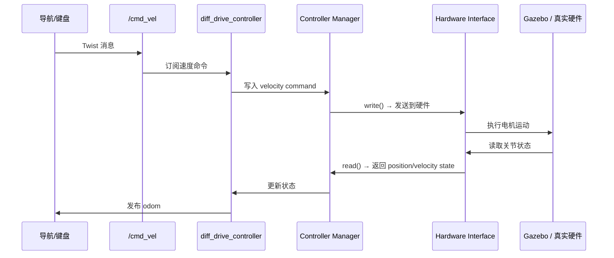

# ros2_control 框架概述

## 前言

**C：** Gazebo 里的差速驱动插件虽然能让轮子转起来，但那只是仿真的"玩具"方式——真机上你得对接真实的电机驱动板、读取编码器数据、发送 PWM 信号。ros2_control 就是 ROS 2 中统一硬件抽象层：不管你的底层是什么硬件，上层的控制器都通过标准接口来读写关节状态和命令。本篇讲解 ros2_control 的架构和核心概念。

<!-- more -->

## 为什么需要 ros2_control

在 Gazebo 仿真中，你用 `gazebo_ros_diff_drive` 插件就能让轮子转。但真机上情况完全不同：

| 场景 | 通信协议 | 驱动板 |
| --- | --- | --- |
| 小型差速机器人 | 串口 / CAN | STM32、Arduino |
| 工业机械臂 | EtherCAT | 商业驱动器 |
| 四足机器人 | CAN / SPI | 自定义 FPGA |
| 移动平台 | USB / RS485 | Roboteq、ODrive |

ros2_control 提供了**硬件无关的抽象层**：



核心思想：**更换硬件时只需实现新的 Hardware Interface，上层的控制器完全不用改。**

## 核心概念

### 1. Hardware Interface（硬件接口）

硬件接口是 ros2_control 的核心抽象，定义了两种数据：

| 数据类型 | 方向 | 说明 |
| --- | --- | --- |
| State（状态） | 硬件 → ROS | 关节位置、速度、力矩等 |
| Command（命令） | ROS → 硬件 | 目标位置、目标速度、目标力矩等 |

```cpp
// 标准的硬件接口头文件
#include <hardware_interface/handle.hpp>
#include <hardware_interface/system_interface.hpp>

// 状态句柄（读取）
hardware_interface::StateInterface position_jnt{"joint1", "position", &pos_value};
hardware_interface::StateInterface velocity_jnt{"joint1", "velocity", &vel_value};

// 命令句柄（写入）
hardware_interface::CommandHandle cmd_jnt{"joint1", "velocity", &cmd_value};
```

### 2. Controller Manager（控制器管理器）

管理所有控制器的生命周期：

- 加载控制器配置
- 启动/停止/切换控制器
- 按固定频率调用控制器

### 3. Controller（控制器）

具体控制算法的实现，如：
- `diff_drive_controller`：差速驱动
- `joint_trajectory_controller`：关节轨迹跟踪
- `joint_position_controller`：关节位置控制

## ros2_control 在 URDF 中的配置

ros2_control 通过 `<ros2_control>` 标签嵌入 URDF：

```xml
<ros2_control name="DiffBotHardware" type="system">
  <hardware>
    <plugin>diff_bot_hardware/DiffBotHardware</plugin>
    <param name="serial_port">/dev/ttyUSB0</param>
    <param name="baud_rate">115200</param>
  </hardware>

  <joint name="left_wheel_joint">
    <command_interface name="velocity"/>
    <state_interface name="position"/>
    <state_interface name="velocity"/>
  </joint>

  <joint name="right_wheel_joint">
    <command_interface name="velocity"/>
    <state_interface name="position"/>
    <state_interface name="velocity"/>
  </joint>
</ros2_control>
```

关键说明：
- `type="system"`：一个硬件接口管理多个关节（适用于大多数移动机器人）
- `type="actuator"`：每个关节一个硬件接口
- `type="sensor"`：纯传感器硬件
- `command_interface`：控制器可以写的数据
- `state_interface`：硬件接口可以读的数据

## Gazebo 仿真集成

使用 `gazebo_ros2_control` 插件将 ros2_control 与 Gazebo 连接：

```xml
<!-- 在 URDF 中添加 Gazebo 仿真插件 -->
<gazebo>
  <plugin filename="libgazebo_ros2_control.so" name="gazebo_ros2_control">
    <robot_param>robot_description</robot_param>
    <robot_param_node>robot_state_publisher</robot_param_node>
    <parameters>$(find my_bot)/config/gazebo_ros2_control.yaml</parameters>
  </plugin>
</gazebo>
```

配置文件 `gazebo_ros2_control.yaml`：

```yaml
controller_manager:
  ros__parameters:
    update_rate: 50  # Hz

    diff_drive_controller:
      type: diff_drive_controller/DiffDriveController

    joint_state_broadcaster:
      type: joint_state_broadcaster/JointStateBroadcaster
```

## 控制器管理

```bash
# 查看控制器列表
ros2 control list_controllers

# 查看硬件接口
ros2 control list_hardware_interfaces

# 加载控制器
ros2 control load_controller diff_drive_controller

# 启动控制器
ros2 control set_controller_state diff_drive_controller active

# 停止控制器
ros2 control set_controller_state diff_drive_controller inactive

# 列出控制器类型
ros2 control list_controller_types
```

## 在 Launch 文件中管理控制器

```python
from launch_ros.actions import Node

# 控制器管理器节点（由 gazebo_ros2_control 自动启动）
# 手动加载和启动控制器
spawn_controllers = ExecuteProcess(
    cmd=['ros2', 'control', 'load_controller', '--set-state', 'active',
         'diff_drive_controller'],
    output='screen',
)

spawn_jsb = ExecuteProcess(
    cmd=['ros2', 'control', 'load_controller', '--set-state', 'active',
         'joint_state_broadcaster'],
    output='screen',
)
```

## diff_drive_controller 配置

```yaml
diff_drive_controller:
  ros__parameters:
    left_wheel_names: ['left_wheel_joint']
    right_wheel_names: ['right_wheel_joint']

    wheel_separation: 0.45
    wheel_radius: 0.1

    wheel_perimeter: 0.628  # 2 * pi * wheel_radius

    wheels_per_side: 1      # 每侧轮子数
    left_wheel_radius_multiplier: 1.0
    right_wheel_radius_multiplier: 1.0

    publish_rate: 50.0      # 里程计发布频率
    odom_topic_name: "odom"
    odom_frame_id: "odom"
    base_frame_id: "base_link"
    pose_covariance_diagonal: [0.001, 0.001, 0.001, 0.001, 0.001, 0.01]
    twist_covariance_diagonal: [0.001, 0.001, 0.001, 0.001, 0.001, 0.01]

    open_loop: false
    enable_odom_tf: true

    cmd_vel_timeout: 0.5     # 速度命令超时时间
    use_stamped_vel: false
    preserve_turning_radius: false
```

启动后，控制器会订阅 `/cmd_vel` 话题，发布 `/odom` 话题和 TF。

## 数据流总结



## 常见问题

### 控制器加载失败

```bash
# 检查控制器类型是否安装
ros2 control list_controller_types | grep diff_drive

# 安装
sudo apt install ros-humble-ros2-control ros-humble-diff-drive-controller
```

### "No hardware interface registered"

检查 URDF 中的 `<ros2_control>` 标签：
1. `<hardware><plugin>` 名称是否正确
2. `command_interface` 和 `state_interface` 是否声明
3. URDF 是否正确传入了 `robot_state_publisher`

### 真机 vs 仿真切换

ros2_control 的优势在于：
- 仿真时用 `gazebo_ros2_control` 的 Hardware Interface
- 真机时替换为自定义 Hardware Interface
- 上层控制器配置完全不变

只需在 Launch 文件中通过参数控制使用哪个 Hardware Interface。

## 小结

ros2_control 是 ROS 2 的标准硬件抽象层：

1. **三层架构**：Controller → Controller Manager → Hardware Interface
2. **URDF 配置**：`<ros2_control>` 标签定义关节的命令和状态接口
3. **Gazebo 集成**：`gazebo_ros2_control` 插件提供仿真 Hardware Interface
4. **控制器管理**：`ros2 control load_controller` / `set_controller_state`
5. **diff_drive_controller**：差速驱动标准控制器，订阅 `/cmd_vel`，发布 `/odom`

下一篇讲解如何编写自定义 Hardware Interface 对接真实硬件。
