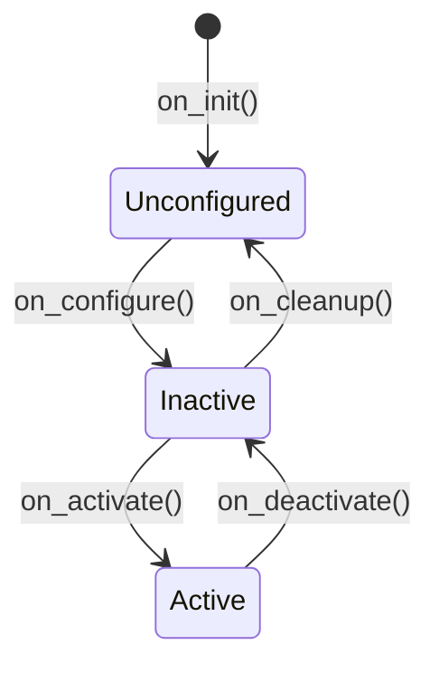

# 自定义 Hardware Interface 编写

## 前言

**C：** 上篇介绍了 ros2_control 的框架，本篇手把手教你编写一个自定义 Hardware Interface。以串口通信的差速机器人为例——底层通过串口与 STM32 驱动板通信，读取编码器数据和发送电机速度命令。掌握了这个模式，对接 CAN、EtherCAT、USB 等其他协议的硬件本质上是一样的。

<!-- more -->

## Hardware Interface 基本结构

每个 Hardware Interface 都需要实现 `hardware_interface::SystemInterface`：

```cpp
// diff_bot_hardware.hpp
#pragma once

#include <hardware_interface/system_interface.hpp>
#include <rclcpp_lifecycle/node.hpp>
#include <string>
#include <vector>

namespace diff_bot_hardware
{

class DiffBotHardware : public hardware_interface::SystemInterface
{
public:
  // ===== 生命周期接口 =====
  rclcpp_lifecycle::node_interfaces::LifecycleNodeInterface::CallbackReturn
  on_init(const hardware_interface::HardwareInfo & info) override;

  rclcpp_lifecycle::node_interfaces::LifecycleNodeInterface::CallbackReturn
  on_configure(const rclcpp_lifecycle::State & previous_state) override;

  rclcpp_lifecycle::node_interfaces::LifecycleNodeInterface::CallbackReturn
  on_activate(const rclcpp_lifecycle::State & previous_state) override;

  rclcpp_lifecycle::node_interfaces::LifecycleNodeInterface::CallbackReturn
  on_deactivate(const rclcpp_lifecycle::State & previous_state) override;

  // ===== 核心读写接口 =====
  hardware_interface::return_type read(
    const rclcpp::Time & time, const rclcpp::Duration & period) override;

  hardware_interface::return_type write(
    const rclcpp::Time & time, const rclcpp::Duration & period) override;
};

}  // namespace diff_bot_hardware
```

## 完整实现

```cpp
// diff_bot_hardware.cpp
#include "diff_bot_hardware/diff_bot_hardware.hpp"
#include <chrono>
#include <cmath>
#include <limits>
#include <sstream>

namespace diff_bot_hardware
{

CallbackReturn DiffBotHardware::on_init(
  const hardware_interface::HardwareInfo & info)
{
  // 确保有 joints 定义
  if (info_.joints.size() < 2) {
    RCLCPP_FATAL(rclcpp::get_logger("DiffBotHardware"),
                 "需要至少 2 个关节");
    return CallbackReturn::ERROR;
  }

  // 初始化状态和命令存储
  hw_positions_.resize(info_.joints.size(), 0.0);
  hw_velocities_.resize(info_.joints.size(), 0.0);
  hw_commands_.resize(info_.joints.size(), 0.0);

  // 从参数中读取硬件配置
  serial_port_ = info_.hardware_parameters["serial_port"];
  baud_rate_ = std::stoi(info_.hardware_parameters["baud_rate"]);
  wheel_radius_ = std::stod(info_.hardware_parameters["wheel_radius"]);

  RCLCPP_INFO(rclcpp::get_logger("DiffBotHardware"),
              "初始化完成，串口: %s, 波特率: %d",
              serial_port_.c_str(), baud_rate_);

  return CallbackReturn::SUCCESS;
}

CallbackReturn DiffBotHardware::on_configure(
  const rclcpp_lifecycle::State &)
{
  // 配置阶段：打开串口但不开始通信
  // serial_.open(serial_port_, baud_rate_);
  RCLCPP_INFO(rclcpp::get_logger("DiffBotHardware"), "配置完成");
  return CallbackReturn::SUCCESS;
}

CallbackReturn DiffBotHardware::on_activate(
  const rclcpp_lifecycle::State &)
{
  // 激活阶段：开始通信
  // serial_.start();
  RCLCPP_INFO(rclcpp::get_logger("DiffBotHardware"), "硬件已激活");
  return CallbackReturn::SUCCESS;
}

CallbackReturn DiffBotHardware::on_deactivate(
  const rclcpp_lifecycle::State &)
{
  // 停止通信，发送停止命令
  for (auto & cmd : hw_commands_) {
    cmd = 0.0;
  }
  // write() 会被调用一次，发送停止命令
  // serial_.stop();
  RCLCPP_INFO(rclcpp::get_logger("DiffBotHardware"), "硬件已停用");
  return CallbackReturn::SUCCESS;
}

hardware_interface::return_type DiffBotHardware::read(
  const rclcpp::Time &, const rclcpp::Duration &)
{
  // ===== 从硬件读取关节状态 =====
  // 示例：从串口读取编码器数据

  // 真实实现：
  // int32_t left_encoder, right_encoder;
  // serial_.read_encoders(left_encoder, right_encoder);
  // hw_positions_[0] = encoder_to_radians(left_encoder);
  // hw_positions_[1] = encoder_to_radians(right_encoder);
  // hw_velocities_[0] = (hw_positions_[0] - prev_positions_[0]) / period;
  // hw_velocities_[1] = (hw_positions_[1] - prev_positions_[1]) / period;

  // 仿真占位（Gazebo 会自动替换这个实现）：
  RCLCPP_DEBUG(rclcpp::get_logger("DiffBotHardware"),
               "读取关节状态: pos=[%.3f, %.3f], vel=[%.3f, %.3f]",
               hw_positions_[0], hw_positions_[1],
               hw_velocities_[0], hw_velocities_[1]);

  return hardware_interface::return_type::OK;
}

hardware_interface::return_type DiffBotHardware::write(
  const rclcpp::Time &, const rclcpp::Duration &)
{
  // ===== 向硬件写入控制命令 =====

  // 真实实现：
  // float left_cmd = hw_commands_[0];  // rad/s
  // float right_cmd = hw_commands_[1];
  // serial_.send_speed(left_cmd, right_cmd);

  // 仿真占位：
  RCLCPP_DEBUG(rclcpp::get_logger("DiffBotHardware"),
               "发送速度命令: [%.3f, %.3f] rad/s",
               hw_commands_[0], hw_commands_[1]);

  return hardware_interface::return_type::OK;
}

}  // namespace diff_bot_hardware

// 导出插件
#include "pluginlib/class_list_macros.hpp"
PLUGINLIB_EXPORT_CLASS(
  diff_bot_hardware::DiffBotHardware,
  hardware_interface::SystemInterface)
```

## 导出插件

```xml
<!-- diff_bot_hardware.xml -->
<library path="diff_bot_hardware">
  <class name="diff_bot_hardware/DiffBotHardware"
         type="diff_bot_hardware::DiffBotHardware"
         base_class_type="hardware_interface::SystemInterface">
    <description>
      差速机器人串口硬件接口
    </description>
  </class>
</library>
```

在 `package.xml` 中声明：

```xml
<export>
  <build_type>ament_cmake</build_type>
  <hardware_interface plugin="${prefix}/diff_bot_hardware.xml"/>
</export>
```

在 `CMakeLists.txt` 中：

```cmake
pluginlib_export_plugins_description_file(
  hardware_interface diff_bot_hardware.xml)
```

## URDF 配置

```xml
<ros2_control name="DiffBotHardware" type="system">
  <hardware>
    <plugin>diff_bot_hardware/DiffBotHardware</plugin>
    <param name="serial_port">/dev/ttyUSB0</param>
    <param name="baud_rate">115200</param>
    <param name="wheel_radius">0.1</param>
  </hardware>

  <joint name="left_wheel_joint">
    <command_interface name="velocity">
      <param name="min">-10</param>
      <param name="max">10</param>
    </command_interface>
    <state_interface name="position"/>
    <state_interface name="velocity"/>
  </joint>

  <joint name="right_wheel_joint">
    <command_interface name="velocity">
      <param name="min">-10</param>
      <param name="max">10</param>
    </command_interface>
    <state_interface name="position"/>
    <state_interface name="velocity"/>
  </joint>
</ros2_control>
```

## 生命周期回调详解



| 阶段 | 触发时机 | 典型操作 |
| --- | --- | --- |
| `on_init` | 加载插件 | 解析参数、分配内存 |
| `on_configure` | 配置阶段 | 打开串口、初始化驱动 |
| `on_activate` | 控制器启动 | 启动通信、使能电机 |
| `on_deactivate` | 控制器停止 | 禁用电机、停止通信 |
| `read` | 每个控制周期 | 读取编码器、IMU 数据 |
| `write` | 每个控制周期 | 发送速度/位置命令 |

## 从 Gazebo 到真机的切换

ros2_control 最大的优势就是**不改动上层代码**即可切换底层硬件：

```python
# launch/robot.launch.py
# 仿真模式
if use_sim:
    # gazebo_ros2_control 会使用 GazeboHardwareInterface
    # 代替你的自定义 Hardware Interface
    gazebo = IncludeLaunchDescription(...)
else:
    # 真机模式：你的自定义 Hardware Interface 会被加载
    # Controller Manager 会自动找到 URDF 中声明的插件
    robot_state_pub = Node(
        package='robot_state_publisher',
        parameters=[robot_description],
    )
    controller_manager = Node(
        package='controller_manager',
        executable='ros2_control_node',
        parameters=[robot_description, controller_config],
    )
```

::: tip 笔者说
这种"上层不变、下层可插拔"的设计，让你可以先用 Gazebo 调好控制算法，再对接真实硬件，减少了很多真机调试的风险。
:::

## 常见问题

### 插件加载失败 "could not find class"

```bash
# 检查插件是否正确导出
ros2 pkg prefix diff_bot_hardware

# 检查 XML 描述文件
cat install/diff_bot_hardware/share/diff_bot_hardware/diff_bot_hardware.xml

# 确认 pluginlib 能找到它
ros2 pkg xml diff_bot_hardware
```

### read/write 不被调用

检查：
1. Controller Manager 是否正常运行
2. 控制器是否已激活（active 状态）
3. Hardware Interface 是否已激活

### 串口权限问题

```bash
# 临时解决
sudo chmod 666 /dev/ttyUSB0

# 永久解决：添加用户到 dialout 组
sudo usermod -aG dialout $USER
# 重新登录后生效
```

## 小结

自定义 Hardware Interface 的编写要点：

1. **继承 `SystemInterface`**：实现 on_init / on_configure / on_activate / on_deactivate / read / write
2. **生命周期管理**：初始化 → 配置 → 激活 → 停用，在合适的阶段做合适的事
3. **read()**：从硬件读取状态（编码器 → position/velocity）
4. **write()**：向硬件发送命令（velocity → 电机驱动）
5. **pluginlib 导出**：XML 描述文件 + package.xml 声明
6. **仿真/真机切换**：不改动控制器和上层代码

下一篇讲解常用的控制器配置和多控制器协作。
