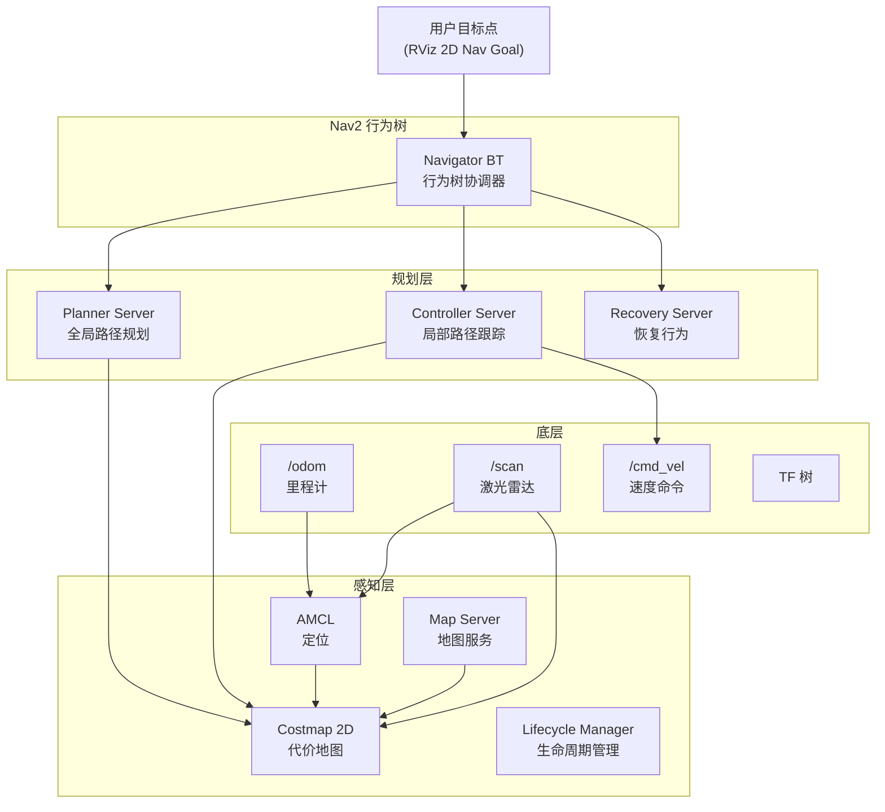

# Nav2 导航框架入门

## 前言

**C：** 前面的基础篇和建模仿真篇搭建好了机器人的"身体"——它能动、能看、能感知环境。下一步就是让它自己走到目标点。Nav2（Navigation2）是 ROS 2 的官方导航框架，覆盖了 SLAM 建图、路径规划、避障、行为树控制等完整导航流程。本篇从 Nav2 的架构讲起，带你用一个 Gazebo 仿真机器人完成基本的建图和导航。

<!-- more -->

## Nav2 架构概述

Nav2 的核心架构：



## 安装 Nav2

```bash
# Humble
sudo apt install ros-humble-nav2-bringup ros-humble-nav2-msgs \
                 ros-humble-slam-toolbox ros-humble-navigation2 \
                 ros-humble-nav2-util

# 验证
ros2 pkg list | grep nav2
```

## 前置条件

在开始 Nav2 之前，确保你的仿真机器人已具备：

1. **URDF/Xacro 模型**：底盘 + 轮子 + 激光雷达
2. **Gazebo 仿真**：diff_drive 插件 + 激光雷达插件
3. **TF 树完整**：map → odom → base_link → laser_link
4. **ros2_control**（或 Gazebo 插件）：提供 `/cmd_vel` 和 `/odom`
5. **话题列表**：

| 话题 | 类型 | 来源 |
| --- | --- | --- |
| `/scan` | `sensor_msgs/LaserScan` | 激光雷达 |
| `/odom` | `nav_msgs/Odometry` | 里程计 |
| `/cmd_vel` | `geometry_msgs/Twist` | 导航发送 |
| `/tf` 和 `/tf_static` | `tf2_msgs/TFMessage` | TF |

## SLAM 建图

### 启动 SLAM

```bash
# 终端1：启动仿真（Gazebo + 机器人）
ros2 launch my_robot simulation.launch.py use_sim:=true

# 终端2：启动 SLAM Toolbox
ros2 launch slam_toolbox online_async_launch.py \
  use_sim_time:=true

# 终端3：启动 RViz（带 Nav2 配置）
ros2 launch nav2_bringup rviz_launch.py
```

在 RViz 中：
1. 添加 **Map** 显示（Topic: `/map`）
2. 添加 **LaserScan** 显示（Topic: `/scan`）
3. 用键盘或 `/cmd_vel` 控制机器人在环境中移动
4. SLAM Toolbox 会实时构建地图

### 保存地图

```bash
# 保存为 pgm + yaml
ros2 run nav2_map_server map_saver_cli -f my_map
# 生成 my_map.pgm 和 my_map.yaml
```

`my_map.yaml` 内容：

```yaml
image: my_map.pgm
resolution: 0.05
origin: [-10.0, -10.0, 0.0]
negate: 0
occupied_thresh: 0.65
free_thresh: 0.196
```

## 自主导航

### 启动导航

```bash
# 终端1：仿真环境
ros2 launch my_robot simulation.launch.py use_sim:=true

# 终端2：启动 Nav2
ros2 launch nav2_bringup navigation_launch.py \
  use_sim_time:=true \
  params_file:=/path/to/nav2_params.yaml \
  map:=/path/to/my_map.yaml
```

### Nav2 参数文件（简化版）

```yaml
# nav2_params.yaml
bt_navigator:
  ros__parameters:
    use_sim_time: True
    global_frame: map
    robot_base_frame: base_link
    odom_topic: /odom
    bt_loop_duration: 10
    default_server_timeout: 20

controller_server:
  ros__parameters:
    use_sim_time: True
    controller_frequency: 20.0
    progress_checker_plugins: ["progress_checker"]
    controller_plugins: ["FollowPath"]

    FollowPath:
      plugin: "dwb_core::DWBLocalPlanner"
      critics: ["RotateToGoal", "Oscillation", "BaseObstacle", "GoalAlign", "PathAlign", "PathDist", "GoalDist"]

local_costmap:
  local_costmap:
    ros__parameters:
      update_frequency: 5.0
      publish_frequency: 2.0
      global_frame: odom
      robot_base_frame: base_link
      use_sim_time: True
      rolling_window: true
      width: 3
      height: 3
      resolution: 0.05
      plugins: ["obstacle_layer", "inflation_layer"]

global_costmap:
  global_costmap:
    ros__parameters:
      update_frequency: 1.0
      publish_frequency: 1.0
      global_frame: map
      robot_base_frame: base_link
      use_sim_time: True
      robot_radius: 0.25
      plugins: ["static_layer", "obstacle_layer", "inflation_layer"]

      static_layer:
        map_subscribe_transient_local: True

      obstacle_layer:
        observation_sources: scan
        scan:
          topic: /scan
          max_obstacle_height: 2.0
          clearing: True
          marking: True
          data_type: "LaserScan"
          raytrace_max_range: 3.0
          raytrace_min_range: 0.0
          obstacle_max_range: 2.5
          obstacle_min_range: 0.0

      inflation_layer:
        inflation_radius: 0.55
        cost_scaling_factor: 3.0

planner_server:
  ros__parameters:
    expected_planner_frequency: 20.0
    use_sim_time: True
    planner_plugins: ["GridBased"]
    GridBased:
      plugin: "nav2_smac_planner/SmacPlannerHybrid"
      tolerance: 0.25
      max_iterations: 1000000

behavior_server:
  ros__parameters:
    costmap_topic: local_costmap/costmap_raw
    footprint_topic: local_costmap/published_footprint
    cycle_frequency: 10.0
    behavior_plugins: ["spin", "backup", "drive_on_heading", "assisted_teleop", "wait"]
    spin:
      plugin: "nav2_behaviors/Spin"
    backup:
      plugin: "nav2_behaviors/BackUp"
    drive_on_heading:
      plugin: "nav2_behaviors/DriveOnHeading"
    wait:
      plugin: "nav2_behaviors/Wait"
```

### 在 RViz 中导航

1. 启动 RViz 并加载 Nav2 配置
2. 点击顶部工具栏的 **"2D Pose Estimate"**，在地图上点击机器人当前位置（初始化 AMCL 定位）
3. 点击 **"Nav2 Goal"**，在地图上点击目标位置
4. Nav2 会自动规划路径并控制机器人导航到目标点

### 使用命令行发送导航目标

```bash
ros2 action send_goal /navigate_to_pose nav2_msgs/action/NavigateToPose \
  "{pose: {header: {frame_id: 'map'}, pose: {position: {x: 2.0, y: 1.0}, orientation: {w: 1.0}}}}"
```

## 代价地图

代价地图是导航的核心——它将环境转换为机器人可理解的"通行成本"：

| 代价值 | 含义 |
| --- | --- |
| 0 | 自由空间（完全可通行） |
| 1 ~ 252 | 膨胀区域（有碰撞风险） |
| 253 | 内切障碍物 |
| 254 | 致命障碍物（绝对不可通过） |
| 255 | 未知区域 |

两层代价地图：

| | 全局代价地图 | 局部代价地图 |
| --- | --- | --- |
| 参考系 | `map` | `odom` |
| 更新方式 | 使用静态地图 | 滚动窗口 |
| 用途 | 全局路径规划 | 局部避障 |
| 大小 | 整张地图 | 机器人周围局部 |

## Nav2 核心节点

| 节点 | 功能 |
| --- | --- |
| `planner_server` | 全局路径规划（A*、Dijkstra、SMAC） |
| `controller_server` | 局部路径跟踪和避障（DWB、TEB、MPPI） |
| `behavior_server` | 恢复行为（旋转、后退、等待） |
| `bt_navigator` | 行为树导航器（协调整体导航流程） |
| `lifecycle_manager` | 管理各节点的生命周期 |
| `map_server` | 加载和发布静态地图 |
| `amcl` | 自适应蒙特卡洛定位 |

## 常见问题

### 机器人不移动

```bash
# 1. 检查 /cmd_vel 是否有数据
ros2 topic echo /cmd_vel

# 2. 检查 /odom 是否正常
ros2 topic echo /odom

# 3. 检查 TF 树完整性
ros2 run tf2_tools view_frames
```

### AMCL 定位漂移

1. 确保初始位姿设置正确（2D Pose Estimate 点击位置要准确）
2. 检查 `/scan` 话题是否有数据且 TF 正确
3. 调整 AMCL 参数（粒子数、激光模型等）

### 全局规划失败

- 检查静态地图是否正确加载
- 检查起点和终点是否在可通行区域
- 检查全局代价地图是否正确显示

## 小结

Nav2 导航框架的核心流程：

1. **SLAM 建图**：`slam_toolbox` 驱动机器人探索环境，生成地图
2. **保存地图**：`map_saver_cli` 导出 pgm + yaml
3. **加载导航**：`navigation_launch.py` 启动完整的导航栈
4. **AMCL 定位**：`2D Pose Estimate` 初始化机器人位置
5. **发送目标**：`Nav2 Goal` 或命令行发送目标点
6. **路径规划**：`planner_server` 全局规划 + `controller_server` 局部跟踪

下一篇深入 Nav2 的路径规划和代价地图配置。
