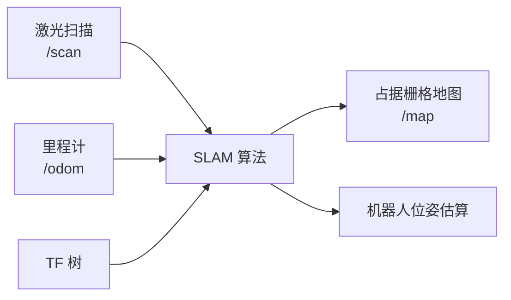

# SLAM 建图与地图管理

## 前言

**C：** 导航的前提是有地图。在实际使用中，大多数室内环境没有现成的地图，需要机器人自己探索并构建。SLAM（Simultaneous Localization and Mapping）就是同时完成"我在哪"和"环境长什么样"这两个任务。ROS 2 中最常用的 SLAM 工具是 slam_toolbox。本篇讲解 SLAM 建图的完整流程、地图保存与加载、以及一些实用技巧。

<!-- more -->

## SLAM 概述

SLAM 的核心思想：



ROS 2 中常用的 SLAM 方案：

| 方案 | 特点 | 适用场景 |
| --- | --- | --- |
| slam_toolbox | 在线/离线建图、支持地图合并、社区活跃 | 大多数室内场景 |
| cartographer | Google 开发、3D 建图、多传感器融合 | 大面积、复杂环境 |
| fast_lio | 基于激光惯导融合、速度快 | 快速移动场景 |

本篇以 **slam_toolbox** 为主要讲解对象。

## 前置条件

确认你的仿真机器人提供以下数据：

```bash
# 检查话题
ros2 topic list | grep -E "scan|odom|tf"

# 检查激光雷达数据
ros2 topic echo /scan --once | head -5

# 检查 TF 树
ros2 run tf2_tools view_frames
```

必需条件：
- `/scan`（`sensor_msgs/LaserScan`）：激光雷达数据
- `/odom`（`nav_msgs/Odometry`）：里程计
- TF：`base_link → laser_link`（激光雷达的安装位置变换）
- `use_sim_time:=true`（仿真环境）

## 启动 SLAM

### 方式1：直接启动

```bash
# 启动在线异步 SLAM（推荐）
ros2 launch slam_toolbox online_async_launch.py \
  use_sim_time:=true
```

### 方式2：自定义配置

创建配置文件 `slam_config.yaml`：

```yaml
slam_toolbox:
  ros__parameters:
    # 机器人配置
    odom_frame: odom
    map_frame: map
    base_frame: base_link
    scan_topic: /scan
    use_sim_time: true

    # 模式配置
    mode: mapping  # mapping 或 localization

    # 地图参数
    resolution: 0.05              # 栅格分辨率（米/格）
    max_laser_range: 12.0         # 最大有效距离
    minimum_time_interval: 0.5    # 地图更新最小间隔

    # 变换容差
    transform_publish_period: 0.02  # map→odom 变换发布频率
    transform_tolerance: 0.2        # 时间容差（秒）

    # 相关性搜索
    correlation_search_space_dimension: 0.5
    correlation_search_space_resolution: 0.01

    # 循环闭合
    do_loop_closing: true
    loop_search_space_dimension: 8.0
    loop_search_space_resolution: 0.05
    loop_match_minimum_chain_size: 10

    # 扫描匹配
    scan_buffer_size: 10
    scan_buffer_maximum_scan_distance: 10.0
    link_match_minimum_response_fine: 0.1
    link_scan_maximum_distance: 1.5

    # Ceres 优化
    ceres_linear_solver: SPARSE_NORMAL_CHOLESKY
    ceres_preconditioner: SCHUR_JACOBI
    ceres_trust_strategy: LEVENBERG_MARQUARDT
    ceres_dogleg_type: TRADITIONAL_DOGLEG
    ceres_loss_function: None
```

Launch 文件引用：

```python
Node(
    package='slam_toolbox',
    executable='async_slam_toolbox_node',
    name='slam_toolbox',
    parameters=[slam_config],
    output='screen',
)
```

## 建图流程

### 1. 启动仿真和 SLAM

```bash
# 终端1：仿真环境
ros2 launch my_robot simulation.launch.py use_sim:=true

# 终端2：SLAM
ros2 launch slam_toolbox online_async_launch.py use_sim_time:=true

# 终端3：RViz
rviz2
```

### 2. 在 RViz 中配置

添加以下显示：
- **Map** → Topic: `/map`
- **LaserScan** → Topic: `/scan`
- **TF** → 可选
- **RobotModel** → 可选
- **Odometry** → Topic: `/odom`

### 3. 手动遥控建图

```bash
# 使用键盘遥控
sudo apt install ros-humble-teleop-twist-keyboard
ros2 run teleop_twist_keyboard teleop_twist_keyboard

# 或使用 ros2 topic pub
ros2 topic pub /cmd_vel geometry_msgs/Twist \
  "{linear: {x: 0.2}, angular: {z: 0.0}}" --rate 10
```

控制机器人在环境中缓慢移动，注意：
- **速度不要太快**，否则扫描匹配容易失败
- **走遍所有区域**，避免大块未知区域
- **适当走回已建图区域**，帮助 SLAM 做循环闭合
- **避免长走廊**（没有特征点的环境），容易丢失定位

### 4. 监控建图质量

在 RViz 中观察：
- 地图是否清晰连续（无重叠、无断裂）
- `/scan` 是否与地图正确对齐
- `map → odom` TF 是否频繁大幅跳变

```bash
# 查看地图话题
ros2 topic echo /map --once | head -20

# 查看地图分辨率
ros2 topic echo /map --once | grep resolution
```

## 保存地图

```bash
# 保存为 pgm 图片 + yaml 描述
ros2 run nav2_map_server map_saver_cli -f ~/my_map

# 生成两个文件：
# my_map.pgm  - 地图图像（灰度）
# my_map.yaml - 地图元信息
```

`my_map.yaml`：

```yaml
image: my_map.pgm
resolution: 0.05
origin: [-10.0, -10.0, 0.0]
negate: 0
occupied_thresh: 0.65
free_thresh: 0.196
```

### 地图图像说明

| 像素颜色 | 含义 |
| --- | --- |
| 白色（255） | 自由空间 |
| 黑色（0） | 障碍物 |
| 灰色（205） | 未知区域 |

## 加载已保存的地图

### 方式1：map_server

```bash
ros2 run nav2_map_server map_server --ros-args \
  -p yaml_filename:=my_map.yaml
```

### 方式2：slam_toolbox 定位模式

用已有地图进行定位（不更新地图）：

```bash
ros2 launch slam_toolbox localization_launch.py \
  map_file:=my_map.yaml \
  use_sim_time:=true
```

## 地图编辑与处理

### 合并地图

slam_toolbox 支持将多段建图会话合并：

```bash
# 启动离线 SLAM
ros2 launch slam_toolbox offline_launch.py \
  bag_filename:=/path/to/recording.db3 \
  map_file:=existing_map.yaml \
  scan_topic:=/scan
```

### 地图裁剪

使用 `map_server` 的 `map_saver` 或 ImageMagick 工具：

```bash
# 裁剪地图图片
convert my_map.pgm -crop 500x500+200+200 cropped_map.pgm

# 手动修改 yaml 中的 origin 坐标
```

### 地图格式转换

```bash
# pgm → png
convert my_map.pgm my_map.png

# 调整分辨率（需要在 yaml 中同步修改 resolution）
convert my_map.pgm -resize 50% my_map_half_res.pgm
# resolution: 0.05 → 0.10
```

## 建图常见问题

### 地图漂移

**现象**：地图中出现重影或不对齐。

**原因与解决**：
1. **里程计不准确**：检查轮径和轮距参数是否与实际一致
2. **速度太快**：降低建图时的移动速度
3. **特征太少**：在特征丰富的环境中建图效果更好
4. **循环闭合失败**：调整 `do_loop_closing` 和搜索参数

### 地图全是未知（灰色）

```bash
# 1. 检查 /scan 是否有数据
ros2 topic hz /scan

# 2. 检查 TF：base_link → laser_link 是否存在
ros2 run tf2_ros tf2_echo base_link laser_link

# 3. 检查 scan topic 的 frame_id
ros2 topic echo /scan --once | grep frame_id
# 必须与 laser_link 对应的 frame 匹配
```

### SLAM 卡死或 CPU 占用过高

调整 SLAM 参数降低计算量：

```yaml
# 降低搜索范围
correlation_search_space_dimension: 0.3   # 从 0.5 降到 0.3
loop_search_space_dimension: 4.0          # 从 8.0 降到 4.0

# 减少扫描缓冲
scan_buffer_size: 5                        # 从 10 降到 5
```

## 小结

SLAM 建图要点：

1. **前置条件**：`/scan`、`/odom`、TF、`use_sim_time`
2. **建图工具**：slam_toolbox（推荐），支持在线/离线/定位三种模式
3. **建图流程**：启动 SLAM → 手动遥控探索 → 保存地图
4. **保存格式**：`pgm`（图像）+ `yaml`（元信息）
5. **质量关键**：低速移动、特征丰富、适当回环、参数调优
6. **定位模式**：用已有地图定位（不建图），适合运行导航

下一篇进入 Nav2 的路径规划配置与调优。
