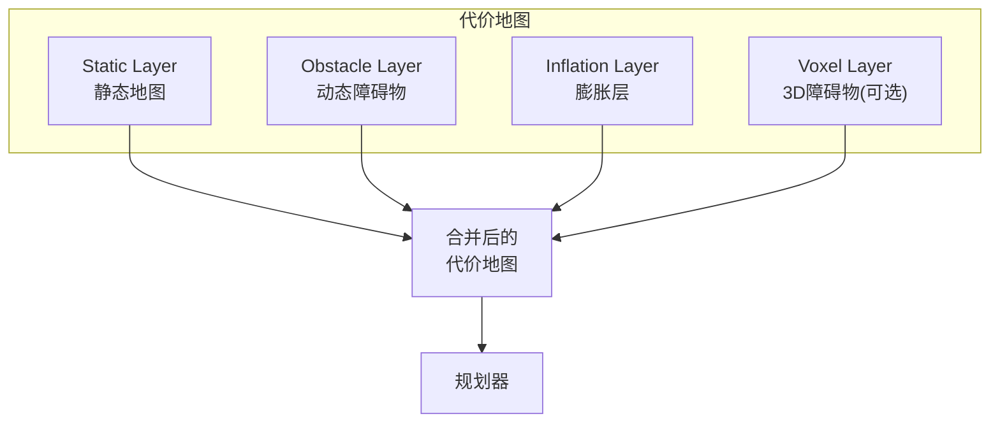

# Nav2 路径规划与调优

## 前言

**C：** 上一篇把建图搞定了，机器人也能走到目标点了。但实际使用中，你大概率会遇到"规划的路径穿过障碍物"、"机器人卡在角落出不来"、"走廊里走得歪歪扭扭"等问题。这些都需要通过调优 Nav2 的路径规划器和代价地图来解决。本篇深入 Nav2 的规划参数，帮你把导航效果调到可用水平。

<!-- more -->

## 全局路径规划

全局规划器负责计算从起点到终点的整体路径，不考虑动态障碍物。

### 可用规划器

| 规划器 | 特点 | 适用场景 |
| --- | --- | --- |
| NavFn | Dijkstra/A*，经典可靠 | 简单环境 |
| SmacPlannerHybrid | A* + SE2 混合 | 支持旋转的移动机器人 |
| SmacPlanner2D | 2D A*，速度快 | 大地图 |
| ThetaStar | any-angle 路径 | 需要更自然的路径 |

### 配置示例

```yaml
planner_server:
  ros__parameters:
    expected_planner_frequency: 20.0
    use_sim_time: True
    planner_plugins: ["GridBased"]

    GridBased:
      plugin: "nav2_smac_planner/SmacPlannerHybrid"
      tolerance: 0.25             # 到达目标的容差
      max_iterations: 1000000     # 最大迭代次数
      allow_unknown: true         # 允许穿越未知区域
      max_on_approach_iterations: 1000
      use_final_approach_orientation: false
    # NavFn 简单配置：
    # GridBased:
    #   plugin: "nav2_navfn_planner/NavfnPlanner"
    #   tolerance: 0.5
    #   use_astar: true
    #   allow_unknown: true
```

## 局部路径跟踪与避障

局部规划器负责沿全局路径行驶并实时避障。

### 可用控制器

| 控制器 | 特点 | 适用场景 |
| --- | --- | --- |
| DWB（默认） | 动态窗口法 | 差速/全向移动机器人 |
| TEB | 时间弹性带 | 需要优化轨迹的场景 |
| MPPI | 采样规划 | 高自由度机器人 |
| RegulatedPurePursuit | 纯跟踪 | 差速机器人，简单高效 |

### DWB 配置

```yaml
controller_server:
  ros__parameters:
    use_sim_time: True
    controller_frequency: 20.0

    controller_plugins: ["FollowPath"]

    FollowPath:
      plugin: "dwb_core::DWBLocalPlanner"

      # 评价函数
      critics: [
        "RotateToGoal",
        "Oscillation",
        "BaseObstacle",
        "GoalAlign",
        "PathAlign",
        "PathDist",
        "GoalDist"
      ]

      # 路径跟踪
      BaseObstacle.scale: 0.02
      PathAlign.scale: 32.0
      PathDist.scale: 32.0
      GoalAlign.scale: 24.0
      GoalDist.scale: 24.0

      # 速度限制
      min_vel_x: 0.1
      max_vel_x: 0.5
      max_vel_y: 0.0
      max_vel_theta: 1.5
      min_speed_xy: 0.1
      max_speed_xy: 0.5
      min_speed_theta: 0.3

      # 加速度限制
      acc_lim_x: 2.5
      acc_lim_y: 0.0
      acc_lim_theta: 3.2

      # 采样配置
      vx_samples: 20
      vtheta_samples: 40
      sim_time: 1.5        # 轨迹模拟时间（秒）
```

### RegulatedPurePursuit（推荐差速机器人）

```yaml
controller_server:
  ros__parameters:
    controller_plugins: ["FollowPath"]

    FollowPath:
      plugin: "nav2_regulated_pure_pursuit::RegulatedPurePursuitController"

      desired_linear_vel: 0.5       # 巡航速度
      lookahead_dist: 0.6           # 前视距离
      min_lookahead_dist: 0.3
      max_lookahead_dist: 0.9
      lookahead_angle: 0.785        # 45度

      rotate_to_heading_angular_vel: 1.8
      transform_tolerance: 0.1
      use_velocity_scaled_lookahead_dist: true
      min_approach_linear_velocity: 0.05
      approach_velocity_scaling_dist: 0.6

      allow_reversing: false         # 是否允许倒车
      max_allowed_pose_to_goal_dist: 0.5

      regulated_linear_scaling_min_radius: 0.4
      regulated_linear_scaling_min_speed: 0.25
```

## 代价地图详解

代价地图将环境信息转换为"通行成本"，是导航规划的基础。

### 层级结构



### Static Layer（静态层）

从地图服务器加载的静态地图：

```yaml
global_costmap:
  global_costmap:
    ros__parameters:
      plugins: ["static_layer", "obstacle_layer", "inflation_layer"]
      static_layer:
        map_subscribe_transient_local: True
```

### Obstacle Layer（障碍物层）

实时从传感器数据标记/清除障碍物：

```yaml
obstacle_layer:
  observation_sources: scan
  scan:
    topic: /scan
    data_type: "LaserScan"
    marking: true           # 标记障碍物
    clearing: true          # 清除障碍物
    max_obstacle_height: 2.0
    raytrace_max_range: 3.0    # 射线追踪最大距离
    raytrace_min_range: 0.0
    obstacle_max_range: 2.5    # 障碍物检测最大距离
    obstacle_min_range: 0.0
    inf_is_valid: false
```

### Inflation Layer（膨胀层）

在障碍物周围创建"危险区域"：

```yaml
inflation_layer:
  inflation_radius: 0.55        # 膨胀半径
  cost_scaling_factor: 3.0      # 衰减因子（越大衰减越快）

  # 膨胀半径应该 >= 机器人半径 + 安全裕度
  # 机器人半径 0.25m + 安全裕度 0.3m = 0.55m
```

| 参数 | 含义 | 推荐值 |
| --- | --- | --- |
| `inflation_radius` | 障碍物影响的最大距离 | 机器人半径 + 0.2~0.5m |
| `cost_scaling_factor` | 代价值衰减速度 | 2.5 ~ 5.0 |

::: tip 笔者说
`inflation_radius` 太大会导致机器人走不出狭窄通道，太小会导致经常擦碰障碍物。建议从机器人半径 + 0.3m 开始调试。
:::

### 全局 vs 局部代价地图

```yaml
global_costmap:
  global_costmap:
    ros__parameters:
      update_frequency: 1.0       # 全局更新慢一点
      publish_frequency: 1.0
      global_frame: map
      robot_base_frame: base_link
      robot_radius: 0.25
      resolution: 0.05
      # 不使用滚动窗口，覆盖整张地图

local_costmap:
  local_costmap:
    ros__parameters:
      update_frequency: 5.0       # 局部更新快一点
      publish_frequency: 2.0
      global_frame: odom
      robot_base_frame: base_link
      robot_radius: 0.25
      rolling_window: true         # 滚动窗口模式
      width: 3                     # 窗口大小
      height: 3
      resolution: 0.05
```

## 恢复行为

当机器人卡住时，Nav2 会自动尝试恢复行为：

```yaml
behavior_server:
  ros__parameters:
    costmap_topic: local_costmap/costmap_raw
    cycle_frequency: 10.0
    behavior_plugins: ["spin", "backup", "drive_on_heading", "wait"]

    spin:
      plugin: "nav2_behaviors/Spin"
    backup:
      plugin: "nav2_behaviors/BackUp"
    drive_on_heading:
      plugin: "nav2_behaviors/DriveOnHeading"
    wait:
      plugin: "nav2_behaviors/Wait"

    # 恢复行为次数限制
    recovery_enabled: true
    n_recoveries: 3
```

## 调优清单

| 问题 | 检查项 | 调整方向 |
| --- | --- | --- |
| 路径穿过障碍物 | 代价地图是否正确渲染 | 检查 obstacle_layer 配置 |
| 机器人擦碰障碍物 | inflation_radius | 增大膨胀半径 |
| 窄通道通过不了 | inflation_radius + robot_radius | 减小膨胀半径或机器人半径 |
| 走到目标附近停不下来 | planner tolerance | 减小容差值 |
| 转弯时卡住 | min_vel_x / max_vel_theta | 调整速度限制 |
| 路径抖动 | 控制器频率 | 提高 controller_frequency |
| 倒退行为异常 | allow_reversing | 检查 DWB 的速度采样 |
| 恢复行为无效 | recovery_enabled / n_recoveries | 调整次数和类型 |

## 小结

Nav2 路径规划调优的核心是理解三个模块：

1. **全局规划器**：计算整体路径，SmacPlannerHybrid（推荐）或 NavFn
2. **局部控制器**：跟踪路径 + 实时避障，RegulatedPurePursuit（差速推荐）或 DWB
3. **代价地图**：Static Layer（静态）+ Obstacle Layer（动态）+ Inflation Layer（膨胀）

调优建议从默认参数开始，一次只改一个参数，观察效果后再调整下一个。
