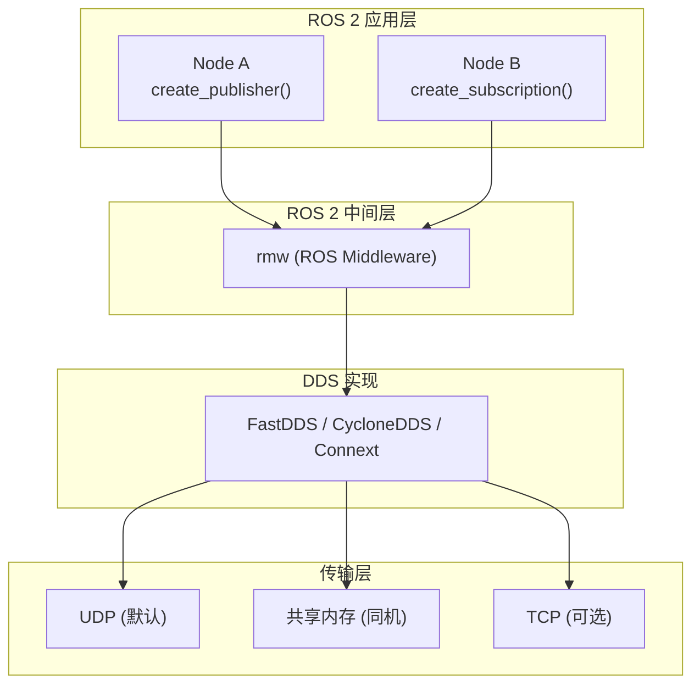

# DDS 中间件配置与调优

## 前言

**C：** ROS 2 的通信底层是 DDS（Data Distribution Service）中间件。大多数情况下你不需要直接配置 DDS——默认参数对一般开发够用了。但当节点数增多、数据量增大、网络环境复杂时，默认配置就不够了：可能遇到消息延迟高、发现慢、CPU 占用过高、甚至通信完全失败。本篇讲解 DDS 的核心配置项和调优方法。

<!-- more -->

## DDS 在 ROS2 中的角色



## 常用 DDS 实现

| 实现 | 特点 | 安装 |
| --- | --- | --- |
| FastDDS（默认） | eProsima 开发，功能全面，共享内存支持好 | `ros-humble-rmw-fastrtps-cpp` |
| CycloneDDS | Eclipse 基金会，轻量级，发现速度快 | `ros-humble-rmw-cyclonedds-cpp` |
| Connext | 商业级，实时性最好，需要授权 | `ros-humble-rmw-connextdds` |

### 切换 DDS 实现

```bash
# 查看当前 DDS 实现
echo $RMW_IMPLEMENTATION

# 切换到 CycloneDDS
export RMW_IMPLEMENTATION=rmw_cyclonedds_cpp

# 切换回 FastDDS
export RMW_IMPLEMENTATION=rmw_fastrtps_cpp
```

::: tip 笔者说
如果在大规模部署（50+ 节点）中遇到节点发现问题非常慢，建议试试 CycloneDDS——它的发现机制比 FastDDS 默认配置快很多。
:::

## ROS_DOMAIN_ID

`ROS_DOMAIN_ID` 是 ROS 2 中最基础的网络隔离参数，默认值为 0：

```bash
# 设置 Domain ID
export ROS_DOMAIN_ID=42

# 不同 Domain ID 的节点互不可见
# 范围：0 ~ 232（实际建议 0 ~ 99）
```

| 场景 | 建议 |
| --- | --- |
| 单机器人 | 默认 0 即可 |
| 多机器人 | 每台机器人使用不同的 Domain ID |
| 同一台机器多仿真 | 每个仿真实例使用不同的 Domain ID |
| 开发/测试隔离 | 开发用 0，测试用 1 |

## FastDDS 配置

### 通过 XML 配置文件

FastDDS 使用 XML 文件进行详细配置：

```xml
<!-- fastdds_profile.xml -->
<?xml version="1.0" encoding="UTF-8"?>
<profiles xmlns="http://www.eprosima.com/XMLSchemas/fastRTPS_Profiles">

  <transport_descriptors>
    <transport_descriptor>
      <transport_id>udp_transport</transport_id>
      <type>UDPv4</type>
      <sendBufferSize>8388608</sendBufferSize>
      <receiveBufferSize>8388608</receiveBufferSize>
    </transport_descriptor>

    <transport_descriptor>
      <transport_id>shm_transport</transport_id>
      <type>SHM</type>
      <segment_size>20971520</segment_size>
    </transport_descriptor>
  </transport_descriptors>

  <participant profile_name="default_participant" is_default_profile="true">
    <rtps>
      <builtinTransports>false</builtinTransports>
      <userTransports>
        <transport_id>shm_transport</transport_id>
        <transport_id>udp_transport</transport_id>
      </userTransports>
    </rtps>
  </participant>

</profiles>
```

### 通过环境变量加载

```bash
# FastDDS
export FASTRTPS_DEFAULT_PROFILES_FILE=/path/to/fastdds_profile.xml

# CycloneDDS
export CYCLONEDDS_URI=file:///path/to/cyclonedds.xml
```

### 在 Launch 文件中设置

```python
import os

os.environ['FASTRTPS_DEFAULT_PROFILES_FILE'] = os.path.join(
    pkg_share, 'config', 'fastdds_profile.xml'
)
```

## 共享内存传输

同一台机器上的节点通信，使用共享内存比 UDP 快得多：

```xml
<transport_descriptor>
  <transport_id>shm_transport</transport_id>
  <type>SHM</type>
  <segment_size>20971520</segment_size>  <!-- 20MB，根据消息大小调整 -->
</transport_descriptor>
```

::: warning 注意
FastDDS 默认在同机通信时自动使用共享内存。但如果消息很大（如点云），需要增大 `segment_size`。
:::

## 大数据传输优化

### 点云/图像数据

```xml
<!-- 增大 UDP 缓冲区 -->
<transport_descriptor>
  <transport_id>udp_transport</transport_id>
  <type>UDPv4</type>
  <sendBufferSize>67108864</sendBufferSize>    <!-- 64MB -->
  <receiveBufferSize>67108864</receiveBufferSize>
</transport_descriptor>

<!-- 系统层面也需要增大缓冲区 -->
<!-- Linux: /proc/sys/net/core/rmem_max 和 wmem_max -->
```

```bash
# Linux 系统层面增大 UDP 缓冲区
sudo sysctl -w net.core.rmem_max=26214400
sudo sysctl -w net.core.wmem_max=26214400

# 持久化
echo "net.core.rmem_max=26214400" | sudo tee -a /etc/sysctl.conf
echo "net.core.wmem_max=26214400" | sudo tee -a /etc/sysctl.conf
```

### 大数据用共享内存

```xml
<transport_descriptor>
  <transport_id>shm_transport</transport_id>
  <type>SHM</type>
  <segment_size>268435456</segment_size>  <!-- 256MB -->
  <port_queue_capacity>10</port_queue_capacity>
  <healthy_check_timeout_ms>1000</healthy_check_timeout_ms>
  <shared_dir>/dev/shm</shared_dir>
</transport_descriptor>
```

## CycloneDDS 配置

```xml
<!-- cyclonedds.xml -->
<?xml version="1.0" encoding="UTF-8"?>
<CycloneDDS>
  <Domain>
    <General>
      <NetworkInterfaceAddress>auto</NetworkInterfaceAddress>
      <AllowMulticast>true</AllowMulticast>
      <MaxMessageSize>65500B</MaxMessageSize>
    </General>

    <Discovery>
      <ParticipantIndex>auto</ParticipantIndex>
      <Peers>
        <Peer address="localhost"/>
      </Peers>
    </Discovery>

    <Internal>
      <SocketReceiveBufferSize min="8MB"/>
      <Watermarks>
        <WhcLow>500KB</WhcLow>
        <WhcHigh>2MB</WhcHigh>
      </Watermarks>
    </Internal>

    <Tracing>
      <Verbosity>warn</Verbosity>
      <OutputFile>stdout</OutputFile>
    </Tracing>
  </Domain>
</CycloneDDS>
```

## 节点发现优化

### FastDDS 发现机制

```xml
<participant profile_name="discovery_optimized" is_default_profile="true">
  <rtps>
    <builtin>
      <discovery_config>
        <leaseDuration_announcementperiod>
          <sec>DURATION_SEC</sec>
        </leaseDuration_announcementperiod>
        <leaseDuration>
          <sec>DURATION_SEC</sec>
        </leaseDuration>
      </discovery_config>
    </builtin>
  </rtps>
</participant>
```

| 参数 | 说明 | 默认值 |
| --- | --- | --- |
| `leaseDuration_announcementperiod` | 心跳间隔 | 3s |
| `leaseDuration` | 节点超时时间 | 10s |
| `initialPeersList` | 静态节点列表 | 空（自动发现） |

### 静态发现（禁用组播）

适用于没有组播支持的网络环境：

```xml
<builtin>
  <discovery_config>
    <staticEndpointXML>file://endpoint_list.xml</staticEndpointXML>
  </discovery_config>
</builtin>
```

## QoS 深度配置

回顾基础篇的 QoS 策略，这里补充高级配置：

### 历史记录与内存

```cpp
// 限制历史深度和内存使用
rclcpp::QoS qos(10);           // History depth = 10
qos.keep_all();                // KEEP_ALL: 保留所有消息（慎用）
qos.keep_last(10);             // KEEP_LAST: 只保留最近 10 条

// 大数据建议使用 KEEP_LAST
// 小数据且不能丢的可以使用 KEEP_ALL 但要设上限
```

### Deadline 和 Lifespan

```cpp
rclcpp::QoS qos(10);

// Deadline：两次消息之间的最大间隔
qos.deadline(std::chrono::milliseconds(100));

// Lifespan：消息的生存时间（过期后自动丢弃）
qos.lifespan(std::chrono::seconds(1));
```

## 调试 DDS

### FastDDS 日志

```bash
# 设置日志级别
export FASTRTPS_DEFAULT_PROFILES_FILE=fastdds_debug.xml

# 或
export FASTRTPS_VERBOSITY=INFO  # DEBUG, INFO, WARNING, ERROR
```

### CycloneDDS 日志

```xml
<Tracing>
  <Verbosity>trace</Verbosity>  <!-- finest, fine, trace, debug, info, warn, error -->
  <OutputFile>stdout</OutputFile>
  <!-- 或输出到文件 -->
  <OutputFile>cyclonedds.log</OutputFile>
</Tracing>
```

### 网络抓包

```bash
# 抓取 DDS 的 RTPS 流量（默认端口 7400-7410）
sudo tcpdump -i any port 7400 -w dds_capture.pcap

# 用 Wireshark 分析（支持 RTPS 协议解析）
wireshark dds_capture.pcap
```

## 常见问题

### 节点发现很慢（30+ 秒才看到对方）

1. 检查防火墙是否阻止了组播
2. 尝试切换到 CycloneDDS
3. 使用静态发现代替自动发现
4. 检查 DNS 配置（某些 DDS 实现依赖 DNS）

### 大数据传输丢包

1. 增大系统 UDP 缓冲区
2. 使用共享内存传输（同机场景）
3. 增大 DDS 的 send/receive buffer
4. 使用 Reliable QoS

### 多机器人网络风暴

1. 每台机器人使用不同的 `ROS_DOMAIN_ID`
2. 使用 CycloneDDS 的 Peers 配置替代组播
3. 限制不必要的跨机器人话题

## 小结

DDS 配置调优要点：

1. **DDS 实现**：FastDDS（默认）或 CycloneDDS（大规模场景）
2. **ROS_DOMAIN_ID**：最基础的网络隔离手段
3. **共享内存**：同机通信的加速利器
4. **UDP 缓冲区**：大数据传输必须调大系统参数
5. **静态发现**：无组播网络下的替代方案
6. **QoS 高级参数**：deadline、lifespan、history depth
