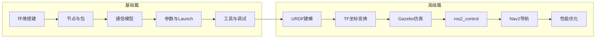

# ROS2入门与实践

## 前言

**C：** 本系列从零开始系统讲解 ROS 2，分为基础篇和高级篇。基础篇覆盖环境搭建、节点通信、参数启动等核心概念；高级篇深入 URDF 建模、Gazebo 仿真、ros2_control 硬件抽象、Nav2 导航、DDS 性能调优等进阶主题。无论你是刚入门还是有一定基础想深入，都能在这里找到系统的学习路径。

<!-- more -->

## 本册内容范围

### 基础篇

- 发行版选择与安装（Ubuntu 等）
- 工作空间、`colcon` 构建与包结构
- 通信模型：Topic / Service / Action
- 参数、launch 与生命周期
- 命令行工具与调试入门

### 高级篇

- URDF 机器人描述与 Xacro 参数化建模
- TF 坐标变换体系
- Gazebo 仿真环境搭建与调试
- ros2_control 硬件抽象与自定义接口
- Nav2 导航框架与 SLAM 建图
- DDS 中间件配置、实时性与性能优化

## 学习路线图

---

## 基础篇

### 第一组：环境搭建与入门

1. [ROS2 概述与发行版选择](/courses/ros2/01-环境搭建与入门/01-ROS2概述与发行版选择)
2. [ROS2 安装与开发环境搭建](/courses/ros2/01-环境搭建与入门/02-ROS2安装与开发环境搭建)
3. [工作空间与 colcon 构建系统](/courses/ros2/01-环境搭建与入门/03-工作空间与colcon构建系统)

### 第二组：节点与包结构

1. [ROS2 包结构与创建方法](/courses/ros2/02-节点与包结构/01-ROS2包结构与创建方法)
2. [第一个节点：编写与运行](/courses/ros2/02-节点与包结构/02-第一个节点编写与运行)
3. [节点生命周期管理](/courses/ros2/02-节点与包结构/03-节点生命周期管理)

### 第三组：通信模型

1. [话题（Topic）通信](/courses/ros2/03-通信模型/01-话题Topic通信)
2. [自定义消息与服务类型](/courses/ros2/03-通信模型/02-自定义消息与服务类型)
3. [服务（Service）通信](/courses/ros2/03-通信模型/03-服务Service通信)
4. [动作（Action）通信](/courses/ros2/03-通信模型/04-动作Action通信)

### 第四组：参数与启动

1. [参数系统](/courses/ros2/04-参数与启动/01-参数系统)
2. [Launch 文件编写](/courses/ros2/04-参数与启动/02-Launch文件编写)

### 第五组：工具与调试

1. [ROS2 命令行工具全览](/courses/ros2/05-工具与调试/01-ROS2命令行工具全览)
2. [rqt 可视化工具](/courses/ros2/05-工具与调试/02-rqt可视化工具)
3. [日志系统与问题排查](/courses/ros2/05-工具与调试/03-日志系统与问题排查)

---

## 高级篇

### 第六组：URDF 与机器人建模

1. [URDF 基础与机器人描述](/courses/ros2/06-URDF与机器人建模/01-URDF基础与机器人描述)
2. [Xacro 宏与参数化建模](/courses/ros2/06-URDF与机器人建模/02-Xacro宏与参数化建模)
3. [URDF 传感器插件与 Gazebo 标签](/courses/ros2/06-URDF与机器人建模/03-URDF传感器插件与Gazebo标签)

### 第七组：TF 坐标变换

1. [TF 坐标系与变换基础](/courses/ros2/07-TF坐标变换/01-TF坐标系与变换基础)
2. [TF2 编程实践](/courses/ros2/07-TF坐标变换/02-TF2编程实践)
3. [静态变换与 robot_state_publisher](/courses/ros2/07-TF坐标变换/03-静态变换与robot_state_publisher)

### 第八组：Gazebo 仿真入门

1. [Gazebo 仿真环境搭建](/courses/ros2/08-Gazebo仿真入门/01-Gazebo仿真环境搭建)
2. [Gazebo 世界构建与模型管理](/courses/ros2/08-Gazebo仿真入门/02-Gazebo世界构建与模型管理)
3. [Gazebo 仿真调试与常见问题](/courses/ros2/08-Gazebo仿真入门/03-Gazebo仿真调试与常见问题)

### 第九组：ros2_control 与硬件接口

1. [ros2_control 框架概述](/courses/ros2/09-ros2_control与硬件接口/01-ros2_control框架概述)
2. [自定义 Hardware Interface 编写](/courses/ros2/09-ros2_control与硬件接口/02-自定义Hardware-Interface编写)
3. [多控制器协作与常用控制器配置](/courses/ros2/09-ros2_control与硬件接口/03-多控制器协作与常用控制器配置)

### 第十组：导航系统 Nav2 入门

1. [Nav2 导航框架入门](/courses/ros2/10-导航系统Nav2入门/01-Nav2导航框架入门)
2. [SLAM 建图与地图管理](/courses/ros2/10-导航系统Nav2入门/02-SLAM建图与地图管理)
3. [Nav2 路径规划与调优](/courses/ros2/10-导航系统Nav2入门/03-Nav2路径规划与调优)

### 第十一组：实时性与性能优化

1. [DDS 中间件配置与调优](/courses/ros2/11-实时性与性能优化/01-DDS中间件配置与调优)
2. [ROS2 实时性支持与 PREEMPT_RT](/courses/ros2/11-实时性与性能优化/02-ROS2实时性支持与PREEMPT_RT)
3. [ROS2 性能分析与优化实战](/courses/ros2/11-实时性与性能优化/03-ROS2性能分析与优化实战)

---

## 学习建议

- ROS 2 与 ROS 1 不兼容，命令与工具链也不同，请按 ROS 2 文档学习。
- 版本（Humble、Iron、Jazzy 等）差异明显，示例会尽量注明发行版。
- 基础篇建议按顺序阅读，各章节之间有依赖关系。
- 高级篇可根据需要选择性阅读，但建议先完成基础篇。
- 每篇文章都包含可运行的代码示例，建议边看边动手实践。

::: tip 持续更新中

章节与示例会陆续补充；若你发现疏漏或与当前发行版不符之处，欢迎评论交流。

:::
