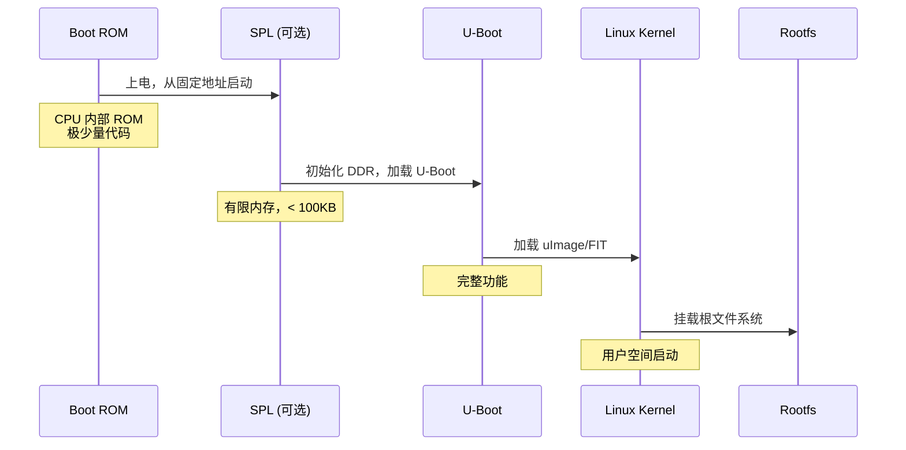

# U-Boot 概述与 Bootloader 基础

## 前言

**C：** 不管你用的是树莓派、NXP i.MX、Rockchip 还是全志的板子，上电之后第一个跑起来的软件（除了 CPU 内部固化的 ROM 代码）几乎都是 U-Boot。它虽然只是一个 Bootloader，但却是嵌入式 Linux 开发里绕不过去的关键一环。本篇先把 Bootloader 的概念和 U-Boot 的前世今生讲清楚，让你知道它"是什么、为什么、在整个启动链里处于什么位置"。

<!-- more -->

## 什么是 Bootloader

### 定义与作用

Bootloader（引导加载程序）是系统上电后运行的第一个"有意义的软件"。它的核心任务很简单：

1. **硬件初始化** — 配置 CPU 时钟、DDR、GPIO、串口等基本外设
2. **加载操作系统** — 从 Flash、SD 卡、网络等介质把内核镜像读到内存
3. **传递参数** — 把设备树（DTB）、命令行参数等交给内核
4. **跳转执行** — 把控制权交给内核的入口点

用一个类比：如果 Linux 内核是"厨师"，硬件是"厨房"，那 Bootloader 就是"帮厨"——它负责把食材（内核镜像）、菜谱（设备树）摆好，告诉厨师从哪里开始做菜。

### Bootloader 在启动链中的位置



对于大多数 SoC（如 i.MX6、RK3399），启动过程是：

**Boot ROM → SPL → U-Boot proper → Linux Kernel → Rootfs**

Boot ROM 是芯片厂商烧死在芯片内部的，不可修改。它做的事也很少：从 SD 卡/eMMC/NAND/SPI Flash 的固定位置加载第一段代码（通常是 SPL），然后跳过去。

### 嵌入式 Bootloader 简史

| 时代 | 代表 | 说明 |
|------|------|------|
| 早期 | RedBoot、Blob | 功能简单，ARM7/9 时代 |
| 2002 | Das U-Boot | Wolfgang Denk 创建，GPL 许可 |
| 2007+ | U-Boot 成为主流 | 支持架构和板子爆发式增长 |
| 2013+ | Driver Model (DM) 引入 | Tom Rini 主导，统一驱动框架 |
| 2020+ | U-Boot v2021+ | DM 全面铺开，SPL/TPL 成熟 |

## U-Boot 简介

### 什么是 U-Boot

U-Boot（全称 *Das U-Boot*，"the Universal Bootloader"）是当前嵌入式 Linux 领域最主流的开源 Bootloader，由 Wolfgang Denk 于 2002 年创建，采用 GPL-2.0 许可证。

核心特点：

- **多架构支持** — ARM、RISC-V、x86、MIPS、PowerPC 等
- **多平台覆盖** — 主流 SoC 厂商均有维护
- **丰富的命令集** — 串口交互，类似小型 shell
- **灵活的配置** — 环境变量驱动，启动脚本可编程
- **活跃的社区** — 由 DENX Software Engineering 和全球开发者维护

### U-Boot 的版本与分支

U-Boot 的版本命名规则是 `v年份.月份`，例如：

- `v2024.01` — 2024 年 1 月发布
- `v2024.04` — 2024 年 4 月发布

每个季度一个版本， maintained 分支会持续 backport 修复。

::: tip 笔者说

在实际项目中，大多数厂商不会直接用主线 U-Boot，而是基于某个版本 fork 出来打补丁（比如 NXP 的 `lf-6.6.y` 分支）。所以你看到的 U-Boot 代码往往是"主线 + 厂商 patch"的组合。

:::

### U-Boot 能做什么

除了基本的引导功能，U-Boot 还提供了很多实用能力：

| 功能 | 说明 |
|------|------|
| 串口 Shell | 交互式命令行，类似小型 Linux shell |
| 环境变量 | 存储启动参数、网络配置等 |
| 网络启动 | TFTP/NFS/DHCP/PXE |
| 设备树操作 | 读取、修改、加载 DTB |
| 多种文件系统 | FAT、ext4、JFFS2、UBIFS 等 |
| USB 支持 | USB Mass Storage、USB Ethernet |
| 安全特性 | FIT 签名验证、Secure Boot、TPM |
| 脚本编程 | `bootcmd` + `run` 实现启动逻辑 |

## ARM 启动流程与内存布局

### 典型 ARM 启动内存映射

以一个常见的 1GB DDR ARM64 平台为例：

```
地址范围                内容
───────────────────────────────
0x0000_0000             Boot ROM（芯片内部）
0x0008_0000             SPL 加载地址
0x4000_0000             U-Boot proper（DDR 起始）
0x4080_0000             设备树 (DTB)
0x4100_0000             Linux 内核
0x5000_0000             initramfs（可选）
0x8000_0000             根文件系统
```

::: warning 注意

以上地址只是示例，实际值取决于 SoC 和板子设计。i.MX6 的 DDR 起始地址是 `0x10000000`，RK3399 是 `0x60000000`，具体要看芯片手册。

:::

### 启动介质与启动顺序

大多数 SoC 支持多种启动介质，通过 Boot Mode 引脚（硬件拨码开关）选择：

| 启动介质 | 速度 | 典型用途 |
|----------|------|----------|
| eMMC | 快 | 产品量产 |
| SD 卡 | 中 | 开发调试 |
| SPI Flash | 快 | 工业设备 |
| NAND Flash | 中 | 大容量存储 |
| USB | 慢 | 紧急恢复 |
| 网络 (TFTP) | 取决于网速 | 量产烧录 |

## U-Boot 源码仓库

### 主线仓库

```
https://github.com/u-boot/u-boot.git
https://source.denx.de/u-boot/u-boot.git
```

### 厂商分支

- NXP: `https://github.com/nxp-imx/uboot-imx`
- Rockchip: `https://github.com/rockchip-linux/u-boot`
- Allwinner: `https://github.com/allwinner/linux-sunxi`（u-boot 子目录）
- TI: `https://git.ti.com/cgit/ti-u-boot/ti-u-boot.git`

::: tip 笔者说

如果你在做产品开发，建议优先用厂商维护的分支，主线 U-Boot 对特定 SoC 的支持不一定完善。如果你在学习，主线代码是最佳参考。

:::

## 准备工作

在开始下一篇的编译实战之前，确保你的开发环境有以下工具：

```bash
# 必需工具
sudo apt install build-essential git bc flex bison libssl-dev

# 交叉编译工具链（ARM64 示例）
sudo apt install gcc-aarch64-linux-gnu

# 或者使用 Linaro 工具链
wget https://releases.linaro.org/components/toolchain/binaries/latest-7/aarch64-linux-gnu/gcc-linaro-7.5-2019.12-x86_64_aarch64-linux-gnu.tar.xz
```

验证工具链：

```bash
aarch64-linux-gnu-gcc --version
# 或
${CROSS_COMPILE}gcc --version
```

## 小结

本篇我们建立了对 U-Boot 的全局认知：

- Bootloader 是硬件和操作系统之间的桥梁
- U-Boot 是嵌入式 Linux 的事实标准 Bootloader
- 典型启动链：Boot ROM → SPL → U-Boot → Kernel → Rootfs
- U-Boot 不仅仅是引导器，还提供了丰富的交互和调试能力

下一篇我们进入实战——获取 U-Boot 源码，配置并完成第一次交叉编译。

::: tip 持续更新中

章节与示例会陆续补充；若你发现疏漏或与当前版本不符之处，欢迎评论交流。

:::
