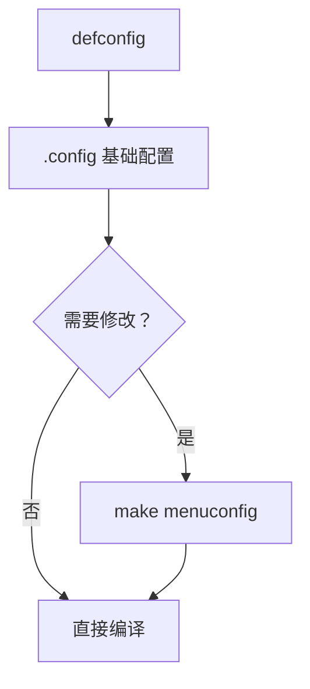

# U-Boot 源码获取与编译入门

## 前言

**C：** 上一篇我们把概念理清了，这一篇直接动手——克隆源码、选 defconfig、交叉编译，跑出你的第一个 `u-boot.bin`。编译 U-Boot 不需要目标硬件，全程在 PC 上完成。编译成功之后，你会对 U-Boot 的构建系统有一个直观的认识。

<!-- more -->

## 获取源码

### 克隆主线仓库

```bash
# 克隆主线（约 500MB）
git clone https://github.com/u-boot/u-boot.git
cd u-boot

# 如果网络慢，用浅克隆
git clone --depth 1 https://github.com/u-boot/u-boot.git
```

### 克隆厂商分支

以 NXP i.MX 为例：

```bash
# NXP imx 平台
git clone -b lf-6.6.36-2.1.0 https://github.com/nxp-imx/uboot-imx.git
cd uboot-imx

# Rockchip 平台
git clone -b next-dev https://github.com/rockchip-linux/u-boot.git
cd u-boot
```

### 源码目录概览（先有个印象）

```
u-boot/
├── arch/           # CPU 架构相关代码
│   ├── arm/        # ARM32
│   ├── arm64/      # ARM64（AArch64）
│   ├── riscv/      # RISC-V
│   └── x86/        # x86
├── board/          # 板级代码（各厂商、各板子）
├── boot/           # 启动镜像格式处理（legacy、FIT）
├── cmd/            # 命令实现（bootm、tftp、fatls 等）
├── common/         # 通用逻辑（autoboot、env、main_loop）
├── configs/        # defconfig 文件
├── doc/            # 文档
├── drivers/        # 所有驱动（MMC、USB、Net、GPIO...）
├── env/            # 环境变量存储实现
├── fs/             # 文件系统（FAT、ext4、UBIFS...）
├── include/        # 头文件
├── lib/            # 通用库函数
├── net/            # 网络协议栈
├── scripts/        # 构建脚本、Kconfig 工具
├── test/           # 单元测试
├── tools/          # 宿主机工具（mkimage 等）
├── Makefile        # 顶层 Makefile
└── .config         # 编译配置（make 后生成）
```

详细的目录结构我们在下一篇讲，这里先混个眼熟。

## 编译环境准备

### 安装依赖

```bash
# Ubuntu/Debian
sudo apt update
sudo apt install -y build-essential git bc bison flex \
    libssl-dev libncurses-dev python3 python3-pip \
    swig libpython3-dev device-tree-compiler

# ARM64 交叉编译工具链
sudo apt install -y gcc-aarch64-linux-gnu \
    binutils-aarch64-linux-gnu

# ARM32 交叉编译工具链
sudo apt install -y gcc-arm-linux-gnueabihf \
    binutils-arm-linux-gnueabihf
```

### 验证工具链

```bash
# ARM64
aarch64-linux-gnu-gcc --version

# ARM32
arm-linux-gnueabihf-gcc --version
```

推荐使用与目标平台匹配的工具链版本。一般 GCC 10~13 对 U-Boot 的支持最好。

## 选择 defconfig

### 什么是 defconfig

U-Boot 使用 Linux 内核相同的 Kconfig 构建系统。每个板子/平台有一个 `defconfig` 文件，定义了该平台的所有编译选项。

```bash
# 查看所有可用的 defconfig
ls configs/ | grep -i "defconfig" | wc -l
# 通常有 2000+ 个

# 常见平台的 defconfig
ls configs/ | grep -E "imx|rockchip|sunxi|rpi"
```

常见示例：

| 平台 | defconfig | 说明 |
|------|-----------|------|
| Raspberry Pi 4 | `rpi_4_defconfig` | ARM64 |
| Raspberry Pi 3 | `rpi_3_32b_defconfig` | ARM32 |
| NXP i.MX6Q | `mx6qsabresd_defconfig` | ARM32 |
| NXP i.MX8MM | `imx8mm_evk_defconfig` | ARM64 |
| Rockchip RK3399 | `evb-rk3399_defconfig` | ARM64 |
| Allwinner H3 | `sinovoip_bpi_m3_defconfig` | ARM32 |
| QEMU ARM64 | `qemu_arm64_defconfig` | 用于仿真 |

### 如何选对你的 defconfig

1. 知道板子型号 → 直接 `grep` 关键字：`ls configs/ | grep imx8mm`
2. 不知道板子型号但知道 SoC → 用评估板的 defconfig 作为起点
3. 完全从零开始 → 用相近平台的 defconfig 改

## 编译三步曲

### Step 1: 配置

```bash
# 设置交叉编译前缀
export CROSS_COMPILE=aarch64-linux-gnu-

# 使用 defconfig 生成 .config
make evb-rk3399_defconfig
```

这一步会从 `configs/evb-rk3399_defconfig` 生成 `.config` 文件。

### Step 2: 定制配置（可选）

```bash
# 打开图形化配置菜单
make menuconfig
```



常用配置选项：

| 路径 | 说明 |
|------|------|
| Device Drivers → USB support | 启用 USB 功能 |
| Device Drivers → Network device support | 启用网络驱动 |
| Library routines → SHA256/SHA384/SHA512 | FIT 签名验证需要 |
| Boot options → Android Boot Image | 启动 Android boot.img |

### Step 3: 编译

```bash
# 使用多线程编译（-j 参数）
make -j$(nproc)
```

编译产物：

```bash
ls -lh u-boot.bin u-boot-nodtb.bin u-boot.dtb u-boot.itb
```

| 文件 | 大小（约） | 说明 |
|------|-----------|------|
| `u-boot.bin` | 200~600KB | U-Boot 二进制（不含 DTB） |
| `u-boot-nodtb.bin` | 200~600KB | 不含 DTB 的裸二进制 |
| `u-boot.dtb` | 5~20KB | U-Boot 自己的设备树 |
| `u-boot.itb` | 200~700KB | FIT 格式镜像（含 DTB + U-Boot） |
| `u-boot.map` | — | 符号表，调试用 |
| `u-boot.srec` | — | S-Record 格式 |
| `spl/u-boot-spl.bin` | 10~80KB | SPL 镜像 |
| `tools/mkimage` | — | 宿主机工具，生成 FIT 镜像 |

::: warning 注意

编译出的 `u-boot.bin` 不能直接烧录到所有平台！不同 SoC 对 Bootloader 的格式要求不同：

- **i.MX**: 需要追加 IVT/DCD 头，使用 NXP 的 `mkimage` 工具
- **Rockchip**: 需要打包成 `u-boot.bin.rk3399` 格式
- **Allwinner**: 需要特定的包头格式

具体烧录方式在后续移植篇详细讲。

:::

## 使用 QEMU 验证编译结果

如果你手边没有硬件板子，可以用 QEMU 仿真验证：

```bash
# 安装 QEMU
sudo apt install qemu-system-arm

# 编译 QEMU ARM64 版本的 U-Boot
make clean
make qemu_arm64_defconfig
make -j$(nproc)

# 启动 QEMU 运行 U-Boot
qemu-system-aarch64 -machine virt -cpu cortex-a57 -nographic \
    -bios u-boot.bin
```

如果你能看到类似这样的输出，说明编译成功：

```
U-Boot 2024.04 (Apr 24 2026 - 10:00:00 +0800)

DRAM:  1 GiB
Core:  77 devices, 17 uclasses, devicetree: board
Flash: 64 MiB
Loading Environment from nowhere... OK
In:    serial@9000000
Out:   serial@9000000
Err:   serial@9000000
Net:   No ethernet found.
Hit any key to stop autoboot: 0
=>
```

`=>` 提示符表示 U-Boot 成功启动并进入了命令行。

## 清理与重新编译

```bash
# 清理所有编译产物（保留 .config）
make clean

# 完全清理（包括 .config）
make distclean

# 更高效的增量编译
make -j$(nproc)
```

## 常见编译问题

### 问题 1: 找不到交叉编译器

```
aarch64-linux-gnu-gcc: command not found
```

解决：

```bash
export CROSS_COMPILE=aarch64-linux-gnu-
# 确认工具链已安装
which aarch64-linux-gnu-gcc
```

### 问题 2: OpenSSL 版本不兼容

```
error: 'ERR_FUNC' undeclared
```

解决：U-Boot 需要 OpenSSL 1.1.x 或 3.x，检查版本：

```bash
openssl version
# 如果是 3.x 且报错，尝试升级 U-Boot 到较新版本
```

### 问题 3: flex/bison 版本问题

```
fatal error: y.tab.h: No such file or directory
```

解决：

```bash
sudo apt install flex bison
```

## 小结

本篇完成了 U-Boot 编译的完整流程：

- 源码获取（主线 + 厂商分支）
- 交叉编译环境搭建
- defconfig 选择与 menuconfig 定制
- 编译与产物说明
- QEMU 仿真验证

编译成功只是第一步，下一篇我们深入 U-Boot 的目录结构，搞清楚里面每一块代码"是什么、干什么"。

::: tip 持续更新中

章节与示例会陆续补充；若你发现疏漏或与当前版本不符之处，欢迎评论交流。

:::
