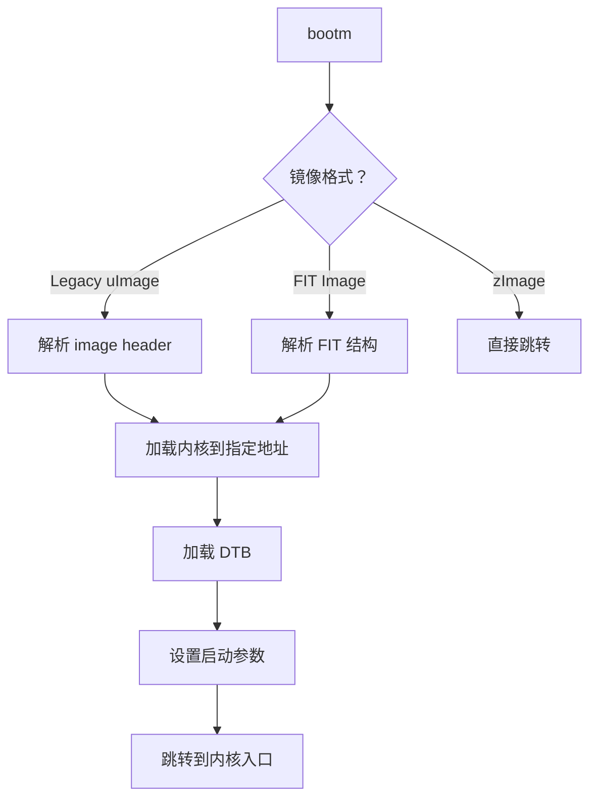
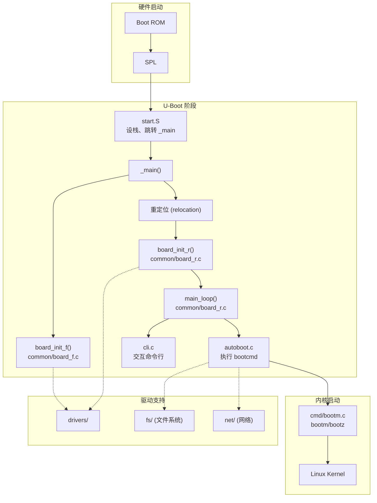

# U-Boot 目录结构与代码架构

## 前言

**C：** 上篇编译出了 `u-boot.bin`，但你可能对这个 600MB+ 的源码仓库还是一头雾水——几百个子目录、几千个文件，从哪看起？本篇带你做一次"源码导览"，把目录结构、核心文件、代码调用关系梳理清楚。这不会让你立刻成为 U-Boot 高手，但当你以后需要改一个驱动、加一个命令、移植一个板子的时候，能快速定位到正确的位置。

<!-- more -->

## 顶层目录总览

U-Boot 的目录组织遵循"按功能分目录"的原则，和 Linux 内核类似：

```
u-boot/
├── api/            # U-Boot 作为子系统被其他 OS 调用的 API
├── arch/           # ★ CPU 架构相关（最核心之一）
├── board/          # ★ 板级初始化代码
├── boot/           # ★ 启动镜像格式处理
├── cmd/            # ★ 命令实现
├── common/         # 通用逻辑
├── configs/        # ★ defconfig 文件
├── disk/           # 磁盘分区处理
├── doc/            # 文档
├── drivers/        # ★ 设备驱动
├── env/            # 环境变量存储
├── examples/       # API 使用示例
├── fs/             # 文件系统支持
├── include/        # ★ 头文件
├── lib/            # 通用库
├── net/            # 网络协议栈
├── post/           # 上电自检 (POST)
├── scripts/        # 构建脚本
├── test/           # 单元测试
└── tools/          # 宿主机工具
```

带 ★ 的是你最常打交道、也最需要了解的目录。

## arch/ — 架构相关代码

```
arch/
├── arm/
│   ├── cpu/                # CPU 通用代码
│   │   ├── armv7/          # ARMv7 (Cortex-A)
│   │   └── armv8/          # ARMv8 (AArch64)
│   ├── dts/                # 架构级设备树
│   ├── lib/                # 架构相关库（memcpy 等）
│   └── mach-*/             # SoC 厂商相关代码
│       ├── imx/            # NXP i.MX
│       ├── rockchip/       # Rockchip RK
│       ├── sunxi/          # Allwinner
│       └── ...
├── arm64/                  # ARM64 专用
├── riscv/                  # RISC-V
└── x86/                    # x86
```

关键文件：

| 文件/目录 | 说明 |
|-----------|------|
| `arch/arm/lib/start.S` | ARM32 入口点，reset vector |
| `arch/arm/cpu/armv8/start.S` | ARM64 入口点 |
| `arch/arm/mach-imx/` | i.MX 平台的低级初始化、时钟、DDR 配置 |
| `arch/arm/mach-rockchip/` | Rockchip 平台的低级初始化 |
| `arch/arm/lib/` | 架构相关工具函数 |

### 启动入口代码（以 ARM64 为例）

```assembly
// arch/arm/cpu/armv8/start.S（简化）
.global _start
_start:
    b   reset               // 跳转到 reset 处理

reset:
    /* 关中断、禁 MMU、设置处理器模式 */
    msr daifclr, #0xf
    mrs x0, mpidr_el1
    and x0, x0, #0xff
    cbz x0, master_cpu       // 只有主 CPU 继续

    /* 设置栈指针 */
    ldr x0, =_start
    sub sp, x0, #CONFIG_SYS_INIT_SP_ADDR

    /* 跳转到 C 代码 */
    bl  _main
```

## board/ — 板级代码

```
board/
├── freescale/
│   └── common/              # NXP 通用板级代码
│       └── imx/             # i.MX 通用
├── rockchip/
│   └── evb_rk3399/          # RK3399 评估板
│       ├── evb-rk3399.c     # 板级初始化入口
│       └── Kconfig
├── raspberrypi/
│   └── rpi/                 # 树莓派
└── ...
```

板级代码的核心文件是 `xxx.c`，实现 `board_init_f()` 和 `board_init_r()` 中的平台特定部分。

以 i.MX8MM EVK 为例：

```c
// board/freescale/imx8mm_evk/imx8mm_evk.c（简化）
int board_init(void)
{
    /* 初始化板级 GPIO */
    setup_fec();              // 配置以太网 PHY 复位引脚
    init_usb_clk();           // 配置 USB 时钟

    return 0;
}

int board_mmc_get_env_dev(int devno)
{
    /* 指定环境变量存储的 MMC 设备 */
    return devno;
}

int board_late_init(void)
{
    /* 晚期初始化：env 设置、显示启动设备 */
#ifdef CONFIG_ENV_VARS_UBOOT_RUNTIME_CONFIG
    env_set("board_name", "EVK");
    env_set("board_rev", "B0");
#endif
    return 0;
}
```

## cmd/ — 命令实现

每个命令对应一个 C 文件：

```
cmd/
├── boot.c          # bootm, bootz 命令
├── bootm.c         # bootm 旧格式镜像
├── tftp.c          # tftp 命令
├── nvedit.c        # printenv, setenv, saveenv
├── fat.c           # fatls, fatload, fatwrite
├── ext4.c          # ext4ls, ext4load
├── net.c           # ping, dhcp, nfs
├── gpio.c          # gpio 命令
├── i2c.c           # i2c 探测/读写
├── mem.c           # md, mw, mm, cmp
├── part.c          # partition 命令
├── source.c        # source 命令（执行脚本）
└── ...
```

命令注册方式（以 `hello` 为例）：

```c
// 自定义命令示例
#include <command.h>

static int do_hello(struct cmd_tbl *cmdtp, int flag, int argc,
                     char *const argv[])
{
    printf("Hello, U-Boot!\n");
    return 0;
}

U_BOOT_CMD(
    hello, 1, 1, do_hello,
    "print hello message",
    ""
);
```

## common/ — 通用逻辑

```
common/
├── board_f.c       # board_init_f() 汇总
├── board_r.c       # board_init_r() 汇总
├── autoboot.c      # 自动启动逻辑（bootcmd 倒计时）
├── cli.c           # 命令行解析器
├── main.c          # _main() 入口
├── splash.c        # 启动 Logo
└── ...
```

**`board_f.c`** 和 **`board_r.c`** 是理解 U-Boot 启动的关键文件，它们用"init sequence"机制把一堆初始化函数按顺序串联起来。

## boot/ — 启动镜像格式处理

```
boot/
├── image-fdt.c     # 设备树加载
├── image.c         # legacy image 头解析
├── bootm.c         # bootm 命令核心逻辑
├── bootm_os.c      # 各 OS 的启动适配
├── fdt_support.c   # FDT 支持（修复、追加）
└── pxe/            # PXE 网络启动
```

### 启动流程中的镜像处理



## drivers/ — 设备驱动

U-Boot 的驱动目录比 Linux 内核简洁得多：

```
drivers/
├── gpio/           # GPIO 驱动
├── i2c/            # I2C 驱动
├── mmc/            # eMMC/SD 驱动
├── mtd/            # NAND/NOR Flash
├── net/            # 网络驱动（eth, phy）
├── phy/            # PHY 驱动
├── pinctrl/        # 引脚复用
├── power/          # 电源管理（PMIC, regulator）
├── ram/            # RAM 盘
├── remoteproc/     # 远程处理器
├── reset/          # 复位控制器
├── serial/         # 串口驱动（UART）
├── spi/            # SPI 驱动
├── thermal/        # 温度传感器
├── timer/          # 定时器
├── usb/            # USB Host/Device/Gadget
├── video/          # 显示驱动（LCD, HDMI）
└── watchdog/       # 看门狗
```

::: tip 笔者说

U-Boot 的 Driver Model (DM) 框架要求所有新驱动按 `uclass → driver → device` 三层来写。旧的非 DM 驱动正在逐步迁移。写新驱动时一定要用 DM 框架，后面会专门讲。

:::

## include/ — 头文件

核心头文件：

| 头文件 | 说明 |
|--------|------|
| `include/configs/` | 板级配置头文件（旧式，正在迁移到 Kconfig） |
| `include/configs/*.h` | 每个板子的配置宏 |
| `include/common.h` | 通用头文件 |
| `include/command.h` | 命令注册宏 |
| `include/dm.h` | Driver Model 框架 |
| `include/fdtdec.h` | 设备树解析接口 |
| `include/env_internal.h` | 环境变量内部结构 |
| `include/image.h` | 镜像格式定义 |
| `include/asm/` | 架构相关头文件 |

## configs/ — defconfig 文件

每个 defconfig 对应一个板子的最小配置：

```bash
# 查看 RK3399 的 defconfig
cat configs/evb-rk3399_defconfig

# 内容示例
CONFIG_ARM=y
CONFIG_ARCH_ROCKCHIP=y
CONFIG_TARGET_EVB_RK3399=y
CONFIG_SPL_STACK_R_ADDR=0x600000
CONFIG_NR_DRAM_BANKS=1
CONFIG_ENV_SIZE=0x8000
CONFIG_DM=y
CONFIG_DM_GPIO=y
CONFIG_MMC=y
CONFIG_DM_MMC=y
CONFIG_RK3399=y
```

## 调用关系全景



## 小结

本篇对 U-Boot 源码做了一次全景导览：

- `arch/` — 架构相关，启动入口在这里
- `board/` — 板级初始化，移植时重点改的目录
- `cmd/` — 命令实现，扩展命令在这里加
- `common/` — 启动流程的骨架代码（board_f.c / board_r.c）
- `boot/` — 镜像解析与内核加载
- `drivers/` — 所有硬件驱动
- `configs/` — defconfig 编译配置

有了这个地图，下一篇我们就深入启动流程，看看从 `reset vector` 到 `boot Linux` 到底发生了什么。

::: tip 持续更新中

章节与示例会陆续补充；若你发现疏漏或与当前版本不符之处，欢迎评论交流。

:::
