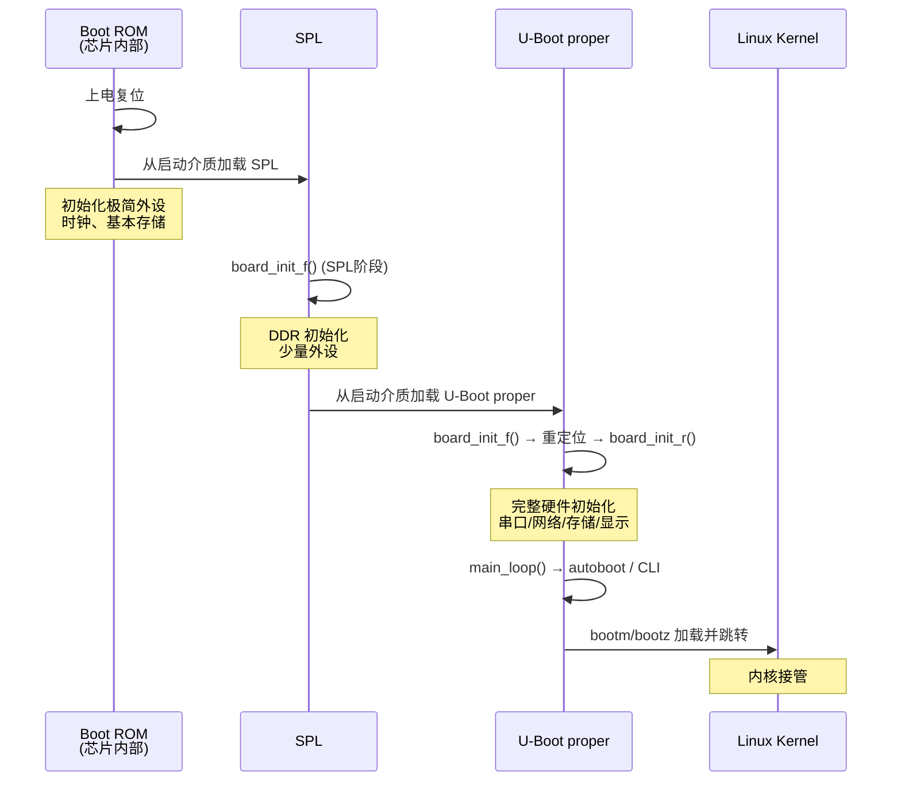
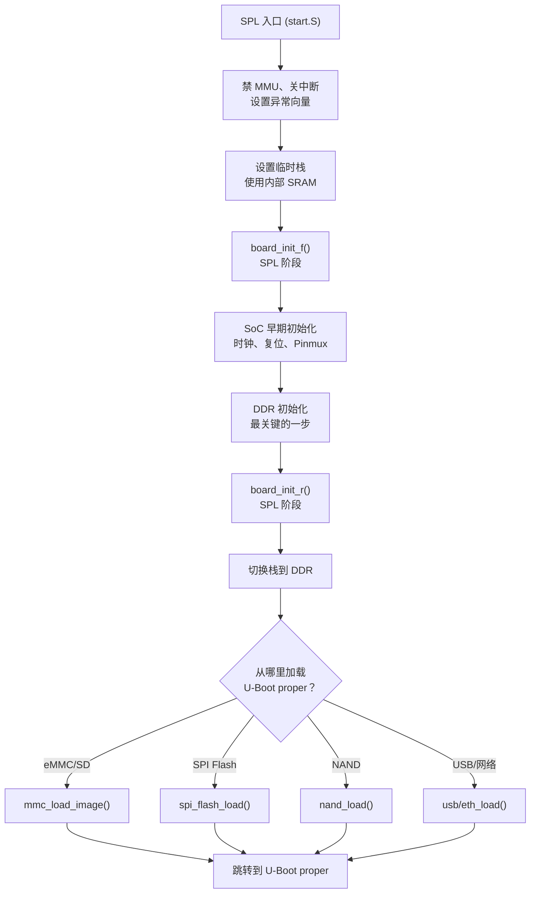
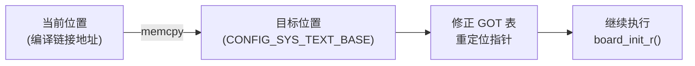
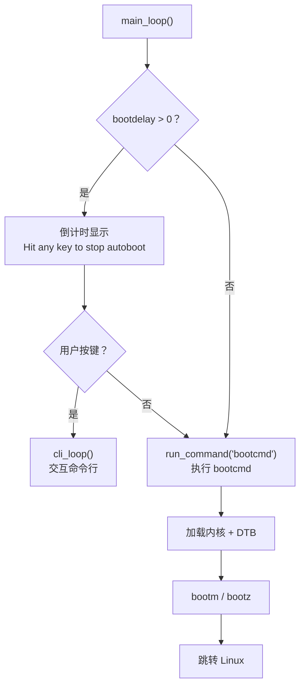

# U-Boot 启动流程详解

## 前言

**C：** 上篇我们看了源码地图，这篇就沿着"上电到启动内核"这条路走一遍。从 Boot ROM 到 SPL、从 board_init_f 到 board_init_r、从自动倒计时到 bootm 跳转内核——每一步都拆开讲清楚。理解启动流程是移植和调试 U-Boot 的基本功，因为出问题的时候你串口看到的第一个报错，往往就藏在某个初始化阶段里。

<!-- more -->

## 全局启动链回顾



## Stage 1: Boot ROM

这是芯片厂商烧死在芯片内部的代码，不可修改。做的事情非常有限：

1. **读取 Boot Mode 引脚** — 确定从哪个介质启动（SD/eMMC/SPI Flash/NAND/USB）
2. **初始化最基本的外设** — 内部 RC 振荡器时钟、引导接口（SDIO、SPI、USB 等）
3. **加载 SPL** — 从固定偏移地址读取 SPL 镜像到内部 SRAM
4. **校验（可选）** — CRC 或签名验证
5. **跳转** — 跳到 SPL 入口

::: tip 笔者说

Boot ROM 的启动顺序通常是：USB → SPI Flash → SD 卡 → eMMC → NAND。但具体顺序取决于 SoC 设计。有些芯片可以通过 efuse 永久锁定启动介质。

:::

## Stage 2: SPL (Secondary Program Loader)

### 为什么需要 SPL

大多数 SoC 的内部 SRAM 只有几十 KB，放不下完整的 U-Boot（200~600KB）。所以需要一个极小的"迷你 Bootloader"先跑起来，初始化 DDR，再加载完整 U-Boot。

SPL 的大小通常限制在 **64KB~128KB**（取决于 SoC 的 SRAM 大小）。

### SPL 启动流程



### SPL 关键代码

SPL 的入口同样在 `arch/arm/cpu/armv8/start.S`，但编译时通过条件编译只保留最小功能：

```c
// common/spl/spl.c（简化）
void spl_board_init(void)
{
    /* 板级 SPL 初始化 */
    board_init_f(GD_FLG_SPL_INIT);
}

// DDR 初始化在 SoC 专用代码中
// arch/arm/mach-rockchip/rk3399/sdram.c
// arch/arm/mach-imx/imx8m/ddr.c
```

### SPL 的 defconfig 控制

SPL 的功能通过 Kconfig 控制：

```
CONFIG_SPL=y                # 启用 SPL
CONFIG_SPL_TEXT_BASE=0x0    # SPL 加载地址
CONFIG_SPL_MAX_SIZE=0x40000 # SPL 最大 256KB
CONFIG_SPL_MMC_SUPPORT=y    # SPL 支持 MMC
CONFIG_SPL_FS_FAT=y         # SPL 支持 FAT 文件系统
CONFIG_SPL_DM=y             # SPL 中启用 Driver Model
```

## Stage 3: U-Boot Proper

U-Boot proper 是完整功能的 Bootloader，通常 200~600KB。它的启动分为两个大阶段：

### board_init_f() — 靠前的初始化（relocation 前）

这个阶段运行在**链接地址**（通常是 Flash 地址或 SRAM 地址），因为此时还没有搬到 DDR 的目标位置。

```c
// common/board_f.c（简化）
void board_init_f(ulong boot_flags)
{
    // 通过 init_sequence_f[] 函数数组逐步执行
    for (init_fnc_ptr = init_sequence_f;
         *init_fnc_ptr;
         init_fnc_ptr++) {
        if ((*init_fnc_ptr)() != 0)
            hang();  // 任何一步失败就挂死
    }
}
```

`init_sequence_f` 的典型顺序（简化）：

| 序号 | 函数 | 说明 |
|------|------|------|
| 1 | `fscache_init` | 快速缓存初始化 |
| 2 | `monitors` | 初始化 monitor 数据 |
| 3 | `announce_dram` | 打印 DRAM 大小 |
| 4 | `setup_reloc` | 计算重定位目标地址 |
| 5 | `reserve_*` | 预留内存区域（GD、栈、log 等） |
| 6 | `dram_init` | DRAM 初始化 |
| 7 | `timer_init` | 定时器初始化 |
| 8 | `console_init_f` | 早期串口初始化 |
| 9 | `board_early_init_f` | 板级早期初始化（时钟、Pinmux） |
| 10 | `env_init` | 环境变量初始化 |

### Relocation — 重定位

U-Boot 会把自己从当前位置复制到 DDR 的最终运行位置：



为什么要重定位？因为 SPL 把 U-Boot 加载到了任意地址，而 U-Boot 的代码需要运行在固定的链接地址上才能正确访问全局变量和函数指针。

::: warning 注意

重定位是 U-Boot 启动中最容易出问题的地方之一。如果 DDR 没初始化好、或者目标地址被其他东西占用了，重定位后就会跑飞。

:::

### board_init_r() — 重定位后的初始化

重定位完成后，U-Boot 在 DDR 的最终位置运行，可以访问完整功能：

| 序号 | 函数 | 说明 |
|------|------|------|
| 1 | `init_sequence_r[]` | 函数数组，逐步执行 |
| 2 | `setup_reloc` | 修正重定位后的全局数据指针 |
| 3 | `malloc_init` | 堆初始化（动态内存分配） |
| 4 | `console_init_r` | 完整串口初始化 |
| 5 | `interrupt_init` | 中断控制器初始化 |
| 6 | `env_relocate` | 环境变量重定位 |
| 7 | `stdio_init` | 标准输入输出设备注册 |
| 8 | `jumptable_init` | 跳转表初始化 |
| 9 | `board_init` | 板级初始化（网口 PHY、USB 等） |
| 10 | `board_late_init` | 板级晚期初始化 |

### main_loop() — 主循环

```c
// common/board_r.c（简化）
void main_loop(void)
{
    cli_init();
    s = env_get("bootdelay");

    // 倒计时：如果有按键输入则进入命令行
    if (tstc()) {
        /* 用户按了键，进入 CLI */
        cli_loop();
    } else {
        /* 倒计时结束，自动执行 bootcmd */
        process_boot_delay();
    }
}
```



## Stage 4: 内核加载与跳转

### bootcmd 详解

`bootcmd` 是 U-Boot 环境变量中最关键的变量，定义了自动启动的命令序列：

```bash
# 典型 bootcmd（MMC 启动）
setenv bootcmd 'mmc dev 1; fatload mmc 1:1 ${kernel_addr_r} Image; fatload mmc 1:1 ${fdt_addr_r} rk3399-evb.dtb; booti ${kernel_addr_r} - ${fdt_addr_r}'

# 典型 bootcmd（网络 TFTP 启动）
setenv bootcmd 'dhcp ${kernel_addr_r} uImage; dhcp ${fdt_addr_r} board.dtb; bootm ${kernel_addr_r} - ${fdt_addr_r}'

# SD 卡 + ext4 启动
setenv bootcmd 'setenv devnum 0; setenv devtype mmc; run load_kernel; run load_fdt; run boot_linux'
```

### bootargs — 传给内核的参数

```bash
setenv bootargs 'console=ttymxc0,115200 root=/dev/mmcblk1p2 rootwait rw earlycon'
```

常用参数：

| 参数 | 说明 |
|------|------|
| `console=ttymxc0,115200` | 串口控制台 |
| `root=/dev/mmcblk1p2` | 根文件系统设备 |
| `rootwait` | 等待设备就绪 |
| `rootfstype=ext4` | 文件系统类型 |
| `rdinit=/init` | initramfs 的 init 程序 |
| `earlycon` | 内核早期串口输出 |
| `loglevel=8` | 日志级别（0-7，7 最详细） |
| `quiet` | 减少内核启动输出 |
| `panic=5` | 内核 panic 后 5 秒重启 |

### bootm vs bootz vs booti

| 命令 | 镜像格式 | 说明 |
|------|----------|------|
| `bootm` | Legacy uImage | 64 字节头 + 内核 |
| `bootz` | zImage | ARM32 压缩镜像 |
| `booti` | Image | ARM64 未压缩镜像 |

用法：

```bash
# booti: ARM64 标准用法
booti ${kernel_addr_r} - ${fdt_addr_r}
#         内核地址       ramdisk(无)  设备树地址

# bootz: ARM32 标准用法
bootz ${kernel_addr_r} ${ramdisk_addr_r} ${fdt_addr_r}
#         内核地址        ramdisk地址    设备树地址

# bootm: Legacy 格式
bootm ${kernel_addr_r} ${ramdisk_addr_r} ${fdt_addr_r}
```

## 启动时间线总结

```
时间轴    阶段                  耗时（典型）
─────────────────────────────────────────
  0ms     Boot ROM               ~10ms
 10ms     SPL 入口               ~5ms
 15ms     DDR 初始化             ~100~500ms
 200ms    加载 U-Boot proper     ~50ms
 250ms    U-Boot 初始化          ~200ms
 450ms    bootcmd 执行           ~100ms
 550ms    内核解压/启动           ~500ms
  1s+     内核接管
```

## TPL (Tertiary Program Loader)

在某些 SoC 上，SPL 本身也太大（SRAM < 32KB），需要在 SPL 前面再加一级 TPL：

```
Boot ROM → TPL → SPL → U-Boot proper → Kernel
```

TPL 极其精简，通常只做最基本的 SRAM 初始化，然后加载 SPL。目前主要在 Rockchip 和少量其他平台上使用。

## 常见启动失败排查

| 现象 | 可能原因 | 排查方法 |
|------|----------|----------|
| 串口无任何输出 | Boot ROM 没找到 SPL | 检查启动介质拨码开关 |
| SPL hang | DDR 初始化失败 | 检查 DDR 型号、配置 |
| `### ERROR ### Please RESET` | U-Boot 重定位失败 | 检查 TEXT_BASE 是否被占用 |
| `bad header magic` | 镜像格式不匹配 | 检查是否用对了 bootm/bootz/booti |
| `Wrong Image Format` | 内核镜像损坏 | 重新编译/下载内核 |
| `FDT not found` | 设备树地址错误 | 检查 fdt_addr_r |

## 小结

本篇完整梳理了 U-Boot 的启动流程：

- Boot ROM → SPL → U-Boot proper → Kernel 四级启动链
- SPL 的核心任务：初始化 DDR，加载完整 U-Boot
- U-Boot proper 两阶段：board_init_f() → relocation → board_init_r()
- main_loop() 实现自动启动和命令行交互
- bootcmd + bootargs 控制内核加载和参数传递
- bootm/bootz/booti 对应不同镜像格式

下一篇我们深入 U-Boot 的命令系统，看看它内置了哪些命令，以及如何自定义命令。

::: tip 持续更新中

章节与示例会陆续补充；若你发现疏漏或与当前版本不符之处，欢迎评论交流。

:::
