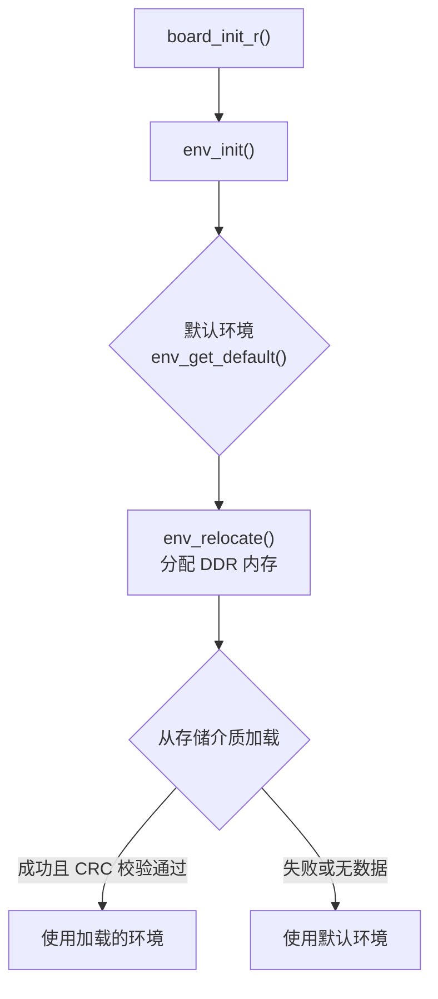

# U-Boot 环境变量系统

## 前言

**C：** U-Boot 的环境变量就像一个小型配置数据库——启动参数、IP 地址、MAC 地址、启动命令序列全都存在里面。而且它比你想的更灵活：支持默认值、持久化存储、运行时修改、甚至回调函数。本篇把环境变量的方方面面讲透，让你彻底搞明白那些 `setenv` / `printenv` / `saveenv` 背后的机制。

<!-- more -->

## 环境变量基础

### 什么是环境变量

环境变量是 **key=value** 形式的字符串集合，存储在 U-Boot 的一个专用内存区域中。启动时加载，运行时可以读取和修改，修改后保存到存储介质下次启动仍然有效。

### 基本操作

```bash
# 打印所有环境变量
printenv

# 打印单个变量
printenv bootargs

# 设置变量
setenv bootargs 'console=ttymxc0,115200 root=/dev/mmcblk1p2 rootwait'

# 删除变量（设置为空即可删除）
setenv my_var

# 保存到存储介质
saveenv

# 查询变量是否存在（$? 返回值）
printenv nonexistent_var; echo $?
# 返回 1 表示不存在
```

### 变量引用

```bash
# 引用变量（在命令中使用）
echo ${bootargs}
echo ${kernel_addr_r}

# 在 bootcmd 中引用
setenv bootcmd 'fatload mmc 0:1 ${kernel_addr_r} Image; booti ${kernel_addr_r} - ${fdt_addr_r}'

# 嵌套引用（不太常见但支持）
setenv addr '0x40800000'
setenv cmd 'echo ${addr}'
run cmd    # 输出 0x40800000
```

## 默认环境变量

U-Boot 编译时内置了一组默认环境变量，定义在板级配置或 env 目录中：

```c
// include/configs/evb_rk3399.h（旧式，正在迁移到 env/）
#define CONFIG_EXTRA_ENV_SETTINGS \
    "fdt_high=0xffffffffffffffff\0"   \
    "initrd_high=0xffffffffffffffff\0" \
    "kernel_addr_r=0x04000000\0"      \
    "fdt_addr_r=0x01e00000\0"         \
    "scriptaddr=0x00500000\0"         \
    "pxefile_addr_r=0x00700000\0"     \
    "ramdisk_addr_r=0x06000000\0"
```

现代 U-Boot 使用独立的环境文件：

```c
// board/rockchip/evb_rk3399/evb-rk3399.env
fdt_high=0xffffffffffffffff
initrd_high=0xffffffffffffffff
kernel_addr_r=0x04000000
fdt_addr_r=0x01e00000
kernel_comp_addr_r=0x08000000
kernel_comp_size=0x2000000
```

### 常见默认变量

| 变量 | 典型值 | 说明 |
|------|--------|------|
| `bootdelay` | `2` 或 `3` | 自动启动倒计时（秒） |
| `bootcmd` | — | 自动执行的命令序列 |
| `bootargs` | — | 传给内核的命令行参数 |
| `baudrate` | `115200` | 串口波特率 |
| `ethaddr` | `00:04:9f:xx:xx:xx` | MAC 地址 |
| `ipaddr` | — | 本机 IP |
| `serverip` | — | TFTP 服务器 IP |
| `gatewayip` | — | 网关 IP |
| `netmask` | `255.255.255.0` | 子网掩码 |
| `stdin` | `serial` | 标准输入设备 |
| `stdout` | `serial` | 标准输出设备 |
| `stderr` | `serial` | 标准错误设备 |
| `kernel_addr_r` | `0x40800000` | 内核加载地址 |
| `fdt_addr_r` | `0x44000000` | 设备树加载地址 |
| `ramdisk_addr_r` | `0x46000000` | initramfs 加载地址 |
| `fdt_high` | `0xffffffff` | DTB 加载位置限制 |
| `initrd_high` | `0xffffffff` | initrd 加载位置限制 |
| `verify` | `yes` | 是否校验 FIT 镜像签名 |

## 环境变量存储介质

U-Boot 支持多种存储后端：

### FAT 文件系统（最常用）

```c
// defconfig
CONFIG_ENV_IS_IN_FAT=y
CONFIG_ENV_FAT_INTERFACE="mmc"
CONFIG_ENV_FAT_DEVICE_AND_PART="0:1"
CONFIG_ENV_FAT_FILE="uboot.env"
```

环境变量存储为 FAT 分区上的一个普通文件 `uboot.env`。优点：方便读写，可以用 PC 直接修改。

### MMC/eMMC

```c
CONFIG_ENV_IS_IN_MMC=y
CONFIG_ENV_OFFSET=0x800000     // 偏移地址
CONFIG_ENV_SIZE=0x8000         // 32KB
CONFIG_ENV_SECT_SIZE=0x8000    // 擦除单位
```

### SPI Flash

```c
CONFIG_ENV_IS_IN_SPI_FLASH=y
CONFIG_ENV_OFFSET=0x3F8000
CONFIG_ENV_SIZE=0x8000
CONFIG_ENV_SECT_SIZE=0x10000
```

### NAND Flash

```c
CONFIG_ENV_IS_IN_NAND=y
CONFIG_ENV_OFFSET=0x300000
CONFIG_ENV_SIZE=0x20000
CONFIG_ENV_SIZE_REDUND=0x20000   // 冗余副本
```

### EEPROM

```c
CONFIG_ENV_IS_IN_EEPROM=y
CONFIG_ENV_OFFSET=0
CONFIG_ENV_SIZE=0x1000
```

### 存储方式对比

| 介质 | 优点 | 缺点 | 典型场景 |
|------|------|------|----------|
| FAT 文件 | 方便修改，PC 可读写 | 依赖文件系统 | 开发板、SD 卡启动 |
| eMMC 偏移 | 独立于文件系统 | 需要知道偏移 | 产品量产 |
| SPI Flash | 掉电可靠 | 大小受限 | 工业设备 |
| NAND | 大容量 | 需要处理坏块 | 大容量存储 |
| EEPROM | 可靠、独立 | 容量小 | 小型设备 |

::: warning 注意

同一时间只能选择一种环境存储后端（由 Kconfig 控制）。如果需要切换，需要修改 defconfig 重新编译。

:::

## 环境变量的内存布局


- **CRC32**：保护整个环境数据区
- **标志位**：标记环境是否有效
- **数据区**：所有 key=value 对，以 `\0` 分隔，末尾额外 `\0`
- **环境最大大小**由 `CONFIG_ENV_SIZE` 决定，通常 4KB~128KB

### 环境加载流程



## 环境回调和钩子函数

U-Boot 支持在环境变量变化时执行回调函数：

```c
// 注册回调
int env_callback_register(const char *name, env_callback_t callback);

// 示例：当 baudrate 变化时，重新初始化串口
static int on_baudrate(const char *name, const char *value, int env_op)
{
    if (env_op == env_op_delete)
        return 0;
    /* 重新设置串口波特率 */
    gd->baudrate = simple_strtoul(value, NULL, 10);
    serial_setbrg();
    return 0;
}

U_BOOT_ENV_CALLBACK(baudrate, on_baudrate);
```

常用的内置回调：

| 变量 | 回调 | 说明 |
|------|------|------|
| `baudrate` | 重设串口波特率 | 修改后立即生效 |
| `loadaddr` | 更新默认加载地址 | 自动同步相关变量 |
| `bootretry` | 修改重试行为 | 控制自动重试次数 |
| `netmask` | 重新配置网络 | 更新子网掩码 |

## 冗余环境（Redundant Environment）

在产品环境中，环境变量的完整性至关重要。U-Boot 支持冗余环境存储：

```c
CONFIG_ENV_OFFSET_REDUND = 0x900000   // 第二份副本偏移
```

工作原理：


每次 `saveenv` 时，U-Boot 会更新两个副本并标记序列号，确保即使写入中途掉电，至少有一份是有效的。

## 环境变量高级技巧

### 使用 filesize 变量

加载文件后，U-Boot 自动设置 `filesize` 变量为文件大小：

```bash
fatload mmc 0:1 ${kernel_addr_r} Image
echo "Loaded ${filesize} bytes"

# 用 filesize 传给下一个命令
booti ${kernel_addr_r} ${initrd_addr}:${filesize} ${fdt_addr_r}
```

### 动态 bootcmd

```bash
# 根据启动设备自动选择
setenv bootcmd 'run distro_bootcmd'

setenv distro_bootcmd '
    for dev in mmc usb; do
        if ${dev} dev ${devnum}; then
            if fatload ${dev} ${devnum}:1 ${scriptaddr} boot.scr; then
                source ${scriptaddr};
            fi;
        fi;
    done;
'
```

### 使用 askenv 交互输入

```bash
# U-Boot 中交互式询问
askenv -t 10 ethaddr    # 10 秒超时，输入 MAC 地址
askenv hostname          # 询问主机名
```

### env import / export

```bash
# 从内存地址导入环境变量
# 格式：key=value\0key=value\0\0
env import -t ${addr} ${size}

# 导出环境变量到内存
env export -t ${addr}

# 导入为纯文本格式（脚本）
env import -b ${addr} ${size}
```

## 常见问题与排查

### 1. saveenv 失败

```
Saving Environment to MMC...
Writing to MMC(0)... ** ERROR **
```

原因：存储介质写保护、偏移地址错误、分区只读。

解决：
```bash
# 检查 MMC 是否写保护
mmc dev 0; mmc info

# 检查环境配置
printenv env_addr
printenv env_size
```

### 2. 环境变量丢失

每次启动都恢复为默认值。原因：saveenv 没执行成功，或存储介质上的环境区被擦除。

### 3. 环境变量大小不够

```
## Error: environment is too large (xxx > yyy bytes)
```

解决：增大 `CONFIG_ENV_SIZE`，或者精简环境变量。

### 4. CRC 校验失败

```
Warning - bad CRC, using default environment
```

首次烧录后的正常现象，执行一次 `saveenv` 即可。

## 小结

本篇深入讲解了 U-Boot 的环境变量系统：

- 基本操作：printenv / setenv / saveenv
- 存储后端：FAT / MMC / SPI Flash / NAND / EEPROM
- 默认环境：编译时内置 + env 文件
- 冗余环境：双副本保护，防止掉电损坏
- 回调函数：变量变化时自动触发动作
- 高级技巧：filesize 自动变量、askenv 交互、env import/export

下一篇我们进入进阶实践篇，首先讲解设备树在 U-Boot 中的使用。

::: tip 持续更新中

章节与示例会陆续补充；若你发现疏漏或与所用 U-Boot 版本不符之处，欢迎评论交流。

:::
