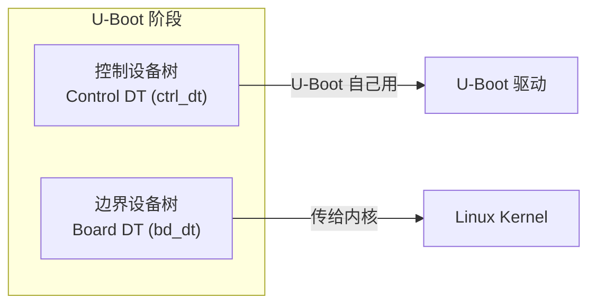
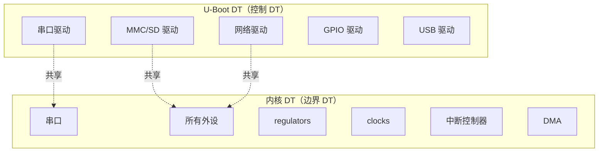

# 设备树在 U-Boot 中的使用

## 前言

**C：** 设备树（Device Tree）是内核和 Bootloader 之间的"硬件描述契约"——内核通过它知道板子上有什么外设、挂在哪个地址、怎么配置。U-Boot 不仅要加载设备树给内核，自己也要用设备树来驱动硬件。本篇把 U-Boot 中设备树的加载、修改、传递机制讲清楚，顺便聊聊 U-Boot 和内核在设备树上的"分工"。

<!-- more -->

## 设备树基础回顾

### 什么是设备树

设备树（DT/DTB/FDT）是一种树形数据结构，用源文件（DTS）描述硬件：

```dts
// 简化示例
/dts-v1/;

/ {
    model = "My Board";
    compatible = "vendor,my-board";

    chosen {
        stdout-path = &uart0;
    };

    soc {
        uart0: serial@fe650000 {
            compatible = "rockchip,rk3399-uart", "snps,dw-apb-uart";
            reg = <0x0 0xfe650000 0x0 0x100>;
            clocks = <&cru SCLK_UART0>;
            status = "okay";
        };
    };
};
```

### 设备树文件类型

| 后缀 | 说明 | 用途 |
|------|------|------|
| `.dts` | 源文件 | 手写，描述硬件 |
| `.dtsi` | 源文件（包含） | SoC 公共部分，被 .dts include |
| `.dtb` | 编译产物（二进制） | 内核和 U-Boot 加载的格式 |
| `.dtbo` | 设备树覆盖 | 运行时动态修改用 |

编译命令：

```bash
dtc -I dts -O dtb -o board.dtb board.dts
# 或在内核/U-Boot 的 Makefile 中自动编译
```

## U-Boot 中的设备树控制模型（CTRL DT）

### 两棵设备树

U-Boot 运行时实际上维护着**两棵**设备树：



1. **控制设备树（Control DT）**：U-Boot 编译时内置的或启动时加载的设备树，U-Boot 自己用它来初始化硬件
2. **边界设备树（Board DT）**：专门传给内核的设备树，可能与控制设备树不同

### 设备树配置选项

```c
CONFIG_OF_CONTROL=y         // 启用 DT 控制模型（DM 必需）
CONFIG_OF_SEPARATE=y        // U-Boot DT 和内核 DT 分离
CONFIG_DEFAULT_DEVICE_TREE="rk3399-evb"  // 默认设备树文件名
```

## U-Boot 加载设备树的方式

### 方式 1：编译时内置

设备树被直接链接进 U-Boot 二进制：

```c
CONFIG_OF_EMBED=y
// dtb 被打包到 u-boot.bin 中
// 适用：简单场景，但不推荐（会增大 U-Boot 体积）
```

### 方式 2：打包成 FIT 镜像（推荐）

U-Boot 和 DTB 一起打包到 FIT（Flattened Image Tree）镜像中：

```bash
# its 文件
cat > fit.its << 'EOF'
/dts-v1/;

/ {
    description = "U-Boot FIT image";
    images {
        uboot {
            description = "U-Boot";
            data = /incbin/("u-boot-nodtb.bin");
            type = "firmware";
            arch = "arm64";
            os = "u-boot";
            compression = "none";
        };
        fdt {
            description = "Device Tree";
            data = /incbin/("u-boot.dtb");
            type = "flat_dt";
            arch = "arm64";
            compression = "none";
        };
    };
    configurations {
        default = "conf";
        conf {
            firmware = "uboot";
            fdt = "fdt";
        };
    };
};
EOF

mkimage -f fit.its u-boot.itb
```

### 方式 3：运行时从存储加载

```bash
# 从 FAT 分区加载
fatload mmc 0:1 ${fdt_addr_r} rk3399-evb.dtb

# 从 TFTP 加载
tftp ${fdt_addr_r} rk3399-evb.dtb

# 从 SPI Flash 加载
sf probe 0; sf read ${fdt_addr_r} 0x100000 0x10000
```

## U-Boot 对设备树的修改

U-Boot 在把设备树传给内核之前，经常需要动态修改它。这是 U-Boot 设备树支持的核心功能。

### 修改 chosen 节点（bootargs）

```bash
# 设置 DTB 地址
fdt addr ${fdt_addr_r}

# 设置 bootargs
fdt set /chosen bootargs 'console=ttymxc0,115200 root=/dev/mmcblk1p2 rootwait'

# 设置 initrd 起始和结束地址
fdt set /chosen linux,initrd-start <${initrd_addr}>
fdt set /chosen linux,initrd-end <${initrd_end}>
```

### 修改设备状态

```bash
# 禁用一个设备
fdt set /soc/uart@fe660000 status "disabled"

# 启用一个设备
fdt set /soc/uart@fe660000 status "okay"

# 修改兼容字符串
fdt set /soc/eth@fe300000 compatible "vendor,my-eth", "snps,dwmac"
```

### 创建/删除节点

```bash
# 创建新节点
fdt mknode /soc my-device
fdt set /soc/my-device compatible "vendor,my-device"
fdt set /soc/my-device reg <0x0 0xff000000 0x0 0x1000>
fdt set /soc/my-device status "okay"

# 删除节点
fdt rm /soc/old-device
```

### 应用设备树覆盖（Overlay）

```bash
# 加载 overlay dtbo
fatload mmc 0:1 ${overlay_addr} my-overlay.dtbo

# 应用到基础 dtb
fdt addr ${fdt_addr_r}
fdt resize 4096              # 先扩大 DTB 空间
fdt apply ${overlay_addr}    # 应用 overlay
```

### 通过环境变量自动修改

U-Boot 支持在内核启动时自动修改设备树：

```c
// defconfig
CONFIG_OF_BOARD_SETUP=y      // 启用板级 setup 修改
```

板级代码中的修改入口：

```c
// board/myboard/myboard.c
int ft_board_setup(void *blob, struct bd_info *bd)
{
    /* 修改 MAC 地址 */
    fdt_fixup_ethernet(blob);

    /* 修改内存节点 */
    fdt_fixup_memory_banks(blob, bd->bi_dram,
                           bd->bi_dram[0].size / CONFIG_NR_DRAM_BANKS);

    /* 添加板级信息 */
    fdt_add_mem_rsv(blob, 0x40000000, 0x1000);

    return 0;
}
```

## U-Boot 与内核设备树的分工



### 关键区别

| 方面 | U-Boot DT | 内核 DT |
|------|-----------|----------|
| 目的 | 驱动 U-Boot 自身硬件 | 描述所有硬件给内核 |
| 完整性 | 只需 U-Boot 用到的节点 | 需要所有外设节点 |
| 来源 | 编译时内置或单独加载 | 单独的 DTB 文件 |
| 修改 | U-Boot 可动态修改 | 通常不修改（只读） |

::: tip 笔者说

在开发中，U-Boot DT 和内核 DT 通常是**同一个文件**，只是 U-Boot 只解析它需要的节点。但如果 U-Boot 和内核对同一设备有不同需求，也可以分别维护。

:::

## 设备树在启动流程中的位置

```
bootcmd 执行
    ↓
加载 DTB 到 ${fdt_addr_r}
    ↓
fdt addr ${fdt_addr_r}        # 设置 DTB 工作地址
    ↓
fdt resize                    # 扩展 DTB（预留修改空间）
    ↓
fdt set /chosen bootargs ...  # 修改 bootargs
    ↓
[可选] fdt apply overlay      # 应用 overlay
    ↓
[可选] ft_board_setup()       # 板级代码修改
    ↓
booti ${kernel_addr_r} - ${fdt_addr_r}   # 传 DTB 地址给内核
```

## 常见设备树问题排查

### 1. DTB 地址未设置

```
## Flattened Device Tree blob at wrong address
```

解决：确保在 bootm/bootz/booti 前设置了正确的 DTB 地址。

### 2. DTB 空间不够

```
fdt_setprop: FDT_ERR_NOSPACE
```

解决：在修改前先 `fdt resize` 扩大空间。

```bash
fdt addr ${fdt_addr_r}
fdt resize 4096    # 增加 4KB 空间
```

### 3. 节点路径错误

```
fdt_setprop: FDT_ERR_NOTFOUND
```

解决：先用 `fdt list` 查看节点路径：

```bash
fdt list /soc
fdt list /
fdt print /chosen
```

### 4. fdt 命令不存在

说明编译时没有启用 FDT 支持：

```
CONFIG_OF_LIBFDT=y
```

## 设备树调试工具

### 在 U-Boot 中查看

```bash
# 设置 DTB 地址
fdt addr ${fdt_addr_r}

# 列出所有节点
fdt list /

# 列出指定节点
fdt list /soc

# 打印节点详细信息
fdt print /chosen
fdt print /soc/serial@fe650000

# 搜索节点
fdt find /soc/serial@fe650000
```

### 在 Linux 中查看

```bash
# 查看内核加载的设备树
ls /proc/device-tree/

# 查看具体属性
cat /proc/device-tree/chosen/bootargs
cat /proc/device-tree/model

# 反编译 DTB
dtc -I dtb -O dts /sys/firmware/devicetree/base -o output.dts

# 使用 fdtdump
fdtdump board.dtb
```

## 小结

本篇详细讲解了设备树在 U-Boot 中的使用：

- U-Boot 维护两棵设备树：控制 DT 和边界 DT
- 加载方式：编译内置、FIT 打包、运行时加载
- fdt 命令族：动态修改 chosen、status、节点属性
- 设备树覆盖（overlay）机制
- U-Boot 与内核在设备树上的分工
- ft_board_setup() 板级修改入口

下一篇我们进入 U-Boot 的 Driver Model（DM）框架，这是现代 U-Boot 驱动开发的基础。

::: tip 持续更新中

章节与示例会陆续补充；若你发现疏漏或与所用 U-Boot 版本不符之处，欢迎评论交流。

:::
