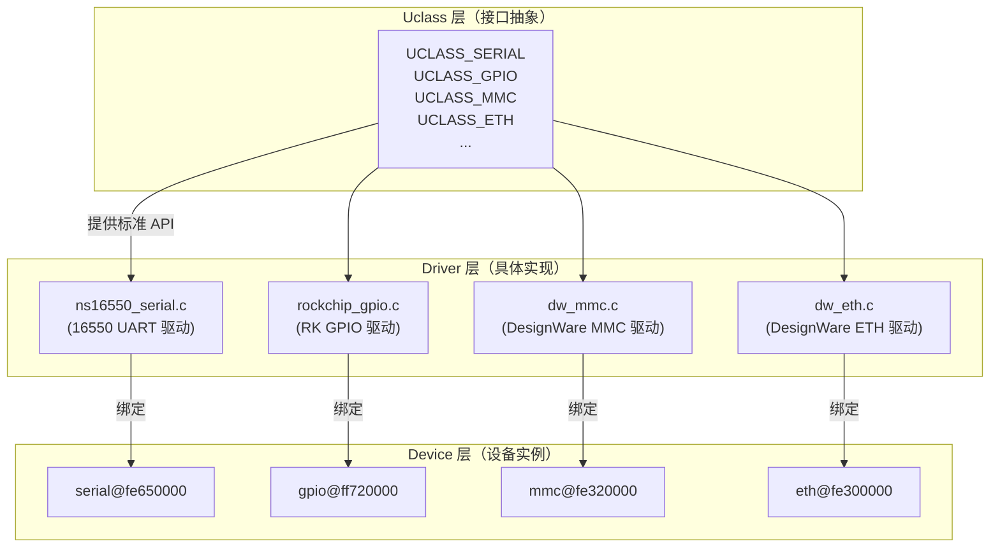
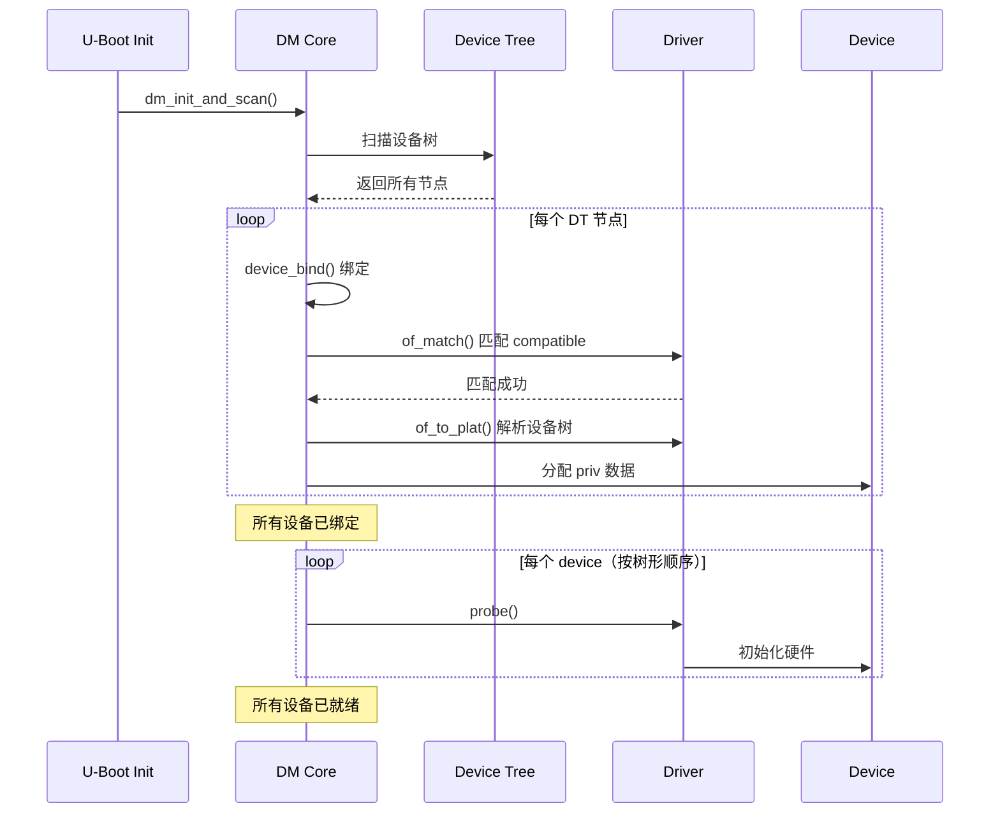
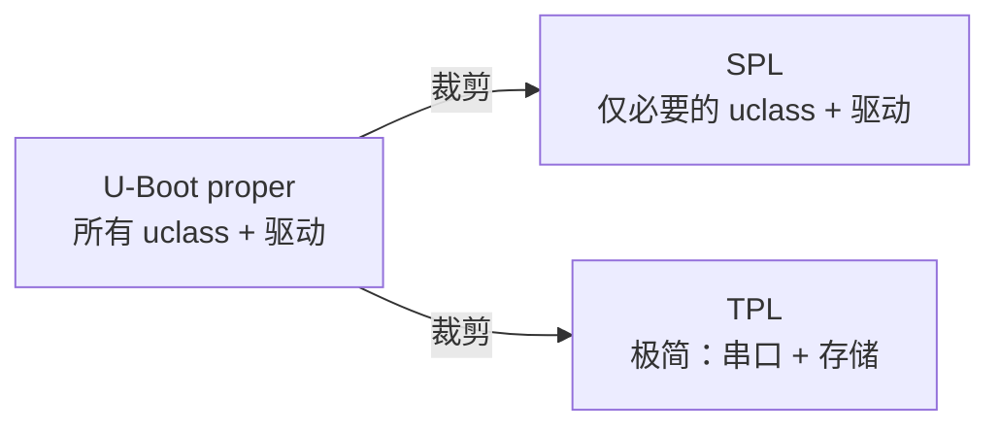

# Driver Model 驱动框架

## 前言

**C：** 如果你翻过几年前的 U-Boot 代码，会发现驱动写法五花八门——每个驱动自己调初始化、自己管设备、没有统一框架。2013 年引入的 Driver Model（DM）就是为了解决这个问题。它借鉴了 Linux 内核的设备模型思路，用"uclass → driver → device"三层架构把所有驱动统一起来。现在写新驱动必须用 DM，旧的也在迁移中。本篇把 DM 的设计理念和核心机制讲清楚，再带你看一个完整的驱动实例。

<!-- more -->

## 为什么需要 Driver Model

### 旧式驱动的问题

在 DM 出现之前，U-Boot 的驱动是这样的：

```c
// 旧式：驱动直接调用初始化
int board_mmc_init(bd_t *bis)
{
    /* 直接操作寄存器，没有统一框架 */
    writel(0x1234, REG_BASE + OFFSET);
    /* 手动注册设备 */
    mmc_initialize(bis);
    return 0;
}
```

问题：

| 问题 | 说明 |
|------|------|
| 代码重复 | 每个 SoC 都写自己的初始化 |
| 顺序混乱 | 初始化顺序靠硬编码保证 |
| 难以复用 | 换个板子就要改初始化代码 |
| 无法按需加载 | 所有驱动都编译进去 |
| 没有生命周期 | 不知道什么时候初始化、什么时候释放 |

### DM 的设计目标

- 统一驱动接口（uclass）
- 设备与驱动分离
- 基于设备树的自动探测
- 支持按需 probe/remove
- 支持 SPL 精简构建
- 单元测试友好

## DM 三层架构



### Uclass（驱动类）

Uclass 是某一类设备的**接口抽象**，定义了统一的标准操作。例如所有串口驱动都必须实现 `putc()`、`getc()`、`pending()` 等方法。

```
常见 Uclass:
UCLASS_SERIAL    — 串口
UCLASS_GPIO      — GPIO
UCLASS_MMC       — eMMC/SD
UCLASS_ETH       — 以太网
UCLASS_I2C       — I2C 总线
UCLASS_SPI       — SPI 总线
UCLASS_USB       — USB
UCLASS_REGULATOR — 电压调节器
UCLASS_CLK       — 时钟
UCLASS_RESET     — 复位控制器
UCLASS_PINCTRL   — 引脚复用
UCLASS_TIMER     — 定时器
UCLASS_VIDEO     — 显示
UCLASS_PHY       — 网络PHY
```

### Driver（驱动实现）

Driver 是具体的硬件驱动程序，实现了 uclass 要求的接口。

### Device（设备实例）

Device 是一个具体的硬件实例，通常对应设备树中的一个节点。

## DM 核心数据结构

### struct udevice

```c
// include/dm/device.h（简化）
struct udevice {
    const char *name;          // 设备名
    const void *plat;          // 平台数据（设备树解析前）
    void *priv;                // 驱动私有数据
    struct udevice *parent;    // 父设备
    struct driver *driver;     // 绑定的驱动
    struct uclass *uclass;     // 所属 uclass
    ofnode node;               // 设备树节点引用
    ulclass_id_t uclass_id;    // uclass ID
    uint32_t flags;            // 标志位
    int seq;                   // 序号
    // ...
};
```

### struct driver

```c
// include/dm/driver.h（简化）
struct driver {
    const char *name;           // 驱动名
    const char *of_match;       // 设备树匹配表
    int (*bind)(struct udevice *dev);     // 绑定
    int (*probe)(struct udevice *dev);    // 探测/初始化
    int (*remove)(struct udevice *dev);   // 移除
    int (*of_to_plat)(struct udevice *dev); // 设备树→平台数据
    int (*child_pre_probe)(struct udevice *dev);
    void (*child_post_remove)(struct udevice *dev);
    const void *plat_auto;      // 平台数据大小（自动分配）
    int priv_auto;              // 私有数据大小（自动分配）
    // ...
};
```

### struct uclass_driver

```c
// include/dm/uclass.h（简化）
struct uclass_driver {
    const char *name;
    enum uclass_id id;
    int (*post_bind)(struct udevice *dev);
    int (*pre_probe)(struct udevice *dev);
    int (*post_probe)(struct udevice *dev);
    int (*pre_remove)(struct udevice *dev);
    int (*child_post_bind)(struct udevice *dev);
    int (*child_pre_probe)(struct udevice *dev);
    int (*init)(struct udevice *dev);
    // ...
};
```

## DM 启动流程



### 两个阶段

1. **bind 阶段**：扫描设备树，匹配 compatible，创建 udevice，解析平台数据。此时**不初始化硬件**。
2. **probe 阶段**：调用驱动的 `probe()` 函数，初始化硬件。按设备树的树形结构从根到叶依次 probe，确保父设备先于子设备。

## 编写一个 DM 驱动

### 示例：简单的 GPIO LED 驱动

设备树定义：

```dts
/ {
    leds {
        compatible = "vendor,gpio-leds";
        pinctrl-names = "default";

        led0 {
            gpios = <&gpio0 17 GPIO_ACTIVE_HIGH>;
            label = "status";
            default-state = "on";
        };

        led1 {
            gpios = <&gpio0 18 GPIO_ACTIVE_HIGH>;
            label = "error";
            default-state = "off";
        };
    };
};
```

驱动实现：

```c
// drivers/gpio/vendor_leds.c
#include <common.h>
#include <dm.h>
#include <dm/device_compat.h>
#include <asm/gpio.h>

/* 每颗 LED 的私有数据 */
struct vendor_led_priv {
    struct gpio_desc gpio;
    const char *label;
    bool active_low;
};

/* LED uclass 操作 */
static int vendor_led_set_on(struct udevice *dev)
{
    struct vendor_led_priv *priv = dev_get_priv(dev);
    return dm_gpio_set_value(&priv->gpio, priv->active_low ? 0 : 1);
}

static int vendor_led_set_off(struct udevice *dev)
{
    struct vendor_led_priv *priv = dev_get_priv(dev);
    return dm_gpio_set_value(&priv->gpio, priv->active_low ? 1 : 0);
}

/* 设备树解析 */
static int vendor_led_of_to_plat(struct udevice *dev)
{
    struct vendor_led_priv *priv = dev_get_priv(dev);
    int ret;

    ret = gpio_request_by_name(dev, "gpios", 0,
                                &priv->gpio, GPIOD_IS_OUT);
    if (ret < 0) {
        dev_err(dev, "Failed to request GPIO: %d\n", ret);
        return ret;
    }

    priv->label = dev_read_string(dev, "label");
    if (!priv->label)
        priv->label = dev->name;

    return 0;
}

/* probe：硬件初始化 */
static int vendor_led_probe(struct udevice *dev)
{
    struct vendor_led_priv *priv = dev_get_priv(dev);
    const char *state;
    int ret;

    state = dev_read_string(dev, "default-state");
    if (state && !strcmp(state, "on"))
        ret = vendor_led_set_on(dev);
    else
        ret = vendor_led_set_off(dev);

    return ret;
}

/* compatible 匹配表 */
static const struct udevice_id vendor_led_ids[] = {
    { .compatible = "vendor,gpio-leds" },
    { /* sentinel */ }
};

/* 驱动定义 */
U_BOOT_DRIVER(vendor_led) = {
    .name   = "vendor-led",
    .id     = UCLASS_LED,           // LED uclass
    .of_match = vendor_led_ids,
    .of_to_plat = vendor_led_of_to_plat,
    .probe  = vendor_led_probe,
    .priv_auto = sizeof(struct vendor_led_priv),
    .flags  = DM_FLAG_PRE_RELOC,    // 允许在重定位前使用
};
```

### 注册到构建系统

```makefile
# drivers/gpio/Makefile
obj-$(CONFIG_LED_VENDOR) += vendor_leds.o
```

```
# drivers/gpio/Kconfig
config LED_VENDOR
    bool "Vendor GPIO LED driver"
    depends on DM_GPIO
    help
      Support for vendor GPIO LEDs controlled via Device Tree.
```

## DM 常用 API

### 设备操作

```c
#include <dm.h>

// 获取设备私有数据
void *dev_get_priv(struct udevice *dev);

// 获取平台数据
const void *dev_get_plat(struct udevice *dev);

// 获取父设备
struct udevice *dev_get_parent(struct udevice *dev);

// 获取 uclass
struct uclass *dev_get_uclass(struct udevice *dev);

// 通过序号获取设备
int uclass_get_device(enum uclass_id id, int index, struct udevice **devp);

// 通过名称获取设备
int uclass_get_device_by_name(enum uclass_id id, const char *name,
                               struct udevice **devp);

// 通过设备树节点获取
int uclass_get_device_by_ofnode(enum uclass_id id, ofnode node,
                                 struct udevice **devp);
```

### 设备树读取

```c
#include <dm/read.h>

// 读取属性
int dev_read_u32(struct udevice *dev, const char *propname, u32 *outp);
int dev_read_u64(struct udevice *dev, const char *propname, u64 *outp);
const char *dev_read_string(struct udevice *dev, const char *propname);
int dev_read_bool(struct udevice *dev, const char *propname);

// 读取数组
int dev_read_u32_array(struct udevice *dev, const char *propname,
                        u32 *outvals, int size);

// 读取字符串列表
int dev_read_string_list(struct udevice *dev, const char *propname,
                          const char ***listp);

// 检查 status
bool device_is_compatible(struct udevice *dev, const char *compat);
int device_get_status(struct udevice *dev);
```

### GPIO（DM）

```c
#include <asm/gpio.h>

// 请求 GPIO
int gpio_request_by_name(struct udevice *dev, const char *list_name,
                          int index, struct gpio_desc *desc, int flags);

// 操作 GPIO
int dm_gpio_set_value(struct gpio_desc *desc, int value);
int dm_gpio_get_value(struct gpio_desc *desc);
int dm_gpio_set_dir_output(struct gpio_desc *desc, int value);
int dm_gpio_set_dir_input(struct gpio_desc *desc);
```

## Uclass 操作宏

定义新的 uclass：

```c
// 定义 uclass ID
enum uclass_id {
    // ... 标准 uclass ...
    UCLASS_MYDEV,    // 自定义 uclass
};

// 定义 uclass 驱动
UCLASS_DRIVER(mydev) = {
    .name   = "mydev",
    .id     = UCLASS_MYDEV,
};
```

## DM 在 SPL 中的精简

SPL 内存有限，DM 提供了精简机制：

```c
// 标记驱动可在 SPL 中使用
U_BOOT_DRIVER(my_driver) = {
    .flags = DM_FLAG_PRE_RELOC,  // SPL 中也会 probe
    // ...
};

// SPL 中只编译必要的 uclass
// defconfig
CONFIG_SPL_DM=y
CONFIG_SPL_SERIAL=y
CONFIG_SPL_MMC=y
# 其他 uclass 不编译
```



## 旧式驱动迁移到 DM

如果你需要维护旧的非 DM 代码，迁移步骤大致是：

1. 把 `board_xxx_init()` 改为 `xxx_probe()`（DM probe 函数）
2. 在设备树中添加对应的节点
3. 在 `driver` 结构体中填写 `of_match`
4. 全局变量改为 `dev_get_priv()` 私有数据
5. 直接 `readl/writel` 改为通过 `dev_read_*` 读取设备树
6. 编译测试

## 小结

本篇介绍了 U-Boot 的 Driver Model 框架：

- 三层架构：Uclass（接口）→ Driver（实现）→ Device（实例）
- 两个阶段：bind（绑定）→ probe（初始化）
- 基于设备树的自动探测和匹配
- 完整的 LED 驱动示例
- DM API：设备操作、设备树读取、GPIO 等
- SPL 精简机制：DM_FLAG_PRE_RELOC

下一篇我们讲 U-Boot 的网络与 TFTP 功能，这是开发中最常用的启动方式之一。

::: tip 持续更新中

章节与示例会陆续补充；若你发现疏漏或与所用 U-Boot 版本不符之处，欢迎评论交流。

:::
