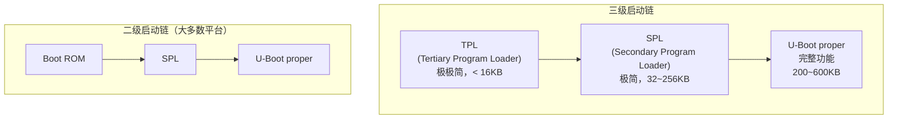
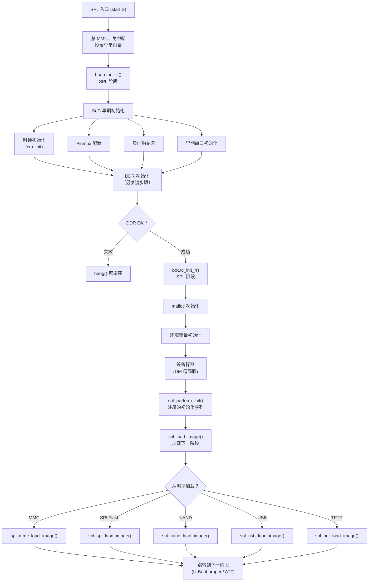
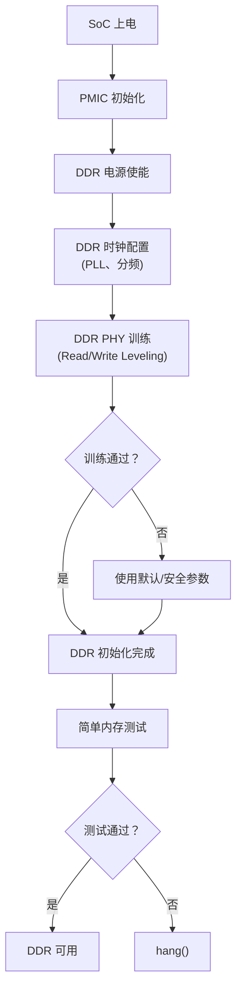

# SPL 框架与极简启动

## 前言

**C：** 大多数嵌入式开发者知道 U-Boot，但不太关注 SPL——直到有一天板子 DDR 没起来，SPL 卡死在某个地方，你才意识到 SPL 才是"第一步"。SPL（Secondary Program Loader）运行在极有限的资源里（几十 KB SRAM、无 DDR），却要完成最关键的 DDR 初始化。本篇从 SPL 的设计理念出发，讲清楚它的框架结构、配置裁剪，以及当 SPL 出问题时怎么排查。

<!-- more -->

## 为什么需要 SPL

### 根本原因：SRAM 不够大

```
典型 SoC 内部 SRAM 大小：
├── 全志 H3:     32 KB
├── i.MX6UL:    128 KB
├── i.MX8MM:     96 KB
├── RK3399:      128 KB (SRAM) + 32 KB (PMU)
└── STM32MP1:   256 KB

完整 U-Boot 大小：
└── 200 ~ 600 KB    ← 放不下！
```

所以必须有一个极小的"迷你 Bootloader"先跑起来，初始化 DDR，再加载完整 U-Boot。

### SPL 的资源限制

| 资源 | SPL 中的限制 |
|------|-------------|
| 代码大小 | 32~256 KB（取决于 SRAM） |
| 可用内存 | 只有内部 SRAM |
| 栈大小 | 通常 2~4 KB |
| 驱动支持 | 仅保留必需的（串口 + 存储介质） |
| 设备树 | 简化版或内嵌 |
| 时间要求 | 开发者期望 < 500ms 完成 |

## SPL 启动链全景



- **两级**（大多数平台）：Boot ROM → SPL → U-Boot proper
- **三级**（Rockchip 等）：Boot ROM → TPL → SPL → U-Boot proper

## SPL 框架结构

### 源码目录

```
common/spl/
├── spl.c              # SPL 核心逻辑（入口、加载镜像）
├── spl_fit.c          # SPL 加载 FIT 镜像
├── spl_nor.c          # NOR Flash 加载
├── spl_mmc.c          # MMC/eMMC/SD 加载
├── spl_nand.c         # NAND Flash 加载
├── spl_spi.c          # SPI Flash 加载
├── spl_usb.c          # USB 加载
├── spl_net.c          # 网络加载（TFTP）
├── spl_ymodem.c       # Ymodem 串口下载
├── spl_atf.c          # ATF/OP-TEE 加载
├── spl_opensbi.c      # OpenSBI 加载（RISC-V）
├── spl_board.c        # 板级 SPL 特殊逻辑
└── spl_dfu.c          # DFU 模式
```

### SPL 启动流程（详细）



### SPL 的 board_init_f 与 U-Boot proper 的区别

SPL 有自己独立的 `board_init_f()`，定义在 `common/spl/spl.c` 中：

```c
// common/spl/spl.c（简化）
void spl_board_init(void)
{
    board_init_r(NULL, 0);
}

// SPL 的 board_init_r 在 common/spl/spl.c 中
void board_init_r(gd_t *gd, ulong dest_addr)
{
    u32 spl_boot_list[] = {
        BOOT_DEVICE_MMC1,
        BOOT_DEVICE_MMC2,
        BOOT_DEVICE_SPI,
        BOOT_DEVICE_NAND,
        BOOT_DEVICE_USB,
    };

    spl_perform_init();

    spl_load_image();
    // 如果成功，不会返回到这里
}
```

## SPL 配置与裁剪

### 启用 SPL

```c
// defconfig
CONFIG_SPL=y
CONFIG_SPL_BUILD=y              // 自动设置（编译 SPL 时）
CONFIG_SPL_TEXT_BASE=0x0        // SPL 的链接/加载地址
CONFIG_SPL_MAX_SIZE=0x30000     // SPL 最大 192KB
```

### SPL 中的驱动选择

SPL 的 Kconfig 支持细粒度的驱动控制：

```c
// 串口（几乎必须）
CONFIG_SPL_SERIAL=y
CONFIG_SPL_SERIAL_SUPPORT=y
CONFIG_SPL_DRIVERS_MISC=y

// 存储介质（选一个或多个）
CONFIG_SPL_MMC=y                 // MMC/SD
CONFIG_SPL_MMC_SUPPORT=y
CONFIG_SPL_SPI_FLASH=y           // SPI Flash
CONFIG_SPL_SPI_FLASH_SUPPORT=y
CONFIG_SPL_NAND=y                // NAND
CONFIG_SPL_NAND_SUPPORT=y

// 网络（可选，会增加 SPL 体积）
CONFIG_SPL_NET=y
CONFIG_SPL_NET_SUPPORT=y

// USB（可选）
CONFIG_SPL_USB=y
CONFIG_SPL_USB_GADGET=y

// DM 框架（推荐）
CONFIG_SPL_DM=y
CONFIG_SPL_OF_CONTROL=y
CONFIG_SPL_PINCTRL=y
CONFIG_SPL_CLK=y
CONFIG_SPL_RESET=y

// FAT 文件系统（如果从 FAT 分区加载）
CONFIG_SPL_FS_FAT=y

// 杂项
CONFIG_SPL_LIBCOMMON_SUPPORT=y
CONFIG_SPL_LIBGENERIC_SUPPORT=y
CONFIG_SPL_BAUDRATE_TABLE=y
```

### SPL 大小控制

```
SPL 目标大小参考：
├── 极简版（仅串口 + 存储）:   20~40 KB
├── 标准版（串口 + 存储 + DM）: 60~100 KB
├── 增强版（+ 网络 + USB）:     100~200 KB
└── 超过 SRAM:                  ✗ 编译失败或运行异常
```

::: warning 注意

如果 SPL 编译后超过 SRAM 大小，会直接无法运行。不要盲目给 SPL 加功能。可以用 `arm-none-eabi-size spl/u-boot-spl` 查看 SPL 各段大小。

:::

### 检查 SPL 大小

```bash
# 编译 SPL
make -j$(nproc) spl/u-boot-spl.bin

# 查看大小
ls -l spl/u-boot-spl.bin
size spl/u-boot-spl

# 查看各段
aarch64-linux-gnu-objdump -h spl/u-boot-spl | grep -E 'text|data|bss'
```

## SPL 加载下一阶段的方式

### 方式 1：直接加载 U-Boot proper

最常见的方式。SPL 从存储介质加载 `u-boot.bin`（或 `u-boot-nodtb.bin` + `u-boot.dtb`）到 DDR，然后跳转。

### 方式 2：加载 FIT 镜像

SPL 支持 FIT 格式，可以一次性加载多个组件：

```c
// SPL FIT 配置
CONFIG_SPL_LOAD_FIT=y
CONFIG_SPL_FIT=y
```

FIT 镜像可以包含 U-Boot + DTB + ATF（ARM Trusted Firmware），SPL 按描述一次性加载。

```dts
// fit_spl.its
/ {
    images {
        uboot {
            description = "U-Boot";
            data = /incbin/("u-boot-nodtb.bin");
            type = "firmware";
            arch = "arm64";
            os = "u-boot";
        };
        fdt {
            description = "DTB";
            data = /incbin/("u-boot.dtb");
            type = "flat_dt";
            arch = "arm64";
        };
        atf {
            description = "ARM Trusted Firmware";
            data = /incbin/("bl31.bin");
            type = "firmware";
            arch = "arm64";
            os = "arm-trusted-firmware";
        };
    };
    configurations {
        default = "conf";
        conf {
            firmware = "uboot";
            fdt = "fdt";
            loadables = "atf";
        };
    };
};
```

### 方式 3：链式加载 ATF → OP-TEE → U-Boot

在安全启动场景中，启动链更长：

```
SPL → ATF (BL31) → OP-TEE → U-Boot proper → Kernel
```

SPL 负责加载 ATF 到安全内存，然后跳转 ATF，ATF 再加载 OP-TEE 和 U-Boot。

## DDR 初始化详解

DDR 初始化是 SPL 中最关键也最容易出问题的步骤。

### DDR 初始化流程



### 不同 SoC 的 DDR 初始化方式

| SoC | 方式 | 说明 |
|-----|------|------|
| i.MX | DDR 固件（DDRC Training Firmware） | NXP 提供闭源二进制，SPL 加载执行 |
| Rockchip | DDR 代码在 SPL 中 | 开源 DDR 初始化代码 |
| Allwinner | DRAMC 驱动 | 开源，参数在设备树中 |
| STM32MP1 | DDR PHY 驱动 | ST 提供的驱动 + 设备树参数 |

### i.MX8MM DDR 初始化示例

```c
// SPL 先通过 ROM 指令加载 DDR 固件
// arch/arm/mach-imx/imx8m/ddr.c（简化）
int ddr_init(struct dram_timing_info *dram_timing)
{
    /* 初始化 DDRC 控制器 */
    ddr_ctrl_init(dram_timing);

    /* 加载 DDR PHY 固件（NXP 闭源） */
    ddrphy_load_firmware();

    /* DDR 训练 */
    ddrphy_training();

    /* 内存测试 */
    ddrphy_mem_test();

    return 0;
}
```

## TPL 框架

TPL（Tertiary Program Loader）在 SPL 之前，用于 SRAM 极小的 SoC（< 32KB）。

```
TPL 启动链：Boot ROM → TPL → SPL → U-Boot proper
```

TPL 极其精简，通常只做：

1. 初始化最基本的外设（串口可选）
2. 初始化 DDR（或仅初始化部分 SRAM）
3. 加载 SPL

```c
// defconfig
CONFIG_SPL=y
CONFIG_TPL=y
CONFIG_TPL_TEXT_BASE=0xff704000
CONFIG_TPL_MAX_SIZE=0x10000    // 64KB
CONFIG_TPL_SERIAL=y
CONFIG_TPL_DRIVERS_MISC=y
```

目前主要在 Rockchip RK3399 和少量其他平台上使用。

## SPL 调试技巧

### 1. 早期串口输出

DDR 初始化完成前，只能用最简单的 `puts()` 输出调试：

```c
// 不要用 printf()（需要 malloc），用 puts()
puts("SPL: DDR init start\n");
// DDR 初始化代码...
puts("SPL: DDR init done\n");
```

### 2. LED 指示

如果连串口都没有（Pinmux 还没配好），可以用 GPIO 点灯：

```c
// 简单 GPIO 操作（非 DM，直接寄存器）
writel(0x1, GPIO_BASE + GPIO_SWPORT_DR);
// 看到灯亮说明代码执行到这里了
```

### 3. SPL hang 分析

SPL 死循环时通常没有输出，排查思路：

```
1. Boot ROM 有输出吗？
   → 没有：启动介质选择错误
   → 有：继续

2. SPL 前几行输出有吗？
   → 没有：SPL 入口就崩了，检查链接地址和代码位置
   → 有：继续

3. 在哪一行之后没有输出了？
   → DDR 初始化之前：检查时钟、电源
   → DDR 初始化中：检查 DDR 参数、型号、PCB 布局
   → 加载 U-Boot 时：检查存储介质、镜像格式
```

### 4. 使用 JTAG 调试 SPL

```
JTAG 连接 → 复位 →停在 SPL 入口
→ 单步执行 → 观察寄存器和内存
→ 定位 DDR 初始化失败点
```

推荐工具：OpenOCD + GDB。

## SPL 常见问题

| 问题 | 原因 | 解决 |
|------|------|------|
| 无任何输出 | Boot ROM 未加载 SPL | 检查启动介质、拨码开关 |
| SPL hang 在早期 | 时钟未初始化 | 检查 PLL 配置 |
| DDR training 失败 | DDR 型号/参数不匹配 | 更新 dram_timing 参数 |
| `spl_load_image failed` | 存储介质读取失败 | 检查分区、文件存在 |
| `SPL: wrong image format` | 镜像头不匹配 | 检查 u-boot.bin 格式 |
| SPL 超出 SRAM | SPL 编译太大 | 减少 SPL 功能配置 |

## 小结

本篇全面介绍了 SPL 框架：

- SPL 存在的原因：SRAM 不够放完整 U-Boot
- 启动流程：SoC 初始化 → DDR 初始化 → 加载下一阶段
- 配置裁剪：SPL 专用的 Kconfig 选项
- FIT 镜像支持：SPL 可以加载多组件 FIT
- DDR 初始化：不同 SoC 的实现方式
- TPL：三级启动链中的极极简 Bootloader
- 调试技巧：早期 puts、LED、JTAG

下一篇进入高级实战篇，讲解 FIT 镜像格式的安全启动机制。

::: tip 持续更新中

章节与示例会陆续补充；若你发现疏漏或与所用 U-Boot 版本不符之处，欢迎评论交流。

:::
