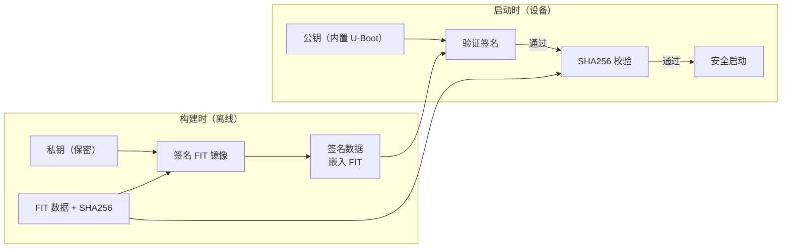
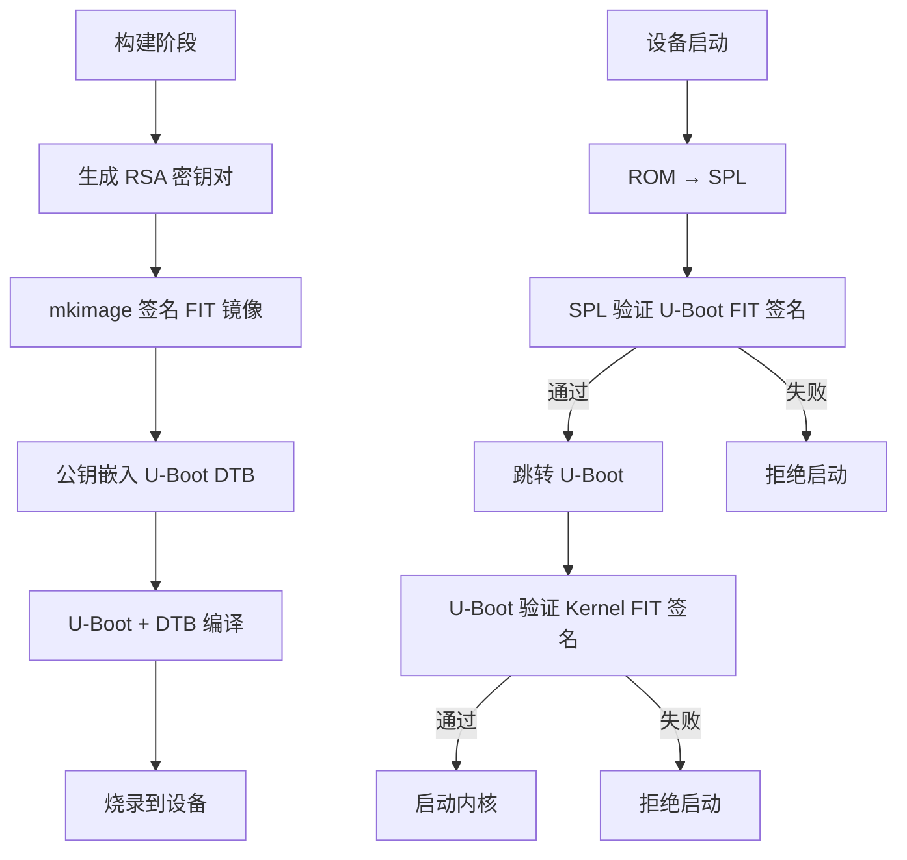

# FIT 镜像格式与安全启动

## 前言

**C：** 之前我们一直用的是裸的二进制镜像（`u-boot.bin`、`Image`、`board.dtb`），它们没有任何防篡改能力。在产品量产中，如果有人把内核换成恶意版本，你的设备就被劫持了。FIT（Flattened Image Tree）镜像格式解决了这个问题——它把多个二进制打包在一起，还支持 RSA/ECDSA 签名验证。本篇从 FIT 格式讲起，再到安全启动的完整配置流程。

<!-- more -->

## FIT 镜像格式基础

### 什么是 FIT

FIT（Flattened Image Tree）是一种基于设备树（FDT）格式的打包格式，把多个二进制组件（内核、设备树、ramdisk、firmware 等）打包成一个文件，并附带描述信息。

```
uImage（旧格式）:
┌──────────────────────┐
│  64-byte header      │  ← 只有简单的头信息
│  kernel binary       │
└──────────────────────┘

FIT（新格式）:
┌──────────────────────┐
│  FIT header (FDT)    │  ← 设备树格式的结构描述
│    ├── kernel node    │
│    ├── fdt node       │
│    ├── ramdisk node   │
│    ├── hash node      │  ← 完整性校验
│    ├── signature node │  ← 签名验证
│    └── config node    │  ← 配置选择
│  data: kernel binary  │
│  data: dtb binary     │
│  data: ramdisk binary │
└──────────────────────┘
```

### 为什么用 FIT

| 特性 | uImage (旧) | FIT (新) |
|------|-------------|----------|
| 多组件 | 只能打包内核 | 内核+DTB+ramdisk+firmware |
| 校验 | 简单 CRC | SHA256/SHA384/SHA512 |
| 签名 | 不支持 | RSA/ECDSA 签名 |
| 多配置 | 不支持 | 可包含多种硬件配置 |
| 压缩 | gzip | gzip/lzo/zstd/bzip2 |
| 加密 | 不支持 | 支持（有限） |
| 元数据 | 极少 | 任意自定义属性 |

## 创建 FIT 镜像

### ITS 文件编写

ITS（Image Tree Source）是 FIT 的源文件，用设备树语法编写：

```dts
// fit_kernel.its — 基础版（无签名）
/dts-v1/;

/ {
    description = "Linux Kernel FIT Image for My Board";
    #address-cells = <1>;

    images {
        kernel {
            description = "Linux Kernel";
            data = /incbin/("Image");
            type = "kernel";
            arch = "arm64";
            os = "linux";
            compression = "none";
            load = <0x40800000>;
            entry = <0x40800000>;
            hash {
                algo = "sha256";
            };
        };

        fdt {
            description = "Device Tree Blob";
            data = /incbin/("board.dtb");
            type = "flat_dt";
            arch = "arm64";
            compression = "none";
            hash {
                algo = "sha256";
            };
        };

        ramdisk {
            description = "Initramfs";
            data = /incbin/("initramfs.cpio.gz");
            type = "ramdisk";
            arch = "arm64";
            os = "linux";
            compression = "gzip";
            load = <0x46000000>;
            hash {
                algo = "sha256";
            };
        };
    };

    configurations {
        default = "conf";
        conf {
            description = "Default configuration";
            kernel = "kernel";
            fdt = "fdt";
            ramdisk = "ramdisk";
        };
    };
};
```

### 编译 FIT 镜像

```bash
# 使用 mkimage 编译
mkimage -f fit_kernel.its kernel.fit

# 查看内容
mkimage -l kernel.fit

# 输出类似：
# FIT description: Linux Kernel FIT Image for My Board
# Created:         2026-04-24  20:00:00 UTC
# Image 0 (kernel)
#  Description:  Linux Kernel
#  Type:         Kernel Image
#  Compression:  uncompressed
#  Data Size:    8765432 Bytes = 8563.88 KiB = 8.36 MiB
#  Architecture: AArch64
#  OS:           Linux
#  Load Address: 04080000
#  Entry Point:  04080000
#  Hash algo:    sha256
#  Hash value:   abc123...
# Image 1 (fdt)
#  ...
# Image 2 (ramdisk)
#  ...
# Default Configuration: 'conf'
# Configuration 0 (conf)
#  Description:  Default configuration
#  Kernel:       kernel
#  Init Ramdisk: ramdisk
#  FDT:          fdt
```

### 在 U-Boot 中启动 FIT

```bash
# 加载 FIT 镜像
tftp ${kernel_addr_r} kernel.fit

# 启动（U-Boot 自动解析 FIT 结构）
bootm ${kernel_addr_r}#conf
#     ^^^^^^^^^^^^^^^^
#     FIT 地址 # 配置名

# 如果有默认配置，直接 bootm
bootm ${kernel_addr_r}
```

## 多配置支持

一个 FIT 镜像可以包含多种硬件配置：

```dts
/dts-v1/;

/ {
    description = "Multi-config FIT Image";

    images {
        kernel {
            data = /incbin/("Image");
            type = "kernel";
            arch = "arm64";
            os = "linux";
            compression = "none";
            load = <0x40800000>;
            entry = <0x40800000>;
            hash { algo = "sha256"; };
        };

        fdt_board_a {
            description = "DTB for Board A (2GB RAM)";
            data = /incbin/("board-a.dtb");
            type = "flat_dt";
            arch = "arm64";
            hash { algo = "sha256"; };
        };

        fdt_board_b {
            description = "DTB for Board B (4GB RAM)";
            data = /incbin/("board-b.dtb");
            type = "flat_dt";
            arch = "arm64";
            hash { algo = "sha256"; };
        };

        initramfs {
            data = /incbin/("initramfs.cpio.gz");
            type = "ramdisk";
            arch = "arm64";
            os = "linux";
            compression = "gzip";
            hash { algo = "sha256"; };
        };
    };

    configurations {
        default = "board_a";

        board_a {
            description = "Board A (2GB RAM)";
            kernel = "kernel";
            fdt = "fdt_board_a";
            ramdisk = "initramfs";
        };

        board_b {
            description = "Board B (4GB RAM)";
            kernel = "kernel";
            fdt = "fdt_board_b";
            ramdisk = "initramfs";
        };
    };
};
```

启动时选择配置：

```bash
# 使用默认配置
bootm ${addr}

# 指定配置
bootm ${addr}#board_b
```

## SHA256 校验

FIT 镜像内置了 SHA256 校验，U-Boot 启动时自动验证：

```c
// defconfig
CONFIG_FIT=y
CONFIG_FIT_ENABLE_SHA256=y
CONFIG_FIT=y
```

启动时如果校验失败：

```
## Loading kernel from FIT Image at 40800000 ...
   Using 'conf' configuration
   Verifying Hash Integrity ... sha256+ OK
```

如果被篡改：

```
   Verifying Hash Integrity ... sha256+ ERROR
   Bad hash value for 'kernel' hash node in 'conf' configuration
   Try again without verification? (y/n)
```

## RSA 签名验证（安全启动）

### 概念

SHA256 只能检测"被改过"，但攻击者可以同时篡改数据和哈希值。RSA 签名则用私钥签名，公钥验证，攻击者无法伪造签名（不知道私钥）。



### 生成密钥对

```bash
# 生成 RSA 2048 位密钥对
openssl genrsa -out private.pem 2048

# 提取公钥（PEM 格式）
openssl rsa -in private.pem -pubout > public.pem

# 转换为 U-Boot 格式
# 方法 1：直接在 ITS 中引用 PEM
# 方法 2：转换为 C 头文件
openssl x509 -pubkey -noout -in public.pem > public_key.pem
```

### 带签名的 ITS 文件

```dts
// fit_kernel_secure.its
/dts-v1/;

/ {
    description = "Secure Boot FIT Image";
    #address-cells = <1>;

    images {
        kernel {
            description = "Linux Kernel";
            data = /incbin/("Image");
            type = "kernel";
            arch = "arm64";
            os = "linux";
            compression = "none";
            load = <0x40800000>;
            entry = <0x40800000>;
            hash {
                algo = "sha256";
            };
            signature {
                algo = "sha256,rsa2048";
                key-name-hint = "dev";
                sign-images = "kernel", "fdt";
            };
        };

        fdt {
            description = "Device Tree Blob";
            data = /incbin/("board.dtb");
            type = "flat_dt";
            arch = "arm64";
            hash {
                algo = "sha256";
            };
        };
    };

    configurations {
        default = "conf";
        conf {
            description = "Default configuration";
            kernel = "kernel";
            fdt = "fdt";
            signature {
                algo = "sha256,rsa2048";
                key-name-hint = "dev";
                sign-images = "kernel", "fdt";
            };
        };
    };
};
```

### 编译带签名的 FIT

```bash
# 编译（需要指定密钥目录）
mkimage -f fit_kernel_secure.its \
    -k /path/to/keys/ \
    -r kernel_secure.fit

# -k: 密钥目录，包含 dev.key (私钥) 和 dev.crt (证书)
# -r: 要求签名（--required）
```

### 将公钥嵌入 U-Boot

```bash
# 生成 C 头文件
# mkimage 的 -K 选项
mkimage -f fit_kernel_secure.its \
    -k /path/to/keys/ \
    -r kernel_secure.fit \
    -K u-boot.dtb

# 或手动将公钥写入设备树
# 公钥会被插入到 DTB 的 /signature/ 节点中
```

也可以在 defconfig 中直接指定公钥：

```c
CONFIG_FIT_SIGNATURE=y
CONFIG_RSA=y
CONFIG_RSA_VERIFY=y
CONFIG_FIT_ENABLE_SHA256=y
CONFIG_FIT_ENABLE_SHA384=y
CONFIG_FIT_ENABLE_SHA512=y
```

### 强制签名验证

```c
// defconfig
CONFIG_FIT_SIGNATURE=y
CONFIG_FIT_DISABLE_SHA256=n    // 不禁用 SHA256
CONFIG_FIT_ENABLED=n           // 不允许跳过签名（强制）

// 或通过环境变量
setenv verify yes              // 强制校验（默认）
setenv verify no               // 跳过校验（仅开发用！）
```

## 在 SPL 中验证 FIT

SPL 也可以验证它加载的 U-Boot FIT 镜像：

```c
// defconfig
CONFIG_SPL_FIT=y
CONFIG_SPL_FIT_SIGNATURE=y
CONFIG_SPL_RSA=y
CONFIG_SPL_RSA_VERIFY=y
```

这样启动链变成：

```
ROM → SPL（验证 FIT）→ U-Boot（验证 Kernel FIT）→ Kernel
```

每一级都验证下一级的签名，实现**信任链**（Chain of Trust）。

## FIT 镜像压缩

FIT 支持内部压缩，减小传输大小：

```dts
kernel {
    data = /incbin/("Image.gz");
    type = "kernel";
    compression = "gzip";    // 告诉 U-Boot 自动解压
    // ...
};

// 支持的压缩算法：
// "none"    - 不压缩
// "gzip"    - gzip
// "bzip2"   - bzip2
// "lzma"    - LZMA
// "lzo"     - LZO
// "lz4"     - LZ4
// "zstd"    - Zstandard（推荐，性能好）
```

## mkimage 工具详解

```bash
# 创建 FIT 镜像
mkimage -f <its_file> -k <key_dir> [-r] [-K <dtb>] <output>

# 查看 FIT 镜像内容
mkimage -l <fit_image>

# 创建 legacy uImage
mkimage -A arm64 -O linux -T kernel -C gzip \
    -a 0x40800000 -e 0x40800000 \
    -n "Linux Kernel" -d Image.gz uImage

# 创建 U-Boot 脚本
mkimage -A arm64 -O linux -T script -C none \
    -a 0 -e 0 -n "Boot Script" -d boot.txt boot.scr

# 创建 FIT initramfs
mkimage -f initramfs.its -k keys/ initramfs.fit
```

## 完整的安全启动流程总结



## 小结

本篇详细讲解了 FIT 镜像格式和安全启动：

- FIT 格式：基于 FDT 的多组件打包格式
- ITS 文件编写：kernel + fdt + ramdisk + configurations
- SHA256 校验：检测篡改
- RSA 签名验证：防伪造，建立信任链
- 多配置支持：一个 FIT 支持多种硬件
- SPL 签名验证：信任链延伸到 SPL
- mkimage 工具：创建和管理 FIT 镜像

下一篇我们实战一个完整的 U-Boot 移植流程。

::: tip 持续更新中

章节与示例会陆续补充；若你发现疏漏或与所用 U-Boot 版本不符之处，欢迎评论交流。

:::
