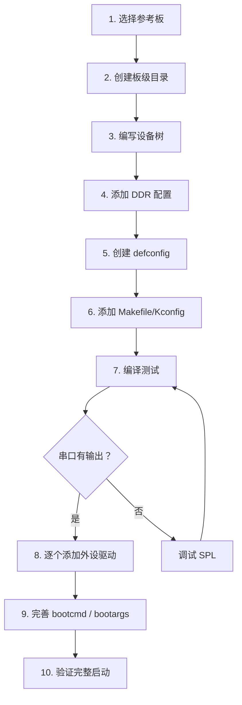

# U-Board 移植实战指南

## 前言

**C：** 前面十几篇都在讲理论，这一篇我们动手做一个"虚拟移植"——假设你有一块新设计的开发板，基于某个已有的 SoC（比如 i.MX8MM 或 RK3399），你需要让 U-Boot 在上面跑起来。移植的核心工作是创建板级支持代码、设备树和 defconfig。本文以一个基于 i.MX8MM 的假设板子 "myboard" 为例，走一遍完整流程。思路和方法对其他 SoC 同样适用。

<!-- more -->

## 移植前的准备

### 明确信息

移植前需要搞清楚以下信息：

| 信息 | 说明 |
|------|------|
| SoC 型号 | i.MX8MM / RK3399 / STM32MP1 等 |
| DDR 型号和容量 | DDR3L / DDR4 / LPDDR4，容量、位宽 |
| 启动介质 | SD 卡 / eMMC / SPI Flash / NAND |
| 网络方案 | 千兆 PHY 型号、连接方式（RGMII/RMII） |
| 存储方案 | eMMC 型号、SD 卡槽 |
| 显示方案 | LCD / HDMI / MIPI DSI |
| USB 方案 | USB 2.0 Host / Device / OTG |
| 参考板 | 厂商评估板（最接近你的硬件） |

::: tip 笔者说

**选对参考板是成功的一半。** 如果你用的是 i.MX8MM，那以 `imx8mm_evk` 为起点；如果是 RK3399，以 `evb-rk3399` 为起点。从参考板改比自己从零写快得多。

:::

### 获取资源

```bash
# 克隆主线 U-Boot
git clone https://github.com/u-boot/u-boot.git
cd u-boot

# 或克隆厂商分支（推荐）
git clone -b lf-6.6.y https://github.com/nxp-imx/uboot-imx.git
```

## 移植步骤总览



## Step 1: 选择参考板并复制

```bash
# 以 i.MX8MM 为例，复制 EVK 板级代码
cd board/freescale
cp -r imx8mm_evk myboard

# 重命名板级配置
mv board/freescale/myboard/imx8mm_evk.c board/freescale/myboard/myboard.c
```

## Step 2: 编写板级代码

```c
// board/freescale/myboard/myboard.c
#include <common.h>
#include <init.h>
#include <asm/global_data.h>
#include <asm/arch/clock.h>
#include <asm/arch/imx8mm_pins.h>
#include <asm/mach-imx/gpio.h>
#include <asm/arch/sys_proto.h>
#include <env.h>
#include <errno.h>

DECLARE_GLOBAL_DATA_PTR;

int board_init(void)
{
    /* LED 初始化 */
    gpio_request(IMX_GPIO_NR(1, 3), "status_led");
    gpio_direction_output(IMX_GPIO_NR(1, 3), 1);

    /* 网卡 PHY 复位 */
    gpio_request(IMX_GPIO_NR(1, 5), "phy_reset");
    gpio_direction_output(IMX_GPIO_NR(1, 5), 0);
    mdelay(10);
    gpio_direction_output(IMX_GPIO_NR(1, 5), 1);
    mdelay(50);

    return 0;
}

int board_mmc_get_env_dev(int devno)
{
    /* 环境变量存储在 MMC 设备 1（eMMC） */
    return devno;
}

int board_late_init(void)
{
#ifdef CONFIG_ENV_VARS_UBOOT_RUNTIME_CONFIG
    env_set("board_name", "MYBOARD");
    env_set("board_rev", "V1.0");
#endif

#ifdef CONFIG_ENV_IS_IN_MMC
    board_late_mmc_env_init();
#endif

    return 0;
}
```

## Step 3: 编写设备树

设备树是移植工作量最大的部分。以 i.MX8MM 为例：

```dts
// arch/arm/dts/imx8mm-myboard.dts
#include "imx8mm.dtsi"

/ {
    model = "My Custom Board";
    compatible = "vendor,myboard", "fsl,imx8mm";

    chosen {
        stdout-path = &uart2;
    };

    memory@40000000 {
        device_type = "memory";
        reg = <0x0 0x40000000 0x0 0x40000000>;  /* 1GB DDR */
    };

    /* 板级 LED */
    leds {
        compatible = "gpio-leds";
        pinctrl-names = "default";
        pinctrl-0 = <&pinctrl_leds>;

        status-led {
            label = "status";
            gpios = <&gpio1 3 GPIO_ACTIVE_HIGH>;
            default-state = "on";
        };
    };

    /* 板级按键 */
    gpio-keys {
        compatible = "gpio-keys";
        pinctrl-names = "default";
        pinctrl-0 = <&pinctrl_gpio_keys>;

        power-key {
            label = "Power";
            gpios = <&gpio1 1 GPIO_ACTIVE_LOW>;
            linux,code = <KEY_POWER>;
            wakeup-source;
        };
    };
};

/* 串口调试口 */
&uart2 {
    pinctrl-names = "default";
    pinctrl-0 = <&pinctrl_uart2>;
    status = "okay";
};

/* eMMC */
&usdhc3 {
    pinctrl-names = "default", "state_100mhz", "state_200mhz";
    pinctrl-0 = <&pinctrl_usdhc3>;
    pinctrl-1 = <&pinctrl_usdhc3_100mhz>;
    pinctrl-2 = <&pinctrl_usdhc3_200mhz>;
    bus-width = <8>;
    non-removable;
    status = "okay";
};

/* SD 卡 */
&usdhc2 {
    pinctrl-names = "default", "state_100mhz", "state_200mhz";
    pinctrl-0 = <&pinctrl_usdhc2>;
    pinctrl-1 = <&pinctrl_usdhc2_100mhz>;
    pinctrl-2 = <&pinctrl_usdhc2_200mhz>;
    bus-width = <4>;
    cd-gpios = <&gpio2 12 GPIO_ACTIVE_LOW>;
    status = "okay";
};

/* 千兆以太网 */
&fec1 {
    pinctrl-names = "default";
    pinctrl-0 = <&pinctrl_fec1>;
    phy-mode = "rgmii-id";
    phy-handle = <&ethphy0>;
    phy-reset-gpios = <&gpio1 5 GPIO_ACTIVE_LOW>;
    phy-reset-duration = <10>;
    status = "okay";

    mdio {
        #address-cells = <1>;
        #size-cells = <0>;

        ethphy0: ethernet-phy@0 {
            compatible = "ethernet-phy-ieee802.3-c22";
            reg = <0>;
            /* PHY 型号根据实际选择 */
            // micrel,ksz9031 或 realtek,rtl8211f 等
        };
    };
};

/* USB */
&usb_dwc3_1 {
    dr_mode = "otg";
    status = "okay";
};

/* 引脚复用配置 */
&iomuxc {
    pinctrl_uart2: uart2grp {
        fsl,pins = <
            MX8MM_IOMUXC_UART2_RXD_UART2_DCE_RX  0x140
            MX8MM_IOMUXC_UART2_TXD_UART2_DCE_TX  0x140
        >;
    };

    pinctrl_usdhc2: usdhc2grp {
        fsl,pins = <
            MX8MM_IOMUXC_SD2_CLK_USDHC2_CLK     0x190
            MX8MM_IOMUXC_SD2_CMD_USDHC2_CMD     0x1d0
            MX8MM_IOMUXC_SD2_DATA0_USDHC2_DATA0 0x1d0
            MX8MM_IOMUXC_SD2_DATA1_USDHC2_DATA1 0x1d0
            MX8MM_IOMUXC_SD2_DATA2_USDHC2_DATA2 0x1d0
            MX8MM_IOMUXC_SD2_DATA3_USDHC2_DATA3 0x1d0
            MX8MM_IOMUXC_GPIO1_IO04_USDHC2_VSELECT 0xd0
        >;
    };

    pinctrl_usdhc2_100mhz: usdhc2-100mhzgrp {
        fsl,pins = <
            MX8MM_IOMUXC_SD2_CLK_USDHC2_CLK     0x194
            MX8MM_IOMUXC_SD2_CMD_USDHC2_CMD     0x1d4
            MX8MM_IOMUXC_SD2_DATA0_USDHC2_DATA0 0x1d4
            MX8MM_IOMUXC_SD2_DATA1_USDHC2_DATA1 0x1d4
            MX8MM_IOMUXC_SD2_DATA2_USDHC2_DATA2 0x1d4
            MX8MM_IOMUXC_SD2_DATA3_USDHC2_DATA3 0x1d4
        >;
    };

    /* 其他 pinctrl 组... */
};
```

### U-Boot 专用设备树

U-Boot 可能需要额外的设备树节点：

```dts
// arch/arm/dts/imx8mm-myboard-u-boot.dtsi
// 只在 U-Boot 阶段使用

&{/} {
    firmware {
        optee {
            compatible = "linaro,optee-tz";
            method = "smc";
        };
    };
};

/* 确保启动阶段需要的外设在 U-Boot DT 中启用 */
&fec1 {
    u-boot,dm-spl;
};

&usdhc3 {
    u-boot,dm-spl;
};
```

## Step 4: DDR 配置

DDR 配置是移植中最关键也最难的部分。不同 DDR 芯片需要不同的时序参数。

### 获取 DDR 参数

- DDR 芯片数据手册中的时序参数
- 厂商提供的 DDR 初始化工具
- 示例：NXP 的 `ddr_stress_test` 工具可以自动生成 DDR 参数

### i.MX8MM DDR 配置示例

```c
// board/freescale/myboard/ddr_timing.c（由工具生成或手动填写）
#include <asm/arch/ddr.h>

struct dram_timing_info dram_timing = {
    .ddrc_config = {
        /* DDRC 配置寄存器 */
        { DDRC_IPS(0), 0x04000000 },
        { DDRC_IPS(1), 0x00000001 },
        // ... 几十个寄存器配置
    },
    .ddrphy_config = {
        /* DDR PHY 配置 */
        { DDRPHY(0), 0x00000000 },
        // ... PHY 训练参数
    },
    .ddrphy_pie = {
        /* PHY PIE 配置 */
        { 0xD0000, 0x0 }, { 0xD0004, 0x0 },
        // ...
    },
    .num_ddrc = 50,
    .num_ddrphy = 200,
    .num_ddrphy_pie = 50,
    .fsp_msg = {
        { 400, 600, 800 },  /* DDR 频率 */
    },
};
```

## Step 5: 创建 defconfig

```bash
# 基于参考板的 defconfig 修改
cp configs/imx8mm_evk_defconfig configs/imx8mm_myboard_defconfig

# 编辑内容
```

```ini
# configs/imx8mm_myboard_defconfig
CONFIG_ARM=y
CONFIG_ARCH_IMX8M=y
CONFIG_TEXT_BASE=0x40200000
CONFIG_SYS_MALLOC_F_LEN=0x10000
CONFIG_SPL_GPIO=y
CONFIG_SPL_LIBCOMMON_SUPPORT=y
CONFIG_SPL_LIBGENERIC_SUPPORT=y
CONFIG_NR_DRAM_BANKS=2
CONFIG_ENV_SIZE=0x2000
CONFIG_ENV_OFFSET=0x400000
CONFIG_DM_GPIO=y
CONFIG_SPL_TEXT_BASE=0x7E0000
CONFIG_TARGET_IMX8MM_MYBOARD=y
CONFIG_SPL_SERIAL=y
CONFIG_SPL_DRIVERS_MISC=y
CONFIG_SPL=y
CONFIG_SPL_IMX_ROMAPI_LOADADDR=0x48000000
CONFIG_SPL_FS_FAT=y
CONFIG_SPL_LIBDISK_SUPPORT=y
CONFIG_DISTRO_DEFAULTS=y
CONFIG_FIT=y
CONFIG_FIT_EXTERNAL_SIG=y
CONFIG_FIT_SIGNATURE=y
CONFIG_RSA=y
CONFIG_RSA_VERIFY=y
CONFIG_OF_BOARD_SETUP=y
CONFIG_DEFAULT_DEVICE_TREE="imx8mm-myboard"
CONFIG_SYS_LOAD_ADDR=0x40480000
CONFIG_SYS_MONITOR_LEN=524288
CONFIG_FIT=y
CONFIG_FIT_SIGNATURE=y
CONFIG_BOOTDELAY=3
CONFIG_USE_BOOTCOMMAND=y
CONFIG_BOOTCOMMAND="mmc dev 2; fatload mmc 2:1 ${kernel_addr_r} Image; fatload mmc 2:1 ${fdt_addr_r} imx8mm-myboard.dtb; booti ${kernel_addr_r} - ${fdt_addr_r}"
CONFIG_SYS_PBSIZE=532
CONFIG_BOARD_LATE_INIT=y
CONFIG_CLOCK_IMX8MM=y
CONFIG_DM=y
CONFIG_DM_THERMAL=y
CONFIG_IMX8MM_THERMAL=y
CONFIG_MMC=y
CONFIG_FSL_USDHC=y
CONFIG_PHYLIB=y
CONFIG_PHY_REALTEK=y
CONFIG_DM_ETH=y
CONFIG_PINCTRL=y
CONFIG_PINCTRL_IMX8MM=y
CONFIG_POWER_DOMAIN=y
CONFIG_IMX8M_POWER_DOMAIN=y
CONFIG_DM_REGULATOR=y
CONFIG_DM_REGULATOR_FIXED=y
CONFIG_DM_REGULATOR_GPIO=y
CONFIG_CONS_INDEX=2
CONFIG_SERIAL=y
CONFIG_SERIAL_MXC=y
CONFIG_SYSRESET=y
CONFIG_SYSRESET_WATCHDOG=y
CONFIG_USB=y
CONFIG_DM_USB=y
CONFIG_USB_EHCI_HCD=y
CONFIG_MXC_USB_OTG_HACTIVE=y
```

## Step 6: 添加到构建系统

### Kconfig

```c
// 在 arch/arm/mach-imx/imx8m/Kconfig 中添加

config TARGET_IMX8MM_MYBOARD
    bool "Support myboard"
    select IMX8MM
    select IMX8M_LPDDR4
    imply CMD_DM

source "board/freescale/myboard/Kconfig"
```

```c
// board/freescale/myboard/Kconfig
if TARGET_IMX8MM_MYBOARD

config SYS_BOARD
    default "myboard"

config SYS_VENDOR
    default "freescale"

config SYS_CONFIG_NAME
    default "imx8mm_myboard"

config IMX_CONFIG
    default "board/freescale/myboard/imximage.cfg"

endif
```

### Makefile

```makefile
# arch/arm/mach-imx/imx8m/Makefile
obj-$(CONFIG_TARGET_IMX8MM_MYBOARD) += imx8mm_myboard.o

# board/freescale/myboard/Makefile
obj-y  := myboard.o
obj-y  += ddr_timing.o        # DDR 配置
ifdef CONFIG_SPL_BUILD
obj-y  += spl.o               # SPL 特殊代码（如果需要）
endif
```

### 设备树编译规则

```makefile
# arch/arm/dts/Makefile
dtb-$(CONFIG_TARGET_IMX8MM_MYBOARD) += imx8mm-myboard.dtb

# U-Boot 专用 DT
imx8mm-myboard-u-boot.dtb := imx8mm-myboard.dtb \
    imx8mm-myboard-u-boot.dtsi
```

## Step 7: 编译测试

```bash
# 交叉编译
export CROSS_COMPILE=aarch64-linux-gnu-

# 配置
make imx8mm_myboard_defconfig

# 编译完整 U-Boot
make -j$(nproc)

# 编译 SPL
make -j$(nproc) spl/u-boot-spl.bin

# 检查产物
ls -l spl/u-boot-spl.bin u-boot.bin u-boot.itb
```

### 烧录到 SD 卡

```bash
# 假设 SD 卡是 /dev/sdX
sudo dd if=spl/u-boot-spl.bin of=/dev/sdX bs=1k seek=1 conv=fsync
sudo dd if=u-boot.bin of=/dev/sdX bs=1k seek=69 conv=fsync

# i.MX8MM 的 SD 卡布局：
# Offset 0x0000 (1KB):  SPL
# Offset 0x11400 (69KB): U-Boot proper
# Offset 0x400000 (4MB): 环境变量
# Offset 0x800000 (8MB): boot 分区
```

::: warning 注意

**烧录偏移因 SoC 不同而完全不同！** 以上是 i.MX8MM 的值。RK3399 使用 `dd if=uboot.img of=/dev/sdX seek=64`。务必查阅芯片手册。

:::

## Step 8: 逐个调试外设

按照优先级逐步添加外设驱动：

```
优先级 0（必须）：
├── 串口 → 能看到调试输出
├── DDR → 能加载 U-Boot proper
└── eMMC/SD → 能加载内核

优先级 1（重要）：
├── 网络 → TFTP 开发
└── USB → 文件传输

优先级 2（有用）：
├── GPIO → LED、按键
├── I2C → EEPROM、传感器
└── SPI → Flash、其他设备

优先级 3（可选）：
├── 显示 → LCD/HDMI
├── 音频 → CODEC
└── 其他 → 看门狗、TPM
```

## 常见移植问题

### 1. SPL 无输出

- 检查 SPL 是否烧录到正确偏移
- 检查串口波特率
- 检查 Pinmux（串口引脚是否正确）
- 检查时钟（UART 时钟是否使能）

### 2. DDR 初始化失败

- DDR 型号与配置不匹配
- 时序参数错误
- PCB 布局问题（信号完整性）
- 用厂商工具重新生成 DDR 参数

### 3. U-Boot 找不到设备树

```
Device tree mismatch
```

- `CONFIG_DEFAULT_DEVICE_TREE` 是否正确
- 设备树 compatible 字符串是否匹配

### 4. 网口不通

- PHY 型号与驱动不匹配
- PHY 复位时序不对
- RGMII 延时参数需要调整
- MDIO 地址配置错误

## 移植检查清单

- [ ] 选择参考板并复制板级代码
- [ ] 编写板级设备树（DTS）
- [ ] 配置 DDR 参数
- [ ] 创建 defconfig
- [ ] 添加 Kconfig / Makefile
- [ ] 编译 SPL + U-Boot
- [ ] 烧录到启动介质
- [ ] 串口有输出
- [ ] DDR 初始化成功
- [ ] eMMC/SD 可用
- [ ] 网络可用
- [ ] TFTP 加载内核成功
- [ ] bootm/booti 启动内核成功
- [ ] NFS rootfs 正常挂载
- [ ] 环境变量 saveenv 正常
- [ ] FIT 签名验证正常

## 小结

本篇以 i.MX8MM 为例，完整演示了 U-Boot 移植流程：

- 移植准备：信息收集和参考板选择
- 板级代码：board_init / board_late_init
- 设备树编写：串口、存储、网络、引脚复用
- DDR 配置：时序参数生成
- defconfig 创建
- 构建系统集成：Kconfig / Makefile
- 编译、烧录、调试
- 外设逐步添加的优先级策略

最后一篇，我们讲解 U-Boot 的调试方法。

::: tip 持续更新中

章节与示例会陆续补充；若你发现疏漏或与所用 U-Boot 版本不符之处，欢迎评论交流。

:::
