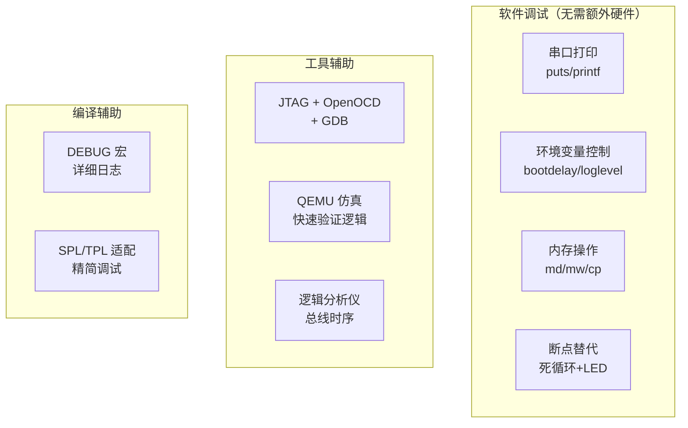

# U-Boot 调试方法与常见问题

## 前言

**C：** 嵌入式开发中"最怕的不是不会写代码，而是代码跑飞了连个错误信息都没有"。U-Boot 调试比应用开发难得多——没有 GDB 随便 attach、没有 printf 随便加（SPL 阶段连 malloc 都没有）。本篇汇总了 U-Boot 开发中所有实用的调试手段，从最简单的串口打印到 JTAG 硬件调试，再到各种常见问题的排查流程。

<!-- more -->

## 调试手段概览



## 串口调试（最基本）

### 串口连接

```
开发板 TXD → USB-TTL RXD
开发板 RXD → USB-TTL TXD
开发板 GND → USB-TTL GND
```

常见 USB-TTL 芯片：CH340、CP2102、FT232。

### 串口工具

```bash
# Linux
sudo picocom -b 115200 /dev/ttyUSB0
sudo minicom -D /dev/ttyUSB0 -b 115200
sudo screen /dev/ttyUSB0 115200

# Windows
PuTTY、Tera Term、MobaXterm
```

### 在代码中添加打印

**U-Boot proper 阶段**（有完整 printf 支持）：

```c
#include <common.h>
#include <log.h>

int my_function(void)
{
    log_debug("my_function called\n");      // DEBUG 级别
    log_info("Initializing hardware...\n");  // INFO 级别
    log_warning("Something unusual\n");      // WARNING 级别
    log_err("Something went wrong!\n");      // ERROR 级别

    printf("DDR start: 0x%08lx, size: 0x%08lx\n",
           gd->bd->bi_dram[0].start,
           gd->bd->bi_dram[0].size);
    return 0;
}
```

**SPL 阶段**（资源有限）：

```c
// SPL 中 printf 可能不可用，用 puts 更安全
#include <common.h>

void spl_early_init(void)
{
    puts("SPL: early init start\n");

    /* DDR 初始化 */
    puts("SPL: DDR init start\n");
    ddr_init();
    puts("SPL: DDR init done\n");
}
```

::: warning 注意

SPL 阶段**不要用 `printf` 的格式化功能**（如 `%d`、`%x`），它们可能需要额外的代码。用 `puts()` 更安全。如果需要打印数值，可以自己实现简化版。

:::

### U-Boot 日志级别控制

```bash
# 在 U-Boot 命令行中设置
setenv loglevel 7    # 最详细 (LOGL_DEBUG)
setenv loglevel 6    # VERBOSE
setenv loglevel 5    # INFO（默认）
setenv loglevel 4    # WARNING
setenv loglevel 3    # ERROR
setenv loglevel 0    # 关闭日志

# 编译时设置默认日志级别
# defconfig
CONFIG_LOG_MAX_LEVEL=7
```

## 内存调试

### md — 内存显示

```bash
# 查看寄存器（假设 GPIO 基地址 0xff720000）
md.l 0xff720000 0x10

# 查看内存中的内核镜像头
md.l ${kernel_addr_r} 0x20

# 持续监控某个寄存器（按 Ctrl+C 停止）
md.l 0xff720100 1 1    # 每秒刷新

# 搜索内存中的模式
# U-Boot 没有内置搜索命令，但可以用脚本
```

### mw — 内存写入

```bash
# 配置 GPIO 为输出
mw.l 0xff720000 0x00010001    # 设置方向寄存器

# 置高 GPIO
mw.l 0xff720004 0x00020000    # 数据寄存器置 1

# 清除一块内存
mw.l 0x40000000 0x0 0x1000
```

### mm — 交互式内存修改

```bash
# 逐个字修改（输入新值，空格下一个，回车结束）
mm.l 0xff720000
# 输出：0xff720000: 0x12345678 ? _
```

### cp — 内存复制

```bash
# 从地址 A 复制到地址 B
cp.b ${kernel_addr_r} 0x48000000 ${filesize}

# 验证复制
cmp.l ${kernel_addr_r} 0x48000000 0x1000
# Total of 4096 word(s) were the same
```

## 环境变量调试技巧

### 增加 bootdelay

```bash
setenv bootdelay 10    # 给自己更多时间按键
saveenv
```

### 单步执行 bootcmd

```bash
# 把 bootcmd 拆开手动执行
setenv bootcmd_mmc 'mmc dev 1'
setenv bootcmd_load 'fatload mmc 1:1 ${kernel_addr_r} Image'
setenv bootcmd_boot 'booti ${kernel_addr_r} - ${fdt_addr_r}'

# 逐步执行
run bootcmd_mmc
# 确认成功后再继续
run bootcmd_load
# 确认加载成功后再
run bootcmd_boot
```

### 使用 silent 模式

```bash
# 禁止自动启动，纯手动
setenv bootdelay -1
saveenv

# 每次上电直接进入命令行
```

## LED 和 GPIO 调试

在串口不可用时的最后手段：

```c
// 直接操作 GPIO 寄存器（非 DM 方式，适合 SPL 早期）
#define GPIO_BASE    0xff720000
#define GPIO_DIR     (GPIO_BASE + 0x00)
#define GPIO_DATA    (GPIO_BASE + 0x04)

void debug_led_on(void)
{
    writel(0x00000001, GPIO_DIR);    // 设为输出
    writel(0x00000001, GPIO_DATA);   // 置高
}

void debug_led_off(void)
{
    writel(0x00000001, GPIO_DIR);
    writel(0x00000000, GPIO_DATA);   // 置低
}

void debug_blink(int count)
{
    for (int i = 0; i < count; i++) {
        debug_led_on();
        mdelay(200);
        debug_led_off();
        mdelay(200);
    }
}
```

在关键位置放 blink，通过闪灯次数判断执行到哪里：

```c
void ddr_init(void)
{
    debug_blink(1);    // 1次 = DDR init start

    ddr_controller_init();
    debug_blink(2);    // 2次 = controller done

    ddr_phy_training();
    debug_blink(3);    // 3次 = training done

    dram_test();
    debug_blink(4);    // 4次 = test done
}
```

## JTAG 调试

### 硬件准备

| 组件 | 推荐 |
|------|------|
| JTAG 仿真器 | SEGGER J-Link / FTDI JTAG |
| 目标板 JTAG 接口 | 20-pin 或 10-pin |
| 软件 | OpenOCD + GDB |

### OpenOCD 配置

```tcl
# openocd-myboard.cfg
source [find interface/jlink.cfg]

# 根据芯片选择 target
source [find target/imx8mm.cfg]

# 或使用通用的 Cortex-A53 配置
set _CHIPNAME myboard
set _TARGETNAME $_CHIPNAME.cpu

jtag newtap $_CHIPNAME cpu -irlen 4 -expected-id 0x...

target create $_TARGETNAME cortex_a -chain-position $_CHIPNAME.cpu

# 初始化
init
halt
```

### 启动 OpenOCD

```bash
# 终端 1：启动 OpenOCD
openocd -f openocd-myboard.cfg

# 终端 2：连接 GDB
aarch64-linux-gnu-gdb u-boot

# GDB 命令
(gdb) target remote :3333
(gdb) load spl/u-boot-spl.elf
(gdb) break board_init_f
(gdb) continue
(gdb) print dram_size
(gdb) step
(gdb) info registers
```

### 常用 JTAG 调试操作

```bash
# 在 GDB 中
(gdb) break ddr_init           # 在 DDR 初始化处设断点
(gdb) continue                  # 继续运行
(gdb) step                      # 单步
(gdb) next                      # 下一行
(gdb) print *reg_ptr            # 打印寄存器值
(gdb) x/16x 0xff720000          # 查看 16 个字
(gdb) info registers            # 查看所有寄存器
(gdb) monitor reset halt        # 复位并停住
```

### JTAG 调试 SPL

SPL 的调试稍有不同——需要先加载 SPL 的 ELF 文件：

```bash
# 编译 SPL 的 ELF（确保有调试符号）
make spl/u-boot-spl

# GDB 中
(gdb) file spl/u-boot-spl.elf
(gdb) target remote :3333
(gdb) load
(gdb) break spl_board_init
(gdb) continue
```

## QEMU 仿真调试

对于 ARM64，可以用 QEMU 快速验证 U-Boot 的逻辑（不涉及硬件驱动）：

```bash
# 编译 QEMU ARM64 版本
make qemu_arm64_defconfig
make -j$(nproc)

# 运行
qemu-system-aarch64 -machine virt -cpu cortex-a57 \
    -nographic -bios u-boot.bin \
    -s -S    # -s 开启 GDB stub，-S 启动时暂停

# 另一个终端
aarch64-linux-gnu-gdb u-boot
(gdb) target remote :1234
(gdb) break board_init_r
(gdb) continue
```

QEMU 的局限：

- 不能验证真实硬件驱动（网络、存储、显示）
- 不能测试 DDR 初始化
- 可以验证启动流程逻辑、命令系统、设备树处理

## 常见问题排查流程

### 问题 1：串口完全无输出

```
排查流程：
1. 检查物理连接（TX/RX 交叉、GND 连接、波特率）
2. 确认 Boot ROM 在工作（测量晶振是否起振）
3. 检查启动介质（SD 卡是否插好、拨码开关是否正确）
4. 尝试不同的启动介质
5. 用示波器/逻辑分析仪检查 TXD 引脚是否有信号
6. 用万用表检查电压（3.3V/1.8V）
```

### 问题 2：SPL hang

```
排查流程：
1. Boot ROM 有输出吗？
   → 有：SPL 被加载了
   → 无：回到问题 1

2. SPL 有部分输出吗？
   → DDR 初始化前 hang：检查时钟、电源、Pinmux
   → DDR 初始化中 hang：检查 DDR 参数、型号匹配
   → 加载 U-Boot 时 hang：检查存储介质、镜像格式

3. 使用 JTAG 连接，看 PC 停在哪里
```

### 问题 3：U-Boot 重定位失败

```
### ERROR ### Please RESET the board ###

排查流程：
1. 检查 CONFIG_SYS_TEXT_BASE 是否与实际加载地址冲突
2. 检查 DDR 是否完整初始化（bdinfo 查看 DRAM 大小）
3. 检查是否有其他代码占用了 TEXT_BASE 地址
4. 尝试更换 TEXT_BASE
```

### 问题 4：bootm/bootz 后内核没启动

```
排查流程：
1. 确认内核镜像加载成功
   md.l ${kernel_addr_r} 0x4
   # 检查 magic number

2. 确认设备树加载成功
   fdt addr ${fdt_addr_r}
   fdt list /

3. 确认 bootargs 正确
   printenv bootargs

4. 确认内核入口地址正确
   # ARM64: Image 必须在 2MB 对齐地址
   # 检查 kernel_addr_r 是否 2MB 对齐

5. 确认设备树 compatible 匹配内核支持
```

### 问题 5：环境变量丢失

```
Warning - bad CRC, using default environment

排查流程：
1. 首次烧录正常现象，执行一次 saveenv
2. 如果反复出现：检查存储介质写保护
3. 检查 CONFIG_ENV_OFFSET 是否被其他分区覆盖
4. 检查 CONFIG_ENV_SIZE 是否足够
```

### 问题 6：网络不通

```
排查流程：
1. ping 服务器
   → 不通：物理层问题
     - 确认网线、PHY 复位、MAC 地址
     - 用 md 读取 PHY 寄存器确认 PHY 状态

2. DHCP 失败
   → 检查 DHCP 服务是否运行
   → 确认网段匹配
   → 尝试手动设置 IP

3. TFTP 超时
   → 检查 TFTP 服务状态
   → 检查文件存在和权限
   → 增大 TFTP 块大小
```

## U-Boot 调试宏

```c
// 开发调试时启用
#define DEBUG                    // 启用当前文件的 debug 输出
#define CONFIG_DEBUG_LL          // 低级调试（最早期的打印）
#define CONFIG_SYS_ICACHE_OFF    // 关闭 I-Cache（方便调试）
#define CONFIG_SYS_DCACHE_OFF    // 关闭 D-Cache

// defconfig 中
CONFIG_LOG=y                    // 启用日志系统
CONFIG_LOG_MAX_LEVEL=8          // 最大日志级别
```

## 性能分析

### 启动时间测量

```c
// 在关键位置打时间戳
void board_init_f(ulong boot_flags)
{
    timer_init();
    printf("board_init_f: %lu ms\n", get_timer(0));

    dram_init();
    printf("dram_init: %lu ms\n", get_timer(0));

    // ...
}

// U-Boot 内置计时
// bootstage 功能
#define CONFIG_BOOTSTAGE=y
#define CONFIG_BOOTSTAGE_REPORT=y

// 启动后查看时间报告
# bootstage report
```

### bootstage 输出示例

```
Timer summary in microseconds:
       Mark    Elapsed  Stage
          0          0  reset
      5,000      5,000  SPL
     50,000     45,000  board_init_f
    200,000    150,000  DDR init
    250,000     50,000  board_init_r
    280,000     30,000  main_loop
```

## 调试检查清单

- [ ] 串口连接正确（TX/RX 交叉、GND、波特率）
- [ ] bootdelay 足够大（建议 5-10）
- [ ] 编译时启用 DEBUG / LOG
- [ ] SPL 中用 puts() 而非 printf()
- [ ] 内存操作前确认地址正确（避免写坏寄存器）
- [ ] 使用 JTAG 在 SPL hang 时定位问题
- [ ] LED/GPIO blink 辅助定位（无串口时）
- [ ] bootcmd 拆分单步执行
- [ ] 使用 QEMU 验证逻辑（不依赖硬件）
- [ ] 记录 bootstage 时间分析启动速度

## 小结

本篇汇总了 U-Boot 的全面调试方法：

- 串口调试：puts/printf/log 级别控制
- 内存调试：md/mw/mm/cp 操作寄存器和内存
- 环境变量技巧：增大 bootdelay、拆分 bootcmd
- LED/GPIO 调试：无串口时的定位方法
- JTAG 调试：OpenOCD + GDB 硬件级调试
- QEMU 仿真：快速验证逻辑不依赖硬件
- 常见问题排查流程：无输出、SPL hang、内核启动失败等
- 性能分析：bootstage 启动时间测量

至此，本系列从概念到实战，覆盖了 U-Boot 开发的方方面面。希望对你在嵌入式 Linux 开发道路上有所帮助！

::: tip 持续更新中

章节与示例会陆续补充；若你发现疏漏或与所用 U-Boot 版本不符之处，欢迎评论交流。

:::
