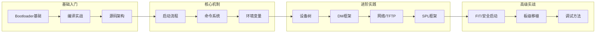

# U-Boot从入门到精通

## 前言

**C：** U-Boot 是嵌入式 Linux 世界的"守门人"——不管你用的是什么 SoC，上电之后第一个有意义的软件几乎都是它。本系列从 Bootloader 基础概念讲起，由浅入深地覆盖源码架构、编译配置、启动流程、命令系统、设备树、驱动模型、网络启动、SPL 框架、FIT 安全启动、板级移植和调试方法。无论你是刚接触嵌入式的新人，还是需要做板级移植的工程师，都能在这里找到系统的学习路径。

<!-- more -->

## 本册内容范围

### 基础入门篇

- Bootloader 概念与 U-Boot 简介
- 源码获取、交叉编译与 QEMU 验证
- 目录结构与代码架构全景

### 核心机制篇

- 启动流程：Boot ROM → SPL → U-Boot → Kernel
- 命令系统：内置命令、脚本、自定义命令开发
- 环境变量系统：存储后端、冗余保护、回调机制

### 进阶实践篇

- 设备树在 U-Boot 中的加载与动态修改
- Driver Model (DM) 三层驱动框架
- 网络功能与 TFTP/NFS 网络启动
- SPL/TPL 极简启动框架与 DDR 初始化

### 高级实战篇

- FIT 镜像格式与 RSA 安全启动
- 完整的板级移植流程（以 i.MX8MM 为例）
- 调试方法：串口/JTAG/QEMU/LED 全覆盖

## 学习路线图

---

## 基础入门篇

### 第一组：U-Boot 基础与入门

1. [U-Boot 概述与 Bootloader 基础](/courses/uboot/01-U-Boot基础与入门/01-U-Boot概述与Bootloader基础)
2. [源码获取与编译入门](/courses/uboot/01-U-Boot基础与入门/02-源码获取与编译入门)
3. [目录结构与代码架构](/courses/uboot/01-U-Boot基础与入门/03-目录结构与代码架构)

---

## 核心机制篇

### 第二组：启动流程与核心机制

1. [U-Boot 启动流程详解](/courses/uboot/02-启动流程与核心机制/01-U-Boot启动流程详解)
2. [命令系统详解](/courses/uboot/02-启动流程与核心机制/02-命令系统详解)
3. [环境变量系统](/courses/uboot/02-启动流程与核心机制/03-环境变量系统)

---

## 进阶实践篇

### 第三组：进阶功能与实践

1. [设备树在 U-Boot 中的使用](/courses/uboot/03-进阶功能与实践/01-设备树在U-Boot中的使用)
2. [Driver Model 驱动框架](/courses/uboot/03-进阶功能与实践/02-Driver-Model驱动框架)
3. [网络功能与 TFTP 启动](/courses/uboot/03-进阶功能与实践/03-网络功能与TFTP启动)
4. [SPL 框架与极简启动](/courses/uboot/03-进阶功能与实践/04-SPL框架与极简启动)

---

## 高级实战篇

### 第四组：高级主题与实战

1. [FIT 镜像格式与安全启动](/courses/uboot/04-高级主题与实战/01-FIT镜像格式与安全启动)
2. [U-Boot 移植实战指南](/courses/uboot/04-高级主题与实战/02-U-Boot移植实战指南)
3. [U-Boot 调试方法与常见问题](/courses/uboot/04-高级主题与实战/03-U-Boot调试方法与常见问题)

---

## 学习建议

- 基础入门篇建议按顺序阅读，各篇之间有依赖关系
- 核心机制篇是理解 U-Boot 的关键，启动流程篇值得反复阅读
- 进阶实践篇可根据需要选择性阅读，但建议至少通读 DM 框架
- 高级实战篇适合有实际移植需求的读者
- 每篇文章都包含可运行的代码示例，建议边看边动手实践
- 平台差异极大，文中命令与地址需按具体芯片与板级理解，不可照搬

::: tip 持续更新中

章节与示例会陆续补充；若你发现疏漏或与当前 U-Boot 版本不符之处，欢迎评论交流。

:::
