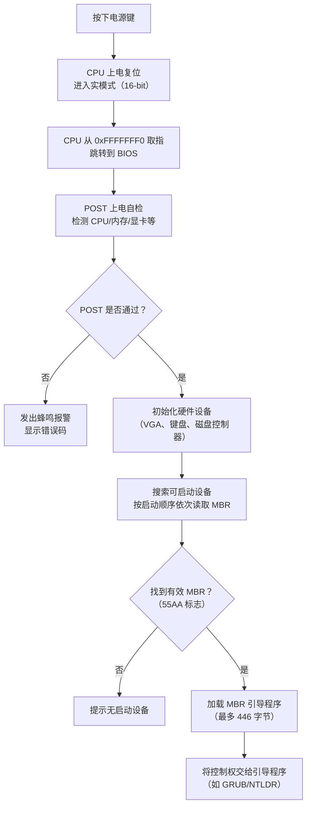
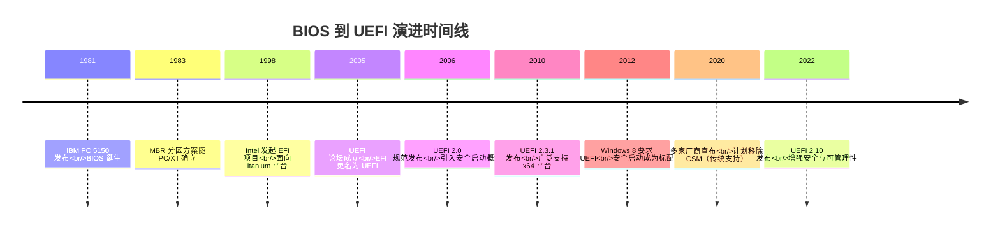

# BIOS到UEFI的演进

## 前言

**C：** 每次开机时屏幕上一闪而过的 logo 背后，其实藏着一整套固件系统的运作。这篇文章带你从古老的 BIOS 出发，看看它为什么被 UEFI 取代，整个演进过程中发生了哪些关键变化。搞清楚这段历史，你才能真正理解现代计算机是怎么启动的。

<!-- more -->

## 什么是 BIOS

BIOS（Basic Input/Output System，基本输入输出系统）是 IBM 在 1981 年为第一台 PC（IBM PC 5150）设计的固件接口。它的核心职责很简单：在操作系统接管之前，完成硬件初始化，并提供一套基本的 I/O 服务。

```c
/* 传统 BIOS 中断调用示例 —— 直接向显存写入字符 */
#include <dos.h>

void print_char(char c, int x, int y) {
    // BIOS 中断 0x10 —— 视频服务
    // AH=0x02: 设置光标位置
    // AH=0x09: 在光标处写字符
    union REGS regs;
    regs.h.ah = 0x02;
    regs.h.bh = 0x00;  // 第 0 页
    regs.h.dh = (unsigned char)y;
    regs.h.dl = (unsigned char)x;
    int86(0x10, &regs, &regs);

    regs.h.ah = 0x09;
    regs.h.al = c;
    regs.h.bl = 0x07;  // 白色前景、黑色背景
    regs.x.cx = 1;     // 写 1 个字符
    int86(0x10, &regs, &regs);
}
```

BIOS 固件通常被烧录在主板上一块 SPI Flash 芯片里，容量一般只有 4MB～16MB。每次你按下电源键，CPU 就会从 `0xFFFFFFF0`（即 Flash 的末端）开始执行第一条指令，跳转到 BIOS 的实模式代码。

## BIOS 的核心工作流程



从流程图可以看出，BIOS 只负责"点到为止"——找到 MBR（Master Boot Record）并把控制权丢过去，后面的操作系统加载就不再管了。

## BIOS 的致命局限

BIOS 在 PC 诞生后的四十多年里几乎没有本质变化，但它的问题越来越明显：

### 1. 16 位实模式的枷锁

BIOS 运行在 CPU 的实模式下，只能寻址 **1MB** 地址空间，其中可用区域甚至不到 640KB。在现代动辄数十 GB 内存的机器上，这简直是个笑话。

```asm
; BIOS 启动代码运行在实模式 —— 段地址:偏移 寻址
; 最大寻址范围：0x00000 ~ 0xFFFFF（1MB）
[BITS 16]
org 0x7C00          ; MBR 加载地址

start:
    mov ax, 0x07C0
    mov ds, ax       ; 设置数据段
    mov si, msg
    call print_string
    jmp $

print_string:
    lodsb            ; 从 DS:SI 加载字节到 AL
    or al, al        ; 检查是否为 0（字符串结尾）
    jz .done
    mov ah, 0x0E     ; BIOS 中断 0x10 teletype 输出
    int 0x10
    jmp print_string
.done:
    ret

msg: db 'Hello from BIOS!', 0

times 510 - ($ - $$) db 0
dw 0xAA55            ; MBR 有效标志
```

### 2. MBR 分区方案的局限

| 特性 | MBR | GPT（UEFI 搭配使用） |
|------|-----|---------------------|
| 最大分区数 | 4 个主分区 | 128 个分区 |
| 单个分区上限 | 2TB | 18EB（理论值） |
| 分区表位置 | 扇区 0（前 512 字节） | LBA 0～33 |
| 冗余备份 | 无 | 有（分区表头部和条目各一份） |
| 校验机制 | 无 CRC | 有 CRC32 校验 |
| UEFI 支持 | 需 CSM 兼容层 | 原生支持 |

### 3. 没有统一的驱动模型

BIOS 里每个硬件驱动都是固件厂商自己写的"黑盒代码"，操作系统无法复用这些驱动。这就导致：
- 操作系统必须为每个硬件重新写一套驱动
- 固件和操作系统之间无法有效协作
- 新硬件的支持完全依赖 BIOS 更新

### 4. 安全性几乎为零

BIOS 没有安全启动（Secure Boot）的概念，任何 MBR 里的代码都会被无条件执行。这为 Bootkit 类恶意软件提供了可乘之机。

::: warning 安全隐患
著名的 CIH 病毒（1998年）就是利用了 BIOS 没有写保护机制的漏洞，直接擦写 Flash 中的 BIOS 固件，导致主板"变砖"。
:::

## UEFI 诞生的驱动力

1998 年，Intel 发起了 **EFI（Extensible Firmware Interface）** 项目，最初用于 Itanium（安腾）服务器平台。Itanium 不兼容 x86 实模式，根本无法运行传统 BIOS，所以 Intel 必须设计一套全新的固件接口。

2005 年，Intel 将 EFI 贡献给了新成立的 **UEFI 论坛（UEFI Forum）**，多家厂商共同参与标准化，EFI 正式更名为 UEFI（Unified Extensible Firmware Interface，统一可扩展固件接口）。

## 关键里程碑



## BIOS vs UEFI 全面对比

| 对比维度 | BIOS | UEFI |
|----------|------|------|
| **运行模式** | 16 位实模式 | 32/64 位保护模式 |
| **寻址能力** | 1MB | 完整物理地址空间 |
| **启动设备** | MBR 分区 | GPT 分区（兼容 MBR） |
| **用户界面** | 纯文本 | 图形化（鼠标支持） |
| **驱动模型** | 无统一模型 | UEFI Driver Model |
| **安全启动** | 不支持 | 支持（Secure Boot） |
| **网络支持** | 非常有限 | 原生 TCP/IP 协议栈 |
| **可扩展性** | 中断扩展（INT 13h 等） | Protocol 模式，高度可扩展 |
| **固件容量** | 通常 4MB | 通常 16MB～32MB |
| **启动速度** | 较慢（串行初始化） | 较快（并行初始化） |
| **标准组织** | 事实标准（IBM 遗产） | UEFI Forum 官方标准 |

::: details CSM 是什么？
CSM（Compatibility Support Module，兼容性支持模块）是 UEFI 固件中的一个组件，它的作用是模拟传统 BIOS 的行为，让不支持 UEFI 启动的操作系统（如旧版 Windows）仍然可以启动。随着 UEFI 的全面普及，大多数现代主板已经移除了 CSM 选项。
:::

## 为什么说 UEFI 是必然趋势

1. **硬件发展的倒逼**：64 位 CPU、大容量内存、NVMe SSD 等新硬件让 16 位实模式的 BIOS 越来越力不从心
2. **安全需求的提升**：Rootkit 和 Bootkit 威胁日益严重，Secure Boot 成为刚需
3. **启动速度的期望**：现代用户期望"秒开"，UEFI 的并行初始化和快速启动（Fast Boot）显著提升了体验
4. **跨平台统一的需求**：ARM、RISC-V 等非 x86 架构的崛起需要一个与架构无关的固件标准

::: tip
如果你想在现代系统上确认自己的启动模式，Linux 下可以运行：
```bash
[ -d /sys/firmware/efi ] && echo "UEFI 模式" || echo "BIOS（Legacy）模式"
```
:::

## 小结

BIOS 服务了 PC 行业三十多年，但 16 位实模式、MBR 分区和缺乏安全机制的三大硬伤注定了它必须被替代。UEFI 从 Intel 的 EFI 项目演化而来，通过 UEFI Forum 的标准化，成为了跨越 x86、ARM、RISC-V 的通用固件标准。理解这段演进历史，是深入学习 UEFI 的第一步。接下来我们会详细拆解 UEFI 的架构和启动流程。
