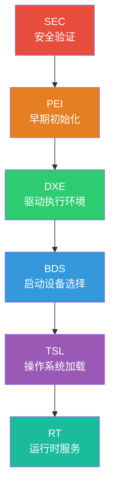
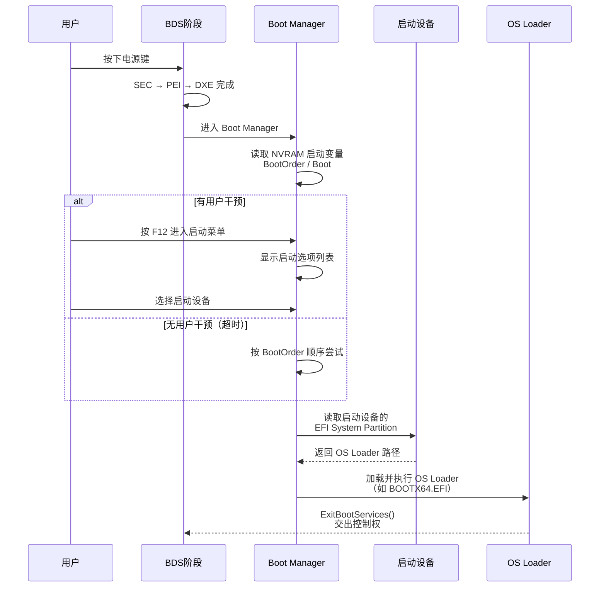
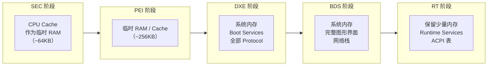

# UEFI架构与启动流程

## 前言

**C：** 上篇文章我们聊了 BIOS 为什么被 UEFI 取代，这篇就来拆解 UEFI 内部到底是怎么运作的。你会看到 UEFI 的六阶段启动架构、Boot Manager 的决策逻辑，以及整个启动过程中各阶段分别做了什么。理解这些，你就能搞明白电脑开机后到操作系统接管前的那几秒钟里到底发生了什么。

<!-- more -->

## UEFI 固件的六大阶段

UEFI 固件的执行过程被划分为六个清晰的阶段（Phase），每个阶段有明确的职责和边界。这是 UEFI 相比 BIOS 最大的架构改进之一。



### SEC — Security（安全验证）

SEC 是整个启动链的第一步，通常由固化在 CPU 内部的微码（Microcode）执行。它的职责是：

- CPU 上电复位后执行的第一段代码
- 验证处理器的安全状态
- 建立最基础的执行环境（临时内存、栈）
- 加载并跳转到 PEI 阶段

SEC 阶段的代码量非常小，通常只有几 KB，是"信任链"的起点。

### PEI — Pre-EFI Initialization（早期初始化）

PEI 阶段负责在资源极其有限的情况下完成基本的硬件初始化：

```c
/* PEI 阶段典型的内存发现过程（伪代码） */
EFI_STATUS FindAndInstallMemory(
    IN EFI_PEI_SERVICES **PeiServices
) {
    EFI_PEI_READ_ONLY_VARIABLE2_PPI *VariablePpi;
    UINT64                           TotalMemory;
    EFI_PHYSICAL_ADDRESS              MemoryBase;

    // 1. 通过内存控制器发现可用内存
    TotalMemory = MrcDiscoverSystemMemory();

    // 2. 安装临时 RAM 作为 PEI 的工作内存
    MemoryBase = InstallTemporaryRam(PEI_TEMP_RAM_BASE, PEI_TEMP_RAM_SIZE);

    // 3. 汇报已发现的内存资源给 DXE
    BuildResourceDescriptorHob(
        EFI_RESOURCE_SYSTEM_MEMORY,
        0,
        MemoryBase,
        TotalMemory
    );

    return EFI_SUCCESS;
}
```

PEI 阶段的关键动作包括：

| 动作 | 说明 |
|------|------|
| 初始化 CPU 缓存 | 使用 L1/L2 Cache 作为临时 RAM |
| 初始化内存控制器 | 配置 DDR 时序参数 |
| 初始化 SPI Flash | 读取后续阶段的固件镜像 |
| 发现基本硬件 | CPU 核心数、内存容量等 |
| 传递 HOB 列表 | 通过 Hand-Off Block 向 DXE 传递信息 |

::: details 什么是 HOB？
HOB（Hand-Off Block）是 PEI 阶段向 DXE 阶段传递数据的标准机制。PEI 将已发现的硬件信息（内存布局、资源描述等）组织成链表形式的 HOB，DXE 阶段读取这些 HOB 来了解系统状态。你可以把 HOB 理解为 PEI 和 DXE 之间的"交接清单"。
:::

### DXE — Driver Execution Environment（驱动执行环境）

DXE 是 UEFI 中最复杂、最核心的阶段。这个阶段拥有完整的 32/64 位运行环境，绝大多数硬件驱动都在这里加载执行。

```c
/* DXE 阶段的驱动入口函数模板 */
EFI_STATUS
EFIAPI
MyDriverEntryPoint(
    IN EFI_HANDLE        ImageHandle,
    IN EFI_SYSTEM_TABLE  *SystemTable
) {
    EFI_STATUS  Status;
    
    // 1. 安装 Protocol（协议）到系统
    Status = gBS->InstallProtocolInterface(
        &ImageHandle,
        &gEfiDriverBindingProtocolGuid,
        EFI_NATIVE_INTERFACE,
        &gDriverBinding
    );
    
    if (EFI_ERROR(Status)) {
        return Status;
    }
    
    // 2. 注册 Driver Supported EFI Version Protocol
    Status = gBS->InstallProtocolInterface(
        &ImageHandle,
        &gEfiDriverSupportedEfiVersionProtocolGuid,
        EFI_NATIVE_INTERFACE,
        &gDriverSupportedEfiVersion
    );
    
    return Status;
}
```

DXE 的核心组件包括：

- **DXE Core（DXE 内核）**：负责调度驱动、管理 Protocol、维护服务表
- **DXE Dispatcher（调度器）**：按依赖顺序加载和执行 DXE Driver
- **Protocol 数据库**：所有已注册的 Protocol 实例的集中管理
- **Boot Services**：提供内存分配、事件通知、Protocol 查询等服务

### BDS — Boot Device Selection（启动设备选择）

BDS 阶段是连接固件和操作系统的桥梁，负责：

1. 执行用户配置的策略（启动顺序、超时设置）
2. 枚举所有可启动设备
3. 根据优先级选择启动项
4. 加载选定的启动设备上的 OS Loader



### TSL — Transient System Load（临时系统加载）

TSL 是操作系统加载器（OS Loader）正在执行、但尚未调用 `ExitBootServices()` 的阶段。此时 Boot Services 仍然可用，OS Loader 可以利用它们来：

- 读取磁盘上的文件（通过 Simple File System Protocol）
- 获取硬件信息（通过 ACPI 表、SMBIOS 表）
- 显示启动画面（通过 Graphics Output Protocol）

::: tip ExitBootServices
当 OS Loader 完成准备工作，准备好自己的运行环境后，会调用 `ExitBootServices()`。这个调用会终止所有 Boot Services，释放固件占用的内存，并将控制权完全移交给操作系统。这是一个"不可逆"的操作。
:::

### RT — Runtime（运行时）

进入 RT 阶段后，操作系统已经完全接管了系统。但固件并没有完全退出——它保留了一小部分服务供操作系统调用：

- **时间服务**：读写 RTC（实时时钟）
- **变量服务**：读写 NVRAM 中的 UEFI 变量
- **重置服务**：重启、关机等

```c
/* 操作系统运行时调用 UEFI Runtime Services 的示例（Linux 内核） */
void efi_get_time_in_kernel(void) {
    efi_time_t      efi_time;
    efi_time_cap_t  capabilities;
    efi_status_t    status;

    // 通过 EFI Runtime Services 获取当前时间
    status = efi.get_time(&efi_time, &capabilities);
    if (status == EFI_SUCCESS) {
        pr_info("EFI Time: %04d-%02d-%02d %02d:%02d:%02d\n",
                efi_time.year, efi_time.month, efi_time.day,
                efi_time.hour, efi_time.minute, efi_time.second);
    }
}
```

## Boot Manager 的工作机制

Boot Manager 是 BDS 阶段的核心，它通过 **NVRAM 变量** 来管理启动配置。

### 启动变量

UEFI 使用以下关键变量来管理启动：

| 变量名 | 类型 | 说明 |
|--------|------|------|
| `BootOrder` | UINT16 数组 | 启动顺序，值对应 Boot#### 的编号 |
| `Boot0000`~`BootFFFF` | Load Option | 每个启动项的详细描述 |
| `BootCurrent` | UINT16 | 当前正在使用的启动项编号 |
| `BootNext` | UINT16 | 下次启动时强制使用的启动项 |
| `BootOptionSupport` | UINT32 | Boot Manager 支持的特性标志 |

每个 `Boot####` 变量的结构为：

```c
typedef struct {
    UINT32  Attributes;        // 启动项属性（ACTIVE/FORCE_RECONNECT等）
    UINT16  FilePathListLength; // 文件路径列表长度
    CHAR16  Description[];      // 启动项描述（UTF-16 字符串）
    // EFI_DEVICE_PATH_PROTOCOL FilePathList[];  // 设备路径
    // UINT8 OptionalData[];     // 可选数据
} EFI_LOAD_OPTION;
```

### UEFI Shell

UEFI Shell 是一个内置在固件中的命令行环境，类似于 DOS 的 command.com。它在你需要调试启动问题或手动加载驱动时非常有用。

```bash
# 常用 UEFI Shell 命令
Shell> map -r           # 列出所有映射的设备
Shell> fs0:             # 切换到 FS0 分区
FS0:\> ls               # 列出当前目录文件
FS0:\> dir EFI\BOOT     # 查看 EFI 启动目录
FS0:\> bcfg boot dump   # 列出所有启动项
FS0:\> bcfg boot add 1 fs0:\EFI\BOOT\grubx64.efi "GRUB"  # 手动添加启动项
```

::: warning 生产环境注意
UEFI Shell 在生产环境中通常被禁用或需要密码保护，因为它可以绕过安全启动直接执行任意 EFI 应用。在安全审计时务必检查 Shell 的访问控制。
:::

## UEFI 与 ACPI 的关系

ACPI（Advanced Configuration and Power Interface）是硬件描述和电源管理的标准，UEFI 和 ACPI 各司其职又紧密配合：

| 方面 | UEFI | ACPI |
|------|------|------|
| **核心职责** | 硬件初始化、启动管理 | 硬件资源描述、电源管理 |
| **工作阶段** | 启动过程 | 启动过程 + 运行时 |
| **数据格式** | Protocol / HOB | DSDT / SSDT 表 |
| **与 OS 交互** | Boot Services → Runtime Services | OSPM 直接读取 ACPI 表 |

UEFI 固件在 DXE 阶段会安装 ACPI 表到系统内存中，OS Loader 和操作系统通过解析这些表来了解硬件拓扑和电源管理策略。

## 各阶段资源使用对比



## 小结

UEFI 的六阶段架构（SEC → PEI → DXE → BDS → TSL → RT）将启动过程拆分成了职责明确的模块。SEC 和 PEI 在极其有限的资源下完成最基础的硬件初始化；DXE 是驱动加载和执行的核心引擎；BDS 通过 Boot Manager 按策略选择启动设备；TSL 是 OS Loader 的过渡阶段；RT 阶段固件退居幕后，仅保留运行时服务。这套架构让 UEFI 既有灵活性，又有良好的可维护性。下一篇我们将深入 UEFI 提供的服务体系——Boot Services 和 Runtime Services。
