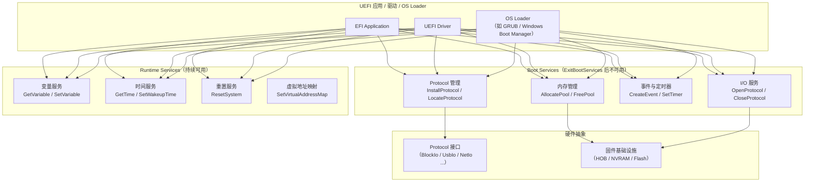
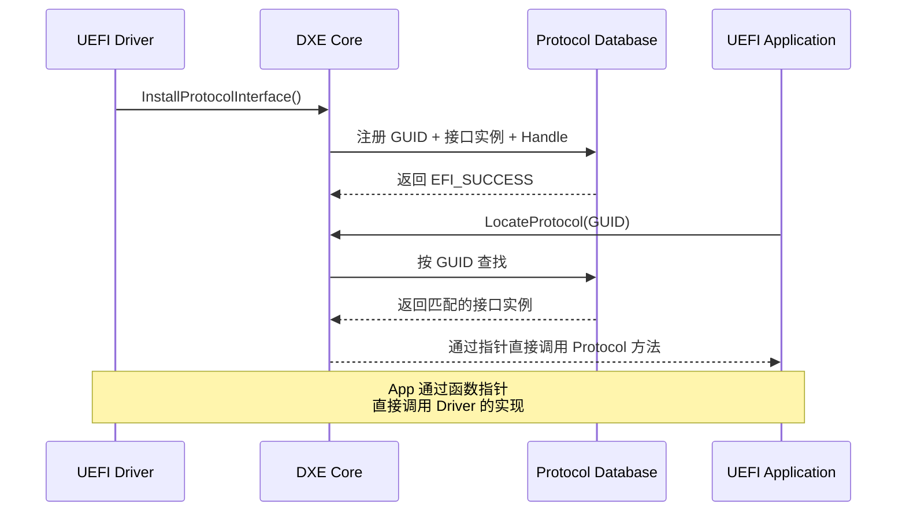

# UEFI固件与标准服务概述

## 前言

**C：** 前两篇我们搞懂了 UEFI 的来龙去脉和启动流程，这篇要聚焦 UEFI 最核心的能力——它到底提供了哪些服务、Protocol 是什么概念、驱动和应用有什么区别。理解这些内容后，你就具备了阅读甚至编写 UEFI 代码的基础。

<!-- more -->

## UEFI 规范概览

UEFI 规范由 **UEFI Forum** 维护，当前最新主要版本是 UEFI 2.10（2022年发布）。规范分为多个子规范：

| 子规范 | 全称 | 核心内容 |
|--------|------|----------|
| UEFI Spec | UEFI Specification | 核心架构、服务定义、Protocol |
| PI Spec | Platform Initialization | SEC/PEI/DXE/BDS 硬件初始化 |
| ACPI Spec | Advanced Configuration and Power Interface | 硬件描述与电源管理 |
| SMBIOS Spec | System Management BIOS | 系统信息描述 |
| UEFI Shell Spec | UEFI Shell Specification | Shell 命令与脚本 |

::: tip 获取规范原文
UEFI Forum 官网（[uefi.org](https://uefi.org)）提供了所有规范的免费 PDF 下载。建议先从 UEFI Specification 开始阅读，重点关注第 4 章（Services）和第 6～12 章（各种 Protocol 的定义）。
:::

## 系统表与服务总览

所有 UEFI 程序（应用、驱动、OS Loader）在入口处都会收到两个关键数据结构：

```c
/* 每个 UEFI 程序的入口函数签名 */
EFI_STATUS
EFIAPI
EfiMain(
    IN EFI_HANDLE        ImageHandle,   // 本镜像的句柄
    IN EFI_SYSTEM_TABLE  *SystemTable   // 系统表指针
);

/* EFI_SYSTEM_TABLE 定义（简化版） */
typedef struct {
    EFI_TABLE_HEADER    Hdr;
    
    // 指向固件提供的只读字符串表
    CHAR16              *FirmwareVendor;
    UINT32              FirmwareRevision;
    
    // === 核心服务表 ===
    EFI_RUNTIME_SERVICES   *RuntimeServices;  // 运行时服务（一直存在）
    EFI_BOOT_SERVICES      *BootServices;     // 启动服务（ExitBootServices 后失效）
    
    // === 系统配置表 ===
    UINTN               NumberOfConfigurationTableEntries;
    EFI_CONFIGURATION_TABLE  *ConfigurationTable;  // 包含 ACPI/SMBIOS 等表
} EFI_SYSTEM_TABLE;
```

## 服务分层架构



## Boot Services 详解

Boot Services 是 UEFI 提供的最主要的服务集合，仅在操作系统调用 `ExitBootServices()` 之前可用。它们涵盖了内存管理、Protocol 操作、事件机制等核心功能。

### 关键 Boot Services API

```c
/* 内存分配示例 */
EFI_STATUS AllocateMemoryDemo(EFI_BOOT_SERVICES *BS) {
    VOID        *Buffer = NULL;
    UINTN       BufSize = 4096;
    EFI_STATUS  Status;
    
    // 分配 4KB 内存（Runtime 类型，ExitBootServices 后仍可用）
    Status = BS->AllocatePool(EfiRuntimeServicesData, BufSize, &Buffer);
    if (EFI_ERROR(Status)) {
        return Status;
    }
    
    // 使用内存...
    
    // 用完后释放
    BS->FreePool(Buffer);
    return EFI_SUCCESS;
}

/* 查找并使用 Protocol 示例 */
EFI_STATUS UseBlockIoProtocol(EFI_BOOT_SERVICES *BS) {
    EFI_BLOCK_IO_PROTOCOL  *BlockIo;
    EFI_HANDLE             *HandleBuffer;
    UINTN                  HandleCount;
    UINTN                  Index;
    EFI_STATUS             Status;
    
    // 1. 枚举所有拥有 BlockIo Protocol 的设备句柄
    Status = BS->LocateHandleBuffer(
        ByProtocol,
        &gEfiBlockIoProtocolGuid,
        NULL,
        &HandleCount,
        &HandleBuffer
    );
    if (EFI_ERROR(Status)) return Status;
    
    // 2. 遍历每个设备
    for (Index = 0; Index < HandleCount; Index++) {
        // 打开设备的 BlockIo Protocol
        Status = BS->OpenProtocol(
            HandleBuffer[Index],
            &gEfiBlockIoProtocolGuid,
            (VOID **)&BlockIo,
            gImageHandle,
            NULL,
            EFI_OPEN_PROTOCOL_GET_PROTOCOL
        );
        
        if (!EFI_ERROR(Status)) {
            // 读取设备前 512 字节
            UINT8 Data[512];
            Status = BlockIo->ReadBlocks(
                BlockIo,
                BlockIo->Media->MediaId,
                0,        // LBA 起始地址
                512,      // 字节数
                Data
            );
        }
    }
    
    BS->FreePool(HandleBuffer);
    return EFI_SUCCESS;
}
```

### 主要 Boot Services 分类

| 分类 | 代表 API | 用途 |
|------|----------|------|
| 内存管理 | `AllocatePool`, `FreePool`, `AllocatePages` | 动态内存分配/释放 |
| Protocol 管理 | `InstallProtocol`, `LocateProtocol`, `OpenProtocol` | 注册和查找设备接口 |
| 事件与定时器 | `CreateEvent`, `SetTimer`, `SignalEvent` | 异步通知与定时 |
| 镜像管理 | `LoadImage`, `StartImage`, `UnloadImage` | 加载和启动 UEFI 程序 |
| I/O 服务 | `OpenProtocol`, `HandleProtocol` | 访问硬件设备 |

## Runtime Services 详解

Runtime Services 是在操作系统接管后仍然保留的少量固件服务，它们从 `ExitBootServices()` 之前就被"标记"为运行时数据，在虚拟地址映射后仍然可以访问。

```c
/* UEFI 变量读写示例 */
EFI_STATUS ReadBootOrder(EFI_RUNTIME_SERVICES *RT) {
    UINT32      Attributes;
    UINTN       DataSize;
    UINT16      *BootOrder;
    EFI_STATUS  Status;

    // 先查询变量大小
    DataSize = 0;
    Status = RT->GetVariable(
        L"BootOrder",                    // 变量名（UTF-16）
        &gEfiGlobalVariableGuid,         // 变量 GUID
        &Attributes,                      // 输出：变量属性
        &DataSize,                        // 输入：缓冲区大小 / 输出：实际大小
        NULL                              // 输出：变量数据
    );

    if (Status == EFI_BUFFER_TOO_SMALL) {
        // 分配足够大的缓冲区
        BootOrder = AllocatePool(DataSize);
        Status = RT->GetVariable(
            L"BootOrder",
            &gEfiGlobalVariableGuid,
            &Attributes,
            &DataSize,
            BootOrder
        );

        if (!EFI_ERROR(Status)) {
            // BootOrder 是 UINT16 数组，每个元素代表一个 Boot#### 编号
            UINTN Count = DataSize / sizeof(UINT16);
            for (UINTN i = 0; i < Count; i++) {
                // BootOrder[0] 是第一启动项, BootOrder[1] 是第二启动项...
            }
            FreePool(BootOrder);
        }
    }
    return Status;
}
```

::: warning Runtime Services 的使用限制
Runtime Services 代码和数据必须被放置在物理内存的特定区域（通常由 UEFI 固件在启动时标记为 `EfiRuntimeServicesCode` 和 `EfiRuntimeServicesData` 类型）。操作系统在设置虚拟地址映射时，必须为这些区域保留映射并调用 `SetVirtualAddressMap()` 通知固件。
:::

## Protocol 机制

Protocol 是 UEFI 中最核心的抽象概念。你可以把它理解为 C++ 中的**接口（Interface）**——它定义了一组函数指针（方法），但本身不包含实现。具体的硬件驱动负责安装特定 Protocol 的实例。

### Protocol 的结构

```c
/* Protocol 由 GUID + 接口结构体组成 */

// 每个 Protocol 都有一个唯一的 GUID 标识
#define EFI_BLOCK_IO_PROTOCOL_GUID \
    { 0x964E5B21, 0x6459, 0x11D2, \
      { 0x8E, 0x39, 0x00, 0xA0, 0xC9, 0x69, 0x72, 0x3B } }

// Protocol 的接口定义（函数指针表）
typedef struct _EFI_BLOCK_IO_PROTOCOL {
    UINT64               Revision;
    EFI_MEDIA            *Media;           // 媒体信息（只读/可写、块大小等）
    
    EFI_BLOCK_RESET      Reset;            // 重置块设备
    EFI_BLOCK_READ       ReadBlocks;       // 读块
    EFI_BLOCK_WRITE      WriteBlocks;      // 写块
    EFI_BLOCK_FLUSH      FlushBlocks;      // 刷新缓存
} EFI_BLOCK_IO_PROTOCOL;
```

### Protocol 的生命周期



### 常用 Protocol 一览

| Protocol | 用途 |
|----------|------|
| `EFI_BLOCK_IO_PROTOCOL` | 块设备读写（硬盘、U盘） |
| `EFI_SIMPLE_FILE_SYSTEM_PROTOCOL` | 文件系统访问 |
| `EFI_SIMPLE_NETWORK_PROTOCOL` | 网络通信 |
| `EFI_GRAPHICS_OUTPUT_PROTOCOL` | 图形输出（GOP） |
| `EFI_SERIAL_IO_PROTOCOL` | 串口通信 |
| `EFI_USB_IO_PROTOCOL` | USB 设备访问 |
| `EFI_LOADED_IMAGE_PROTOCOL` | 已加载镜像信息 |
| `EFI_DEVICE_PATH_PROTOCOL` | 设备路径描述 |

## UEFI 驱动模型

UEFI 驱动模型（Driver Model）定义了驱动如何被 DXE Dispatcher 发现、加载和绑定到硬件设备。

### 驱动的启动方式（Start Method）

| 启动方式 | 说明 | 典型场景 |
|----------|------|----------|
| **Boot Service Driver** | 由 DXE Dispatcher 在启动时加载 | 平台基础驱动 |
| **Runtime Driver** | 在启动和运行时都需要 | 固件更新工具 |
| **Driver Binding Protocol** | 按需绑定到匹配的设备 | 即插即用设备驱动 |
| **UEFI Application** | 手动或自动执行后退出 | 固件设置、诊断工具 |

### Driver Binding Protocol

这是 UEFI 驱动模型的核心 Protocol，定义了三个关键回调：

```c
typedef struct _EFI_DRIVER_BINDING_PROTOCOL {
    EFI_DRIVER_BINDING_SUPPORTED   Supported;    // 检查是否支持该设备
    EFI_DRIVER_BINDING_START       Start;        // 启动（绑定）设备
    EFI_DRIVER_BINDING_STOP        Stop;         // 停止（解绑）设备
    UINT32                         Version;
    EFI_HANDLE                     ImageHandle;
    EFI_HANDLE                     DriverBindingHandle;
} EFI_DRIVER_BINDING_PROTOCOL;

/* 伪代码：驱动绑定流程 */
EFI_STATUS EFIAPI DriverSupported(
    IN EFI_DRIVER_BINDING_PROTOCOL *This,
    IN EFI_HANDLE                  ControllerHandle,
    IN EFI_DEVICE_PATH_PROTOCOL    *RemainingDevicePath
) {
    // 检查 ControllerHandle 上是否有我们需要的 Protocol
    // 例如：检查是否有 EFI_PCI_IO_PROTOCOL
    EFI_PCI_IO_PROTOCOL *PciIo;
    Status = gBS->OpenProtocol(ControllerHandle,
        &gEfiPciIoProtocolGuid, (VOID **)&PciIo,
        This->ImageHandle, ControllerHandle,
        EFI_OPEN_PROTOCOL_BY_DRIVER);
    
    if (EFI_ERROR(Status)) {
        return EFI_UNSUPPORTED;  // 不支持此设备
    }
    
    // 进一步检查 Vendor ID / Device ID ...
    gBS->CloseProtocol(ControllerHandle,
        &gEfiPciIoProtocolGuid,
        This->ImageHandle, ControllerHandle);
    
    return EFI_SUCCESS;  // 支持此设备
}
```

## UEFI 程序类型对比

UEFI 生态中有三类可执行程序，它们有明确的职责划分：

| 类型 | 运行时机 | 是否驻留 | 典型用途 | 入口函数 |
|------|----------|----------|----------|----------|
| **UEFI Application** | BDS 阶段 | 否（执行完退出） | Shell、诊断工具、设置界面 | `efi_main` / `EfiMain` |
| **UEFI Driver** | DXE 阶段 | 是（常驻内存） | 硬件驱动、平台初始化 | 同上（但安装 Protocol） |
| **OS Loader** | BDS 阶段 | 否（调用 ExitBootServices 后移交控制权） | GRUB、Windows Boot Manager | 同上 |

### 判断程序类型的属性标志

```c
// UEFI 镜像的 Header 中包含类型信息
// 通过 EFI_LOADED_IMAGE_PROTOCOL 可以查询
typedef struct {
    UINT32          Revision;
    EFI_HANDLE      ParentHandle;
    EFI_SYSTEM_TABLE *SystemTable;
    // ...
    UINT32          ImageCodeType;   // EfiBootServicesCode / EfiRuntimeServicesCode
    UINT32          ImageDataType;   // EfiBootServicesData / EfiRuntimeServicesData
    EFI_MEMORY_TYPE ImageData;       // 内存类型
    // ...
} EFI_LOADED_IMAGE_PROTOCOL;
```

## 小结

UEFI 通过**服务表（System Table）**对外提供两大类服务：Boot Services 在启动阶段提供内存管理、Protocol 操作、事件通知等丰富能力；Runtime Services 在操作系统运行期间持续提供变量读写、时间管理、系统重置等基本功能。**Protocol** 是 UEFI 的核心抽象机制，通过 GUID 标识的接口让驱动和应用以松耦合的方式协作。UEFI 驱动模型基于 Driver Binding Protocol 实现了即插即用式的设备管理。UEFI Application、UEFI Driver 和 OS Loader 三类程序共享同一套入口约定，但职责和使用场景各不相同。掌握这些基础概念后，你就可以开始动手编写 UEFI 程序了。
