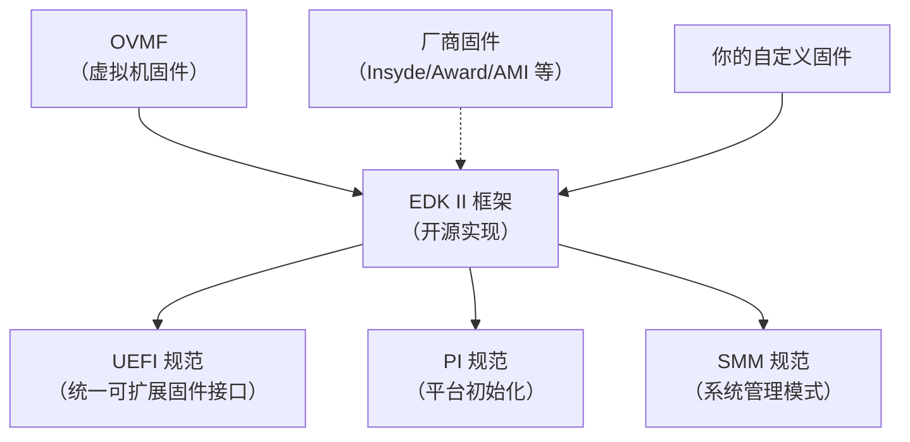
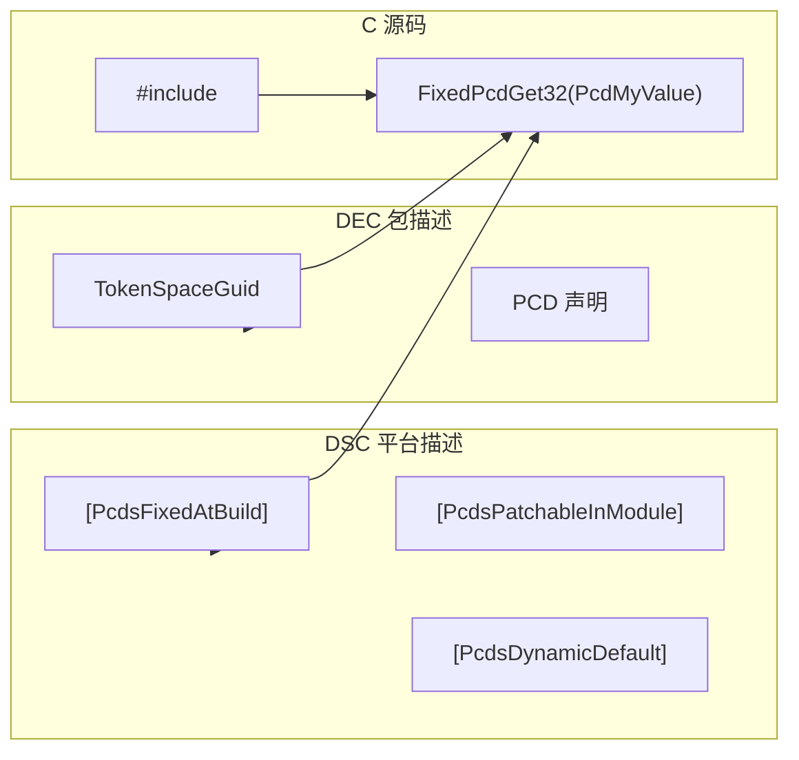
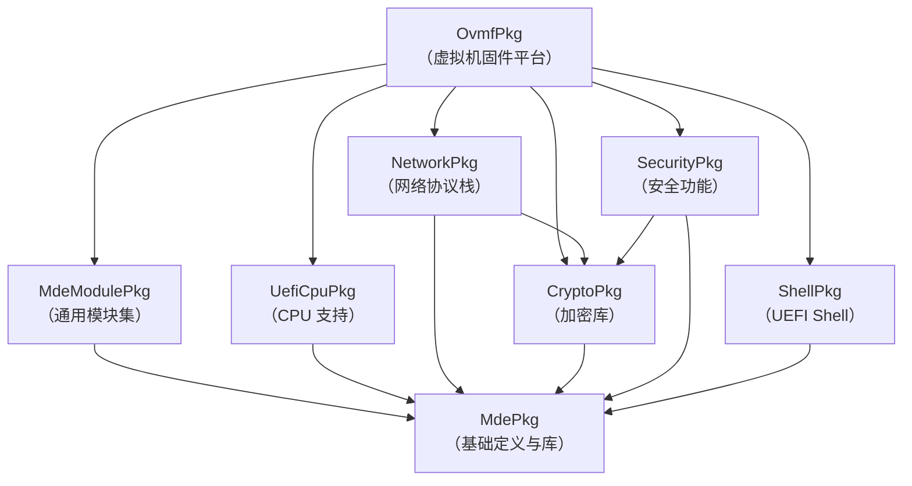

# EDK II 框架介绍

## 前言

**C：** 这篇文章带你全面了解 EDK II 框架——UEFI 固件开发的"大本营"。搞懂它的目录结构、核心包和构建系统，是你正式上手 UEFI 开发的第一步，值得花十分钟认真看看。

<!-- more -->

## 什么是 EDK II

EDK II（EFI Development Kit II）是 Intel（现由 TianoCore 社区维护）提供的一套开源 UEFI 固件开发框架。简单来说，**UEFI 规范是"标准"，EDK II 是"实现"**。就像 POSIX 定义了操作系统的接口标准，而 Linux/GNU 是它的具体实现一样。

EDK II 包含了编译固件所需的全部源码、工具链配置、构建脚本和文档，是目前最主流的 UEFI 开发基础设施。市面上绝大多数主板厂商的 UEFI 固件，以及 OVMF（QEMU 用的虚拟固件）、Tianocore 主板固件等，都是基于 EDK II 构建的。



## EDK II 与 UEFI 规范的关系

| 层次 | 说明 | 举例 |
|------|------|------|
| **UEFI 规范** | 定义了固件与操作系统之间的接口标准 | Boot Services、Runtime Services、Protocol |
| **PI 规范** | 定义了固件内部模块间的接口标准 | DXE、PEI、SEC 阶段 |
| **EDK II** | 上述规范的开源参考实现 | MdePkg、MdeModulePkg |

::: tip 理解层次关系
你可以把 UEFI 规范想象成"建筑图纸"，PI 规范是"施工规范"，而 EDK II 则是"现成的建材和工具箱"。你要盖房子（开发固件），直接用 EDK II 就行，不用从零开始烧砖。
:::

## EDK II 仓库概览

目前 EDK II 生态主要有以下几个核心仓库：

### 1. edk2（核心仓库）

最基础的仓库，包含了 UEFI 固件的核心代码、构建系统和基础模块。

```
edk2/
├── MdePkg/              # 最基础的包，所有模块都依赖它
├── MdeModulePkg/        # 通用模块集合（USB、网络、文件系统等）
├── UefiCpuPkg/          # CPU 相关模块（MP 服务、微码等）
├── UefiPayloadPkg/      # UEFI Payload 方案
├── IntelFrameworkModulePkg/  # Intel 旧框架模块（已逐步弃用）
├── ShellPkg/            # UEFI Shell
├── NetworkPkg/          # 网络协议栈
├── PcAtChipsetPkg/      # 传统 PC 芯片组驱动
├── CryptoPkg/           # 加密库（OpenSSL）
├── SecurityPkg/         # 安全相关（Secure Boot、TPM 等）
├── ArmPkg/              # ARM 架构支持
├── ArmVirtPkg/          # ARM 虚拟化平台
├── OvmfPkg/             # QEMU/OVMF 虚拟机固件
└── BaseTools/           # 构建工具（Python + C 混合）
```

### 2. edk2-platforms

存放各个平台（主板、SoC）的固件配置，是 edk2 核心仓库的补充。

```
edk2-platforms/
├── Platform/Intel/      # Intel 平台
├── Platform/AMD/        # AMD 平台
├── Platform/ARM/        # ARM 平台
├── Silicon/             # 芯片组驱动
└── Features/            # 平台级特性
```

### 3. edk2-non-osi

存放不兼容 OSI（开源倡议）协议的第三方二进制模块或闭源驱动。

```
edk2-non-osi/
├── Silicon/             # 闭源芯片组驱动
└── Binary/              # 二进制模块
```

## 核心 Package 详解

### MdePkg（Module Development Environment Package）

这是**最核心、最基础**的包，几乎是所有其他包的依赖。它包含：

- **UEFI 规范定义**：所有 Protocol、GUID、结构体的头文件
- **基础库**：内存操作、字符串处理、数学运算等
- **Pi 规范定义**：PI 阶段相关的头文件

```c
#include <Uefi.h>                    // UEFI 基础类型定义
#include <Library/UefiLib.h>         // UEFI 基础函数库
#include <Library/UefiBootServicesTableLib.h>  // gBS、gST 等
#include <Protocol/LoadedImage.h>    // 已加载镜像协议
```

### MdeModulePkg

提供大量通用可复用模块，是 EDK II 中**模块数量最多**的包：

| 模块 | 功能 |
|------|------|
| `Universal/BdsDxe` | 启动设备选择（BDS 阶段） |
| `Universal/DxeCore` | DXE 核心调度器 |
| `Universal/DebugPortDxe` | 调试端口驱动 |
| `Bus/Pci/PciHostBridgeDxe` | PCI 主桥驱动 |
| `Universal/SetupBrowserDxe` | BIOS 设置界面 |

### UefiCpuPkg

CPU 相关的核心功能：

- 多处理器（MP）服务
- CPU 微码更新
- CPU 异常处理
- MTRR 配置

## 构建系统概览：DSC / INF / PCD

EDK II 的构建系统由三个核心概念组成：

### INF（模块描述文件）

每个模块都有一个 `.inf` 文件，描述模块的元信息、源文件、依赖库等。

```ini
[Defines]
  INF_VERSION                    = 0x00010005
  BASE_NAME                      = MyDriver
  MODULE_UNI_FILE                = MyDriver.uni
  FILE_GUID                      = 12345678-1234-1234-1234-123456789ABC
  MODULE_TYPE                    = DXE_DRIVER
  VERSION_STRING                 = 1.0
  ENTRY_POINT                    = MyDriverEntryPoint

[Sources]
  MyDriver.c

[Packages]
  MdePkg/MdePkg.dec
  MdeModulePkg/MdeModulePkg.dec

[LibraryClasses]
  UefiDriverEntryPoint
  UefiLib
  DebugPrintErrorLevelLib

[FixedPcd]
  gEfiMdePkgTokenSpaceGuid.PcdDebugPrintErrorLevel|0x80000000
```

### DSC（平台描述文件）

描述一个完整的平台由哪些模块组成，以及全局编译选项。

```ini
[Defines]
  PLATFORM_NAME                  = MyPlatform
  PLATFORM_GUID                  = 12345678-1234-1234-1234-123456789ABC
  PLATFORM_VERSION               = 1.0
  DSC_SPECIFICATION              = 0x00010005
  SUPPORTED_ARCHITECTURES        = IA32|X64
  BUILD_TARGETS                  = DEBUG|RELEASE
  SKUID_IDENTIFIER               = DEFAULT

[LibraryClasses]
  UefiLib|MdePkg/Library/UefiLib/UefiLib.inf

[Components]
  MdeModulePkg/Universal/PCD/Dxe/PcdDxe.inf
  MyPackage/MyDriver/MyDriver.inf
```

### PCD（平台配置数据库）

PCD 是 EDK II 的**动态配置机制**，允许在不修改源码的情况下调整模块行为。

| PCD 类型 | 作用域 | 示例 |
|----------|--------|------|
| `FixedPcd` | 编译时固定 | 调试输出级别 |
| `PatchPcd` | 编译时补丁 | 默认启动超时 |
| `FeaturePcd` | 功能开关 | 是否启用 Secure Boot |
| `DynamicPcd` | 运行时动态 | 内存大小 |



## 包依赖关系

下面是 EDK II 中各核心包之间的依赖关系图：



::: warning 关于 MdePkg 的特殊性
MdePkg 几乎不依赖任何其他包（除了 BaseTools），它是整个 EDK II 生态的"根节点"。你自己的包也应该只依赖 MdePkg（如果可能的话），这样可以最大化复用性。
:::

## 小结

这篇文章帮你梳理了 EDK II 的整体架构：

- **EDK II** 是 UEFI/PI 规范的开源实现，是固件开发的基础设施
- 核心仓库 **edk2** 包含基础代码，**edk2-platforms** 存放平台配置
- **MdePkg** 是最基础的包，提供类型定义和基础库
- **MdeModulePkg** 提供大量通用可复用模块
- 构建系统由 **INF**（模块描述）、**DSC**（平台描述）、**PCD**（配置数据库）三大支柱组成
- 包之间的依赖关系清晰，遵循分层原则

搞懂这些概念后，下一步就是搭建开发环境，然后动手写第一个 UEFI 应用程序了。
