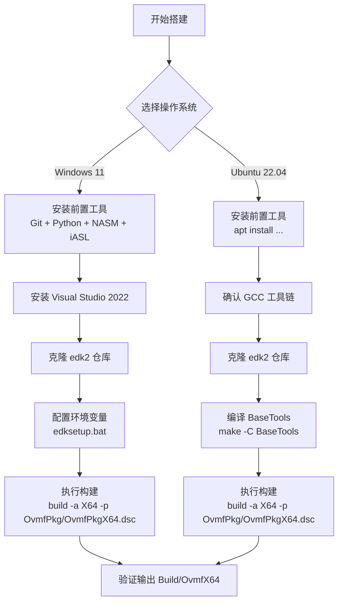

# 开发环境搭建 Windows 与 Linux

## 前言

**C：** 这篇文章手把手教你在 Windows 11 和 Ubuntu 22.04 上搭建 UEFI 开发环境。不管你用什么系统，照着做就能把 EDK II 跑起来，还会帮你排查那些烦人的编译错误。

<!-- more -->

## 环境搭建总览



## 前置依赖一览

不管你用哪个系统，以下工具都是必须的：

| 工具 | 用途 | 最低版本 |
|------|------|----------|
| **Git** | 克隆代码仓库 | 2.x |
| **Python 3** | 构建脚本运行时 | 3.6+ |
| **NASM** | 汇编编译器 | 2.14+ |
| **iASL (AcpiTools)** | ACPI 表编译器 | 20200925+ |
| **编译器** | 编译 C 代码 | VS2019+ / GCC 9+ |

::: tip 工具链选择
- **Windows**：推荐 Visual Studio 2022（免费 Community 版即可）
- **Linux**：推荐 GCC 11+（Ubuntu 22.04 默认就是 GCC 11）
:::

## Ubuntu 22.04 搭建步骤

### 第一步：安装系统工具

```bash
sudo apt update
sudo apt install -y git python3 python3-pip nasm iasl build-essential uuid-dev acpica-tools
```

验证安装：

```bash
git --version       # git version 2.34.1
python3 --version   # Python 3.10.x
nasm --version      # NASM version 2.15.x
gcc --version       # gcc 11.x
```

### 第二步：克隆 edk2 仓库

```bash
cd ~
git clone https://github.com/tianocore/edk2.git
cd edk2
git submodule update --init --recursive
```

::: warning 关于仓库大小
edk2 仓库体积较大（约 2-3 GB），全量拉取可能需要 15-30 分钟。如果网络不好，可以考虑 `--depth=1` 浅克隆，但后续开发可能会遇到问题。
:::

### 第三步：编译 BaseTools

BaseTools 是 EDK II 构建系统的核心工具，必须先编译：

```bash
make -C BaseTools
```

编译成功后会生成 `Source/C/bin` 目录下的工具可执行文件。

### 第四步：设置环境变量

```bash
export WORKSPACE=$HOME/edk2
export PACKAGES_PATH=$HOME/edk2
source edksetup.sh
```

::: tip 持久化配置
建议把这几行加到 `~/.bashrc` 中，这样每次打开终端就自动配置好：
```bash
echo 'export WORKSPACE=$HOME/edk2' >> ~/.bashrc
echo 'export PACKAGES_PATH=$HOME/edk2' >> ~/.bashrc
echo 'source $WORKSPACE/edksetup.sh' >> ~/.bashrc
```
:::

### 第五步：执行构建

```bash
build -a X64 -p OvmfPkg/OvmfPkgX64.dsc -t GCC5 -b DEBUG
```

参数说明：

| 参数 | 含义 |
|------|------|
| `-a X64` | 目标架构为 x86_64 |
| `-p OvmfPkg/OvmfPkgX64.dsc` | 指定平台描述文件（OVMF 虚拟机固件） |
| `-t GCC5` | 使用 GCC5 工具链（兼容 GCC 5-12） |
| `-b DEBUG` | Debug 模式构建 |

构建成功后，固件文件位于：

```
Build/OvmfX64/DEBUG_GCC5/FV/
├── OVMF_CODE.fd        # 固件代码段
├── OVMF_VARS.fd        # 固件变量存储
└── OVMF.fd             # 完整固件镜像
```

## Windows 11 搭建步骤

### 第一步：安装前置工具

| 工具 | 下载地址 | 备注 |
|------|----------|------|
| Git | git-scm.com/download/win | 或 `winget install Git.Git` |
| Python 3 | python.org/downloads | **务必勾选"Add Python to PATH"** |
| NASM | nasm.us | 安装后添加到 PATH |
| iASL | acpica.org/downloads | 解压后添加到 PATH |

### 第二步：安装 Visual Studio 2022

从 https://visualstudio.microsoft.com/vs/community/ 下载 Community 版，安装时勾选 **"使用 C++ 的桌面开发"** 工作负载。

::: details 关于 VS 版本
EDK II 支持 VS2019 和 VS2022。如果已安装 VS2019，构建时工具链名称改为 `VS2019` 即可。
:::

### 第三步：克隆并配置

打开 **x64 Native Tools Command Prompt for VS 2022**（开始菜单搜索），然后执行：

```cmd
cd C:\Workspace
git clone https://github.com/tianocore/edk2.git
cd edk2
git submodule update --init --recursive
edksetup.bat
```

### 第四步：执行构建

```cmd
build -a X64 -p OvmfPkg/OvmfPkgX64.dsc -t VS2022 -b DEBUG
```

::: tip 使用 stuart 构建（进阶）
TianoCore 社区推荐 `stuart` 工具链管理构建，尤其适合 CI/CD 场景：
```bash
pip install -U stuart edk2-pytool-library
stuart_setup -c OvmfPkg/OvmfPkgX64.dsc
stuart_build -c OvmfPkg/OvmfPkgX64.dsc
```
`stuart` 会自动处理依赖、子模块和工具链配置。
:::

## 常见构建错误及解决方案

### 错误 1：Python 版本不兼容

```
Python 3.12+ may not be fully compatible with edk2 build tools
```

**解决方案：** 使用 Python 3.8 ~ 3.11：

```bash
sudo add-apt-repository ppa:deadsnakes/ppa
sudo apt install python3.10 python3.10-venv
```

### 错误 2：NASM 或 BaseTools 找不到

```
nasm: command not found
Could not find AutoGen
```

**解决方案：** 确认工具已安装且在 PATH 中，然后重新编译 BaseTools：

```bash
which nasm    # Linux          where nasm    # Windows
cd $WORKSPACE/BaseTools && make clean && make
```

### 错误 3：编译器版本不匹配

```
GCC5: error: 'for' loop initial declarations are only allowed in C99 mode
```

**解决方案：** 确认 GCC 版本，`GCC5` 工具链名实际支持 GCC 5-12。GCC 13+ 需要使用 `GCC13` 工具链。

| 工具链名称 | 实际支持版本 |
|-----------|-------------|
| `GCC5` | GCC 5 ~ 12 |
| `GCC13` | GCC 13+ |
| `CLANGPDB` | Clang（生成 PDB 调试信息） |

### 错误 4：磁盘空间不足

```
error: No space left on device
```

**解决方案：** EDK II 完整构建需要约 **10-15 GB** 磁盘空间。确保空闲空间足够，也可定期清理：`rm -rf Build/`

## 环境变量速查表

| 变量名 | 用途 | 示例值 |
|--------|------|--------|
| `WORKSPACE` | 工作空间根目录 | `/home/wyh/edk2` |
| `PACKAGES_PATH` | 包搜索路径（多路径用 `:` 分隔） | `/home/wyh/edk2` |
| `EDK_TOOLS_PATH` | BaseTools 路径（通常自动设置） | `$WORKSPACE/BaseTools` |
| `PYTHON_HOME` | Python 解释器路径 | `/usr/bin/python3` |

::: warning 多仓库协作
同时使用 edk2 和 edk2-platforms 时，需把两个路径都加到 `PACKAGES_PATH`：
```bash
export PACKAGES_PATH=$HOME/edk2:$HOME/edk2-platforms
```
:::

## 小结

这篇文章带你完成了 UEFI 开发环境的搭建：

- **Ubuntu 22.04**：通过 apt 安装工具链，编译 BaseTools，执行 build 命令即可
- **Windows 11**：安装 VS2022 + 前置工具，在 VS 开发者命令行中操作
- 两个平台的构建命令几乎一致，只是工具链参数不同（`-t GCC5` vs `-t VS2022`）
- 遇到错误时，优先检查 Python 版本、NASM 路径和 BaseTools 是否编译

环境搭好之后，下一篇文章就带你写第一个 UEFI 应用程序——经典的 HelloWorld！
