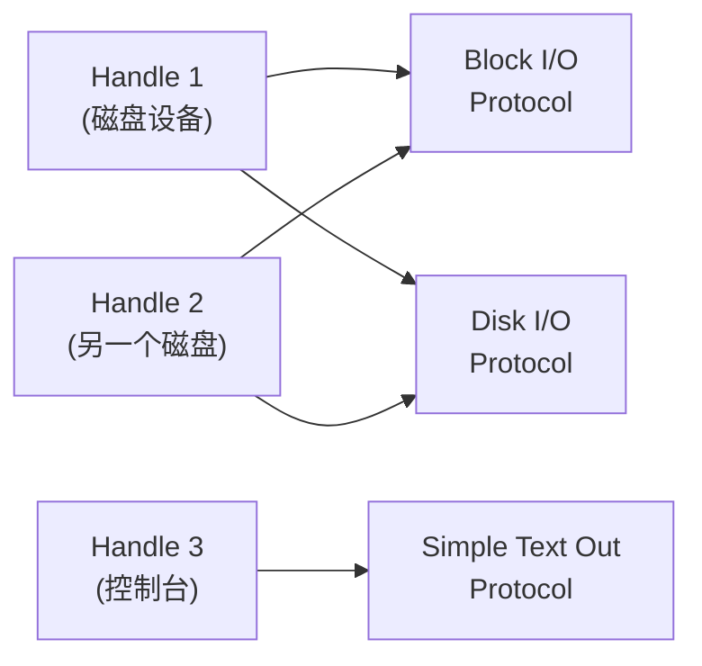
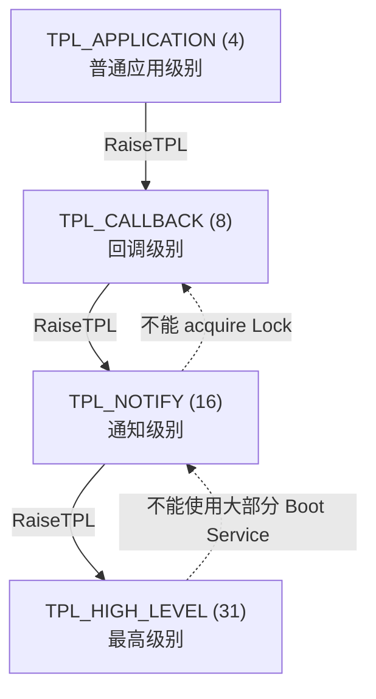

# 协议、句柄与事件机制

## 前言

**C：** 这篇文章带你搞懂 UEFI 里最核心的三个概念——Handle（句柄）、Protocol（协议）和 Event（事件）。这三个东西是 UEFI 架构的骨架，几乎所有 UEFI 应用开发都绕不开它们。搞明白了，你写 UEFI 程序就像搭积木一样顺手。

<!-- more -->

## 一、Handle（句柄）是什么

在 UEFI 里，Handle 是一个不透明的指针（`EFI_HANDLE`），本质上就是一个 `void*`。你可以把它理解为一个"容器"或者"标签"，它本身不包含任何数据，而是指向系统 Handle 数据库中的一条记录。

```c
/// UEFI 句柄定义
typedef void *EFI_HANDLE;
```

::: tip 核心理念
Handle 本身只是一个不透明的引用，真正有意义的是它上面安装的 Protocol（协议）。
:::

### Handle 的类型

| 类型 | 说明 | 示例 |
|------|------|------|
| Image Handle | 加载的 UEFI 镜像本身 | 你的 `.efi` 程序 |
| Device Handle | 硬件设备 | 磁盘、网卡、显卡 |
| Driver Handle | 驱动程序 | PCI 驱动、USB 驱动 |
| Service Handle | 系统服务 | 全局协议句柄 |

系统启动时，固件会为发现的每个硬件设备创建对应的 Handle，并在上面安装相应的协议。

## 二、Protocol（协议）——UEFI 的灵魂

### 2.1 协议的概念

Protocol 是 UEFI 中接口暴露的标准方式。每个协议由两部分组成：

- **GUID**：全局唯一标识符，128 位，用来标识协议类型
- **接口结构体**：包含函数指针和数据字段

```c
/// 协议接口示例：一个简单的"打招呼"协议
#define MY_HELLO_PROTOCOL_GUID \
  { 0xA1B2C3D4, 0xE5F6, 0x7890, \
    { 0xAA, 0xBB, 0xCC, 0xDD, 0xEE, 0xFF, 0x11, 0x22 } }

typedef struct _MY_HELLO_PROTOCOL {
  EFI_STATUS (EFIAPI *SayHello)(IN CONST CHAR16 *Name);
  UINT32 Version;
} MY_HELLO_PROTOCOL;
```

### 2.2 Handle 与 Protocol 的关系

一个 Handle 上可以安装多个 Protocol，而同一个 Protocol 可以安装在多个 Handle 上。这就形成了一个多对多的关系：



### 2.3 LocateProtocol ——查找协议

`LocateProtocol` 是最常用的协议查找方式，它会找到系统上第一个安装了目标协议的 Handle：

```c
#include <Uefi.h>
#include <Library/UefiBootServicesTableLib.h>

EFI_STATUS
EFIAPI
UefiMain(
  IN EFI_HANDLE        ImageHandle,
  IN EFI_SYSTEM_TABLE  *SystemTable
)
{
  EFI_STATUS Status;
  MY_HELLO_PROTOCOL *HelloProto;

  // 通过 GUID 查找协议
  Status = gBS->LocateProtocol(
    &gMyHelloProtocolGuid,  // 协议 GUID
    NULL,                   // Registration（可选）
    (VOID **)&HelloProto    // 输出协议接口
  );

  if (EFI_ERROR(Status)) {
    // 协议未找到
    return Status;
  }

  // 调用协议中的方法
  HelloProto->SayHello(L"UEFI Developer");

  return EFI_SUCCESS;
}
```

### 2.4 OpenProtocol ——更精细的协议访问

`OpenProtocol` 比 `LocateProtocol` 更强大，因为它需要你指定目标 Handle：

```c
EFI_STATUS Status;
EFI_BLOCK_IO_PROTOCOL *BlkIo;

// 第一步：找到磁盘设备的 Handle
EFI_HANDLE *HandleBuffer;
UINTN HandleCount;

Status = gBS->LocateHandleBuffer(
  ByProtocol,                 // 按协议类型搜索
  &gEfiBlockIoProtocolGuid,   // Block I/O 协议 GUID
  NULL,
  &HandleCount,
  &HandleBuffer
);

if (EFI_ERROR(Status)) return Status;

// 第二步：在特定 Handle 上打开协议
Status = gBS->OpenProtocol(
  HandleBuffer[0],                   // 目标 Handle
  &gEfiBlockIoProtocolGuid,          // 协议 GUID
  (VOID **)&BlkIo,                   // 输出协议接口
  ImageHandle,                       // 调用者 Image Handle
  NULL,                              // Controller Handle（驱动用）
  EFI_OPEN_PROTOCOL_GET_PROTOCOL     // 打开模式
);

// ... 使用 BlkIo ...

// 用完记得关闭
gBS->CloseProtocol(
  HandleBuffer[0],
  &gEfiBlockIoProtocolGuid,
  ImageHandle,
  NULL
);

gBS->FreePool(HandleBuffer);
```

::: warning 重要
`OpenProtocol` 之后一定要记得 `CloseProtocol`，否则会影响驱动的卸载和资源回收。
:::

### 2.5 OpenProtocol 的打开模式

| 模式 | 常量 | 说明 |
|------|------|------|
| 获取协议 | `EFI_OPEN_PROTOCOL_GET_PROTOCOL` | 只读访问，用于查询 |
| 读写访问 | `EFI_OPEN_PROTOCOL_BY_HANDLE_PROTOCOL` | 类似 GET_PROTOCOL |
| 驱动绑定 | `EFI_OPEN_PROTOCOL_BY_DRIVER` | 驱动独占，阻止卸载 |
| 子控制器 | `EFI_OPEN_PROTOCOL_BY_CHILD_CONTROLLER` | 父子关系 |

## 三、Handle 数据库操作

除了查找，你还可以对 Handle 数据库执行更多操作：

```c
// 遍历所有安装了某个协议的 Handle
EFI_HANDLE *Handles;
UINTN NoHandles;

gBS->LocateHandleBuffer(
  ByProtocol,
  &gEfiSimpleFileSystemProtocolGuid,
  NULL,
  &NoHandles,
  &Handles
);

for (UINTN i = 0; i < NoHandles; i++) {
  // 处理每个 Handle...
}

gBS->FreePool(Handles);
```

::: details LocateHandle 的搜索类型

```c
typedef enum {
  AllHandles,        // 返回所有 Handle
  ByRegisterNotify,  // 返回已注册通知的 Handle
  ByProtocol         // 返回安装了指定协议的 Handle
} EFI_LOCATE_SEARCH_TYPE;
```

`ByProtocol` 最常用；`AllHandles` 会返回系统中所有 Handle，数量可能很多。
:::

## 四、Event（事件机制）

### 4.1 事件的概念

UEFI 的事件机制是一种异步通知机制，类似于 Linux 的 `epoll` 或 Windows 的 `Event`。核心思想是：**你创建一个事件，等待它被触发，在被触发之前你可以做别的事情。**

```c
typedef struct {
  UINT32 Signature;
  // ... 内部字段 ...
} EFI_EVENT;
```

### 4.2 创建与等待事件

```c
EFI_EVENT Event;
EFI_STATUS Status;

// 创建一个简单事件
Status = gBS->CreateEvent(
  EVT_NOTIFY_WAIT,           // 事件类型
  TPL_CALLBACK,              // 通知优先级
  MyNotifyFunction,          // 回调函数（可选）
  NULL,                      // 回调上下文
  &Event                     // 输出事件句柄
);

// 等待事件被触发
UINTN Index;
EFI_EVENT WaitEvents[1] = { Event };

Status = gBS->WaitForEvent(
  1,                         // 事件数量
  WaitEvents,                // 事件数组
  &Index                     // 被触发事件的索引
);
```

### 4.3 事件类型一览

| 类型 | 常量 | 说明 |
|------|------|------|
| 通知等待 | `EVT_NOTIFY_WAIT` | 调用 CheckEvent / WaitForEvent 时触发回调 |
| 通知信号 | `EVT_NOTIFY_SIGNAL` | SignalEvent 时触发回调 |
| 定时器 | `EVT_TIMER` | 定时事件，需配合 SetTimer 使用 |
| 信号退出引导服务 | `EVT_SIGNAL_EXIT_BOOT_SERVICES` | 退出引导服务时触发 |

### 4.4 定时器事件

```c
EFI_EVENT TimerEvent;

// 创建定时器事件
gBS->CreateEvent(
  EVT_TIMER | EVT_NOTIFY_SIGNAL,
  TPL_CALLBACK,
  TimerCallback,    // 定时到期时调用
  NULL,
  &TimerEvent
);

// 设置周期性定时：每 100ns * 10000000 = 1 秒触发一次
gBS->SetTimer(
  TimerEvent,
  TimerPeriodic,        // TimerPeriodic | TimerRelative | TimerTypeCancel
  10000000              // 100 纳秒单位
);

// ... 程序继续运行 ...

// 停止定时器
gBS->SetTimer(TimerEvent, TimerCancel, 0);
gBS->CloseEvent(TimerEvent);
```

```c
// 定时器回调函数
VOID EFIAPI
TimerCallback(
  IN EFI_EVENT Event,
  IN VOID *Context
)
{
  // 注意：在回调中不能做太多事情
  // 因为 TPL 可能限制了可用的服务
  Print(L"Timer tick!\n");
}
```

### 4.5 手动触发事件

```c
EFI_EVENT MyEvent;
gBS->CreateEvent(0, TPL_NOTIFY, NULL, NULL, &MyEvent);

// 在某个线程中等待
// gBS->WaitForEvent(1, &MyEvent, &Index);

// 在另一个地方触发
gBS->SignalEvent(MyEvent);

gBS->CloseEvent(MyEvent);
```

## 五、TPL（任务优先级）

TPL 是 UEFI 的中断优先级机制，类似于 CPU 的中断屏蔽等级。不同的 TPL 级别决定了哪些操作可以执行：



| TPL 级别 | 数值 | 说明 |
|----------|------|------|
| `TPL_APPLICATION` | 4 | 普通 UEFI 应用运行级别 |
| `TPL_CALLBACK` | 8 | 事件回调、IO 中断 |
| `TPL_NOTIFY` | 16 | 事件通知回调 |
| `TPL_HIGH_LEVEL` | 31 | 最高级别，几乎不能做什么 |

::: warning 注意
在定时器回调等高 TPL 级别的函数中，你不能调用阻塞型 API（如 `WaitForEvent`），也不能分配内存。处理要尽可能简短。
:::

```c
// 提升 TPL 示例
EFI_TPL OldTpl;

// 提升到 NOTIFY 级别，保护临界区
OldTpl = gBS->RaiseTPL(TPL_NOTIFY);

// --- 临界区操作 ---
// 在这里不会被低优先级事件打断

// 恢复原来的 TPL
gBS->RestoreTPL(OldTpl);
```

## 六、实战：遍历系统设备

下面这个例子遍历系统上所有安装了 Block I/O 协议的设备：

```c
EFI_STATUS Status;
EFI_HANDLE *BlockIoHandles = NULL;
UINTN BlockIoCount = 0;

Status = gBS->LocateHandleBuffer(
  ByProtocol,
  &gEfiBlockIoProtocolGuid,
  NULL,
  &BlockIoCount,
  &BlockIoHandles
);

if (EFI_ERROR(Status)) {
  Print(L"No Block I/O devices found!\n");
  return Status;
}

Print(L"Found %d Block I/O device(s):\n", BlockIoCount);

for (UINTN i = 0; i < BlockIoCount; i++) {
  EFI_BLOCK_IO_PROTOCOL *BlkIo = NULL;
  Status = gBS->HandleProtocol(
    BlockIoHandles[i],
    &gEfiBlockIoProtocolGuid,
    (VOID **)&BlkIo
  );

  if (!EFI_ERROR(Status)) {
    Print(L"  Device %d: MediaId=%d, BlockSize=%d, "
          L"LastBlock=%ld\n",
          i,
          BlkIo->Media->MediaId,
          BlkIo->Media->BlockSize,
          BlkIo->Media->LastBlock);
  }
}

gBS->FreePool(BlockIoHandles);
```

## 小结

这篇文章我们学习了 UEFI 的三大支柱概念：

- **Handle** 是系统中实体（设备、驱动、镜像）的引用标签
- **Protocol** 是基于 GUID 的接口暴露机制，Handle 上安装协议，通过 `LocateProtocol` / `OpenProtocol` 访问
- **Event** 提供异步通知能力，配合定时器可实现周期性任务
- **TPL** 是任务优先级机制，高 TPL 下可用的 API 受限

掌握这四个概念后，你就具备了 UEFI 应用开发的完整基础。下一篇文章我们会深入 UEFI 的内存管理系统。
