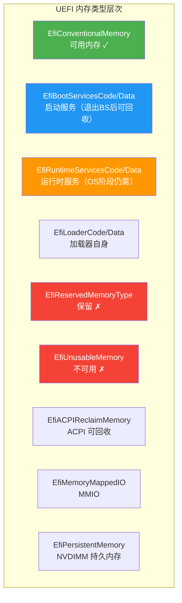

# 内存管理

## 前言

**C：** 这篇文章带你深入理解 UEFI 的内存管理体系。在 UEFI 环境下没有操作系统的虚拟内存机制，你直接面对的是物理内存，而且内存类型划分非常细致。学会正确分配和管理内存，是写稳定 UEFI 程序的基本功。

<!-- more -->

## 一、UEFI 内存类型

UEFI 把物理内存划分为多种类型，每种类型有不同用途和属性：

```c
typedef enum {
  EfiReservedMemoryType,       // 0: 保留，不可使用
  EfiLoaderCode,               // 1: 加载器代码段
  EfiLoaderData,               // 2: 加载器数据段
  EfiBootServicesCode,         // 3: 启动服务代码
  EfiBootServicesData,         // 4: 启动服务数据
  EfiRuntimeServicesCode,      // 5: 运行时服务代码
  EfiRuntimeServicesData,      // 6: 运行时服务数据
  EfiConventionalMemory,       // 7: 可用内存
  EfiUnusableMemory,           // 8: 不可用内存
  EfiACPIReclaimMemory,        // 9: ACPI 可回收内存
  EfiACPIMemoryNVS,            // 10: ACPI NVS 内存
  EfiMemoryMappedIO,           // 11: 内存映射 IO
  EfiMemoryMappedIOPortSpace,  // 12: 内存映射 IO 端口空间
  EfiPalCode,                  // 13: PAL 代码
  EfiPersistentMemory,         // 14: 持久化内存
  EfiMaxMemoryType             // 15: 边界值
} EFI_MEMORY_TYPE;
```



| 类型 | 能用吗 | 说明 |
|------|--------|------|
| `EfiConventionalMemory` | ✅ 最常用 | 自由可用内存，`AllocatePool` 默认分配这个类型 |
| `EfiBootServicesCode/Data` | ✅ 可用 | 退出 Boot Services 后可被 OS 回收 |
| `EfiLoaderCode/Data` | ✅ 可用 | 通常用于加载器自身 |
| `EfiRuntimeServicesCode/Data` | ⚠️ 特殊 | OS 启动后仍需保留，通常驱动用 |
| `EfiACPIReclaimMemory` | ⚠️ 谨慎 | OS 可以使用，但要等 ACPI 解析完 |
| `EfiReservedMemoryType` | ❌ 不可用 | 系统保留 |
| `EfiUnusableMemory` | ❌ 不可用 | 硬件错误标记 |

::: tip 关键区别
在调用 `ExitBootServices()` 之后，所有 `EfiBootServicesCode/Data` 类型的内存都会被 OS 接管。如果你分配了这种类型的内存但想在 OS 阶段继续用，那就会出问题。
:::

## 二、内存分配 API

### 2.1 AllocatePool ——按字节分配

`AllocatePool` 类似于 `malloc`，按字节大小分配内存，适合小对象和数据结构：

```c
EFI_STATUS Status;
VOID *Buffer;

Status = gBS->AllocatePool(
  EfiBootServicesData,    // 内存类型
  4096,                   // 大小（字节）
  &Buffer                 // 输出指针
);

if (EFI_ERROR(Status)) {
  Print(L"AllocatePool failed: %r\n", Status);
  return Status;
}

// 使用 Buffer...
SetMem(Buffer, 4096, 0);

// 释放
gBS->FreePool(Buffer);
```

### 2.2 AllocatePages ——按页分配

`AllocatePages` 按页（4KB）分配，适合大块内存或需要页对齐的场景：

```c
EFI_PHYSICAL_ADDRESS AllocAddress;
EFI_STATUS Status;

// 方式1：让系统自动选择地址
AllocAddress = 0;  // 0 表示自动分配
Status = gBS->AllocatePages(
  AllocateAnyPages,       // 分配策略
  EfiBootServicesData,    // 内存类型
  4,                      // 分配 4 页 = 16KB
  &AllocAddress           // 输出物理地址
);

// 方式2：指定地址分配
AllocAddress = 0x100000;  // 1MB 处
Status = gBS->AllocatePages(
  AllocateAddress,        // 指定地址
  EfiRuntimeServicesData, // 运行时数据
  1,                      // 1 页
  &AllocAddress
);

// 方式3：从顶部向下分配（大内存场景）
AllocAddress = 0xFFFFFFFFFFFFFFFF;
Status = gBS->AllocatePages(
  AllocateMaxAddress,     // 从 MaxAddress 向下找
  EfiLoaderData,
  8,
  &AllocAddress
);

// 释放页面
gBS->FreePages(AllocAddress, 4);
```

### 2.3 分配策略对比

| 分配策略 | 常量 | 说明 |
|---------|------|------|
| 任意分配 | `AllocateAnyPages` | 系统选择合适地址 |
| 指定地址 | `AllocateAddress` | 你指定物理地址 |
| 最大地址以下 | `AllocateMaxAddress` | 从指定地址以下分配 |

::: warning AllocateAddress 的坑
使用 `AllocateAddress` 时，指定的地址必须是空闲的且页对齐（4KB 对齐）。如果该地址已被占用，会返回 `EFI_NOT_AVAILABLE`。
:::

## 三、获取内存映射

`GetMemoryMap` 是 UEFI 中最重要的 API 之一，它在退出 Boot Services 时**必须调用**：

```c
EFI_MEMORY_DESCRIPTOR *MemMap = NULL;
UINTN MemMapSize = 0;
UINTN MapKey = 0;
UINTN DescriptorSize = 0;
UINT32 DescriptorVersion = 0;

// 第一次调用：获取需要的缓冲区大小
Status = gBS->GetMemoryMap(
  &MemMapSize,
  MemMap,           // NULL，只需要大小
  &MapKey,
  &DescriptorSize,
  &DescriptorVersion
);

// MapKey 会变化，实际多分配一些空间
MemMapSize += 2 * DescriptorSize;

// 分配缓冲区
gBS->AllocatePool(EfiBootServicesData, MemMapSize, (VOID **)&MemMap);

// 第二次调用：真正获取内存映射
Status = gBS->GetMemoryMap(
  &MemMapSize,
  MemMap,
  &MapKey,
  &DescriptorSize,
  &DescriptorVersion
);

if (EFI_ERROR(Status)) {
  Print(L"GetMemoryMap failed: %r\n", Status);
  return Status;
}
```

### 3.1 内存描述符结构

```c
typedef struct {
  UINT32 Type;          // 内存类型
  EFI_PHYSICAL_ADDRESS PhysicalStart;  // 物理起始地址
  EFI_VIRTUAL_ADDRESS  VirtualStart;   // 虚拟起始地址（通常为0）
  UINT64 NumberOfPages; // 页数
  UINT64 Attribute;     // 属性位
} EFI_MEMORY_DESCRIPTOR;
```

### 3.2 打印内存映射

```c
VOID PrintMemoryMap(
  IN EFI_MEMORY_DESCRIPTOR *MemMap,
  IN UINTN MemMapSize,
  IN UINTN DescriptorSize
)
{
  UINTN Entries = MemMapSize / DescriptorSize;
  UINTN TotalFree = 0;

  Print(L"%-12s %-18s %-12s %-10s\n",
        L"Type", L"PhysicalStart", L"Pages", L"Attribute");
  Print(L"------------------------------------------------\n");

  for (UINTN i = 0; i < Entries; i++) {
    EFI_MEMORY_DESCRIPTOR *Desc =
      (EFI_MEMORY_DESCRIPTOR *)((UINT8 *)MemMap + i * DescriptorSize);

    CHAR16 TypeStr[32];
    switch (Desc->Type) {
      case EfiConventionalMemory:   StrCpyS(TypeStr, 32, L"Free"); break;
      case EfiBootServicesData:     StrCpyS(TypeStr, 32, L"BootData"); break;
      case EfiBootServicesCode:     StrCpyS(TypeStr, 32, L"BootCode"); break;
      case EfiRuntimeServicesData:  StrCpyS(TypeStr, 32, L"RTData"); break;
      case EfiRuntimeServicesCode:  StrCpyS(TypeStr, 32, L"RTCode"); break;
      case EfiLoaderData:           StrCpyS(TypeStr, 32, L"LoaderData"); break;
      case EfiACPIReclaimMemory:    StrCpyS(TypeStr, 32, L"ACPIReclaim"); break;
      default: StrCpyS(TypeStr, 32, L"Other"); break;
    }

    Print(L"%-12s 0x%016lX %10ld  0x%08lX\n",
          TypeStr,
          Desc->PhysicalStart,
          Desc->NumberOfPages,
          Desc->Attribute);

    if (Desc->Type == EfiConventionalMemory) {
      TotalFree += Desc->NumberOfPages;
    }
  }

  Print(L"\nTotal free memory: %ld pages (%ld MB)\n",
        TotalFree,
        (TotalFree * 4096) / (1024 * 1024));
}
```

## 四、内存属性

每个内存描述符都有一个 `Attribute` 字段，定义内存的访问权限：

| 属性 | 值 | 说明 |
|------|----|------|
| `EFI_MEMORY_UC` | `0x0000000000000001` | 不可缓存（Uncacheable） |
| `EFI_MEMORY_WC` | `0x0000000000000002` | 写合并（Write Combining） |
| `EFI_MEMORY_WT` | `0x0000000000000004` | 写穿透（Write Through） |
| `EFI_MEMORY_WB` | `0x0000000000000008` | 写回（Write Back） |
| `EFI_MEMORY_UCE` | `0x0000000000000010` | 不可缓存但允许推测读取 |
| `EFI_MEMORY_RO` | `0x0000000000001000` | 只读 |
| `EFI_MEMORY_XP` | `0x0000000000002000` | 不可执行 |
| `EFI_MEMORY_NV` | `0x0000000000008000` | 非易失性 |
| `EFI_MEMORY_RUNTIME` | `0x8000000000000000` | 运行时内存 |

::: details 修改内存属性

```c
// 设置指定地址范围的属性
Status = gBS->SetMemoryAttributes(
  MemoryMap,    // 当前内存映射
  MemoryMapSize,
  MapKey,
  DescriptorSize,
  DescriptorVersion
);

// 或者使用 GCD（Global Coherency Domain）服务
Status = gDS->SetMemorySpaceAttributes(
  BaseAddress,       // 起始地址
  Length,            // 长度
  EFI_MEMORY_RO      // 设置为只读
);
```

这在设置运行时内存为只读时非常有用。
:::

## 五、与 OS 内存管理的区别


| 对比项 | UEFI 环境 | 操作系统环境 |
|--------|----------|-------------|
| 地址空间 | 物理地址为主 | 虚拟地址为主 |
| 内存类型 | 多种 EFI_MEMORY_TYPE | 统一管理 |
| 分配粒度 | 字节（Pool）或 4KB（Pages） | 通常 4KB 页 |
| 权限控制 | 属性位（RO/XP） | 页表权限位 |
| 垃圾回收 | 无，手动 FreePool/FreePages | 有（某些 OS 有 GC） |
| 内存碎片 | 容易产生 | OS 有整理机制 |
| OOM 处理 | 直接返回错误 | 有 OOM killer |

## 六、实战：内存分配与使用示例

下面是一个综合示例，展示了常用的内存操作：

```c
#include <Uefi.h>
#include <Library/UefiLib.h>
#include <Library/UefiBootServicesTableLib.h>
#include <Library/BaseMemoryLib.h>

EFI_STATUS
EFIAPI
UefiMain(
  IN EFI_HANDLE        ImageHandle,
  IN EFI_SYSTEM_TABLE  *SystemTable
)
{
  EFI_STATUS Status;

  // ---- 1. Pool 分配 ----
  CHAR16 *MsgBuffer = NULL;
  Status = gBS->AllocatePool(
    EfiBootServicesData, 200 * sizeof(CHAR16), (VOID **)&MsgBuffer
  );
  if (EFI_ERROR(Status)) return Status;

  StrCpyS(MsgBuffer, 200, L"Hello from UEFI Memory!");
  Print(L"Pool: %s\n", MsgBuffer);
  gBS->FreePool(MsgBuffer);

  // ---- 2. Pages 分配 ----
  EFI_PHYSICAL_ADDRESS PageAddr = 0;
  Status = gBS->AllocatePages(
    AllocateAnyPages, EfiBootServicesData, 2, &PageAddr
  );
  if (EFI_ERROR(Status)) return Status;

  Print(L"Allocated 2 pages at 0x%lX\n", PageAddr);

  // 清零页面
  ZeroMem((VOID *)(UINTN)PageAddr, 2 * 4096);

  // 写入测试数据
  UINT8 *Ptr = (UINT8 *)(UINTN)PageAddr;
  for (UINTN i = 0; i < 4096; i++) {
    Ptr[i] = (UINT8)(i & 0xFF);
  }

  gBS->FreePages(PageAddr, 2);

  // ---- 3. 获取并打印内存映射 ----
  EFI_MEMORY_DESCRIPTOR *MemMap = NULL;
  UINTN MemMapSize = 0, MapKey = 0;
  UINTN DescSize = 0; UINT32 DescVer = 0;

  gBS->GetMemoryMap(&MemMapSize, NULL, &MapKey, &DescSize, &DescVer);
  MemMapSize += 2 * DescSize;
  gBS->AllocatePool(EfiBootServicesData, MemMapSize, (VOID **)&MemMap);

  Status = gBS->GetMemoryMap(&MemMapSize, MemMap, &MapKey, &DescSize, &DescVer);
  if (!EFI_ERROR(Status)) {
    PrintMemoryMap(MemMap, MemMapSize, DescSize);
  }

  gBS->FreePool(MemMap);
  return EFI_SUCCESS;
}
```

## 小结

UEFI 内存管理的核心要点：

- **内存类型很重要**：不同类型在 `ExitBootServices` 后命运不同，选错类型会导致 OS 启动失败
- **Pool vs Pages**：小对象用 `AllocatePool`，大块或需要物理地址对齐的用 `AllocatePages`
- **GetMemoryMap 是必须掌握的**：退出 Boot Services 前必须调用，OS Loader 的基础
- **物理地址直接操作**：UEFI 阶段没有虚拟内存，指针就是物理地址（直到调用 `SetVirtualAddressMap`）
- **注意内存对齐**：Pages 分配天然 4KB 对齐，Pool 分配不保证对齐
