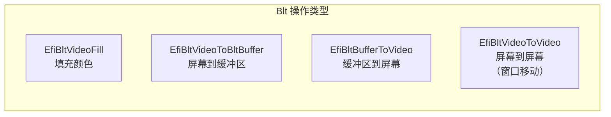

# 控制台输入输出

## 前言

**C：** 这篇文章教你如何在 UEFI 里做输入输出——从最简单的文本控制台到图形界面都有。你会学会用键盘输入读取用户指令、用彩色文字美化输出，以及用 GOP 协议画像素点。学完之后你就能写出一个带菜单交互的 UEFI 小工具了。

<!-- more -->

## 一、系统表中的标准设备

UEFI 的 `EFI_SYSTEM_TABLE` 提供了三个标准的控制台设备指针：

```c
typedef struct {
  EFI_TABLE_HEADER              Hdr;
  CHAR16                        *FirmwareVendor;
  UINT32                        FirmwareRevision;
  EFI_HANDLE                    ConsoleInHandle;
  EFI_SIMPLE_TEXT_INPUT_PROTOCOL *ConIn;
  EFI_HANDLE                    ConsoleOutHandle;
  EFI_SIMPLE_TEXT_OUTPUT_PROTOCOL *ConOut;
  EFI_HANDLE                    StandardErrorHandle;
  EFI_SIMPLE_TEXT_OUTPUT_PROTOCOL *StdErr;
  EFI_RUNTIME_SERVICES          *RuntimeServices;
  EFI_BOOT_SERVICES             *BootServices;
  UINTN                         NumberOfTableEntries;
  EFI_CONFIGURATION_TABLE       *ConfigurationTable;
} EFI_SYSTEM_TABLE;
```

| 字段 | 协议 | 说明 |
|------|------|------|
| `ConIn` | `EFI_SIMPLE_TEXT_INPUT_PROTOCOL` | 标准输入（键盘） |
| `ConOut` | `EFI_SIMPLE_TEXT_OUTPUT_PROTOCOL` | 标准输出（屏幕） |
| `StdErr` | `EFI_SIMPLE_TEXT_OUTPUT_PROTOCOL` | 标准错误输出 |

在代码中你可以直接通过 `gST->ConOut` 和 `gST->ConIn` 访问。

## 二、文本输出协议

### 2.1 基本输出

```c
// 方式1：使用 Print 库函数（最简单）
#include <Library/UefiLib.h>
Print(L"Hello, UEFI!\n");
Print(L"Hex value: 0x%08X\n", 0xDEADBEEF);
Print(L"Status code: %r\n", EFI_SUCCESS);  // %r 自动打印状态码字符串

// 方式2：使用 ConOut 直接输出
gST->ConOut->OutputString(gST->ConOut, L"Direct output!\n");

// 方式3：使用 StdErr
gST->StdErr->OutputString(gST->StdErr, L"Error message!\r\n");
```

::: tip 注意换行
UEFI 使用 `\r\n`（CRLF）作为换行符。`Print()` 的 `\n` 会自动转换，但直接用 `OutputString` 时需要手动写 `\r\n`。
:::

### 2.2 控制台模式

UEFI 控制台支持多种文本模式（不同的列数和行数）：

```c
EFI_SIMPLE_TEXT_OUTPUT_PROTOCOL *ConOut = gST->ConOut;

// 查询当前模式
UINTN CurrentMode;
ConOut->QueryMode(ConOut, ConOut->Mode->Mode, &CurrentMode, NULL);

// 获取所有可用模式
UINTN MaxMode = ConOut->Mode->MaxMode;
Print(L"Available modes: %d\n", MaxMode);

for (UINTN i = 0; i < MaxMode; i++) {
  UINTN Columns, Rows;
  ConOut->QueryMode(ConOut, i, &Columns, &Rows);
  Print(L"  Mode %d: %dx%d\n", i, Columns, Rows);
}

// 切换到 80x50 模式（如果支持）
for (UINTN i = 0; i < MaxMode; i++) {
  UINTN Col, Row;
  ConOut->QueryMode(ConOut, i, &Col, &Row);
  if (Col == 80 && Row == 50) {
    ConOut->SetMode(ConOut, i);
    break;
  }
}
```

### 2.3 文本属性与颜色

`EFI_TEXT_ATTR` 控制前景色和背景色：

```c
// 颜色定义
#define EFI_BLACK      0x00
#define EFI_BLUE       0x01
#define EFI_GREEN      0x02
#define EFI_CYAN       (EFI_BLUE | EFI_GREEN)
#define EFI_RED        0x04
#define EFI_MAGENTA    (EFI_BLUE | EFI_RED)
#define EFI_BROWN      (EFI_GREEN | EFI_RED)
#define EFI_LIGHTGRAY  (EFI_BLUE | EFI_GREEN | EFI_RED)
#define EFI_BRIGHT     0x08
#define EFI_DARKGRAY   (EFI_BRIGHT)
#define EFI_LIGHTBLUE  (EFI_BLUE | EFI_BRIGHT)
#define EFI_LIGHTGREEN (EFI_GREEN | EFI_BRIGHT)
#define EFI_LIGHTCYAN  (EFI_CYAN | EFI_BRIGHT)
#define EFI_LIGHTRED   (EFI_RED | EFI_BRIGHT)
#define EFI_LIGHTMAGENTA (EFI_MAGENTA | EFI_BRIGHT)
#define EFI_YELLOW     (EFI_BROWN | EFI_BRIGHT)
#define EFI_WHITE      (EFI_LIGHTGRAY | EFI_BRIGHT)

// 设置文本属性：前景色 | (背景色 << 4)
gST->ConOut->SetAttribute(gST->ConOut,
  EFI_YELLOW | (EFI_BLUE << 4)  // 黄字蓝底
);
Print(L"This is yellow text on blue background!\r\n");

// 恢复默认
gST->ConOut->SetAttribute(gST->ConOut, EFI_WHITE | (EFI_BLACK << 4));
```

### 2.4 屏幕控制

```c
// 清屏
gST->ConOut->ClearScreen(gST->ConOut);

// 设置光标位置（从 0 开始）
gST->ConOut->SetCursorPosition(gST->ConOut, 10, 5);

// 启用/禁用光标
gST->ConOut->EnableCursor(gST->ConOut, TRUE);   // 显示光标
gST->ConOut->EnableCursor(gST->ConOut, FALSE);  // 隐藏光标
```

## 三、文本输入协议

### 3.1 等待键盘输入

```c
#include <Library/UefiLib.h>

EFI_INPUT_KEY Key;

Print(L"Press any key to continue...\n");

// 等待键盘事件
UINTN Index;
gBS->WaitForEvent(1, &gST->ConIn->WaitForKey, &Index);

// 读取按键
gST->ConIn->ReadKeyStroke(gST->ConIn, &Key);

Print(L"You pressed: ScanCode=%04X, UnicodeChar=%04X (",
      Key.ScanCode, Key.UnicodeChar);

if (Key.UnicodeChar != 0) {
  Print(L"%c)\n", Key.UnicodeChar);
} else {
  Print(L"Special Key)\n");
}
```

### 3.2 扫描码与特殊键

特殊功能键没有 Unicode 字符，需要通过 `ScanCode` 判断：

| 扫描码 | 常量 | 说明 |
|--------|------|------|
| 0x01 | `SCAN_UP` | 上箭头 |
| 0x02 | `SCAN_DOWN` | 下箭头 |
| 0x03 | `SCAN_RIGHT` | 右箭头 |
| 0x04 | `SCAN_LEFT` | 左箭头 |
| 0x05 | `SCAN_HOME` | Home |
| 0x06 | `SCAN_END` | End |
| 0x08 | `SCAN_DELETE` | Delete |
| 0x0C | `SCAN_F1` ~ `SCAN_F12` | 功能键 F1-F12 |
| 0x17 | `SCAN_ESC` | Esc |

### 3.3 非阻塞读取按键

```c
// 检查是否有按键可用（非阻塞）
if (gST->ConIn->KeyState.KeyToggleState & EFI_KEY_STATE_EXPOSED) {
  // 支持扩展状态
}

EFI_STATUS Status;
EFI_INPUT_KEY Key;

// 轮询方式：使用 CheckEvent 或直接 ReadKeyStroke
Status = gBS->CheckEvent(gST->ConIn->WaitForKey);
if (Status == EFI_SUCCESS) {
  // 有按键可用
  gST->ConIn->ReadKeyStroke(gST->ConIn, &Key);
  Print(L"Key: %c\n", Key.UnicodeChar);
} else {
  // 没有按键，继续做其他事情
  Print(L"Waiting...\n");
}
```

## 四、图形输出协议（GOP）

### 4.1 GOP 简介

`EFI_GRAPHICS_OUTPUT_PROTOCOL` 提供了像素级图形操作能力，是现代 UEFI 显示的基础：

```c
typedef struct _EFI_GRAPHICS_OUTPUT_PROTOCOL {
  EFI_GRAPHICS_OUTPUT_PROTOCOL_MODE *Mode;
  EFI_GRAPHICS_OUTPUT_BLT_PIXEL     *Blt;
  EFI_STATUS (EFIAPI *Blt)(
    IN EFI_GRAPHICS_OUTPUT_PROTOCOL *This,
    IN OUT EFI_GRAPHICS_OUTPUT_BLT_PIXEL *BltBuffer OPTIONAL,
    IN EFI_GRAPHICS_OUTPUT_BLT_OPERATION BltOperation,
    IN UINTN SourceX, IN UINTN SourceY,
    IN UINTN DestinationX, IN UINTN DestinationY,
    IN UINTN Width, IN UINTN Height,
    IN UINTN Delta OPTIONAL
  );
} EFI_GRAPHICS_OUTPUT_PROTOCOL;
```

### 4.2 GOP 模式查询

```c
#include <Protocol/GraphicsOutput.h>

EFI_STATUS Status;
EFI_GRAPHICS_OUTPUT_PROTOCOL *Gop = NULL;

// 查找 GOP
Status = gBS->LocateProtocol(
  &gEfiGraphicsOutputProtocolGuid, NULL, (VOID **)&Gop
);

if (EFI_ERROR(Status)) {
  Print(L"GOP not available! Status: %r\n", Status);
  return Status;
}

// 打印当前模式信息
EFI_GRAPHICS_OUTPUT_MODE_INFORMATION *Info = Gop->Mode->Info;
Print(L"Current mode: %d\n", Gop->Mode->Mode);
Print(L"Resolution: %dx%d\n", Info->HorizontalResolution,
      Info->VerticalResolution);
Print(L"PixelFormat: %d\n", Info->PixelFormat);
Print(L"PixelsPerScanLine: %d\n", Info->PixelsPerScanLine);

// 遍历所有模式
Print(L"\nAvailable modes:\n");
for (UINT32 i = 0; i < Gop->Mode->MaxMode; i++) {
  UINTN SizeOfInfo;
  EFI_GRAPHICS_OUTPUT_MODE_INFORMATION *ModeInfo;
  Status = Gop->QueryMode(Gop, i, &SizeOfInfo, &ModeInfo);
  if (!EFI_ERROR(Status)) {
    Print(L"  Mode %d: %dx%d (Format: %d)\n",
          i,
          ModeInfo->HorizontalResolution,
          ModeInfo->VerticalResolution,
          ModeInfo->PixelFormat);
  }
}
```

### 4.3 设置分辨率

```c
// 设置为 1920x1080
Status = Gop->SetMode(Gop, TargetMode);
if (EFI_ERROR(Status)) {
  Print(L"SetMode failed: %r\n", Status);
}
```

### 4.4 绘制像素

```c
// 像素颜色结构
typedef struct {
  UINT8 Blue;
  UINT8 Green;
  UINT8 Red;
  UINT8 Reserved;
} EFI_GRAPHICS_OUTPUT_BLT_PIXEL;

// 直接写 Framebuffer（最快的方式）
VOID DrawPixel(
  IN EFI_GRAPHICS_OUTPUT_PROTOCOL *Gop,
  IN UINTN X, IN UINTN Y,
  IN UINT8 R, IN UINT8 G, IN UINT8 B
)
{
  if (Gop->Mode->Info->PixelFormat != PixelBlueGreenRedReserved8BitPerColor)
    return;

  UINT8 *FrameBufBase = (UINT8 *)(UINTN)Gop->Mode->FrameBufferBase;
  UINT32 PixelsPerLine = Gop->Mode->Info->PixelsPerScanLine;
  UINT32 Bpp = 4;  // 32 位色深

  UINT8 *Pixel = FrameBufBase + (Y * PixelsPerLine + X) * Bpp;
  Pixel[0] = B;   // Blue
  Pixel[1] = G;   // Green
  Pixel[2] = R;   // Red
  Pixel[3] = 0;   // Reserved
}

// 画一个红色矩形
VOID DrawRect(
  IN EFI_GRAPHICS_OUTPUT_PROTOCOL *Gop,
  IN UINTN X, IN UINTN Y,
  IN UINTN W, IN UINTN H
)
{
  for (UINTN row = Y; row < Y + H; row++) {
    for (UINTN col = X; col < X + W; col++) {
      DrawPixel(Gop, col, row, 0xFF, 0x00, 0x00);
    }
  }
}
```

### 4.5 使用 Blt 操作

Blt（Block Transfer）提供硬件加速的图形操作：

```c
EFI_GRAPHICS_OUTPUT_BLT_PIXEL RedPixel = { 0, 0, 0xFF, 0 };

// 填充整个屏幕为红色
Gop->Blt(Gop, &RedPixel, EfiBltVideoFill,
         0, 0, 0, 0,
         Gop->Mode->Info->HorizontalResolution,
         Gop->Mode->Info->VerticalResolution,
         0);

// 从 Buffer 写入屏幕
EFI_GRAPHICS_OUTPUT_BLT_PIXEL Buffer[100 * 100];
SetMem(Buffer, sizeof(Buffer), 0x00);  // 黑色
Gop->Blt(Gop, Buffer, EfiBltBufferToVideo,
         0, 0,     // 源区域起始位置
         50, 50,   // 目标位置
         100, 100, // 尺寸
         0);       // 行跨度
```



## 五、实战：简易菜单系统

下面是一个完整的菜单系统示例：

```c
#include <Uefi.h>
#include <Library/UefiLib.h>
#include <Library/UefiBootServicesTableLib.h>

STATIC CONST CHAR16 *MenuItems[] = {
  L"1. System Information",
  L"2. Memory Map",
  L"3. Clear Screen",
  L"4. Exit"
};
STATIC CONST UINTN MenuCount = sizeof(MenuItems) / sizeof(MenuItems[0]);

VOID DrawMenu(VOID)
{
  gST->ConOut->ClearScreen(gST->ConOut);

  gST->ConOut->SetAttribute(gST->ConOut, EFI_LIGHTCYAN | (EFI_BLACK << 4));
  Print(L"==============================\n");
  Print(L"   UEFI Tool v1.0\n");
  Print(L"==============================\n\n");

  gST->ConOut->SetAttribute(gST->ConOut, EFI_WHITE | (EFI_BLACK << 4));
  for (UINTN i = 0; i < MenuCount; i++) {
    Print(L"  %s\n", MenuItems[i]);
  }

  gST->ConOut->SetAttribute(gST->ConOut, EFI_YELLOW | (EFI_BLACK << 4));
  Print(L"\n  Use arrow keys or press number key\n");
  gST->ConOut->SetAttribute(gST->ConOut, EFI_WHITE | (EFI_BLACK << 4));
}

VOID HandleMenuChoice(IN UINTN Choice)
{
  switch (Choice) {
    case 0:
      Print(L"\n>> System Info: UEFI v%d.%02d\n",
            gST->Hdr.Revision >> 16,
            gST->Hdr.Revision & 0xFFFF);
      break;
    case 1:
      Print(L"\n>> Memory map display (simplified)\n");
      break;
    case 2:
      gST->ConOut->ClearScreen(gST->ConOut);
      break;
    case 3:
      Print(L"\n>> Goodbye!\n");
      break;
  }
}

EFI_STATUS EFIAPI UefiMain(
  IN EFI_HANDLE ImageHandle,
  IN EFI_SYSTEM_TABLE *SystemTable
)
{
  UINTN Selected = 0;
  BOOLEAN Running = TRUE;

  while (Running) {
    DrawMenu();

    // 高亮选中项
    gST->ConOut->SetCursorPosition(gST->ConOut, 2, 4 + (UINTN)Selected);
    gST->ConOut->SetAttribute(gST->ConOut,
      EFI_BLACK | (EFI_LIGHTGREEN << 4));
    Print(L"%s", MenuItems[Selected]);
    gST->ConOut->SetAttribute(gST->ConOut, EFI_WHITE | (EFI_BLACK << 4));

    // 等待按键
    EFI_INPUT_KEY Key;
    gBS->WaitForEvent(1, &gST->ConIn->WaitForKey, NULL);
    gST->ConIn->ReadKeyStroke(gST->ConIn, &Key);

    if (Key.UnicodeChar >= L'1' && Key.UnicodeChar <= L'4') {
      HandleMenuChoice(Key.UnicodeChar - L'1');
      if (Key.UnicodeChar == L'4') Running = FALSE;
      if (Running) {
        Print(L"\nPress any key...");
        gBS->WaitForEvent(1, &gST->ConIn->WaitForKey, NULL);
        gST->ConIn->ReadKeyStroke(gST->ConIn, &Key);
      }
    } else if (Key.ScanCode == SCAN_UP) {
      if (Selected > 0) Selected--;
    } else if (Key.ScanCode == SCAN_DOWN) {
      if (Selected < MenuCount - 1) Selected++;
    } else if (Key.UnicodeChar == L'\r' || Key.UnicodeChar == L'\n') {
      HandleMenuChoice(Selected);
      if (Selected == MenuCount - 1) Running = FALSE;
      if (Running) {
        Print(L"\nPress any key...");
        gBS->WaitForEvent(1, &gST->ConIn->WaitForKey, NULL);
        gST->ConIn->ReadKeyStroke(gST->ConIn, &Key);
      }
    }
  }

  return EFI_SUCCESS;
}
```

## 小结

UEFI 控制台 IO 要点总结：

- **文本输出**：`gST->ConOut` 提供字符串输出、颜色设置、光标控制和清屏功能
- **文本输入**：`gST->ConIn` 通过事件驱动模型获取键盘输入，`WaitForEvent` + `ReadKeyStroke` 是标准模式
- **颜色控制**：通过 `SetAttribute` 设置前景色和背景色，让界面更好看
- **图形输出**：GOP 协议提供像素级绘图能力，可直接操作 Framebuffer 或使用 Blt 硬件加速
- **组合使用**：文本 IO 搭配 GOP 可以实现菜单 + 图形的混合界面
