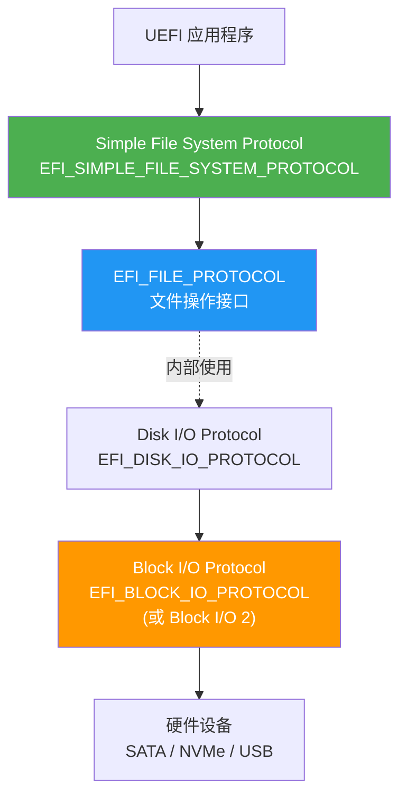
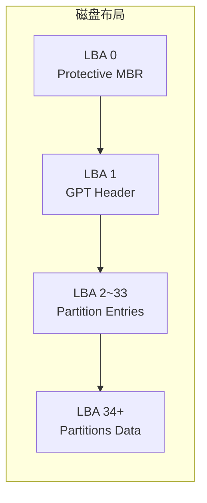

# 文件系统与存储访问

## 前言

**C：** 这篇文章教你如何在 UEFI 里读写文件和访问磁盘。你会学到 Simple File System 协议怎么用、文件操作（打开/读/写/关闭）的 API 长什么样，以及如何用 Block I/O 协议直接访问磁盘扇区。最后一个实战例子是从 ESP 分区读取配置文件，这在写 UEFI 引导管理器时非常实用。

<!-- more -->

## 一、UEFI 存储架构

UEFI 的存储访问是分层的，从底层硬件到上层文件系统，每层都有对应的协议：



| 层次 | 协议 | 说明 |
|------|------|------|
| 文件系统层 | `EFI_SIMPLE_FILE_SYSTEM_PROTOCOL` | 提供文件系统抽象，打开根目录 |
| 文件层 | `EFI_FILE_PROTOCOL` | 读写文件、遍历目录 |
| 磁盘 I/O 层 | `EFI_DISK_IO_PROTOCOL` | 按字节偏移读写磁盘 |
| 块设备层 | `EFI_BLOCK_IO_PROTOCOL` | 按扇区读写磁盘，底层硬件接口 |

## 二、Simple File System 协议

### 2.1 查找文件系统

```c
#include <Protocol/SimpleFileSystem.h>
#include <Protocol/BlockIo.h>

EFI_STATUS Status;
EFI_SIMPLE_FILE_SYSTEM_PROTOCOL *Volume = NULL;

// 查找第一个文件系统设备
EFI_HANDLE *Handles = NULL;
UINTN HandleCount = 0;

Status = gBS->LocateHandleBuffer(
  ByProtocol,
  &gEfiSimpleFileSystemProtocolGuid,
  NULL,
  &HandleCount,
  &Handles
);

if (EFI_ERROR(Status) || HandleCount == 0) {
  Print(L"No file system found!\n");
  return Status;
}

// 打开第一个卷
Status = gBS->HandleProtocol(
  Handles[0],
  &gEfiSimpleFileSystemProtocolGuid,
  (VOID **)&Volume
);

if (EFI_ERROR(Status)) {
  Print(L"Cannot open file system: %r\n", Status);
  gBS->FreePool(Handles);
  return Status;
}

Print(L"Found %d file system(s), using the first one.\n", HandleCount);
```

### 2.2 打开根目录

```c
EFI_FILE_PROTOCOL *RootDir = NULL;

Status = Volume->OpenVolume(Volume, &RootDir);
if (EFI_ERROR(Status)) {
  Print(L"OpenVolume failed: %r\n", Status);
  return Status;
}
```

## 三、文件操作

### 3.1 打开与关闭文件

```c
EFI_FILE_PROTOCOL *File = NULL;

// 打开文件
Status = RootDir->Open(
  RootDir,              // 父目录（根目录）
  &File,                // 输出文件句柄
  L"\\EFI\\BOOT\\boot.cfg",  // 文件路径
  EFI_FILE_MODE_READ,   // 打开模式：只读
  0                     // 属性（打开已有文件时为 0）
);

if (EFI_ERROR(Status)) {
  Print(L"Cannot open file: %r\n", Status);
  RootDir->Close(RootDir);
  return Status;
}

// ... 读取文件内容 ...

// 关闭文件
File->Close(File);
RootDir->Close(RootDir);
```

打开模式选项：

| 模式 | 常量 | 说明 |
|------|------|------|
| 只读 | `EFI_FILE_MODE_READ` | 只能读取 |
| 只写 | `EFI_FILE_MODE_WRITE` | 只能写入 |
| 读写 | `EFI_FILE_MODE_READ | EFI_FILE_MODE_WRITE` | 可读可写 |
| 创建 | `EFI_FILE_MODE_CREATE` | 不存在则创建 |
| 覆盖 | `EFI_FILE_MODE_CREATE | EFI_FILE_MODE_WRITE` | 创建或截断 |

### 3.2 读取文件

```c
// 获取文件大小
EFI_FILE_INFO *FileInfo = NULL;
UINTN InfoSize = sizeof(EFI_FILE_INFO) + 256;

gBS->AllocatePool(EfiBootServicesData, InfoSize, (VOID **)&FileInfo);
Status = File->GetInfo(File, &gEfiFileInfoGuid, &InfoSize, FileInfo);

if (!EFI_ERROR(Status)) {
  Print(L"File size: %ld bytes\n", FileInfo->FileSize);
}

gBS->FreePool(FileInfo);

// 分配读取缓冲区
UINTN FileSize = 8192;  // 假设不超过 8KB，或用 FileInfo->FileSize
CHAR8 *Buffer = NULL;
gBS->AllocatePool(EfiBootServicesData, FileSize + 1, (VOID **)&Buffer);

// 读取文件内容
UINTN ReadSize = FileSize;
Status = File->Read(File, &ReadSize, Buffer);

if (EFI_ERROR(Status)) {
  Print(L"Read failed: %r\n", Status);
} else {
  Buffer[ReadSize] = '\0';
  Print(L"Read %d bytes\n", ReadSize);

  // 输出文件内容（假设是 ASCII 文本）
  // 将 ASCII 转为 Unicode 输出
  for (UINTN i = 0; i < ReadSize && i < 256; i++) {
    Print(L"%c", (CHAR16)Buffer[i]);
  }
  Print(L"\n");
}

gBS->FreePool(Buffer);
```

### 3.3 写入文件

```c
EFI_FILE_PROTOCOL *NewFile = NULL;

// 创建新文件
Status = RootDir->Open(
  RootDir,
  &NewFile,
  L"\\test_output.txt",
  EFI_FILE_MODE_READ | EFI_FILE_MODE_WRITE | EFI_FILE_MODE_CREATE,
  0
);

if (!EFI_ERROR(Status)) {
  // 删除文件内容（截断为 0 字节）
  NewFile->SetPosition(NewFile, 0);

  // 写入数据
  CONST CHAR8 *Text = "Hello from UEFI!\nThis is a test file.\n";
  UINTN TextLen = AsciiStrLen(Text);
  UINTN Written;

  Status = NewFile->Write(NewFile, &TextLen, (VOID *)Text);
  if (!EFI_ERROR(Status)) {
    Print(L"Wrote %d bytes successfully.\n", TextLen);
  }

  // 刷新到磁盘
  NewFile->Flush(NewFile);
  NewFile->Close(NewFile);
}
```

### 3.4 删除文件

```c
EFI_FILE_PROTOCOL *DelFile = NULL;

Status = RootDir->Open(
  RootDir, &DelFile, L"\\temp_file.txt",
  EFI_FILE_MODE_READ | EFI_FILE_MODE_WRITE, 0
);

if (!EFI_ERROR(Status)) {
  Status = DelFile->Delete(DelFile);
  if (!EFI_ERROR(Status)) {
    Print(L"File deleted.\n");
  }
  // Delete 会自动关闭句柄，不需要再 Close
}
```

::: warning Delete 的行为
调用 `Delete()` 后文件句柄会被自动关闭，**不要**再调用 `Close()`，否则会出错。
:::

## 四、目录操作

### 4.1 遍历目录

```c
VOID ListDirectory(IN EFI_FILE_PROTOCOL *Dir)
{
  EFI_STATUS Status;
  UINTN BufSize = sizeof(EFI_FILE_INFO) + 512;
  EFI_FILE_INFO *Info = NULL;
  UINTN ReadSize;

  gBS->AllocatePool(EfiBootServicesData, BufSize, (VOID **)&Info);

  // 重置到目录起始位置
  Dir->SetPosition(Dir, 0);

  Print(L"Directory listing:\n");
  Print(L"%.20s  %.10s  %s\n", L"FileName", L"Size", L"Attribute");
  Print(L"----------------------------------------\n");

  while (TRUE) {
    ReadSize = BufSize;
    Status = Dir->Read(Dir, &ReadSize, Info);

    if (EFI_ERROR(Status) || ReadSize == 0) {
      break;  // 读取结束
    }

    // 跳过 "." 和 ".."
    if (StrCmp(Info->FileName, L".") == 0 ||
        StrCmp(Info->FileName, L"..") == 0) {
      continue;
    }

    CHAR16 Attr[16] = {0};
    if (Info->Attribute & EFI_FILE_DIRECTORY) StrCatS(Attr, 16, L"D");
    if (Info->Attribute & EFI_FILE_READ_ONLY) StrCatS(Attr, 16, L"R");
    if (Info->Attribute & EFI_FILE_HIDDEN)    StrCatS(Attr, 16, L"H");
    if (Info->Attribute & EFI_FILE_SYSTEM)    StrCatS(Attr, 16, L"S");
    if (StrLen(Attr) == 0)                    StrCatS(Attr, 16, L"A");

    Print(L"%.20s  %10ld  %s\n",
          Info->FileName, Info->FileSize, Attr);
  }

  gBS->FreePool(Info);
}

// 使用示例
ListDirectory(RootDir);
```

### 4.2 创建目录

```c
EFI_FILE_PROTOCOL *NewDir = NULL;

Status = RootDir->Open(
  RootDir,
  &NewDir,
  L"\\my_folder",
  EFI_FILE_MODE_READ | EFI_FILE_MODE_WRITE | EFI_FILE_MODE_CREATE,
  EFI_FILE_DIRECTORY  // 属性标记为目录
);

if (!EFI_ERROR(Status)) {
  Print(L"Directory created.\n");
  NewDir->Close(NewDir);
}
```

## 五、Block I/O 协议——直接访问磁盘

### 5.1 Block I/O 基础

当你需要绕过文件系统直接读写磁盘时（比如读取分区表、启动扇区），就需要 Block I/O 协议：

```c
#include <Protocol/BlockIo.h>

EFI_BLOCK_IO_PROTOCOL *BlkIo = NULL;

// 找到 Block I/O 设备
Status = gBS->LocateProtocol(
  &gEfiBlockIoProtocolGuid,
  NULL,
  (VOID **)&BlkIo
);

if (EFI_ERROR(Status)) {
  Print(L"Block I/O not found: %r\n", Status);
  return Status;
}

// 打印设备信息
Print(L"Media Present: %s\n",
      BlkIo->Media->MediaPresent ? L"Yes" : L"No");
Print(L"Block Size:   %d bytes\n", BlkIo->Media->BlockSize);
Print(L"Last Block:   %ld\n", BlkIo->Media->LastBlock);
Print(L"Read Only:    %s\n",
      BlkIo->Media->ReadOnly ? L"Yes" : L"No");
```

### 5.2 读取磁盘扇区

```c
// 读取 LBA 0（MBR/GPT 头）
#define SECTOR_SIZE 512
UINT8 SectorBuffer[SECTOR_SIZE];

Status = BlkIo->ReadBlocks(
  BlkIo,
  BlkIo->Media->MediaId,  // Media ID
  0,                       // 起始 LBA
  SECTOR_SIZE,             // 大小
  SectorBuffer             // 输出缓冲区
);

if (EFI_ERROR(Status)) {
  Print(L"ReadBlocks failed: %r\n", Status);
} else {
  // 检查 MBR 签名
  if (SectorBuffer[510] == 0x55 && SectorBuffer[511] == 0xAA) {
    Print(L"Valid MBR signature found.\n");
  }

  // 检查 GPT 签名
  CHAR8 *GptSig = (CHAR8 *)SectorBuffer;
  if (CompareMem(GptSig, "EFI PART", 8) == 0) {
    Print(L"GPT partition table detected!\n");
  }
}
```

## 六、GPT 分区表解析

### 6.1 GPT 结构概览



```c
#pragma pack(1)

/// GPT 头部结构
typedef struct {
  CHAR8  Signature[8];       // "EFI PART"
  UINT16 Revision;
  UINT32 HeaderSize;
  UINT32 HeaderCRC32;
  UINT32 Reserved;
  UINT64 MyLBA;
  UINT64 AlternateLBA;
  UINT64 FirstUsableLBA;
  UINT64 LastUsableLBA;
  CHAR8  DiskGUID[16];
  UINT64 PartitionEntryStartLBA;
  UINT32 NumberOfPartitions;
  UINT32 SizeOfPartitionEntry;
  UINT32 PartitionEntryArrayCRC32;
} GPT_HEADER;

/// GPT 分区条目（128 字节）
typedef struct {
  CHAR8  TypeGUID[16];       // 分区类型 GUID
  CHAR8  UniqueGUID[16];     // 唯一分区 GUID
  UINT64 StartingLBA;
  UINT64 EndingLBA;
  UINT64 Attributes;
  CHAR16 Name[36];           // 分区名称（UTF-16LE）
} GPT_PARTITION_ENTRY;

#pragma pack()
```

### 6.2 解析分区表

```c
VOID PrintGPTInfo(IN EFI_BLOCK_IO_PROTOCOL *BlkIo)
{
  UINT8 Buffer[512];

  // 读取 LBA 1（GPT Header）
  BlkIo->ReadBlocks(BlkIo, BlkIo->Media->MediaId, 1, 512, Buffer);

  GPT_HEADER *Gpt = (GPT_HEADER *)Buffer;

  if (CompareMem(Gpt->Signature, "EFI PART", 8) != 0) {
    Print(L"Not a GPT disk!\n");
    return;
  }

  Print(L"GPT Disk:\n");
  Print(L"  Disk GUID:    %08X-%04X-%04X-...\n",
        *(UINT32 *)&Gpt->DiskGUID,
        *(UINT16 *)&Gpt->DiskGUID[4],
        *(UINT16 *)&Gpt->DiskGUID[6]);
  Print(L"  Partitions:   %d\n", Gpt->NumberOfPartitions);
  Print(L"  Entry Size:   %d bytes\n", Gpt->SizeOfPartitionEntry);
  Print(L"  First Usable: LBA %ld\n", Gpt->FirstUsableLBA);
  Print(L"  Last Usable:  LBA %ld\n", Gpt->LastUsableLBA);

  // 读取分区条目（从 LBA 2 开始）
  UINT32 EntryCount = Gpt->NumberOfPartitions;
  UINT32 EntrySize = Gpt->SizeOfPartitionEntry;
  UINT32 EntriesPerSector = 512 / EntrySize;
  UINT32 TotalSectors =
    (EntryCount * EntrySize + 511) / 512;

  UINT8 *EntryBuffer;
  gBS->AllocatePool(EfiBootServicesData,
    TotalSectors * 512, (VOID **)&EntryBuffer);

  for (UINT32 i = 0; i < TotalSectors; i++) {
    BlkIo->ReadBlocks(BlkIo, BlkIo->Media->MediaId,
      Gpt->PartitionEntryStartLBA + i,
      512, EntryBuffer + i * 512);
  }

  // 打印每个分区信息
  Print(L"\n%-8s %-12s %-12s %-20s\n",
        L"#", L"Start LBA", L"End LBA", L"Size");
  Print(L"------------------------------------------------\n");

  for (UINT32 i = 0; i < EntryCount; i++) {
    GPT_PARTITION_ENTRY *Entry =
      (GPT_PARTITION_ENTRY *)(EntryBuffer + i * EntrySize);

    // 检查是否为空条目（全零 TypeGUID）
    BOOLEAN IsEmpty = TRUE;
    for (int j = 0; j < 16; j++) {
      if (Entry->TypeGUID[j] != 0) { IsEmpty = FALSE; break; }
    }
    if (IsEmpty) continue;

    UINT64 SizeBytes =
      (Entry->EndingLBA - Entry->StartingLBA + 1) *
      BlkIo->Media->BlockSize;
    UINT64 SizeMB = SizeBytes / (1024 * 1024);

    Print(L"%-8d 0x%-10llX 0x%-10llX %ld MB  %s\n",
          i + 1,
          Entry->StartingLBA,
          Entry->EndingLBA,
          SizeMB,
          Entry->Name);
  }

  gBS->FreePool(EntryBuffer);
}
```

## 七、实战：从 ESP 分区读取配置文件

ESP（EFI System Partition）是存放 UEFI 引导文件的 FAT32 分区，通常在 `L"\EFI\"` 路径下：

```c
#include <Uefi.h>
#include <Library/UefiLib.h>
#include <Library/UefiBootServicesTableLib.h>
#include <Library/BaseMemoryLib.h>
#include <Protocol/SimpleFileSystem.h>

#define CONFIG_PATH L"\\EFI\\myboot\\config.ini"
#define MAX_CONFIG_SIZE 4096

/**
 * 在所有文件系统设备中查找 ESP 分区
 */
EFI_STATUS FindESP(OUT EFI_FILE_PROTOCOL **RootDir)
{
  EFI_HANDLE *Handles = NULL;
  UINTN HandleCount = 0;

  gBS->LocateHandleBuffer(ByProtocol,
    &gEfiSimpleFileSystemProtocolGuid,
    NULL, &HandleCount, &Handles);

  for (UINTN i = 0; i < HandleCount; i++) {
    EFI_SIMPLE_FILE_SYSTEM_PROTOCOL *Vol = NULL;
    gBS->HandleProtocol(Handles[i],
      &gEfiSimpleFileSystemProtocolGuid, (VOID **)&Vol);

    EFI_FILE_PROTOCOL *Dir = NULL;
    if (!EFI_ERROR(Vol->OpenVolume(Vol, &Dir))) {
      // 检查是否存在 \EFI 目录
      EFI_FILE_PROTOCOL *EfiDir = NULL;
      EFI_STATUS S = Dir->Open(Dir, &EfiDir, L"\\EFI",
        EFI_FILE_MODE_READ, 0);
      if (!EFI_ERROR(S)) {
        EfiDir->Close(EfiDir);
        *RootDir = Dir;
        gBS->FreePool(Handles);
        return EFI_SUCCESS;
      }
      Dir->Close(Dir);
    }
  }

  gBS->FreePool(Handles);
  return EFI_NOT_FOUND;
}

/**
 * 简单的 INI 配置解析
 */
EFI_STATUS ReadConfig(
  IN EFI_FILE_PROTOCOL *RootDir,
  OUT CHAR8 *ConfigBuffer,
  IN OUT UINTN *BufferSize
)
{
  EFI_STATUS Status;
  EFI_FILE_PROTOCOL *File = NULL;

  Status = RootDir->Open(RootDir, &File, CONFIG_PATH,
    EFI_FILE_MODE_READ, 0);
  if (EFI_ERROR(Status)) {
    Print(L"Config file not found: %s (%r)\n", CONFIG_PATH, Status);
    return Status;
  }

  // 获取文件大小
  EFI_FILE_INFO *Info = NULL;
  UINTN InfoSize = sizeof(EFI_FILE_INFO) + 256;
  gBS->AllocatePool(EfiBootServicesData, InfoSize, (VOID **)&Info);
  File->GetInfo(File, &gEfiFileInfoGuid, &InfoSize, Info);
  UINTN FileSize = (UINTN)Info->FileSize;
  gBS->FreePool(Info);

  if (FileSize > *BufferSize) FileSize = *BufferSize - 1;

  UINTN ReadSize = FileSize;
  Status = File->Read(File, &ReadSize, ConfigBuffer);
  File->Close(File);

  if (!EFI_ERROR(Status)) {
    ConfigBuffer[ReadSize] = '\0';
    *BufferSize = ReadSize;
    Print(L"Loaded %d bytes from config.\n", ReadSize);
  }

  return Status;
}

EFI_STATUS EFIAPI UefiMain(
  IN EFI_HANDLE ImageHandle,
  IN EFI_SYSTEM_TABLE *SystemTable
)
{
  EFI_STATUS Status;
  EFI_FILE_PROTOCOL *RootDir = NULL;

  Status = FindESP(&RootDir);
  if (EFI_ERROR(Status)) {
    Print(L"ESP partition not found!\n");
    return Status;
  }

  CHAR8 *ConfigBuf = NULL;
  gBS->AllocatePool(EfiBootServicesData, MAX_CONFIG_SIZE, (VOID **)&ConfigBuf);
  UINTN ConfigSize = MAX_CONFIG_SIZE;

  Status = ReadConfig(RootDir, ConfigBuf, &ConfigSize);
  if (!EFI_ERROR(Status)) {
    Print(L"\n--- Config Content ---\n");
    for (UINTN i = 0; i < ConfigSize && i < 512; i++) {
      Print(L"%c", (CHAR16)ConfigBuf[i]);
    }
    Print(L"\n--- End ---\n");
  }

  gBS->FreePool(ConfigBuf);
  RootDir->Close(RootDir);
  return EFI_SUCCESS;
}
```

::: tip ESP 分区的特征
- 分区类型 GUID：`C12A7328-F81F-11D2-BA4B-00A0C93EC93B`
- 文件系统：FAT32
- 包含 `\EFI\BOOT\BOOTX64.EFI`（默认引导文件）
- 每个 OS 安装通常会在 `\EFI\<厂商名>\` 下放自己的引导程序
:::

## 小结

这篇文章我们全面学习了 UEFI 的存储访问体系：

- **Simple File System 协议**提供了文件系统抽象，通过 `OpenVolume` 获取根目录，然后进行文件操作
- **文件操作**遵循标准的 Open/Read/Write/Close/Delete 模式，注意 `Delete` 后不需要 `Close`
- **目录遍历**通过循环 `Read` 实现，返回 `EFI_FILE_INFO` 结构，注意检查 `ReadSize == 0` 表示结束
- **Block I/O 协议**是底层磁盘访问接口，按扇区（LBA）读写，适合操作分区表等底层结构
- **GPT 解析**需要理解 LBA 布局和分区条目结构，GPT Header 在 LBA 1，分区条目从 LBA 2 开始
- **ESP 访问**是 UEFI 开发中最常见的场景，需要遍历文件系统设备找到正确的分区
